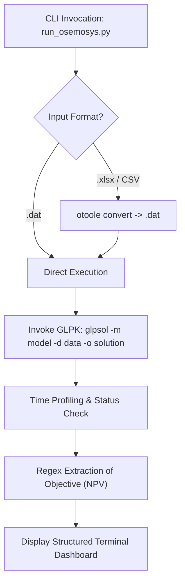

# EN401: Energy Systems Modelling
# GNU MathProg Code & OSeMOSYS Architecture Manual

---

### Purpose
This technical manual provides a comprehensive code walkthrough of the **GNU MathProg** model files, MathProg data files (`.dat`), and execution scripts used throughout the **EN401: Energy Systems Modelling** coursework.

---

## 1. GNU MathProg Syntax & Architecture

**GNU MathProg** is a subset of the AMPL (A Mathematical Programming Language) modeling language supported natively by **GLPK** (`glpsol`). OSeMOSYS is implemented in MathProg as a declarative system of sets, parameters, decision variables, objective functions, and linear constraints.

### 1.1 Fundamental Structural Elements

```mathprog
# 1. Sets: Domain dimensions indexing variables and data
set YEAR;
set TECHNOLOGY;
set COMMODITY;
set TIMESLICE;
set MODE_OF_OPERATION;

# 2. Parameters: Exogenous input data matrices
param CapitalCost{REGION, TECHNOLOGY, YEAR} >= 0;
param CapacityFactor{REGION, TECHNOLOGY, TIMESLICE, YEAR} >= 0;

# 3. Decision Variables: Unknowns determined by the solver
var NewCapacity{REGION, TECHNOLOGY, YEAR} >= 0;
var RateOfActivity{REGION, TIMESLICE, TECHNOLOGY, MODE_OF_OPERATION, YEAR} >= 0;

# 4. Objective Function: Scalar value to be minimized
minimize Cost: TotalDiscountedCost;

# 5. Constraints: Linear equality or inequality equations
s.t. DemandAdequacy{r in REGION, l in TIMESLICE, f in COMMODITY, y in YEAR}:
    sum{t in TECHNOLOGY, m in MODE_OF_OPERATION}
        RateOfActivity[r, l, t, m, y] * OutputActivityRatio[r, t, f, m, y]
        >= RateOfDemand[r, l, f, y];
```

---

## 2. Complete OSeMOSYS Parameters Reference

The table below documents all 17 primary OSeMOSYS parameters configured across Handouts 3 through 6:

| Parameter Name | Index Dimensions | Units | Default | Engineering Purpose & Semantic |
|---|---|---|---|---|
| `YearSplit` | `TIMESLICE, YEAR` | Fraction | 0 | Fraction of total hours in a calendar year assigned to each sub-annual timeslice (sums to 1.0). |
| `DiscountRate` | `REGION` | Fraction | 0.05 | Social discount rate applied to discount future investment and operational expenditures to base year NPV. |
| `CapitalCost` | `REGION, TECH, YEAR` | M$/GW | 0 | Overnight capital expenditure required to install one unit of new capacity. |
| `FixedCost` | `REGION, TECH, YEAR` | M$/GW/yr | 0 | Fixed annual operating and maintenance expenses incurred regardless of generation level. |
| `VariableCost` | `REGION, TECH, MODE, YEAR` | M$/PJ | 0 | Variable operational cost scaling linearly with energy production/activity. |
| `OperationalLife` | `REGION, TECH` | Years | 1 | Physical/economic asset lifespan determining annual capital recovery and salvage value. |
| `CapacityFactor` | `REGION, TECH, SLICE, YEAR` | Fraction | 1 | Maximum allowable generation rate as a fraction of installed capacity per timeslice. |
| `AvailabilityFactor` | `REGION, TECH, YEAR` | Fraction | 1 | Annual upper bound on capacity availability taking scheduled maintenance and outages into account. |
| `CapacityToActivityUnit` | `REGION, TECH` | Factor | 31.536 | Converts power capacity (GW) into energy activity (PJ/yr) over one full year: $1 \text{ GW} \times 8760\text{h} \times 3600\text{s} = 31.536 \text{ PJ}$. |
| `InputActivityRatio` | `REGION, TECH, FUEL, MODE, YEAR` | Ratio | 0 | Commodity units consumed per unit of technology activity (determines plant thermal efficiency: $1/\text{Ratio}$). |
| `OutputActivityRatio` | `REGION, TECH, FUEL, MODE, YEAR` | Ratio | 0 | Commodity units produced per unit of technology activity (1.0 for single-product generator). |
| `SpecifiedAnnualDemand` | `REGION, FUEL, YEAR` | PJ/yr | 0 | Total annual final consumer energy demand for fuel $f$ in year $y$. |
| `SpecifiedDemandProfile`| `REGION, FUEL, SLICE, YEAR` | Fraction | 0 | Sub-annual distribution profile of demand across timeslices (sums to 1.0 over the year). |
| `ResidualCapacity` | `REGION, TECH, YEAR` | GW | 0 | Existing pre-installed capacity inherited from past investments operating before the model horizon. |
| `TotalAnnualMaxCapacity`| `REGION, TECH, YEAR` | GW | $\infty$ | Maximum cumulative installed capacity permissible due to physical, site, or grid constraints. |
| `TotalTechnologyAnnualActivityUpperLimit` | `REGION, TECH, YEAR` | PJ/yr | $\infty$ | Maximum allowable annual throughput/activity (e.g., maximum fuel extraction ceiling). |
| `EmissionActivityRatio`| `REGION, TECH, EMISSION, MODE, YEAR` | kt/PJ | 0 | Pollutant mass (e.g., kt $\text{CO}_2$) emitted per unit of operational activity. |

---

## 3. Dissecting the MathProg Data File (`.dat`)

The data files (`OSeHO3.dat` through `OSeHO6.dat`) provide the numerical values for all sets and parameters. They follow standard GNU MathProg format:

### 3.1 Sets Declaration
Sets are declared using the `set :=` syntax, terminated with a semicolon:

```mathprog
set YEAR := 2021 2022 2023 2024 2025 2026 2027 2028 2029 2030 2031 2032 2033 2034 2035 ;
set TECHNOLOGY := MINBACK BACKSTOP MINNGS IMPDSL PWRDSL PWRNGS PWRTRN PWRDIST MINHYD PWRHYD MINBIO PWRBIO ;
set COMMODITY := ELC001 ELC002 ELC003 NGS DSL HYD BIO ;
set TIMESLICE := RD RN DD DN ;
set MODE_OF_OPERATION := 1 2 ;
set REGION := SC_0 ;
```

### 3.2 2D Matrix Parameters
When a parameter is indexed over multiple sets, MathProg supports 2D tabular layout using `(tr)` (transposed matrix) for readability:

```mathprog
param default 0 : CapitalCost :=
[SC_0, *, *]:
           2021   2022   2023   2024   2025   ...   2035 :=
PWRDSL     1200   1200   1200   1200   1200   ...   1200
PWRNGS     1200   1200   1200   1200   1200   ...   1200
PWRHYD     2500   2500   2500   2500   2500   ...   2500
PWRBIO     1800   1800   1800   1800   1800   ...   1800
PWRTRN      700    700    700    700    700   ...    700
PWRDIST    1500   1500   1500   1500   1500   ...   1500
BACKSTOP  99999  99999  99999  99999  99999   ...  99999
;
```

---

## 4. The Python Runner Architecture (`run_osemosys.py`)

The repository includes a unified automation script ([run_osemosys.py](file:///Users/kaustubhashok/SEM5%20pros/run_osemosys.py)) that streamlines model execution:



### Key Functions in `run_osemosys.py`:
1. `ensure_glpsol()`: Verifies that `/opt/homebrew/bin/glpsol` exists on `PATH`.
2. `convert_to_datafile(input_path, config_path, output_dat)`: Uses `otoole convert` to transform multi-tab Excel workbooks or CSV directories into GLPK MathProg format.
3. `run_glpsol(model_path, data_path, results_dir)`: Spawns the GLPK subprocess, captures primal and dual solutions, and measures execution runtime down to the millisecond.
4. `display_summary(results_dir, obj_val)`: Formats the optimization summary into a readable terminal report.

---

## 5. GLPK Command-Line Flags Reference

To run models directly from the command line without Python:

```bash
glpsol [OPTIONS] -m <model_file> -d <data_file> -o <output_file>
```

| Switch | Argument | Purpose |
|---|---|---|
| `-m, --math` | `<file>` | Path to the MathProg model file (`osemosys_fast.txt`). |
| `-d, --data` | `<file>` | Path to the MathProg data file (`OSeHO3.dat`, etc.). |
| `-o, --output` | `<file>` | Destination file for the full primal and dual solution report. |
| `--log` | `<file>` | Saves the detailed Simplex solver iteration log. |
| `--check` | *None* | Performs syntax parsing and error checking without solving. |
| `--scale` | *None* | Automatically scales the LP constraint matrix to improve numerical stability. |
| `--cpxlp` | `<file>` | Dumps the compiled LP matrix into standard CPLEX LP format for debugging. |
