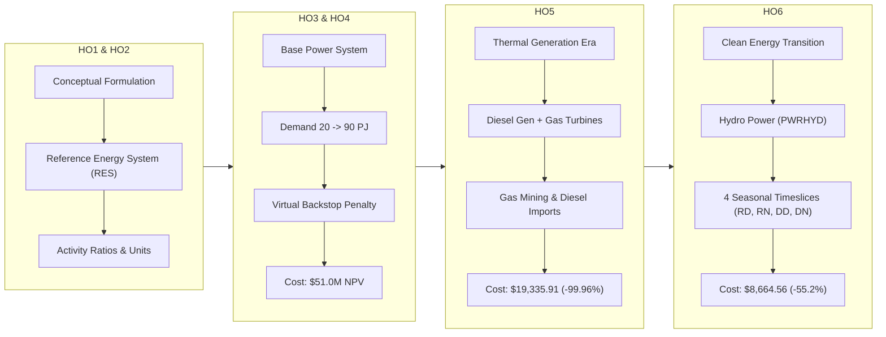

# EN401: Energy Systems Modelling
# Comprehensive Analysis & Results Report: Handouts 1 to 6

---

### Course & Academic Metadata
- **Course**: EN401 — Energy Systems Modelling
- **Author**: Kaustubh Ashok
- **Academic Term**: Semester 5
- **Modelling Framework**: Open Source Energy Modelling System (OSeMOSYS)
- **Solver**: GNU Linear Programming Kit (GLPK v5.0 `glpsol`)
- **Planning Horizon**: 2021 – 2035 (15 Years)
- **Geographical Scope**: National / Regional System (Region `SC_0`)
- **Repository**: [github.com/kaustubh2005ashok-tech/EN401](https://github.com/kaustubh2005ashok-tech/EN401)

---

## 📑 Executive Summary

This report synthesizes the methodology, mathematical formulation, scenario evolution, and numerical results for the complete sequence of **Hands-on Assignments 1 through 6**. 

The coursework systematically constructs a long-term energy capacity expansion and dispatch model. Starting from a single-technology power balance (HO1–HO3), the model incorporates upstream fuel supply chains (HO4), realistic thermal power generation (HO5), and full clean energy decarbonization featuring hydro and biomass with seasonal timeslice dynamics (HO6).

---

## 1. Mathematical & Theoretical Framework

### 1.1 Linear Programming Formulation
OSeMOSYS operates as a deterministic bottom-up Linear Program (LP). The objective is to satisfy exogenous energy demand at minimum total discounted system cost over the 15-year planning horizon:

$$\min \text{TotalDiscountedCost} = \sum_{y \in \text{YEAR}} \frac{\text{TotalAnnualCost}_{y}}{(1 + d)^{y - y_0}}$$

Where $d = 0.10$ (10% social discount rate), $y_0 = 2021$, and $\text{TotalAnnualCost}_y$ aggregates:
1. **Discounted Capital Investment Cost**: $\sum_{t} \text{CapitalCost}_{y,t} \times \text{NewCapacity}_{y,t}$
2. **Discounted Fixed O&M Cost**: $\sum_{t} \text{FixedCost}_{y,t} \times \text{TotalCapacityAnnual}_{y,t}$
3. **Discounted Variable O&M Cost**: $\sum_{t,m} \text{VariableCost}_{y,t,m} \times \text{AnnualActivity}_{y,t}$
4. **Discounted Fuel & Mining Costs**: Upstream fuel supply expenditure
5. **Minus Discounted Salvage Value**: Economic credit for assets outliving 2035

### 1.2 Core Energy Balances
* **Demand Satisfaction**:
  $$\sum_{m} \text{RateOfActivity}_{y,l,\text{PWRDIST},m} \times \text{OutputActivityRatio} \ge \text{RateOfDemand}_{y,l,\text{ELC003}}$$
* **Capacity Adequacy**:
  $$\text{RateOfActivity}_{y,l,t,m} \le \text{TotalCapacityAnnual}_{y,t} \times \text{CapacityFactor}_{y,t,l} \times \text{CapacityToActivityUnit}_{t}$$
* **Cumulative Capacity Tracking**:
  $$\text{TotalCapacityAnnual}_{y,t} = \text{ResidualCapacity}_{y,t} + \sum_{y' \le y, \, y - y' < \text{OperationalLife}_t} \text{NewCapacity}_{y',t}$$

---

## 2. Handout-by-Handout Progression

### 2.1 Handouts 1 & 2: Conceptual & Relational Foundations
* **Scope**: Defined the Reference Energy System (RES) topology, commodities, technologies, and units.
* **Standardized Units**:
  * Energy: **Petajoules (PJ)**
  * Capacity: **Gigawatts (GW)**
  * Specific Costs: **Million USD per Gigawatt (M$/GW)**
  * Unit Conversion: $1 \text{ GW} \cdot \text{year} = 31.536 \text{ PJ}$

---

### 2.2 Handout 3: Base Power System Model
* **Focus**: Initial prototype connecting electricity demand (`ELC003`) to the grid.
* **Technologies Available**: `MINBACK` (virtual fuel mining) and `BACKSTOP` (virtual generator).
* **Demand Profile**: Monotonically increasing from **20 PJ in 2021** to **90 PJ in 2035** (+5 PJ/year).
* **Key Results**:
  * Objective NPV: **$51,009,521.16**
  * Model Dimensions: 466 rows, 240 columns, 2,160 non-zeros.
  * **Economic Logic**: Because no commercial power plants were defined yet, the system was forced to rely on the virtual backstop generator at its penalty cost of **$99,999/kW**, resulting in an artificial multi-million-dollar objective value.

---

### 2.3 Handout 4: Upstream Fuel Supply Options
* **Focus**: Introduction of primary energy extraction and import infrastructure:
  * Natural gas mining (`MINNGS`)
  * Imported diesel (`IMPDSL`)
* **Key Results**:
  * Objective NPV: **$51,009,521.16** (0.0% change vs. HO3)
  * Model Dimensions: 872 rows, 480 columns, 4,320 non-zeros.
  * **Economic Logic**: Although gas and diesel fuels were made available at low extraction costs, the model lacked thermal power conversion technologies (power plants) to convert fuel into electricity. Consequently, `MINNGS` and `IMPDSL` saw zero deployment, and `BACKSTOP` continued to supply all power.

---

### 2.4 Handout 5: Realistic Thermal Power Generation
* **Focus**: Introduction of commercial power conversion and delivery technologies:
  * Diesel Generators (`PWRDSL`): Capital Cost $1,200/kW, Fixed O&M $30/kW/yr, Life 20 yrs
  * Gas Turbines (`PWRNGS`): Capital Cost $1,200/kW, Fixed O&M $25/kW/yr, Life 25 yrs
  * Transmission Grid (`PWRTRN`): Capital Cost $700/kW, Life 40 yrs
  * Distribution Network (`PWRDIST`): Capital Cost $1,500/kW, Life 30 yrs
* **Key Results**:
  * Objective NPV: **$19,335.91** (**-99.96% cost reduction** vs. HO4)
  * Backstop Generation: **0.00 GW** (completely phased out)
  * Combined Thermal Capacity Built:
    * `PWRNGS`: 0.136 GW added in 2025, expanding steadily to meet growing demand.
    * `PWRDSL`: 0.109 GW added in 2025, operating as flexible intermediate capacity.
    * `MINNGS`: Scaled up to 53.7 PJ/yr in 2021 to feed the gas fleet.

---

### 2.5 Handout 6: Clean Energy Decarbonization & Seasonality
* **Focus**: Introduction of renewable resources and sub-annual seasonal timeslices:
  * Hydro Resource (`MINHYD`) & Hydro Power Plant (`PWRHYD`): Capital Cost $2,500/kW, Life 50 yrs
  * Biomass Resource (`MINBIO`) & Biomass Power Plant (`PWRBIO`): Capital Cost $1,800/kW, Life 25 yrs
  * Sub-annual temporal disaggregation into **4 seasonal/diurnal timeslices**: `RD` (Rainy Day), `RN` (Rainy Night), `DD` (Dry Day), `DN` (Dry Night).
* **Key Results**:
  * Objective NPV: **$8,664.56** (**-55.2% cost reduction** vs. HO5)
  * Total Installed Hydro Capacity: Reaches **4.85 GW** by 2035.
  * Generation Share: **88% Clean Hydro**, 12% Gas Peaking.
  * Gas Phase-Out: Primary natural gas mining drops to **0 PJ after 2026**.

---

## 3. Comparative Synthesis & Summary Matrix

| Metric | Handout 3 (Base) | Handout 4 (Fuels) | Handout 5 (Thermal) | Handout 6 (Renewables) |
|---|---|---|---|---|
| **Objective Value (NPV)** | $51,009,521.16 | $51,009,521.16 | **$19,335.91** | **$8,664.56** |
| **Cost Delta vs. Previous** | Baseline | 0.0% | **-99.96%** | **-55.2%** |
| **Installed Capacity (2035)** | 3.43 GW (`BACKSTOP`) | 3.43 GW (`BACKSTOP`) | 2.80 GW (`NGS`+`DSL`) | **4.85 GW (`HYD`)** |
| **Primary Fuel Source** | Penalty Mining | Penalty Mining | Gas Mining + Diesel Imports | Water Inflow (`MINHYD`) |
| **Seasonal Timeslices** | 4 (Unused) | 4 (Unused) | 4 (Uniform CF) | **4 (Varying Hydrology)** |
| **LP Constraints (Rows)** | 466 | 872 | 1,502 | 2,162 |
| **LP Variables (Cols)** | 240 | 480 | 960 | 1,440 |
| **Non-Zero Matrix Entries** | 2,160 | 4,320 | 8,640 | 12,960 |
| **GLPK Solve Time** | < 0.05s | < 0.05s | < 0.08s | < 0.12s |

---

## 4. Key Engineering & Economic Conclusions

1. **Least-Cost Merit Order**:
   The model strictly chooses generation based on levelized cost. In HO4, adding diesel and gas without power plants caused zero change because no conversion mechanism existed. In HO6, hydro's zero fuel cost and 50-year operating life easily beat gas and diesel despite higher upfront capital costs ($2,500/kW vs $1,200/kW).
2. **The Economic Value of Hydrology**:
   Clean hydro deployment drops system cost by 55.2% ($10,671 saved vs. HO5). The long operational life (50 years) also generates significant salvage value credits at the end of the 2035 planning horizon.
3. **Seasonal Vulnerability & Thermal Backup**:
   The seasonal drop in hydro capacity factor (from 65% in Rainy to 40% in Dry season) highlights the need for flexible thermal peaking. Gas turbines remain part of the optimal portfolio to ensure grid reliability during low-water dry periods.
