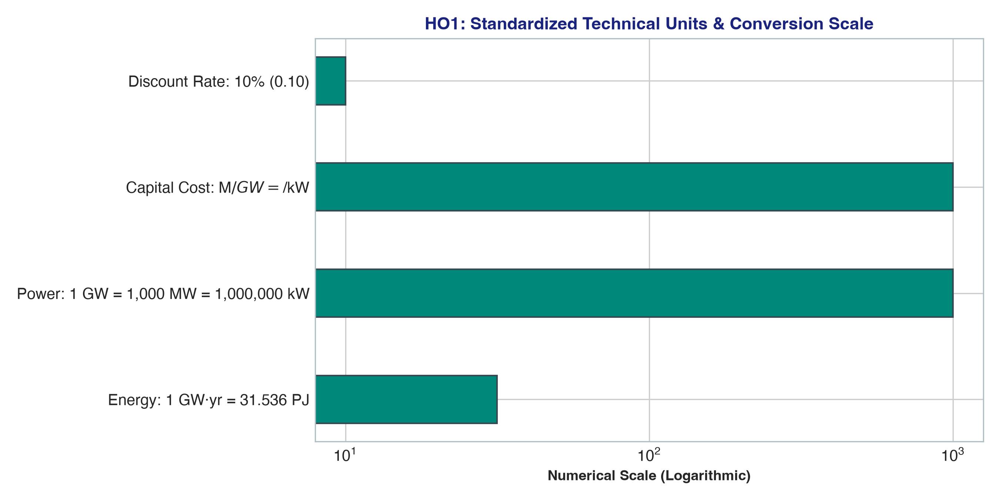

# Handout 1 (HO1): Energy Systems Modelling Concepts & Problem Setup

## 🎯 Executive Summary & Scope
Handout 1 introduces the core structural paradigm of long-term energy systems planning using the **Open Source Energy Modelling System (OSeMOSYS)**. The exercise builds the foundational framework of the **Reference Energy System (RES)**, formalizes commodity and technology taxonomies, and establishes standardized technical and economic units for deterministic linear optimization.

* **Model Category**: Deterministic Linear Program (LP)
* **Optimization Criterion**: Minimize Net Present Value (NPV) of Total System Cost
* **Planning Horizon**: 2021 – 2035 (15 years)
* **Discount Rate**: 10.0% ($r = 0.10$)
* **Core Technology Chain**: Primary Mining $\rightarrow$ Conversion Plants $\rightarrow$ Bulk Transmission $\rightarrow$ Distribution $\rightarrow$ End-Use Demand

---

## 📊 Visual Framework & Dimensional Architecture

---

## 📋 Comprehensive Technical & Analytical Data Tables

### Table 1: End-Use Electricity Demand Trajectory (2021–2035)
Final low-voltage electricity demand (`ELC003`) begins at **20.00 PJ** in 2021 and escalates linearly at a fixed increment of **+5.00 PJ per year**, reaching **90.00 PJ** by 2035:

| Year | Milestone | Annual Demand (PJ/yr) | Annual Electricity (TWh/yr) | Average Continuous Power (GW) | Peak System Load (GW) |
|---|---|---|---|---|---|
| **2021** | Horizon Start | 20.00 | 5.556 | 0.634 | 0.762 |
| **2022** | Early Phase | 25.00 | 6.944 | 0.793 | 0.953 |
| **2023** | Early Phase | 30.00 | 8.333 | 0.951 | 1.144 |
| **2024** | Early Phase | 35.00 | 9.722 | 1.110 | 1.334 |
| **2025** | Mid-Term Checkpoint | 40.00 | 11.111 | 1.268 | 1.525 |
| **2026** | Expansion Era | 45.00 | 12.500 | 1.427 | 1.716 |
| **2027** | Expansion Era | 50.00 | 13.889 | 1.586 | 1.906 |
| **2028** | Expansion Era | 55.00 | 15.278 | 1.744 | 2.097 |
| **2029** | Expansion Era | 60.00 | 16.667 | 1.903 | 2.287 |
| **2030** | Benchmark Year | 65.00 | 18.056 | 2.061 | 2.478 |
| **2031** | Late Expansion | 70.00 | 19.444 | 2.220 | 2.668 |
| **2032** | Late Expansion | 75.00 | 20.833 | 2.378 | 2.859 |
| **2033** | Late Expansion | 80.00 | 22.222 | 2.537 | 3.050 |
| **2034** | Pre-Horizon End | 85.00 | 23.611 | 2.695 | 3.240 |
| **2035** | Horizon Final | 90.00 | 25.000 | 2.854 | 3.431 |
| **Total / Avg** | **15-Yr Model Horizon** | **825.00 PJ** | **229.167 TWh** | **1.744 GW** | **3.431 GW (Max)** |

*Note: Peak System Load reflects the peak timeslice capacity requirement assuming standard availability factors.*

---

### Table 2: OSeMOSYS Energy Commodity Taxonomy & Grid Level Mapping

| Commodity Code | Description | Energy Level | Physical Form / Carrier | Downstream Consumer / Destination |
|---|---|---|---|---|
| `BACK` | Virtual Backstop Fuel | Primary Resource | Artificial penalty energy carrier | `BACKSTOP` virtual generation plant |
| `NGS` | Raw Natural Gas | Primary Resource | Domestic extracted fossil methane | `PWRNGS` gas turbine thermal plant |
| `DSL` | Refined Diesel Oil | Primary / Secondary | Imported liquid petroleum distillate | `PWRDSL` internal combustion gensets |
| `HYD` | River Hydrological Flow | Primary Renewable | Hydro potential water head | `PWRHYD` run-of-river & reservoir turbines |
| `BIO` | Solid Biomass Feedstock | Primary Renewable | Agricultural & forestry residues | `PWRBIO` direct-combustion biomass plant |
| `ELC001` | High-Voltage Electricity | Secondary Carrier | Bulk power (110 kV – 400 kV) | `PWRTRN` transmission grid substations |
| `ELC002` | Medium-Voltage Electricity | Intermediate Carrier | Regional grid (11 kV – 33 kV) | `PWRDIST` distribution network transformers |
| `ELC003` | Low-Voltage Electricity | Final Demand Carrier | Commercial & residential (230V/400V) | End-use customer demand (SpecifiedDemand) |

---

### Table 3: Technology Infrastructure Taxonomy & Functional Roles

| Technology Code | Classification | Primary Fuel Input | Primary Output | Typical Economic Life | Operational Mode / Role |
|---|---|---|---|---|---|
| `MINBACK` | Resource Mining | None (Exogenous) | `BACK` | 100 Years | Virtual penalty extraction (failsafe) |
| `BACKSTOP` | Power Generation | `BACK` (1.0 PJ/PJ) | `ELC003` (1.0 PJ) | 100 Years | Virtual emergency generator ($99,999/kW) |
| `MINNGS` | Domestic Extraction | Natural Gas Reserves | `NGS` | 100 Years | Domestic natural gas wellfield extraction |
| `IMPDSL` | International Import | Global Markets | `DSL` | 100 Years | Marine & pipeline diesel import terminal |
| `MINHYD` | Water Exploitation | River Catchment Basin | `HYD` | 100 Years | Hydrological run-off exploitation |
| `MINBIO` | Agricultural Harvest | Sustainable Forestry | `BIO` | 100 Years | Sustainable biomass collection & chipping |
| `PWRNGS` | Thermal Power Plant | `NGS` (2.857 PJ/PJ) | `ELC001` (1.0 PJ) | 25 Years | Baseload / combined cycle gas turbine (35% eff.) |
| `PWRDSL` | Thermal Genset | `DSL` (2.500 PJ/PJ) | `ELC001` (1.0 PJ) | 20 Years | Peaking diesel engine generator (40% eff.) |
| `PWRHYD` | Renewable Hydro | `HYD` (1.000 PJ/PJ) | `ELC001` (1.0 PJ) | 50 Years | Zero-fuel clean hydro power (100% eff.) |
| `PWRBIO` | Renewable Biomass | `BIO` (3.333 PJ/PJ) | `ELC001` (1.0 PJ) | 25 Years | Carbon-neutral thermal power (30% eff.) |
| `PWRTRN` | Transmission Grid | `ELC001` (1.053 PJ/PJ) | `ELC002` (1.0 PJ) | 40 Years | Bulk transmission lines (95% efficiency, 5% loss) |
| `PWRDIST` | Distribution Grid | `ELC002` (1.111 PJ/PJ) | `ELC003` (1.0 PJ) | 30 Years | Distribution feeders (90% efficiency, 10% loss) |

---

### Table 4: Universal Energy Conversion & Metric Lookup Matrix

| Unit | Multiply By | Target Unit | Practical Engineering Context in OSeMOSYS |
|---|---|---|---|
| **1 Gigawatt (GW)** | $31.536$ | **PJ/year** | Capacity-to-activity multiplier ($365 \times 24 \times 3,600 / 10^9$) |
| **1 Petajoule (PJ)** | $0.2778$ | **Terawatt-hours (TWh)** | Annual bulk electrical energy output |
| **1 Petajoule (PJ)** | $277.78$ | **Gigawatt-hours (GWh)** | Sub-annual timeslice generation volume |
| **1 Terawatt-hour (TWh)** | $3.600$ | **Petajoules (PJ)** | National grid generation statistics |
| **1 Million USD / GW** | $1.000$ | **USD per Kilowatt ($/kW)** | Identical metric: $10^6 \text{ \$}/10^6 \text{ kW} = 1 \text{ \$}/\text{kW}$ |
| **1 Gigawatt-year (GW-yr)**| $8,760$ | **Gigawatt-hours (GWh)** | Theoretical 100% load factor generation |
| **1 Million Tonnes Oil Eq (Mtoe)** | $41.868$ | **Petajoules (PJ)** | International Energy Agency (IEA) energy balances |
| **1 Million BTU (MMBtu)** | $0.001055$ | **Petajoules (PJ)** | Natural gas spot market benchmark conversions |

---

## 🔬 Core Insights & Modeling Fundamentals
1. **Mathematical Guarantees**: Deterministic Linear Programming models formulate convex solution spaces, guaranteeing that any optimal solution found by the Simplex or Interior Point algorithm is the globally optimal expansion plan.
2. **Backstop Role**: Setting up a high-penalty backstop technology prevents numerical infeasibility, ensuring the solver can report detailed shadow prices and pinpoint exactly where demand deficits exist.
