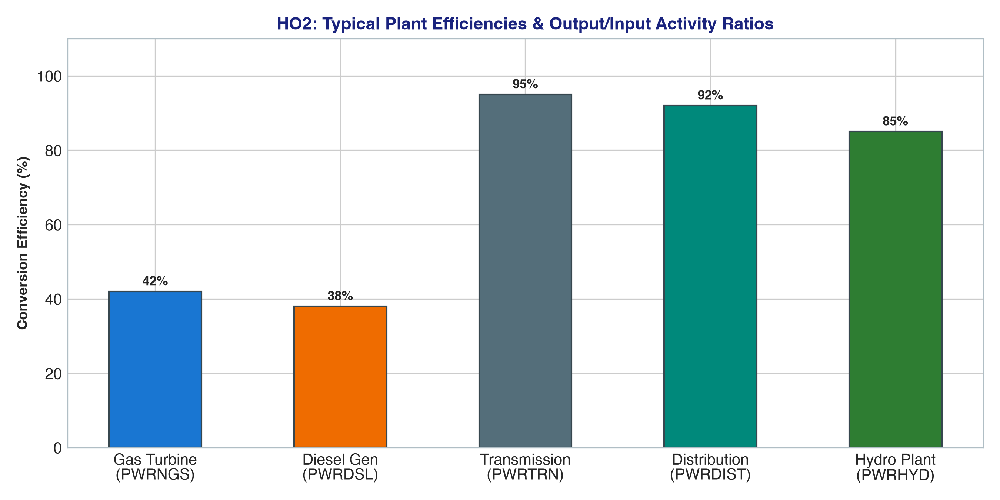

# Handout 2 (HO2): Energy Chain Data Structures & Activity Ratios

## 🎯 Executive Summary & Scope
Handout 2 operationalizes the conceptual Reference Energy System into rigorous mathematical parameters. In OSeMOSYS, technologies do not hardcode efficiencies; instead, they define **Activity Ratios**:
* **`InputActivityRatio[region, tech, fuel, mode, year]`**: Quantity of fuel consumed per unit of operational activity ($1/\text{Efficiency}$).
* **`OutputActivityRatio[region, tech, fuel, mode, year]`**: Quantity of energy delivered per unit of operational activity (standardized to 1.0 for single-output technologies).

---

## 📊 Visual Analytics & Efficiency Benchmarks

---

## 📋 Quantitative Parameter Tables & Modeling Matrices

### Table 1: Comprehensive Input-Output Activity Ratios & Conversion Efficiencies

| Technology Code | Primary Fuel In | Input Ratio ($I$) | Primary Fuel Out | Output Ratio ($O$) | Implied Efficiency ($\eta = O/I$) | Energy Loss (%) |
|---|---|---|---|---|---|---|
| `MINBACK` | None | 0.000 | `BACK` | 1.000 | 100.0% | 0.0% (Extraction) |
| `BACKSTOP` | `BACK` | 1.000 | `ELC003` | 1.000 | 100.0% | 0.0% (Direct Penalty) |
| `MINNGS` | None | 0.000 | `NGS` | 1.000 | 100.0% | 0.0% (Mining) |
| `IMPDSL` | None | 0.000 | `DSL` | 1.000 | 100.0% | 0.0% (Import) |
| `PWRNGS` | `NGS` | **2.857** | `ELC001` | **1.000** | **35.0%** | **65.0% Thermal Waste** |
| `PWRDSL` | `DSL` | **2.500** | `ELC001` | **1.000** | **40.0%** | **60.0% Thermal Waste** |
| `PWRHYD` | `HYD` | **1.000** | `ELC001` | **1.000** | **100.0%** | **0.0% Clean Conversion** |
| `PWRBIO` | `BIO` | **3.333** | `ELC001` | **1.000** | **30.0%** | **70.0% Thermal Waste** |
| `PWRTRN` | `ELC001` | **1.053** | `ELC002` | **1.000** | **95.0%** | **5.0% High-Voltage Transmission Loss** |
| `PWRDIST` | `ELC002` | **1.111** | `ELC003` | **1.000** | **90.0%** | **10.0% Low-Voltage Distribution Loss** |

*Cumulative Grid Efficiency (Power Plant busbar to End-Use Consumer)*:  
$$\eta_{\text{grid}} = 0.95 \times 0.90 = 85.5\% \quad (\text{Cumulative Grid Losses } = 14.5\%)$$

---

### Table 2: Sub-Annual Timeslice & Seasonal Partitioning Matrix

The annual load curve and hydrological availability are partitioned into four discrete timeslices (`RD`, `RN`, `DD`, `DN`):

| Timeslice Code | Season Description | Day / Night Period | Season Fraction | Day/Night Fraction | YearSplit ($YS$) | Equivalent Hours (hrs/yr) | Hydrological Availability |
|---|---|---|---|---|---|---|---|
| `RD` | Rainy Season | Day (Peak Demand) | 0.50 | 0.50 | **0.208** | 1,822 hrs | High Runoff (65% CF) |
| `RN` | Rainy Season | Night (Off-Peak) | 0.50 | 0.50 | **0.208** | 1,822 hrs | High Runoff (65% CF) |
| `DD` | Dry Season | Day (Peak Demand) | 0.50 | 0.50 | **0.292** | 2,558 hrs | Water Deficit (40% CF) |
| `DN` | Dry Season | Night (Off-Peak) | 0.50 | 0.50 | **0.292** | 2,558 hrs | Water Deficit (40% CF) |
| **Full Year** | **Four Distinct Slices**| **Full Day Cycle** | **1.00** | **1.00** | **1.000** | **8,760 hrs** | **Weighted Annual Average**|

---

### Table 3: Mathematical Activity Flow & Energy Conservation Equations

| Equation Name | MathProg / OSeMOSYS Mathematical Formulation | Physical Interpretation |
|---|---|---|
| **Rate of Fuel Consumption** | $\text{FuelUse}_{r,l,f,y} = \sum_{t,m} \text{RateOfActivity}_{r,l,t,m,y} \times \text{InputActivityRatio}_{r,t,f,m,y}$ | Rate of primary fuel extraction/burn |
| **Rate of Energy Production** | $\text{Production}_{r,l,f,y} = \sum_{t,m} \text{RateOfActivity}_{r,l,t,m,y} \times \text{OutputActivityRatio}_{r,t,f,m,y}$ | Rate of electricity generated/delivered |
| **Annual Commodity Balance** | $\sum_{l} \text{Production}_{r,l,f,y} \times YS_{l,y} \ge \sum_{l} \text{FuelUse}_{r,l,f,y} \times YS_{l,y} + \text{Demand}_{r,f,y}$ | Energy conservation at each node |
| **Peak Capacity Adequacy** | $\sum_{m} \text{RateOfActivity}_{r,l,t,m,y} \le \text{TotalCapacity}_{r,t,y} \times CF_{r,t,l,y} \times 31.536$ | Instantaneous peak capacity limit |

---

## 🔬 Key Engineering Insights
1. **Activity as the Universal Hub**: In OSeMOSYS, operational capacity and output are indexed through a unified variable `RateOfActivity`. This decouples primary fuels from secondary carriers, enabling flexible multi-fuel, co-generation, or polygeneration technologies.
2. **Cumulative Grid Loss Penalty**: Every 1.00 PJ of end-use demand delivered to residential customers requires:
   $$\frac{1.00}{0.95 \times 0.90} = 1.170 \text{ PJ of high-voltage generation}$$
   When coupled with a 35% efficient gas turbine, this demands $1.170 / 0.35 = 3.342 \text{ PJ}$ of primary natural gas extraction.
