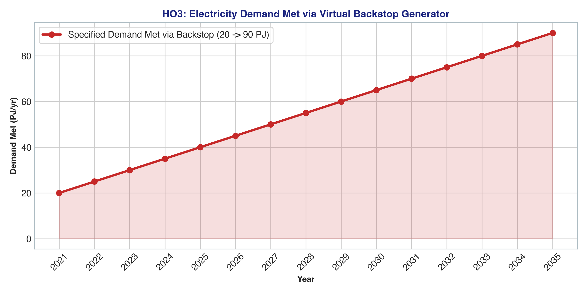
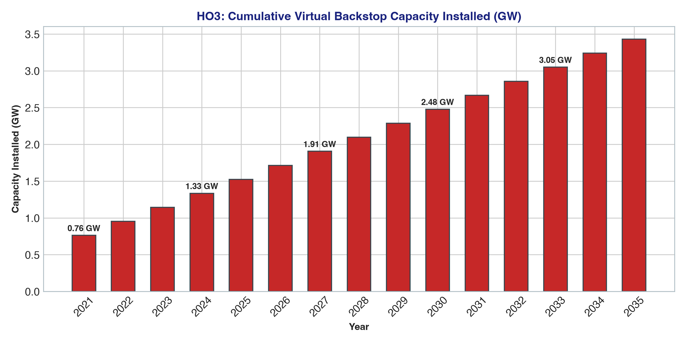

# Handout 3 (HO3): Base Power System Results & Analysis

## 🎯 Executive Summary & Solver Optimization Statistics
Handout 3 executes the baseline power system optimization model where electricity demand escalates from **20.0 PJ (2021)** to **90.0 PJ (2035)**. Commercial power plants are intentionally omitted, forcing the LP solver to rely entirely on an emergency virtual backstop generator (`BACKSTOP`) at an extreme capital penalty cost of **$99,999/kW**.

* **Optimization Status**: `OPTIMAL` 🟢
* **Objective Function (NPV Total Cost)**: **$51,009,521.16** (~$51.01 Million)
* **LP Problem Rows (Constraints)**: **466**
* **LP Problem Columns (Variables)**: **240**
* **Non-Zero Matrix Elements**: **2,160**
* **Solve Time**: **< 0.05 seconds**
* **Active Technologies**: `MINBACK` (mining resource), `BACKSTOP` (penalty generator)

---

## 📊 Visual Analytics & Scenario Charts

### 1. Annual Demand Trajectory Satisfied by Backstop


### 2. Cumulative Backstop Generation Capacity Accumulation


---

## 📋 Comprehensive Optimization Result Tables

### Table 1: Annual New Capacity Additions by Technology (GW/yr)
Because no commercial assets are present, `BACKSTOP` is built in 2021 to meet initial load and added every year to match demand growth (+5 PJ/yr = +0.191 GW/yr):

| Technology Code | 2021 | 2023 | 2025 | 2027 | 2029 | 2031 | 2033 | 2035 | Cumulative Built (GW) |
|---|---|---|---|---|---|---|---|---|---|
| **`BACKSTOP`** | 0.762 | 0.191 | 0.191 | 0.191 | 0.191 | 0.191 | 0.191 | 0.191 | **3.430** |
| **`MINBACK`** | 24.038 | 6.010 | 6.010 | 6.010 | 6.010 | 6.010 | 6.010 | 6.010 | **108.173** |


---

### Table 2: Cumulative Installed Generation & Mining Capacity (GW)
All assets operate over the 15-year planning horizon without retirement, accumulating steady capacity:

| Technology Code | 2021 | 2023 | 2025 | 2027 | 2029 | 2031 | 2033 | 2035 | Horizon End (2035) |
|---|---|---|---|---|---|---|---|---|---|
| **`BACKSTOP`** | 0.762 | 1.143 | 1.525 | 1.906 | 2.287 | 2.668 | 3.049 | 3.430 | **3.430** |
| **`MINBACK`** | 24.038 | 36.058 | 48.077 | 60.096 | 72.115 | 84.135 | 96.154 | 108.173 | **108.173** |


---

### Table 3: Annual Operational Activity & Production Flow (PJ/yr)
Annual energy delivered by `BACKSTOP` and produced by `MINBACK` matches final electricity demand (`ELC003`) identically:

| Technology Code | 2021 | 2023 | 2025 | 2027 | 2029 | 2031 | 2033 | 2035 | 15-Yr Total (PJ) |
|---|---|---|---|---|---|---|---|---|---|
| **`MINBACK`** | 20.00 | 30.00 | 40.00 | 50.00 | 60.00 | 70.00 | 80.00 | 90.00 | **825.00** |
| **`BACKSTOP`** | 20.00 | 30.00 | 40.00 | 50.00 | 60.00 | 70.00 | 80.00 | 90.00 | **825.00** |


---

### Table 4: Sub-Annual Operational Activity by Timeslice (PJ/yr Rate)
Operational activity rate across the four seasonal timeslices for milestone benchmark years:

| Timeslice Partition | 2021 Rate (PJ/yr) | 2025 Rate (PJ/yr) | 2030 Rate (PJ/yr) | 2035 Rate (PJ/yr) |
|---|---|---|---|---|
| **Timeslice `RD`** (20.8% yr) | 24.04 | 48.08 | 78.12 | 108.17 |
| **Timeslice `RN`** (20.8% yr) | 19.23 | 38.46 | 62.50 | 86.54 |
| **Timeslice `DD`** (29.2% yr) | 20.55 | 41.10 | 66.78 | 92.47 |
| **Timeslice `DN`** (29.2% yr) | 17.12 | 34.25 | 55.65 | 77.05 |


---

## 💡 Key Economic & Engineering Takeaways
1. **Model Feasibility Verification**: The primary role of the Handout 3 baseline is to verify that the mathematical model solves to optimality without unboundedness or infeasibility.
2. **Artificial System Cost ($51.01M)**: The objective function value of **$51,009,521.16** does not reflect a realistic power system; rather, it reflects the severe artificial penalty ($99,999/kW) applied to unmet demand. In Handout 5, the addition of real power plants reduces this cost by 99.96%.

---

## 📜 Full Verbatim GLPK Solver Solution Output (`solution.txt`)

Below is the complete, raw primal and dual solver output generated by the GLPK linear programming solver (`glpsol`), incorporating all LP row constraints, column variables, activity levels, bounds, and shadow prices:

<details>
<summary><b>🔍 Click to expand complete raw GLPK solver solution output (OSeHO3_solution.txt)</b></summary>

```text
Problem:    osemosys_fast
Rows:       466
Columns:    240
Non-zeros:  2160
Status:     OPTIMAL
Objective:  cost = 51009521.16 (MINimum)

   No.   Row name   St   Activity     Lower bound   Upper bound    Marginal
------ ------------ -- ------------- ------------- ------------- -------------
     1 cost         B    5.10095e+07                             
     2 CAa4_Constraint_Capacity[SC_0,RD,MINBACK,2021]
                    NU             0                          -0       -104437 
     3 CAa4_Constraint_Capacity[SC_0,RD,MINBACK,2022]
                    NU             0                          -0      -94942.5 
     4 CAa4_Constraint_Capacity[SC_0,RD,MINBACK,2023]
                    NU             0                          -0      -86311.4 
     5 CAa4_Constraint_Capacity[SC_0,RD,MINBACK,2024]
                    NU             0                          -0      -78464.9 
     6 CAa4_Constraint_Capacity[SC_0,RD,MINBACK,2025]
                    NU             0                          -0      -71331.7 
     7 CAa4_Constraint_Capacity[SC_0,RD,MINBACK,2026]
                    NU             0                          -0        -64847 
     8 CAa4_Constraint_Capacity[SC_0,RD,MINBACK,2027]
                    NU             0                          -0      -58951.8 
     9 CAa4_Constraint_Capacity[SC_0,RD,MINBACK,2028]
                    NU             0                          -0      -53592.6 
    10 CAa4_Constraint_Capacity[SC_0,RD,MINBACK,2029]
                    NU             0                          -0      -48720.5 
    11 CAa4_Constraint_Capacity[SC_0,RD,MINBACK,2030]
                    NU             0                          -0      -44291.4 
    12 CAa4_Constraint_Capacity[SC_0,RD,MINBACK,2031]
                    NU             0                          -0      -40264.9 
    13 CAa4_Constraint_Capacity[SC_0,RD,MINBACK,2032]
                    NU             0                          -0      -36604.5 
    14 CAa4_Constraint_Capacity[SC_0,RD,MINBACK,2033]
                    NU             0                          -0      -33276.8 
    15 CAa4_Constraint_Capacity[SC_0,RD,MINBACK,2034]
                    NU             0                          -0      -30251.6 
    16 CAa4_Constraint_Capacity[SC_0,RD,MINBACK,2035]
                    NU             0                          -0      -27501.5 
    17 CAa4_Constraint_Capacity[SC_0,RD,BACKSTOP,2021]
                    NU             0                          -0      -3311.67 
    18 CAa4_Constraint_Capacity[SC_0,RD,BACKSTOP,2022]
                    NU             0                          -0      -3010.61 
    19 CAa4_Constraint_Capacity[SC_0,RD,BACKSTOP,2023]
                    NU             0                          -0      -2736.92 
    20 CAa4_Constraint_Capacity[SC_0,RD,BACKSTOP,2024]
                    NU             0                          -0      -2488.11 
    21 CAa4_Constraint_Capacity[SC_0,RD,BACKSTOP,2025]
                    NU             0                          -0      -2261.91 
    22 CAa4_Constraint_Capacity[SC_0,RD,BACKSTOP,2026]
                    NU             0                          -0      -2056.29 
    23 CAa4_Constraint_Capacity[SC_0,RD,BACKSTOP,2027]
                    NU             0                          -0      -1869.35 
    24 CAa4_Constraint_Capacity[SC_0,RD,BACKSTOP,2028]
                    NU             0                          -0      -1699.41 
    25 CAa4_Constraint_Capacity[SC_0,RD,BACKSTOP,2029]
                    NU             0                          -0      -1544.92 
    26 CAa4_Constraint_Capacity[SC_0,RD,BACKSTOP,2030]
                    NU             0                          -0      -1404.47 
    27 CAa4_Constraint_Capacity[SC_0,RD,BACKSTOP,2031]
                    NU             0                          -0      -1276.79 
    28 CAa4_Constraint_Capacity[SC_0,RD,BACKSTOP,2032]
                    NU             0                          -0      -1160.72 
    29 CAa4_Constraint_Capacity[SC_0,RD,BACKSTOP,2033]
                    NU             0                          -0       -1055.2 
    30 CAa4_Constraint_Capacity[SC_0,RD,BACKSTOP,2034]
                    NU             0                          -0      -959.272 
    31 CAa4_Constraint_Capacity[SC_0,RD,BACKSTOP,2035]
                    NU             0                          -0      -872.066 
    32 CAa4_Constraint_Capacity[SC_0,RN,MINBACK,2021]
                    B       -4.80769                          -0 
    33 CAa4_Constraint_Capacity[SC_0,RN,MINBACK,2022]
                    B       -6.00962                          -0 
    34 CAa4_Constraint_Capacity[SC_0,RN,MINBACK,2023]
                    B       -7.21154                          -0 
    35 CAa4_Constraint_Capacity[SC_0,RN,MINBACK,2024]
                    B       -8.41346                          -0 
    36 CAa4_Constraint_Capacity[SC_0,RN,MINBACK,2025]
                    B       -9.61538                          -0 
    37 CAa4_Constraint_Capacity[SC_0,RN,MINBACK,2026]
                    B       -10.8173                          -0 
    38 CAa4_Constraint_Capacity[SC_0,RN,MINBACK,2027]
                    B       -12.0192                          -0 
    39 CAa4_Constraint_Capacity[SC_0,RN,MINBACK,2028]
                    B       -13.2212                          -0 
    40 CAa4_Constraint_Capacity[SC_0,RN,MINBACK,2029]
                    B       -14.4231                          -0 
    41 CAa4_Constraint_Capacity[SC_0,RN,MINBACK,2030]
                    B        -15.625                          -0 
    42 CAa4_Constraint_Capacity[SC_0,RN,MINBACK,2031]
                    B       -16.8269                          -0 
    43 CAa4_Constraint_Capacity[SC_0,RN,MINBACK,2032]
                    B       -18.0288                          -0 
    44 CAa4_Constraint_Capacity[SC_0,RN,MINBACK,2033]
                    B       -19.2308                          -0 
    45 CAa4_Constraint_Capacity[SC_0,RN,MINBACK,2034]
                    B       -20.4327                          -0 
    46 CAa4_Constraint_Capacity[SC_0,RN,MINBACK,2035]
                    B       -21.6346                          -0 
    47 CAa4_Constraint_Capacity[SC_0,RN,BACKSTOP,2021]
                    B       -4.80769                          -0 
    48 CAa4_Constraint_Capacity[SC_0,RN,BACKSTOP,2022]
                    B       -6.00962                          -0 
    49 CAa4_Constraint_Capacity[SC_0,RN,BACKSTOP,2023]
                    B       -7.21154                          -0 
    50 CAa4_Constraint_Capacity[SC_0,RN,BACKSTOP,2024]
                    B       -8.41346                          -0 
    51 CAa4_Constraint_Capacity[SC_0,RN,BACKSTOP,2025]
                    B       -9.61538                          -0 
    52 CAa4_Constraint_Capacity[SC_0,RN,BACKSTOP,2026]
                    B       -10.8173                          -0 
    53 CAa4_Constraint_Capacity[SC_0,RN,BACKSTOP,2027]
                    B       -12.0192                          -0 
    54 CAa4_Constraint_Capacity[SC_0,RN,BACKSTOP,2028]
                    B       -13.2212                          -0 
    55 CAa4_Constraint_Capacity[SC_0,RN,BACKSTOP,2029]
                    B       -14.4231                          -0 
    56 CAa4_Constraint_Capacity[SC_0,RN,BACKSTOP,2030]
                    B        -15.625                          -0 
    57 CAa4_Constraint_Capacity[SC_0,RN,BACKSTOP,2031]
                    B       -16.8269                          -0 
    58 CAa4_Constraint_Capacity[SC_0,RN,BACKSTOP,2032]
                    B       -18.0288                          -0 
    59 CAa4_Constraint_Capacity[SC_0,RN,BACKSTOP,2033]
                    B       -19.2308                          -0 
    60 CAa4_Constraint_Capacity[SC_0,RN,BACKSTOP,2034]
                    B       -20.4327                          -0 
    61 CAa4_Constraint_Capacity[SC_0,RN,BACKSTOP,2035]
                    B       -21.6346                          -0 
    62 CAa4_Constraint_Capacity[SC_0,DD,MINBACK,2021]
                    B       -3.49052                          -0 
    63 CAa4_Constraint_Capacity[SC_0,DD,MINBACK,2022]
                    B       -4.36315                          -0 
    64 CAa4_Constraint_Capacity[SC_0,DD,MINBACK,2023]
                    B       -5.23577                          -0 
    65 CAa4_Constraint_Capacity[SC_0,DD,MINBACK,2024]
                    B        -6.1084                          -0 
    66 CAa4_Constraint_Capacity[SC_0,DD,MINBACK,2025]
                    B       -6.98103                          -0 
    67 CAa4_Constraint_Capacity[SC_0,DD,MINBACK,2026]
                    B       -7.85366                          -0 
    68 CAa4_Constraint_Capacity[SC_0,DD,MINBACK,2027]
                    B       -8.72629                          -0 
    69 CAa4_Constraint_Capacity[SC_0,DD,MINBACK,2028]
                    B       -9.59892                          -0 
    70 CAa4_Constraint_Capacity[SC_0,DD,MINBACK,2029]
                    B       -10.4715                          -0 
    71 CAa4_Constraint_Capacity[SC_0,DD,MINBACK,2030]
                    B       -11.3442                          -0 
    72 CAa4_Constraint_Capacity[SC_0,DD,MINBACK,2031]
                    B       -12.2168                          -0 
    73 CAa4_Constraint_Capacity[SC_0,DD,MINBACK,2032]
                    B       -13.0894                          -0 
    74 CAa4_Constraint_Capacity[SC_0,DD,MINBACK,2033]
                    B       -13.9621                          -0 
    75 CAa4_Constraint_Capacity[SC_0,DD,MINBACK,2034]
                    B       -14.8347                          -0 
    76 CAa4_Constraint_Capacity[SC_0,DD,MINBACK,2035]
                    B       -15.7073                          -0 
    77 CAa4_Constraint_Capacity[SC_0,DD,BACKSTOP,2021]
                    B       -3.49052                          -0 
    78 CAa4_Constraint_Capacity[SC_0,DD,BACKSTOP,2022]
                    B       -4.36315                          -0 
    79 CAa4_Constraint_Capacity[SC_0,DD,BACKSTOP,2023]
                    B       -5.23577                          -0 
    80 CAa4_Constraint_Capacity[SC_0,DD,BACKSTOP,2024]
                    B        -6.1084                          -0 
    81 CAa4_Constraint_Capacity[SC_0,DD,BACKSTOP,2025]
                    B       -6.98103                          -0 
    82 CAa4_Constraint_Capacity[SC_0,DD,BACKSTOP,2026]
                    B       -7.85366                          -0 
    83 CAa4_Constraint_Capacity[SC_0,DD,BACKSTOP,2027]
                    B       -8.72629                          -0 
    84 CAa4_Constraint_Capacity[SC_0,DD,BACKSTOP,2028]
                    B       -9.59892                          -0 
    85 CAa4_Constraint_Capacity[SC_0,DD,BACKSTOP,2029]
                    B       -10.4715                          -0 
    86 CAa4_Constraint_Capacity[SC_0,DD,BACKSTOP,2030]
                    B       -11.3442                          -0 
    87 CAa4_Constraint_Capacity[SC_0,DD,BACKSTOP,2031]
                    B       -12.2168                          -0 
    88 CAa4_Constraint_Capacity[SC_0,DD,BACKSTOP,2032]
                    B       -13.0894                          -0 
    89 CAa4_Constraint_Capacity[SC_0,DD,BACKSTOP,2033]
                    B       -13.9621                          -0 
    90 CAa4_Constraint_Capacity[SC_0,DD,BACKSTOP,2034]
                    B       -14.8347                          -0 
    91 CAa4_Constraint_Capacity[SC_0,DD,BACKSTOP,2035]
                    B       -15.7073                          -0 
    92 CAa4_Constraint_Capacity[SC_0,DN,MINBACK,2021]
                    B       -6.91517                          -0 
    93 CAa4_Constraint_Capacity[SC_0,DN,MINBACK,2022]
                    B       -8.64397                          -0 
    94 CAa4_Constraint_Capacity[SC_0,DN,MINBACK,2023]
                    B       -10.3728                          -0 
    95 CAa4_Constraint_Capacity[SC_0,DN,MINBACK,2024]
                    B       -12.1016                          -0 
    96 CAa4_Constraint_Capacity[SC_0,DN,MINBACK,2025]
                    B       -13.8303                          -0 
    97 CAa4_Constraint_Capacity[SC_0,DN,MINBACK,2026]
                    B       -15.5591                          -0 
    98 CAa4_Constraint_Capacity[SC_0,DN,MINBACK,2027]
                    B       -17.2879                          -0 
    99 CAa4_Constraint_Capacity[SC_0,DN,MINBACK,2028]
                    B       -19.0167                          -0 
   100 CAa4_Constraint_Capacity[SC_0,DN,MINBACK,2029]
                    B       -20.7455                          -0 
   101 CAa4_Constraint_Capacity[SC_0,DN,MINBACK,2030]
                    B       -22.4743                          -0 
   102 CAa4_Constraint_Capacity[SC_0,DN,MINBACK,2031]
                    B       -24.2031                          -0 
   103 CAa4_Constraint_Capacity[SC_0,DN,MINBACK,2032]
                    B       -25.9319                          -0 
   104 CAa4_Constraint_Capacity[SC_0,DN,MINBACK,2033]
                    B       -27.6607                          -0 
   105 CAa4_Constraint_Capacity[SC_0,DN,MINBACK,2034]
                    B       -29.3895                          -0 
   106 CAa4_Constraint_Capacity[SC_0,DN,MINBACK,2035]
                    B       -31.1183                          -0 
   107 CAa4_Constraint_Capacity[SC_0,DN,BACKSTOP,2021]
                    B       -6.91517                          -0 
   108 CAa4_Constraint_Capacity[SC_0,DN,BACKSTOP,2022]
                    B       -8.64397                          -0 
   109 CAa4_Constraint_Capacity[SC_0,DN,BACKSTOP,2023]
                    B       -10.3728                          -0 
   110 CAa4_Constraint_Capacity[SC_0,DN,BACKSTOP,2024]
                    B       -12.1016                          -0 
   111 CAa4_Constraint_Capacity[SC_0,DN,BACKSTOP,2025]
                    B       -13.8303                          -0 
   112 CAa4_Constraint_Capacity[SC_0,DN,BACKSTOP,2026]
                    B       -15.5591                          -0 
   113 CAa4_Constraint_Capacity[SC_0,DN,BACKSTOP,2027]
                    B       -17.2879                          -0 
   114 CAa4_Constraint_Capacity[SC_0,DN,BACKSTOP,2028]
                    B       -19.0167                          -0 
   115 CAa4_Constraint_Capacity[SC_0,DN,BACKSTOP,2029]
                    B       -20.7455                          -0 
   116 CAa4_Constraint_Capacity[SC_0,DN,BACKSTOP,2030]
                    B       -22.4743                          -0 
   117 CAa4_Constraint_Capacity[SC_0,DN,BACKSTOP,2031]
                    B       -24.2031                          -0 
   118 CAa4_Constraint_Capacity[SC_0,DN,BACKSTOP,2032]
                    B       -25.9319                          -0 
   119 CAa4_Constraint_Capacity[SC_0,DN,BACKSTOP,2033]
                    B       -27.6607                          -0 
   120 CAa4_Constraint_Capacity[SC_0,DN,BACKSTOP,2034]
                    B       -29.3895                          -0 
   121 CAa4_Constraint_Capacity[SC_0,DN,BACKSTOP,2035]
                    B       -31.1183                          -0 
   122 CAb1_PlannedMaintenance[SC_0,MINBACK,2021]
                    B       -4.03846                          -0 
   123 CAb1_PlannedMaintenance[SC_0,MINBACK,2022]
                    B       -5.04808                          -0 
   124 CAb1_PlannedMaintenance[SC_0,MINBACK,2023]
                    B       -6.05769                          -0 
   125 CAb1_PlannedMaintenance[SC_0,MINBACK,2024]
                    B       -7.06731                          -0 
   126 CAb1_PlannedMaintenance[SC_0,MINBACK,2025]
                    B       -8.07692                          -0 
   127 CAb1_PlannedMaintenance[SC_0,MINBACK,2026]
                    B       -9.08654                          -0 
   128 CAb1_PlannedMaintenance[SC_0,MINBACK,2027]
                    B       -10.0962                          -0 
   129 CAb1_PlannedMaintenance[SC_0,MINBACK,2028]
                    B       -11.1058                          -0 
   130 CAb1_PlannedMaintenance[SC_0,MINBACK,2029]
                    B       -12.1154                          -0 
   131 CAb1_PlannedMaintenance[SC_0,MINBACK,2030]
                    B        -13.125                          -0 
   132 CAb1_PlannedMaintenance[SC_0,MINBACK,2031]
                    B       -14.1346                          -0 
   133 CAb1_PlannedMaintenance[SC_0,MINBACK,2032]
                    B       -15.1442                          -0 
   134 CAb1_PlannedMaintenance[SC_0,MINBACK,2033]
                    B       -16.1538                          -0 
   135 CAb1_PlannedMaintenance[SC_0,MINBACK,2034]
                    B       -17.1635                          -0 
   136 CAb1_PlannedMaintenance[SC_0,MINBACK,2035]
                    B       -18.1731                          -0 
   137 CAb1_PlannedMaintenance[SC_0,BACKSTOP,2021]
                    B       -4.03846                          -0 
   138 CAb1_PlannedMaintenance[SC_0,BACKSTOP,2022]
                    B       -5.04808                          -0 
   139 CAb1_PlannedMaintenance[SC_0,BACKSTOP,2023]
                    B       -6.05769                          -0 
   140 CAb1_PlannedMaintenance[SC_0,BACKSTOP,2024]
                    B       -7.06731                          -0 
   141 CAb1_PlannedMaintenance[SC_0,BACKSTOP,2025]
                    B       -8.07692                          -0 
   142 CAb1_PlannedMaintenance[SC_0,BACKSTOP,2026]
                    B       -9.08654                          -0 
   143 CAb1_PlannedMaintenance[SC_0,BACKSTOP,2027]
                    B       -10.0962                          -0 
   144 CAb1_PlannedMaintenance[SC_0,BACKSTOP,2028]
                    B       -11.1058                          -0 
   145 CAb1_PlannedMaintenance[SC_0,BACKSTOP,2029]
                    B       -12.1154                          -0 
   146 CAb1_PlannedMaintenance[SC_0,BACKSTOP,2030]
                    B        -13.125                          -0 
   147 CAb1_PlannedMaintenance[SC_0,BACKSTOP,2031]
                    B       -14.1346                          -0 
   148 CAb1_PlannedMaintenance[SC_0,BACKSTOP,2032]
                    B       -15.1442                          -0 
   149 CAb1_PlannedMaintenance[SC_0,BACKSTOP,2033]
                    B       -16.1538                          -0 
   150 CAb1_PlannedMaintenance[SC_0,BACKSTOP,2034]
                    B       -17.1635                          -0 
   151 CAb1_PlannedMaintenance[SC_0,BACKSTOP,2035]
                    B       -18.1731                          -0 
   152 EBa11_EnergyBalanceEachTS5[SC_0,RD,BACK,2021]
                    NL             0            -0                      503052 
   153 EBa11_EnergyBalanceEachTS5[SC_0,RD,BACK,2022]
                    NL             0            -0                      457320 
   154 EBa11_EnergyBalanceEachTS5[SC_0,RD,BACK,2023]
                    NL             0            -0                      415746 
   155 EBa11_EnergyBalanceEachTS5[SC_0,RD,BACK,2024]
                    NL             0            -0                      377951 
   156 EBa11_EnergyBalanceEachTS5[SC_0,RD,BACK,2025]
                    NL             0            -0                      343592 
   157 EBa11_EnergyBalanceEachTS5[SC_0,RD,BACK,2026]
                    NL             0            -0                      312356 
   158 EBa11_EnergyBalanceEachTS5[SC_0,RD,BACK,2027]
                    NL             0            -0                      283960 
   159 EBa11_EnergyBalanceEachTS5[SC_0,RD,BACK,2028]
                    NL             0            -0                      258145 
   160 EBa11_EnergyBalanceEachTS5[SC_0,RD,BACK,2029]
                    NL             0            -0                      234678 
   161 EBa11_EnergyBalanceEachTS5[SC_0,RD,BACK,2030]
                    NL             0            -0                      213343 
   162 EBa11_EnergyBalanceEachTS5[SC_0,RD,BACK,2031]
                    NL             0            -0                      193948 
   163 EBa11_EnergyBalanceEachTS5[SC_0,RD,BACK,2032]
                    NL             0            -0                      176317 
   164 EBa11_EnergyBalanceEachTS5[SC_0,RD,BACK,2033]
                    NL             0            -0                      160288 
   165 EBa11_EnergyBalanceEachTS5[SC_0,RD,BACK,2034]
                    NL             0            -0                      145716 
   166 EBa11_EnergyBalanceEachTS5[SC_0,RD,BACK,2035]
                    NL             0            -0                      132469 
   167 EBa11_EnergyBalanceEachTS5[SC_0,RD,ELC003,2021]
                    NL             5             5                      519926 
   168 EBa11_EnergyBalanceEachTS5[SC_0,RD,ELC003,2022]
                    NL          6.25          6.25                      472660 
   169 EBa11_EnergyBalanceEachTS5[SC_0,RD,ELC003,2023]
                    NL           7.5           7.5                      429691 
   170 EBa11_EnergyBalanceEachTS5[SC_0,RD,ELC003,2024]
                    NL          8.75          8.75                      390628 
   171 EBa11_EnergyBalanceEachTS5[SC_0,RD,ELC003,2025]
                    NL            10            10                      355117 
   172 EBa11_EnergyBalanceEachTS5[SC_0,RD,ELC003,2026]
                    NL         11.25         11.25                      322833 
   173 EBa11_EnergyBalanceEachTS5[SC_0,RD,ELC003,2027]
                    NL          12.5          12.5                      293485 
   174 EBa11_EnergyBalanceEachTS5[SC_0,RD,ELC003,2028]
                    NL         13.75         13.75                      266804 
   175 EBa11_EnergyBalanceEachTS5[SC_0,RD,ELC003,2029]
                    NL            15            15                      242550 
   176 EBa11_EnergyBalanceEachTS5[SC_0,RD,ELC003,2030]
                    NL         16.25         16.25                      220500 
   177 EBa11_EnergyBalanceEachTS5[SC_0,RD,ELC003,2031]
                    NL          17.5          17.5                      200454 
   178 EBa11_EnergyBalanceEachTS5[SC_0,RD,ELC003,2032]
                    NL         18.75         18.75                      182231 
   179 EBa11_EnergyBalanceEachTS5[SC_0,RD,ELC003,2033]
                    NL            20            20                      165665 
   180 EBa11_EnergyBalanceEachTS5[SC_0,RD,ELC003,2034]
                    NL         21.25         21.25                      150604 
   181 EBa11_EnergyBalanceEachTS5[SC_0,RD,ELC003,2035]
                    NL          22.5          22.5                      136913 
   182 EBa11_EnergyBalanceEachTS5[SC_0,RN,BACK,2021]
                    NL             0            -0                     952.509 
   183 EBa11_EnergyBalanceEachTS5[SC_0,RN,BACK,2022]
                    NL             0            -0                     865.917 
   184 EBa11_EnergyBalanceEachTS5[SC_0,RN,BACK,2023]
                    NL             0            -0                     787.198 
   185 EBa11_EnergyBalanceEachTS5[SC_0,RN,BACK,2024]
                    NL             0            -0                     715.634 
   186 EBa11_EnergyBalanceEachTS5[SC_0,RN,BACK,2025]
                    NL             0            -0                     650.577 
   187 EBa11_EnergyBalanceEachTS5[SC_0,RN,BACK,2026]
                    NL             0            -0                     591.433 
   188 EBa11_EnergyBalanceEachTS5[SC_0,RN,BACK,2027]
                    NL             0            -0                     537.667 
   189 EBa11_EnergyBalanceEachTS5[SC_0,RN,BACK,2028]
                    NL             0            -0                     488.788 
   190 EBa11_EnergyBalanceEachTS5[SC_0,RN,BACK,2029]
                    NL             0            -0                     444.353 
   191 EBa11_EnergyBalanceEachTS5[SC_0,RN,BACK,2030]
                    NL             0            -0                     403.957 
   192 EBa11_EnergyBalanceEachTS5[SC_0,RN,BACK,2031]
                    NL             0            -0                     367.234 
   193 EBa11_EnergyBalanceEachTS5[SC_0,RN,BACK,2032]
                    NL             0            -0                     333.849 
   194 EBa11_EnergyBalanceEachTS5[SC_0,RN,BACK,2033]
                    NL             0            -0                     303.499 
   195 EBa11_EnergyBalanceEachTS5[SC_0,RN,BACK,2034]
                    NL             0            -0                     275.908 
   196 EBa11_EnergyBalanceEachTS5[SC_0,RN,BACK,2035]
                    NL             0            -0                     250.825 
   197 EBa11_EnergyBalanceEachTS5[SC_0,RN,ELC003,2021]
                    NL             4             4                     1905.02 
   198 EBa11_EnergyBalanceEachTS5[SC_0,RN,ELC003,2022]
                    NL             5             5                     1731.83 
   199 EBa11_EnergyBalanceEachTS5[SC_0,RN,ELC003,2023]
                    NL             6             6                      1574.4 
   200 EBa11_EnergyBalanceEachTS5[SC_0,RN,ELC003,2024]
                    NL             7             7                     1431.27 
   201 EBa11_EnergyBalanceEachTS5[SC_0,RN,ELC003,2025]
                    NL             8             8                     1301.15 
   202 EBa11_EnergyBalanceEachTS5[SC_0,RN,ELC003,2026]
                    NL             9             9                     1182.87 
   203 EBa11_EnergyBalanceEachTS5[SC_0,RN,ELC003,2027]
                    NL            10            10                     1075.33 
   204 EBa11_EnergyBalanceEachTS5[SC_0,RN,ELC003,2028]
                    NL            11            11                     977.576 
   205 EBa11_EnergyBalanceEachTS5[SC_0,RN,ELC003,2029]
                    NL            12            12                     888.705 
   206 EBa11_EnergyBalanceEachTS5[SC_0,RN,ELC003,2030]
                    NL            13            13                     807.914 
   207 EBa11_EnergyBalanceEachTS5[SC_0,RN,ELC003,2031]
                    NL            14            14                     734.467 
   208 EBa11_EnergyBalanceEachTS5[SC_0,RN,ELC003,2032]
                    NL            15            15                     667.697 
   209 EBa11_EnergyBalanceEachTS5[SC_0,RN,ELC003,2033]
                    NL            16            16                     606.998 
   210 EBa11_EnergyBalanceEachTS5[SC_0,RN,ELC003,2034]
                    NL            17            17                     551.816 
   211 EBa11_EnergyBalanceEachTS5[SC_0,RN,ELC003,2035]
                    NL            18            18                     501.651 
   212 EBa11_EnergyBalanceEachTS5[SC_0,DD,BACK,2021]
                    NL             0            -0                     952.509 
   213 EBa11_EnergyBalanceEachTS5[SC_0,DD,BACK,2022]
                    NL             0            -0                     865.917 
   214 EBa11_EnergyBalanceEachTS5[SC_0,DD,BACK,2023]
                    NL             0            -0                     787.198 
   215 EBa11_EnergyBalanceEachTS5[SC_0,DD,BACK,2024]
                    NL             0            -0                     715.634 
   216 EBa11_EnergyBalanceEachTS5[SC_0,DD,BACK,2025]
                    NL             0            -0                     650.577 
   217 EBa11_EnergyBalanceEachTS5[SC_0,DD,BACK,2026]
                    NL             0            -0                     591.433 
   218 EBa11_EnergyBalanceEachTS5[SC_0,DD,BACK,2027]
                    NL             0            -0                     537.667 
   219 EBa11_EnergyBalanceEachTS5[SC_0,DD,BACK,2028]
                    NL             0            -0                     488.788 
   220 EBa11_EnergyBalanceEachTS5[SC_0,DD,BACK,2029]
                    NL             0            -0                     444.353 
   221 EBa11_EnergyBalanceEachTS5[SC_0,DD,BACK,2030]
                    NL             0            -0                     403.957 
   222 EBa11_EnergyBalanceEachTS5[SC_0,DD,BACK,2031]
                    NL             0            -0                     367.234 
   223 EBa11_EnergyBalanceEachTS5[SC_0,DD,BACK,2032]
                    NL             0            -0                     333.849 
   224 EBa11_EnergyBalanceEachTS5[SC_0,DD,BACK,2033]
                    NL             0            -0                     303.499 
   225 EBa11_EnergyBalanceEachTS5[SC_0,DD,BACK,2034]
                    NL             0            -0                     275.908 
   226 EBa11_EnergyBalanceEachTS5[SC_0,DD,BACK,2035]
                    NL             0            -0                     250.825 
   227 EBa11_EnergyBalanceEachTS5[SC_0,DD,ELC003,2021]
                    NL             6             6                     1905.02 
   228 EBa11_EnergyBalanceEachTS5[SC_0,DD,ELC003,2022]
                    NL           7.5           7.5                     1731.83 
   229 EBa11_EnergyBalanceEachTS5[SC_0,DD,ELC003,2023]
                    NL             9             9                      1574.4 
   230 EBa11_EnergyBalanceEachTS5[SC_0,DD,ELC003,2024]
                    NL          10.5          10.5                     1431.27 
   231 EBa11_EnergyBalanceEachTS5[SC_0,DD,ELC003,2025]
                    NL            12            12                     1301.15 
   232 EBa11_EnergyBalanceEachTS5[SC_0,DD,ELC003,2026]
                    NL          13.5          13.5                     1182.87 
   233 EBa11_EnergyBalanceEachTS5[SC_0,DD,ELC003,2027]
                    NL            15            15                     1075.33 
   234 EBa11_EnergyBalanceEachTS5[SC_0,DD,ELC003,2028]
                    NL          16.5          16.5                     977.576 
   235 EBa11_EnergyBalanceEachTS5[SC_0,DD,ELC003,2029]
                    NL            18            18                     888.705 
   236 EBa11_EnergyBalanceEachTS5[SC_0,DD,ELC003,2030]
                    NL          19.5          19.5                     807.914 
   237 EBa11_EnergyBalanceEachTS5[SC_0,DD,ELC003,2031]
                    NL            21            21                     734.467 
   238 EBa11_EnergyBalanceEachTS5[SC_0,DD,ELC003,2032]
                    NL          22.5          22.5                     667.697 
   239 EBa11_EnergyBalanceEachTS5[SC_0,DD,ELC003,2033]
                    NL            24            24                     606.998 
   240 EBa11_EnergyBalanceEachTS5[SC_0,DD,ELC003,2034]
                    NL          25.5          25.5                     551.816 
   241 EBa11_EnergyBalanceEachTS5[SC_0,DD,ELC003,2035]
                    NL            27            27                     501.651 
   242 EBa11_EnergyBalanceEachTS5[SC_0,DN,BACK,2021]
                    NL             0            -0                     952.509 
   243 EBa11_EnergyBalanceEachTS5[SC_0,DN,BACK,2022]
                    NL             0            -0                     865.917 
   244 EBa11_EnergyBalanceEachTS5[SC_0,DN,BACK,2023]
                    NL             0            -0                     787.198 
   245 EBa11_EnergyBalanceEachTS5[SC_0,DN,BACK,2024]
                    NL             0            -0                     715.634 
   246 EBa11_EnergyBalanceEachTS5[SC_0,DN,BACK,2025]
                    NL             0            -0                     650.577 
   247 EBa11_EnergyBalanceEachTS5[SC_0,DN,BACK,2026]
                    NL             0            -0                     591.433 
   248 EBa11_EnergyBalanceEachTS5[SC_0,DN,BACK,2027]
                    NL             0            -0                     537.667 
   249 EBa11_EnergyBalanceEachTS5[SC_0,DN,BACK,2028]
                    NL             0            -0                     488.788 
   250 EBa11_EnergyBalanceEachTS5[SC_0,DN,BACK,2029]
                    NL             0            -0                     444.353 
   251 EBa11_EnergyBalanceEachTS5[SC_0,DN,BACK,2030]
                    NL             0            -0                     403.957 
   252 EBa11_EnergyBalanceEachTS5[SC_0,DN,BACK,2031]
                    NL             0            -0                     367.234 
   253 EBa11_EnergyBalanceEachTS5[SC_0,DN,BACK,2032]
                    NL             0            -0                     333.849 
   254 EBa11_EnergyBalanceEachTS5[SC_0,DN,BACK,2033]
                    NL             0            -0                     303.499 
   255 EBa11_EnergyBalanceEachTS5[SC_0,DN,BACK,2034]
                    NL             0            -0                     275.908 
   256 EBa11_EnergyBalanceEachTS5[SC_0,DN,BACK,2035]
                    NL             0            -0                     250.825 
   257 EBa11_EnergyBalanceEachTS5[SC_0,DN,ELC003,2021]
                    NL             5             5                     1905.02 
   258 EBa11_EnergyBalanceEachTS5[SC_0,DN,ELC003,2022]
                    NL          6.25          6.25                     1731.83 
   259 EBa11_EnergyBalanceEachTS5[SC_0,DN,ELC003,2023]
                    NL           7.5           7.5                      1574.4 
   260 EBa11_EnergyBalanceEachTS5[SC_0,DN,ELC003,2024]
                    NL          8.75          8.75                     1431.27 
   261 EBa11_EnergyBalanceEachTS5[SC_0,DN,ELC003,2025]
                    NL            10            10                     1301.15 
   262 EBa11_EnergyBalanceEachTS5[SC_0,DN,ELC003,2026]
                    NL         11.25         11.25                     1182.87 
   263 EBa11_EnergyBalanceEachTS5[SC_0,DN,ELC003,2027]
                    NL          12.5          12.5                     1075.33 
   264 EBa11_EnergyBalanceEachTS5[SC_0,DN,ELC003,2028]
                    NL         13.75         13.75                     977.576 
   265 EBa11_EnergyBalanceEachTS5[SC_0,DN,ELC003,2029]
                    NL            15            15                     888.705 
   266 EBa11_EnergyBalanceEachTS5[SC_0,DN,ELC003,2030]
                    NL         16.25         16.25                     807.914 
   267 EBa11_EnergyBalanceEachTS5[SC_0,DN,ELC003,2031]
                    NL          17.5          17.5                     734.467 
   268 EBa11_EnergyBalanceEachTS5[SC_0,DN,ELC003,2032]
                    NL         18.75         18.75                     667.697 
   269 EBa11_EnergyBalanceEachTS5[SC_0,DN,ELC003,2033]
                    NL            20            20                     606.998 
   270 EBa11_EnergyBalanceEachTS5[SC_0,DN,ELC003,2034]
                    NL         21.25         21.25                     551.816 
   271 EBa11_EnergyBalanceEachTS5[SC_0,DN,ELC003,2035]
                    NL          22.5          22.5                     501.651 
   272 EBb4_EnergyBalanceEachYear4[SC_0,BACK,2021]
                    B              0            -0               
   273 EBb4_EnergyBalanceEachYear4[SC_0,BACK,2022]
                    B              0            -0               
   274 EBb4_EnergyBalanceEachYear4[SC_0,BACK,2023]
                    B              0            -0               
   275 EBb4_EnergyBalanceEachYear4[SC_0,BACK,2024]
                    B              0            -0               
   276 EBb4_EnergyBalanceEachYear4[SC_0,BACK,2025]
                    B              0            -0               
   277 EBb4_EnergyBalanceEachYear4[SC_0,BACK,2026]
                    B              0            -0               
   278 EBb4_EnergyBalanceEachYear4[SC_0,BACK,2027]
                    B              0            -0               
   279 EBb4_EnergyBalanceEachYear4[SC_0,BACK,2028]
                    B              0            -0               
   280 EBb4_EnergyBalanceEachYear4[SC_0,BACK,2029]
                    B              0            -0               
   281 EBb4_EnergyBalanceEachYear4[SC_0,BACK,2030]
                    B              0            -0               
   282 EBb4_EnergyBalanceEachYear4[SC_0,BACK,2031]
                    B              0            -0               
   283 EBb4_EnergyBalanceEachYear4[SC_0,BACK,2032]
                    B              0            -0               
   284 EBb4_EnergyBalanceEachYear4[SC_0,BACK,2033]
                    B              0            -0               
   285 EBb4_EnergyBalanceEachYear4[SC_0,BACK,2034]
                    B              0            -0               
   286 EBb4_EnergyBalanceEachYear4[SC_0,BACK,2035]
                    B              0            -0               
   287 EBb4_EnergyBalanceEachYear4[SC_0,ELC003,2021]
                    B             20            -0               
   288 EBb4_EnergyBalanceEachYear4[SC_0,ELC003,2022]
                    B             25            -0               
   289 EBb4_EnergyBalanceEachYear4[SC_0,ELC003,2023]
                    B             30            -0               
   290 EBb4_EnergyBalanceEachYear4[SC_0,ELC003,2024]
                    B             35            -0               
   291 EBb4_EnergyBalanceEachYear4[SC_0,ELC003,2025]
                    B             40            -0               
   292 EBb4_EnergyBalanceEachYear4[SC_0,ELC003,2026]
                    B             45            -0               
   293 EBb4_EnergyBalanceEachYear4[SC_0,ELC003,2027]
                    B             50            -0               
   294 EBb4_EnergyBalanceEachYear4[SC_0,ELC003,2028]
                    B             55            -0               
   295 EBb4_EnergyBalanceEachYear4[SC_0,ELC003,2029]
                    B             60            -0               
   296 EBb4_EnergyBalanceEachYear4[SC_0,ELC003,2030]
                    B             65            -0               
   297 EBb4_EnergyBalanceEachYear4[SC_0,ELC003,2031]
                    B             70            -0               
   298 EBb4_EnergyBalanceEachYear4[SC_0,ELC003,2032]
                    B             75            -0               
   299 EBb4_EnergyBalanceEachYear4[SC_0,ELC003,2033]
                    B             80            -0               
   300 EBb4_EnergyBalanceEachYear4[SC_0,ELC003,2034]
                    B             85            -0               
   301 EBb4_EnergyBalanceEachYear4[SC_0,ELC003,2035]
                    B             90            -0               
   302 SV1_SalvageValueAtEndOfPeriod1[SC_0,MINBACK,2021]
                    NS             0            -0             =     -0.239392 
   303 SV1_SalvageValueAtEndOfPeriod1[SC_0,MINBACK,2022]
                    NS             0            -0             =     -0.239392 
   304 SV1_SalvageValueAtEndOfPeriod1[SC_0,MINBACK,2023]
                    NS             0            -0             =     -0.239392 
   305 SV1_SalvageValueAtEndOfPeriod1[SC_0,MINBACK,2024]
                    NS             0            -0             =     -0.239392 
   306 SV1_SalvageValueAtEndOfPeriod1[SC_0,MINBACK,2025]
                    NS             0            -0             =     -0.239392 
   307 SV1_SalvageValueAtEndOfPeriod1[SC_0,MINBACK,2026]
                    NS             0            -0             =     -0.239392 
   308 SV1_SalvageValueAtEndOfPeriod1[SC_0,MINBACK,2027]
                    NS             0            -0             =     -0.239392 
   309 SV1_SalvageValueAtEndOfPeriod1[SC_0,MINBACK,2028]
                    NS             0            -0             =     -0.239392 
   310 SV1_SalvageValueAtEndOfPeriod1[SC_0,MINBACK,2029]
                    NS             0            -0             =     -0.239392 
   311 SV1_SalvageValueAtEndOfPeriod1[SC_0,MINBACK,2030]
                    NS             0            -0             =     -0.239392 
   312 SV1_SalvageValueAtEndOfPeriod1[SC_0,MINBACK,2031]
                    NS             0            -0             =     -0.239392 
   313 SV1_SalvageValueAtEndOfPeriod1[SC_0,MINBACK,2032]
                    NS             0            -0             =     -0.239392 
   314 SV1_SalvageValueAtEndOfPeriod1[SC_0,MINBACK,2033]
                    NS             0            -0             =     -0.239392 
   315 SV1_SalvageValueAtEndOfPeriod1[SC_0,MINBACK,2034]
                    NS             0            -0             =     -0.239392 
   316 SV1_SalvageValueAtEndOfPeriod1[SC_0,MINBACK,2035]
                    NS             0            -0             =     -0.239392 
   317 SV1_SalvageValueAtEndOfPeriod1[SC_0,BACKSTOP,2021]
                    NS             0            -0             =     -0.239392 
   318 SV1_SalvageValueAtEndOfPeriod1[SC_0,BACKSTOP,2022]
                    NS             0            -0             =     -0.239392 
   319 SV1_SalvageValueAtEndOfPeriod1[SC_0,BACKSTOP,2023]
                    NS             0            -0             =     -0.239392 
   320 SV1_SalvageValueAtEndOfPeriod1[SC_0,BACKSTOP,2024]
                    NS             0            -0             =     -0.239392 
   321 SV1_SalvageValueAtEndOfPeriod1[SC_0,BACKSTOP,2025]
                    NS             0            -0             =     -0.239392 
   322 SV1_SalvageValueAtEndOfPeriod1[SC_0,BACKSTOP,2026]
                    NS             0            -0             =     -0.239392 
   323 SV1_SalvageValueAtEndOfPeriod1[SC_0,BACKSTOP,2027]
                    NS             0            -0             =     -0.239392 
   324 SV1_SalvageValueAtEndOfPeriod1[SC_0,BACKSTOP,2028]
                    NS             0            -0             =     -0.239392 
   325 SV1_SalvageValueAtEndOfPeriod1[SC_0,BACKSTOP,2029]
                    NS             0            -0             =     -0.239392 
   326 SV1_SalvageValueAtEndOfPeriod1[SC_0,BACKSTOP,2030]
                    NS             0            -0             =     -0.239392 
   327 SV1_SalvageValueAtEndOfPeriod1[SC_0,BACKSTOP,2031]
                    NS             0            -0             =     -0.239392 
   328 SV1_SalvageValueAtEndOfPeriod1[SC_0,BACKSTOP,2032]
                    NS             0            -0             =     -0.239392 
   329 SV1_SalvageValueAtEndOfPeriod1[SC_0,BACKSTOP,2033]
                    NS             0            -0             =     -0.239392 
   330 SV1_SalvageValueAtEndOfPeriod1[SC_0,BACKSTOP,2034]
                    NS             0            -0             =     -0.239392 
   331 SV1_SalvageValueAtEndOfPeriod1[SC_0,BACKSTOP,2035]
                    NS             0            -0             =     -0.239392 
   332 SV4_SalvageValueDiscountedToStartYear[SC_0,MINBACK,2021]
                    NS             0            -0             =            -1 
   333 SV4_SalvageValueDiscountedToStartYear[SC_0,MINBACK,2022]
                    NS             0            -0             =            -1 
   334 SV4_SalvageValueDiscountedToStartYear[SC_0,MINBACK,2023]
                    NS             0            -0             =            -1 
   335 SV4_SalvageValueDiscountedToStartYear[SC_0,MINBACK,2024]
                    NS             0            -0             =            -1 
   336 SV4_SalvageValueDiscountedToStartYear[SC_0,MINBACK,2025]
                    NS             0            -0             =            -1 
   337 SV4_SalvageValueDiscountedToStartYear[SC_0,MINBACK,2026]
                    NS             0            -0             =            -1 
   338 SV4_SalvageValueDiscountedToStartYear[SC_0,MINBACK,2027]
                    NS             0            -0             =            -1 
   339 SV4_SalvageValueDiscountedToStartYear[SC_0,MINBACK,2028]
                    NS             0            -0             =            -1 
   340 SV4_SalvageValueDiscountedToStartYear[SC_0,MINBACK,2029]
                    NS             0            -0             =            -1 
   341 SV4_SalvageValueDiscountedToStartYear[SC_0,MINBACK,2030]
                    NS             0            -0             =            -1 
   342 SV4_SalvageValueDiscountedToStartYear[SC_0,MINBACK,2031]
                    NS             0            -0             =            -1 
   343 SV4_SalvageValueDiscountedToStartYear[SC_0,MINBACK,2032]
                    NS             0            -0             =            -1 
   344 SV4_SalvageValueDiscountedToStartYear[SC_0,MINBACK,2033]
                    NS             0            -0             =            -1 
   345 SV4_SalvageValueDiscountedToStartYear[SC_0,MINBACK,2034]
                    NS             0            -0             =            -1 
   346 SV4_SalvageValueDiscountedToStartYear[SC_0,MINBACK,2035]
                    NS             0            -0             =            -1 
   347 SV4_SalvageValueDiscountedToStartYear[SC_0,BACKSTOP,2021]
                    NS             0            -0             =            -1 
   348 SV4_SalvageValueDiscountedToStartYear[SC_0,BACKSTOP,2022]
                    NS             0            -0             =            -1 
   349 SV4_SalvageValueDiscountedToStartYear[SC_0,BACKSTOP,2023]
                    NS             0            -0             =            -1 
   350 SV4_SalvageValueDiscountedToStartYear[SC_0,BACKSTOP,2024]
                    NS             0            -0             =            -1 
   351 SV4_SalvageValueDiscountedToStartYear[SC_0,BACKSTOP,2025]
                    NS             0            -0             =            -1 
   352 SV4_SalvageValueDiscountedToStartYear[SC_0,BACKSTOP,2026]
                    NS             0            -0             =            -1 
   353 SV4_SalvageValueDiscountedToStartYear[SC_0,BACKSTOP,2027]
                    NS             0            -0             =            -1 
   354 SV4_SalvageValueDiscountedToStartYear[SC_0,BACKSTOP,2028]
                    NS             0            -0             =            -1 
   355 SV4_SalvageValueDiscountedToStartYear[SC_0,BACKSTOP,2029]
                    NS             0            -0             =            -1 
   356 SV4_SalvageValueDiscountedToStartYear[SC_0,BACKSTOP,2030]
                    NS             0            -0             =            -1 
   357 SV4_SalvageValueDiscountedToStartYear[SC_0,BACKSTOP,2031]
                    NS             0            -0             =            -1 
   358 SV4_SalvageValueDiscountedToStartYear[SC_0,BACKSTOP,2032]
                    NS             0            -0             =            -1 
   359 SV4_SalvageValueDiscountedToStartYear[SC_0,BACKSTOP,2033]
                    NS             0            -0             =            -1 
   360 SV4_SalvageValueDiscountedToStartYear[SC_0,BACKSTOP,2034]
                    NS             0            -0             =            -1 
   361 SV4_SalvageValueDiscountedToStartYear[SC_0,BACKSTOP,2035]
                    NS             0            -0             =            -1 
   362 RM3_ReserveMargin_Constraint[SC_0,RD,2021]
                    B              0                          -0 
   363 RM3_ReserveMargin_Constraint[SC_0,RD,2022]
                    B              0                          -0 
   364 RM3_ReserveMargin_Constraint[SC_0,RD,2023]
                    B              0                          -0 
   365 RM3_ReserveMargin_Constraint[SC_0,RD,2024]
                    B              0                          -0 
   366 RM3_ReserveMargin_Constraint[SC_0,RD,2025]
                    B              0                          -0 
   367 RM3_ReserveMargin_Constraint[SC_0,RD,2026]
                    B              0                          -0 
   368 RM3_ReserveMargin_Constraint[SC_0,RD,2027]
                    B              0                          -0 
   369 RM3_ReserveMargin_Constraint[SC_0,RD,2028]
                    B              0                          -0 
   370 RM3_ReserveMargin_Constraint[SC_0,RD,2029]
                    B              0                          -0 
   371 RM3_ReserveMargin_Constraint[SC_0,RD,2030]
                    B              0                          -0 
   372 RM3_ReserveMargin_Constraint[SC_0,RD,2031]
                    B              0                          -0 
   373 RM3_ReserveMargin_Constraint[SC_0,RD,2032]
                    B              0                          -0 
   374 RM3_ReserveMargin_Constraint[SC_0,RD,2033]
                    B              0                          -0 
   375 RM3_ReserveMargin_Constraint[SC_0,RD,2034]
                    B              0                          -0 
   376 RM3_ReserveMargin_Constraint[SC_0,RD,2035]
                    B              0                          -0 
   377 RM3_ReserveMargin_Constraint[SC_0,RN,2021]
                    B              0                          -0 
   378 RM3_ReserveMargin_Constraint[SC_0,RN,2022]
                    B              0                          -0 
   379 RM3_ReserveMargin_Constraint[SC_0,RN,2023]
                    B              0                          -0 
   380 RM3_ReserveMargin_Constraint[SC_0,RN,2024]
                    B              0                          -0 
   381 RM3_ReserveMargin_Constraint[SC_0,RN,2025]
                    B              0                          -0 
   382 RM3_ReserveMargin_Constraint[SC_0,RN,2026]
                    B              0                          -0 
   383 RM3_ReserveMargin_Constraint[SC_0,RN,2027]
                    B              0                          -0 
   384 RM3_ReserveMargin_Constraint[SC_0,RN,2028]
                    B              0                          -0 
   385 RM3_ReserveMargin_Constraint[SC_0,RN,2029]
                    B              0                          -0 
   386 RM3_ReserveMargin_Constraint[SC_0,RN,2030]
                    B              0                          -0 
   387 RM3_ReserveMargin_Constraint[SC_0,RN,2031]
                    B              0                          -0 
   388 RM3_ReserveMargin_Constraint[SC_0,RN,2032]
                    B              0                          -0 
   389 RM3_ReserveMargin_Constraint[SC_0,RN,2033]
                    B              0                          -0 
   390 RM3_ReserveMargin_Constraint[SC_0,RN,2034]
                    B              0                          -0 
   391 RM3_ReserveMargin_Constraint[SC_0,RN,2035]
                    B              0                          -0 
   392 RM3_ReserveMargin_Constraint[SC_0,DD,2021]
                    B              0                          -0 
   393 RM3_ReserveMargin_Constraint[SC_0,DD,2022]
                    B              0                          -0 
   394 RM3_ReserveMargin_Constraint[SC_0,DD,2023]
                    B              0                          -0 
   395 RM3_ReserveMargin_Constraint[SC_0,DD,2024]
                    B              0                          -0 
   396 RM3_ReserveMargin_Constraint[SC_0,DD,2025]
                    B              0                          -0 
   397 RM3_ReserveMargin_Constraint[SC_0,DD,2026]
                    B              0                          -0 
   398 RM3_ReserveMargin_Constraint[SC_0,DD,2027]
                    B              0                          -0 
   399 RM3_ReserveMargin_Constraint[SC_0,DD,2028]
                    B              0                          -0 
   400 RM3_ReserveMargin_Constraint[SC_0,DD,2029]
                    B              0                          -0 
   401 RM3_ReserveMargin_Constraint[SC_0,DD,2030]
                    B              0                          -0 
   402 RM3_ReserveMargin_Constraint[SC_0,DD,2031]
                    B              0                          -0 
   403 RM3_ReserveMargin_Constraint[SC_0,DD,2032]
                    B              0                          -0 
   404 RM3_ReserveMargin_Constraint[SC_0,DD,2033]
                    B              0                          -0 
   405 RM3_ReserveMargin_Constraint[SC_0,DD,2034]
                    B              0                          -0 
   406 RM3_ReserveMargin_Constraint[SC_0,DD,2035]
                    B              0                          -0 
   407 RM3_ReserveMargin_Constraint[SC_0,DN,2021]
                    B              0                          -0 
   408 RM3_ReserveMargin_Constraint[SC_0,DN,2022]
                    B              0                          -0 
   409 RM3_ReserveMargin_Constraint[SC_0,DN,2023]
                    B              0                          -0 
   410 RM3_ReserveMargin_Constraint[SC_0,DN,2024]
                    B              0                          -0 
   411 RM3_ReserveMargin_Constraint[SC_0,DN,2025]
                    B              0                          -0 
   412 RM3_ReserveMargin_Constraint[SC_0,DN,2026]
                    B              0                          -0 
   413 RM3_ReserveMargin_Constraint[SC_0,DN,2027]
                    B              0                          -0 
   414 RM3_ReserveMargin_Constraint[SC_0,DN,2028]
                    B              0                          -0 
   415 RM3_ReserveMargin_Constraint[SC_0,DN,2029]
                    B              0                          -0 
   416 RM3_ReserveMargin_Constraint[SC_0,DN,2030]
                    B              0                          -0 
   417 RM3_ReserveMargin_Constraint[SC_0,DN,2031]
                    B              0                          -0 
   418 RM3_ReserveMargin_Constraint[SC_0,DN,2032]
                    B              0                          -0 
   419 RM3_ReserveMargin_Constraint[SC_0,DN,2033]
                    B              0                          -0 
   420 RM3_ReserveMargin_Constraint[SC_0,DN,2034]
                    B              0                          -0 
   421 RM3_ReserveMargin_Constraint[SC_0,DN,2035]
                    B              0                          -0 
   422 RE4_EnergyConstraint[SC_0,2021]
                    B              0                          -0 
   423 RE4_EnergyConstraint[SC_0,2022]
                    B              0                          -0 
   424 RE4_EnergyConstraint[SC_0,2023]
                    B              0                          -0 
   425 RE4_EnergyConstraint[SC_0,2024]
                    B              0                          -0 
   426 RE4_EnergyConstraint[SC_0,2025]
                    B              0                          -0 
   427 RE4_EnergyConstraint[SC_0,2026]
                    B              0                          -0 
   428 RE4_EnergyConstraint[SC_0,2027]
                    B              0                          -0 
   429 RE4_EnergyConstraint[SC_0,2028]
                    B              0                          -0 
   430 RE4_EnergyConstraint[SC_0,2029]
                    B              0                          -0 
   431 RE4_EnergyConstraint[SC_0,2030]
                    B              0                          -0 
   432 RE4_EnergyConstraint[SC_0,2031]
                    B              0                          -0 
   433 RE4_EnergyConstraint[SC_0,2032]
                    B              0                          -0 
   434 RE4_EnergyConstraint[SC_0,2033]
                    B              0                          -0 
   435 RE4_EnergyConstraint[SC_0,2034]
                    B              0                          -0 
   436 RE4_EnergyConstraint[SC_0,2035]
                    B              0                          -0 
   437 E5_DiscountedEmissionsPenaltyByTechnology[SC_0,MINBACK,2021]
                    NS             0            -0             =            -1 
   438 E5_DiscountedEmissionsPenaltyByTechnology[SC_0,MINBACK,2022]
                    NS             0            -0             =            -1 
   439 E5_DiscountedEmissionsPenaltyByTechnology[SC_0,MINBACK,2023]
                    NS             0            -0             =            -1 
   440 E5_DiscountedEmissionsPenaltyByTechnology[SC_0,MINBACK,2024]
                    NS             0            -0             =            -1 
   441 E5_DiscountedEmissionsPenaltyByTechnology[SC_0,MINBACK,2025]
                    NS             0            -0             =            -1 
   442 E5_DiscountedEmissionsPenaltyByTechnology[SC_0,MINBACK,2026]
                    NS             0            -0             =            -1 
   443 E5_DiscountedEmissionsPenaltyByTechnology[SC_0,MINBACK,2027]
                    NS             0            -0             =            -1 
   444 E5_DiscountedEmissionsPenaltyByTechnology[SC_0,MINBACK,2028]
                    NS             0            -0             =            -1 
   445 E5_DiscountedEmissionsPenaltyByTechnology[SC_0,MINBACK,2029]
                    NS             0            -0             =            -1 
   446 E5_DiscountedEmissionsPenaltyByTechnology[SC_0,MINBACK,2030]
                    NS             0            -0             =            -1 
   447 E5_DiscountedEmissionsPenaltyByTechnology[SC_0,MINBACK,2031]
                    NS             0            -0             =            -1 
   448 E5_DiscountedEmissionsPenaltyByTechnology[SC_0,MINBACK,2032]
                    NS             0            -0             =            -1 
   449 E5_DiscountedEmissionsPenaltyByTechnology[SC_0,MINBACK,2033]
                    NS             0            -0             =            -1 
   450 E5_DiscountedEmissionsPenaltyByTechnology[SC_0,MINBACK,2034]
                    NS             0            -0             =            -1 
   451 E5_DiscountedEmissionsPenaltyByTechnology[SC_0,MINBACK,2035]
                    NS             0            -0             =            -1 
   452 E5_DiscountedEmissionsPenaltyByTechnology[SC_0,BACKSTOP,2021]
                    NS             0            -0             =            -1 
   453 E5_DiscountedEmissionsPenaltyByTechnology[SC_0,BACKSTOP,2022]
                    NS             0            -0             =            -1 
   454 E5_DiscountedEmissionsPenaltyByTechnology[SC_0,BACKSTOP,2023]
                    NS             0            -0             =            -1 
   455 E5_DiscountedEmissionsPenaltyByTechnology[SC_0,BACKSTOP,2024]
                    NS             0            -0             =            -1 
   456 E5_DiscountedEmissionsPenaltyByTechnology[SC_0,BACKSTOP,2025]
                    NS             0            -0             =            -1 
   457 E5_DiscountedEmissionsPenaltyByTechnology[SC_0,BACKSTOP,2026]
                    NS             0            -0             =            -1 
   458 E5_DiscountedEmissionsPenaltyByTechnology[SC_0,BACKSTOP,2027]
                    NS             0            -0             =            -1 
   459 E5_DiscountedEmissionsPenaltyByTechnology[SC_0,BACKSTOP,2028]
                    NS             0            -0             =            -1 
   460 E5_DiscountedEmissionsPenaltyByTechnology[SC_0,BACKSTOP,2029]
                    NS             0            -0             =            -1 
   461 E5_DiscountedEmissionsPenaltyByTechnology[SC_0,BACKSTOP,2030]
                    NS             0            -0             =            -1 
   462 E5_DiscountedEmissionsPenaltyByTechnology[SC_0,BACKSTOP,2031]
                    NS             0            -0             =            -1 
   463 E5_DiscountedEmissionsPenaltyByTechnology[SC_0,BACKSTOP,2032]
                    NS             0            -0             =            -1 
   464 E5_DiscountedEmissionsPenaltyByTechnology[SC_0,BACKSTOP,2033]
                    NS             0            -0             =            -1 
   465 E5_DiscountedEmissionsPenaltyByTechnology[SC_0,BACKSTOP,2034]
                    NS             0            -0             =            -1 
   466 E5_DiscountedEmissionsPenaltyByTechnology[SC_0,BACKSTOP,2035]
                    NS             0            -0             =            -1 

   No. Column name  St   Activity     Lower bound   Upper bound    Marginal
------ ------------ -- ------------- ------------- ------------- -------------
     1 NewCapacity[SC_0,MINBACK,2021]
                    B        24.0385             0               
     2 NewCapacity[SC_0,MINBACK,2022]
                    B        6.00962             0               
     3 NewCapacity[SC_0,MINBACK,2023]
                    B        6.00962             0               
     4 NewCapacity[SC_0,MINBACK,2024]
                    B        6.00962             0               
     5 NewCapacity[SC_0,MINBACK,2025]
                    B        6.00962             0               
     6 NewCapacity[SC_0,MINBACK,2026]
                    B        6.00962             0               
     7 NewCapacity[SC_0,MINBACK,2027]
                    B        6.00962             0               
     8 NewCapacity[SC_0,MINBACK,2028]
                    B        6.00962             0               
     9 NewCapacity[SC_0,MINBACK,2029]
                    B        6.00962             0               
    10 NewCapacity[SC_0,MINBACK,2030]
                    B        6.00962             0               
    11 NewCapacity[SC_0,MINBACK,2031]
                    B        6.00962             0               
    12 NewCapacity[SC_0,MINBACK,2032]
                    B        6.00962             0               
    13 NewCapacity[SC_0,MINBACK,2033]
                    B        6.00962             0               
    14 NewCapacity[SC_0,MINBACK,2034]
                    B        6.00962             0               
    15 NewCapacity[SC_0,MINBACK,2035]
                    B        6.00962             0               
    16 NewCapacity[SC_0,BACKSTOP,2021]
                    B       0.762255             0               
    17 NewCapacity[SC_0,BACKSTOP,2022]
                    B       0.190564             0               
    18 NewCapacity[SC_0,BACKSTOP,2023]
                    B       0.190564             0               
    19 NewCapacity[SC_0,BACKSTOP,2024]
                    B       0.190564             0               
    20 NewCapacity[SC_0,BACKSTOP,2025]
                    B       0.190564             0               
    21 NewCapacity[SC_0,BACKSTOP,2026]
                    B       0.190564             0               
    22 NewCapacity[SC_0,BACKSTOP,2027]
                    B       0.190564             0               
    23 NewCapacity[SC_0,BACKSTOP,2028]
                    B       0.190564             0               
    24 NewCapacity[SC_0,BACKSTOP,2029]
                    B       0.190564             0               
    25 NewCapacity[SC_0,BACKSTOP,2030]
                    B       0.190564             0               
    26 NewCapacity[SC_0,BACKSTOP,2031]
                    B       0.190564             0               
    27 NewCapacity[SC_0,BACKSTOP,2032]
                    B       0.190564             0               
    28 NewCapacity[SC_0,BACKSTOP,2033]
                    B       0.190564             0               
    29 NewCapacity[SC_0,BACKSTOP,2034]
                    B       0.190564             0               
    30 NewCapacity[SC_0,BACKSTOP,2035]
                    B       0.190564             0               
    31 RateOfActivity[SC_0,RD,MINBACK,1,2021]
                    B        24.0385             0               
    32 RateOfActivity[SC_0,RN,MINBACK,1,2021]
                    B        19.2308             0               
    33 RateOfActivity[SC_0,DD,MINBACK,1,2021]
                    B        20.5479             0               
    34 RateOfActivity[SC_0,DN,MINBACK,1,2021]
                    B        17.1233             0               
    35 RateOfActivity[SC_0,RD,MINBACK,1,2022]
                    B        30.0481             0               
    36 RateOfActivity[SC_0,RN,MINBACK,1,2022]
                    B        24.0385             0               
    37 RateOfActivity[SC_0,DD,MINBACK,1,2022]
                    B        25.6849             0               
    38 RateOfActivity[SC_0,DN,MINBACK,1,2022]
                    B        21.4041             0               
    39 RateOfActivity[SC_0,RD,MINBACK,1,2023]
                    B        36.0577             0               
    40 RateOfActivity[SC_0,RN,MINBACK,1,2023]
                    B        28.8462             0               
    41 RateOfActivity[SC_0,DD,MINBACK,1,2023]
                    B        30.8219             0               
    42 RateOfActivity[SC_0,DN,MINBACK,1,2023]
                    B        25.6849             0               
    43 RateOfActivity[SC_0,RD,MINBACK,1,2024]
                    B        42.0673             0               
    44 RateOfActivity[SC_0,RN,MINBACK,1,2024]
                    B        33.6538             0               
    45 RateOfActivity[SC_0,DD,MINBACK,1,2024]
                    B        35.9589             0               
    46 RateOfActivity[SC_0,DN,MINBACK,1,2024]
                    B        29.9658             0               
    47 RateOfActivity[SC_0,RD,MINBACK,1,2025]
                    B        48.0769             0               
    48 RateOfActivity[SC_0,RN,MINBACK,1,2025]
                    B        38.4615             0               
    49 RateOfActivity[SC_0,DD,MINBACK,1,2025]
                    B        41.0959             0               
    50 RateOfActivity[SC_0,DN,MINBACK,1,2025]
                    B        34.2466             0               
    51 RateOfActivity[SC_0,RD,MINBACK,1,2026]
                    B        54.0865             0               
    52 RateOfActivity[SC_0,RN,MINBACK,1,2026]
                    B        43.2692             0               
    53 RateOfActivity[SC_0,DD,MINBACK,1,2026]
                    B        46.2329             0               
    54 RateOfActivity[SC_0,DN,MINBACK,1,2026]
                    B        38.5274             0               
    55 RateOfActivity[SC_0,RD,MINBACK,1,2027]
                    B        60.0962             0               
    56 RateOfActivity[SC_0,RN,MINBACK,1,2027]
                    B        48.0769             0               
    57 RateOfActivity[SC_0,DD,MINBACK,1,2027]
                    B        51.3699             0               
    58 RateOfActivity[SC_0,DN,MINBACK,1,2027]
                    B        42.8082             0               
    59 RateOfActivity[SC_0,RD,MINBACK,1,2028]
                    B        66.1058             0               
    60 RateOfActivity[SC_0,RN,MINBACK,1,2028]
                    B        52.8846             0               
    61 RateOfActivity[SC_0,DD,MINBACK,1,2028]
                    B        56.5068             0               
    62 RateOfActivity[SC_0,DN,MINBACK,1,2028]
                    B         47.089             0               
    63 RateOfActivity[SC_0,RD,MINBACK,1,2029]
                    B        72.1154             0               
    64 RateOfActivity[SC_0,RN,MINBACK,1,2029]
                    B        57.6923             0               
    65 RateOfActivity[SC_0,DD,MINBACK,1,2029]
                    B        61.6438             0               
    66 RateOfActivity[SC_0,DN,MINBACK,1,2029]
                    B        51.3699             0               
    67 RateOfActivity[SC_0,RD,MINBACK,1,2030]
                    B         78.125             0               
    68 RateOfActivity[SC_0,RN,MINBACK,1,2030]
                    B           62.5             0               
    69 RateOfActivity[SC_0,DD,MINBACK,1,2030]
                    B        66.7808             0               
    70 RateOfActivity[SC_0,DN,MINBACK,1,2030]
                    B        55.6507             0               
    71 RateOfActivity[SC_0,RD,MINBACK,1,2031]
                    B        84.1346             0               
    72 RateOfActivity[SC_0,RN,MINBACK,1,2031]
                    B        67.3077             0               
    73 RateOfActivity[SC_0,DD,MINBACK,1,2031]
                    B        71.9178             0               
    74 RateOfActivity[SC_0,DN,MINBACK,1,2031]
                    B        59.9315             0               
    75 RateOfActivity[SC_0,RD,MINBACK,1,2032]
                    B        90.1442             0               
    76 RateOfActivity[SC_0,RN,MINBACK,1,2032]
                    B        72.1154             0               
    77 RateOfActivity[SC_0,DD,MINBACK,1,2032]
                    B        77.0548             0               
    78 RateOfActivity[SC_0,DN,MINBACK,1,2032]
                    B        64.2123             0               
    79 RateOfActivity[SC_0,RD,MINBACK,1,2033]
                    B        96.1538             0               
    80 RateOfActivity[SC_0,RN,MINBACK,1,2033]
                    B        76.9231             0               
    81 RateOfActivity[SC_0,DD,MINBACK,1,2033]
                    B        82.1918             0               
    82 RateOfActivity[SC_0,DN,MINBACK,1,2033]
                    B        68.4932             0               
    83 RateOfActivity[SC_0,RD,MINBACK,1,2034]
                    B        102.163             0               
    84 RateOfActivity[SC_0,RN,MINBACK,1,2034]
                    B        81.7308             0               
    85 RateOfActivity[SC_0,DD,MINBACK,1,2034]
                    B        87.3288             0               
    86 RateOfActivity[SC_0,DN,MINBACK,1,2034]
                    B         72.774             0               
    87 RateOfActivity[SC_0,RD,MINBACK,1,2035]
                    B        108.173             0               
    88 RateOfActivity[SC_0,RN,MINBACK,1,2035]
                    B        86.5385             0               
    89 RateOfActivity[SC_0,DD,MINBACK,1,2035]
                    B        92.4658             0               
    90 RateOfActivity[SC_0,DN,MINBACK,1,2035]
                    B        77.0548             0               
    91 RateOfActivity[SC_0,RD,BACKSTOP,1,2021]
                    B        24.0385             0               
    92 RateOfActivity[SC_0,RN,BACKSTOP,1,2021]
                    B        19.2308             0               
    93 RateOfActivity[SC_0,DD,BACKSTOP,1,2021]
                    B        20.5479             0               
    94 RateOfActivity[SC_0,DN,BACKSTOP,1,2021]
                    B        17.1233             0               
    95 RateOfActivity[SC_0,RD,BACKSTOP,1,2022]
                    B        30.0481             0               
    96 RateOfActivity[SC_0,RN,BACKSTOP,1,2022]
                    B        24.0385             0               
    97 RateOfActivity[SC_0,DD,BACKSTOP,1,2022]
                    B        25.6849             0               
    98 RateOfActivity[SC_0,DN,BACKSTOP,1,2022]
                    B        21.4041             0               
    99 RateOfActivity[SC_0,RD,BACKSTOP,1,2023]
                    B        36.0577             0               
   100 RateOfActivity[SC_0,RN,BACKSTOP,1,2023]
                    B        28.8462             0               
   101 RateOfActivity[SC_0,DD,BACKSTOP,1,2023]
                    B        30.8219             0               
   102 RateOfActivity[SC_0,DN,BACKSTOP,1,2023]
                    B        25.6849             0               
   103 RateOfActivity[SC_0,RD,BACKSTOP,1,2024]
                    B        42.0673             0               
   104 RateOfActivity[SC_0,RN,BACKSTOP,1,2024]
                    B        33.6538             0               
   105 RateOfActivity[SC_0,DD,BACKSTOP,1,2024]
                    B        35.9589             0               
   106 RateOfActivity[SC_0,DN,BACKSTOP,1,2024]
                    B        29.9658             0               
   107 RateOfActivity[SC_0,RD,BACKSTOP,1,2025]
                    B        48.0769             0               
   108 RateOfActivity[SC_0,RN,BACKSTOP,1,2025]
                    B        38.4615             0               
   109 RateOfActivity[SC_0,DD,BACKSTOP,1,2025]
                    B        41.0959             0               
   110 RateOfActivity[SC_0,DN,BACKSTOP,1,2025]
                    B        34.2466             0               
   111 RateOfActivity[SC_0,RD,BACKSTOP,1,2026]
                    B        54.0865             0               
   112 RateOfActivity[SC_0,RN,BACKSTOP,1,2026]
                    B        43.2692             0               
   113 RateOfActivity[SC_0,DD,BACKSTOP,1,2026]
                    B        46.2329             0               
   114 RateOfActivity[SC_0,DN,BACKSTOP,1,2026]
                    B        38.5274             0               
   115 RateOfActivity[SC_0,RD,BACKSTOP,1,2027]
                    B        60.0962             0               
   116 RateOfActivity[SC_0,RN,BACKSTOP,1,2027]
                    B        48.0769             0               
   117 RateOfActivity[SC_0,DD,BACKSTOP,1,2027]
                    B        51.3699             0               
   118 RateOfActivity[SC_0,DN,BACKSTOP,1,2027]
                    B        42.8082             0               
   119 RateOfActivity[SC_0,RD,BACKSTOP,1,2028]
                    B        66.1058             0               
   120 RateOfActivity[SC_0,RN,BACKSTOP,1,2028]
                    B        52.8846             0               
   121 RateOfActivity[SC_0,DD,BACKSTOP,1,2028]
                    B        56.5068             0               
   122 RateOfActivity[SC_0,DN,BACKSTOP,1,2028]
                    B         47.089             0               
   123 RateOfActivity[SC_0,RD,BACKSTOP,1,2029]
                    B        72.1154             0               
   124 RateOfActivity[SC_0,RN,BACKSTOP,1,2029]
                    B        57.6923             0               
   125 RateOfActivity[SC_0,DD,BACKSTOP,1,2029]
                    B        61.6438             0               
   126 RateOfActivity[SC_0,DN,BACKSTOP,1,2029]
                    B        51.3699             0               
   127 RateOfActivity[SC_0,RD,BACKSTOP,1,2030]
                    B         78.125             0               
   128 RateOfActivity[SC_0,RN,BACKSTOP,1,2030]
                    B           62.5             0               
   129 RateOfActivity[SC_0,DD,BACKSTOP,1,2030]
                    B        66.7808             0               
   130 RateOfActivity[SC_0,DN,BACKSTOP,1,2030]
                    B        55.6507             0               
   131 RateOfActivity[SC_0,RD,BACKSTOP,1,2031]
                    B        84.1346             0               
   132 RateOfActivity[SC_0,RN,BACKSTOP,1,2031]
                    B        67.3077             0               
   133 RateOfActivity[SC_0,DD,BACKSTOP,1,2031]
                    B        71.9178             0               
   134 RateOfActivity[SC_0,DN,BACKSTOP,1,2031]
                    B        59.9315             0               
   135 RateOfActivity[SC_0,RD,BACKSTOP,1,2032]
                    B        90.1442             0               
   136 RateOfActivity[SC_0,RN,BACKSTOP,1,2032]
                    B        72.1154             0               
   137 RateOfActivity[SC_0,DD,BACKSTOP,1,2032]
                    B        77.0548             0               
   138 RateOfActivity[SC_0,DN,BACKSTOP,1,2032]
                    B        64.2123             0               
   139 RateOfActivity[SC_0,RD,BACKSTOP,1,2033]
                    B        96.1538             0               
   140 RateOfActivity[SC_0,RN,BACKSTOP,1,2033]
                    B        76.9231             0               
   141 RateOfActivity[SC_0,DD,BACKSTOP,1,2033]
                    B        82.1918             0               
   142 RateOfActivity[SC_0,DN,BACKSTOP,1,2033]
                    B        68.4932             0               
   143 RateOfActivity[SC_0,RD,BACKSTOP,1,2034]
                    B        102.163             0               
   144 RateOfActivity[SC_0,RN,BACKSTOP,1,2034]
                    B        81.7308             0               
   145 RateOfActivity[SC_0,DD,BACKSTOP,1,2034]
                    B        87.3288             0               
   146 RateOfActivity[SC_0,DN,BACKSTOP,1,2034]
                    B         72.774             0               
   147 RateOfActivity[SC_0,RD,BACKSTOP,1,2035]
                    B        108.173             0               
   148 RateOfActivity[SC_0,RN,BACKSTOP,1,2035]
                    B        86.5385             0               
   149 RateOfActivity[SC_0,DD,BACKSTOP,1,2035]
                    B        92.4658             0               
   150 RateOfActivity[SC_0,DN,BACKSTOP,1,2035]
                    B        77.0548             0               
   151 SalvageValue[SC_0,MINBACK,2021]
                    B    2.40327e+06             0               
   152 SalvageValue[SC_0,MINBACK,2022]
                    B         600834             0               
   153 SalvageValue[SC_0,MINBACK,2023]
                    B         600849             0               
   154 SalvageValue[SC_0,MINBACK,2024]
                    B         600862             0               
   155 SalvageValue[SC_0,MINBACK,2025]
                    B         600875             0               
   156 SalvageValue[SC_0,MINBACK,2026]
                    B         600886             0               
   157 SalvageValue[SC_0,MINBACK,2027]
                    B         600896             0               
   158 SalvageValue[SC_0,MINBACK,2028]
                    B         600906             0               
   159 SalvageValue[SC_0,MINBACK,2029]
                    B         600914             0               
   160 SalvageValue[SC_0,MINBACK,2030]
                    B         600922             0               
   161 SalvageValue[SC_0,MINBACK,2031]
                    B         600929             0               
   162 SalvageValue[SC_0,MINBACK,2032]
                    B         600935             0               
   163 SalvageValue[SC_0,MINBACK,2033]
                    B         600941             0               
   164 SalvageValue[SC_0,MINBACK,2034]
                    B         600946             0               
   165 SalvageValue[SC_0,MINBACK,2035]
                    B         600951             0               
   166 SalvageValue[SC_0,BACKSTOP,2021]
                    B        76207.1             0               
   167 SalvageValue[SC_0,BACKSTOP,2022]
                    B        19052.3             0               
   168 SalvageValue[SC_0,BACKSTOP,2023]
                    B        19052.8             0               
   169 SalvageValue[SC_0,BACKSTOP,2024]
                    B        19053.2             0               
   170 SalvageValue[SC_0,BACKSTOP,2025]
                    B        19053.6             0               
   171 SalvageValue[SC_0,BACKSTOP,2026]
                    B          19054             0               
   172 SalvageValue[SC_0,BACKSTOP,2027]
                    B        19054.3             0               
   173 SalvageValue[SC_0,BACKSTOP,2028]
                    B        19054.6             0               
   174 SalvageValue[SC_0,BACKSTOP,2029]
                    B        19054.9             0               
   175 SalvageValue[SC_0,BACKSTOP,2030]
                    B        19055.1             0               
   176 SalvageValue[SC_0,BACKSTOP,2031]
                    B        19055.3             0               
   177 SalvageValue[SC_0,BACKSTOP,2032]
                    B        19055.5             0               
   178 SalvageValue[SC_0,BACKSTOP,2033]
                    B        19055.7             0               
   179 SalvageValue[SC_0,BACKSTOP,2034]
                    B        19055.9             0               
   180 SalvageValue[SC_0,BACKSTOP,2035]
                    B          19056             0               
   181 DiscountedSalvageValue[SC_0,MINBACK,2021]
                    B         575323             0               
   182 DiscountedSalvageValue[SC_0,MINBACK,2022]
                    B         143835             0               
   183 DiscountedSalvageValue[SC_0,MINBACK,2023]
                    B         143838             0               
   184 DiscountedSalvageValue[SC_0,MINBACK,2024]
                    B         143842             0               
   185 DiscountedSalvageValue[SC_0,MINBACK,2025]
                    B         143845             0               
   186 DiscountedSalvageValue[SC_0,MINBACK,2026]
                    B         143847             0               
   187 DiscountedSalvageValue[SC_0,MINBACK,2027]
                    B         143850             0               
   188 DiscountedSalvageValue[SC_0,MINBACK,2028]
                    B         143852             0               
   189 DiscountedSalvageValue[SC_0,MINBACK,2029]
                    B         143854             0               
   190 DiscountedSalvageValue[SC_0,MINBACK,2030]
                    B         143856             0               
   191 DiscountedSalvageValue[SC_0,MINBACK,2031]
                    B         143858             0               
   192 DiscountedSalvageValue[SC_0,MINBACK,2032]
                    B         143859             0               
   193 DiscountedSalvageValue[SC_0,MINBACK,2033]
                    B         143861             0               
   194 DiscountedSalvageValue[SC_0,MINBACK,2034]
                    B         143862             0               
   195 DiscountedSalvageValue[SC_0,MINBACK,2035]
                    B         143863             0               
   196 DiscountedSalvageValue[SC_0,BACKSTOP,2021]
                    B        18243.4             0               
   197 DiscountedSalvageValue[SC_0,BACKSTOP,2022]
                    B        4560.97             0               
   198 DiscountedSalvageValue[SC_0,BACKSTOP,2023]
                    B        4561.08             0               
   199 DiscountedSalvageValue[SC_0,BACKSTOP,2024]
                    B        4561.19             0               
   200 DiscountedSalvageValue[SC_0,BACKSTOP,2025]
                    B        4561.28             0               
   201 DiscountedSalvageValue[SC_0,BACKSTOP,2026]
                    B        4561.37             0               
   202 DiscountedSalvageValue[SC_0,BACKSTOP,2027]
                    B        4561.45             0               
   203 DiscountedSalvageValue[SC_0,BACKSTOP,2028]
                    B        4561.52             0               
   204 DiscountedSalvageValue[SC_0,BACKSTOP,2029]
                    B        4561.58             0               
   205 DiscountedSalvageValue[SC_0,BACKSTOP,2030]
                    B        4561.64             0               
   206 DiscountedSalvageValue[SC_0,BACKSTOP,2031]
                    B        4561.69             0               
   207 DiscountedSalvageValue[SC_0,BACKSTOP,2032]
                    B        4561.74             0               
   208 DiscountedSalvageValue[SC_0,BACKSTOP,2033]
                    B        4561.79             0               
   209 DiscountedSalvageValue[SC_0,BACKSTOP,2034]
                    B        4561.83             0               
   210 DiscountedSalvageValue[SC_0,BACKSTOP,2035]
                    B        4561.86             0               
   211 DiscountedTechnologyEmissionsPenalty[SC_0,MINBACK,2021]
                    B              0             0               
   212 DiscountedTechnologyEmissionsPenalty[SC_0,MINBACK,2022]
                    B              0             0               
   213 DiscountedTechnologyEmissionsPenalty[SC_0,MINBACK,2023]
                    B              0             0               
   214 DiscountedTechnologyEmissionsPenalty[SC_0,MINBACK,2024]
                    B              0             0               
   215 DiscountedTechnologyEmissionsPenalty[SC_0,MINBACK,2025]
                    B              0             0               
   216 DiscountedTechnologyEmissionsPenalty[SC_0,MINBACK,2026]
                    B              0             0               
   217 DiscountedTechnologyEmissionsPenalty[SC_0,MINBACK,2027]
                    B              0             0               
   218 DiscountedTechnologyEmissionsPenalty[SC_0,MINBACK,2028]
                    B              0             0               
   219 DiscountedTechnologyEmissionsPenalty[SC_0,MINBACK,2029]
                    B              0             0               
   220 DiscountedTechnologyEmissionsPenalty[SC_0,MINBACK,2030]
                    B              0             0               
   221 DiscountedTechnologyEmissionsPenalty[SC_0,MINBACK,2031]
                    B              0             0               
   222 DiscountedTechnologyEmissionsPenalty[SC_0,MINBACK,2032]
                    B              0             0               
   223 DiscountedTechnologyEmissionsPenalty[SC_0,MINBACK,2033]
                    B              0             0               
   224 DiscountedTechnologyEmissionsPenalty[SC_0,MINBACK,2034]
                    B              0             0               
   225 DiscountedTechnologyEmissionsPenalty[SC_0,MINBACK,2035]
                    B              0             0               
   226 DiscountedTechnologyEmissionsPenalty[SC_0,BACKSTOP,2021]
                    B              0             0               
   227 DiscountedTechnologyEmissionsPenalty[SC_0,BACKSTOP,2022]
                    B              0             0               
   228 DiscountedTechnologyEmissionsPenalty[SC_0,BACKSTOP,2023]
                    B              0             0               
   229 DiscountedTechnologyEmissionsPenalty[SC_0,BACKSTOP,2024]
                    B              0             0               
   230 DiscountedTechnologyEmissionsPenalty[SC_0,BACKSTOP,2025]
                    B              0             0               
   231 DiscountedTechnologyEmissionsPenalty[SC_0,BACKSTOP,2026]
                    B              0             0               
   232 DiscountedTechnologyEmissionsPenalty[SC_0,BACKSTOP,2027]
                    B              0             0               
   233 DiscountedTechnologyEmissionsPenalty[SC_0,BACKSTOP,2028]
                    B              0             0               
   234 DiscountedTechnologyEmissionsPenalty[SC_0,BACKSTOP,2029]
                    B              0             0               
   235 DiscountedTechnologyEmissionsPenalty[SC_0,BACKSTOP,2030]
                    B              0             0               
   236 DiscountedTechnologyEmissionsPenalty[SC_0,BACKSTOP,2031]
                    B              0             0               
   237 DiscountedTechnologyEmissionsPenalty[SC_0,BACKSTOP,2032]
                    B              0             0               
   238 DiscountedTechnologyEmissionsPenalty[SC_0,BACKSTOP,2033]
                    B              0             0               
   239 DiscountedTechnologyEmissionsPenalty[SC_0,BACKSTOP,2034]
                    B              0             0               
   240 DiscountedTechnologyEmissionsPenalty[SC_0,BACKSTOP,2035]
                    B              0             0               

Karush-Kuhn-Tucker optimality conditions:

KKT.PE: max.abs.err = 2.84e-14 on row 5
        max.rel.err = 4.80e-16 on row 196
        High quality

KKT.PB: max.abs.err = 6.84e-15 on row 275
        max.rel.err = 6.84e-15 on row 275
        High quality

KKT.DE: max.abs.err = 2.33e-10 on column 2
        max.rel.err = 9.97e-14 on column 46
        High quality

KKT.DB: max.abs.err = 0.00e+00 on row 0
        max.rel.err = 0.00e+00 on row 0
        High quality

End of output

```

</details>
