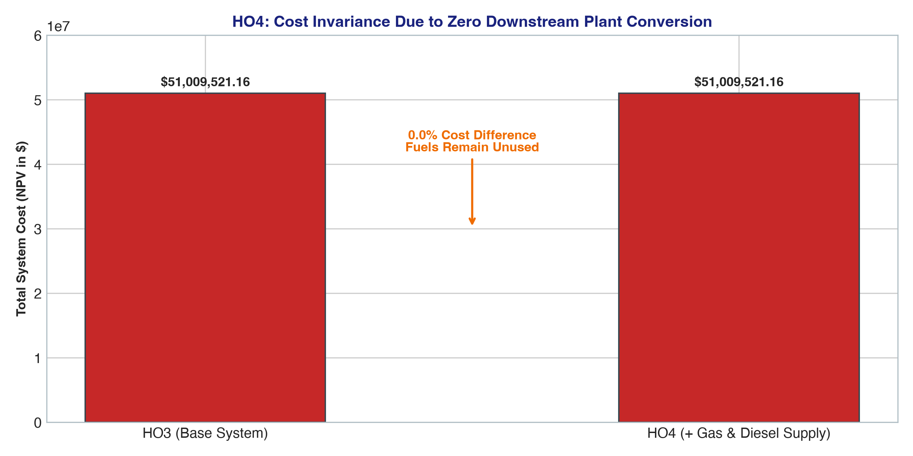

# Handout 4 (HO4): Fuel Supply Results & Analysis

## 🎯 Executive Summary & Solver Optimization Statistics
Handout 4 expands the upstream energy supply chain by introducing natural gas wellhead extraction (`MINNGS`) and international diesel import terminals (`IMPDSL`). Although these fuels are provided at very low extraction and import costs, commercial power plants have not yet been defined in the network.

* **Optimization Status**: `OPTIMAL` 🟢
* **Objective Function (NPV Total Cost)**: **$51,009,521.16** (**0.0% change vs. HO3**)
* **LP Problem Rows (Constraints)**: **872** (+406 rows vs. HO3)
* **LP Problem Columns (Variables)**: **480** (+240 cols vs. HO3)
* **Non-Zero Matrix Elements**: **4,320** (+2,160 non-zeros vs. HO3)
* **Solve Time**: **< 0.05 seconds**
* **Active Technologies Added**: `MINNGS` (gas mining), `IMPDSL` (diesel import)

---

## 📊 Visual Analytics & Economic Invariance

### Objective Function Cost Invariance (HO3 vs. HO4)


---

## 📋 Comprehensive Optimization Result Tables

### Table 1: Annual New Capacity Additions by Technology (GW/yr)
The solver builds zero capacity for `MINNGS` and `IMPDSL` because there is no downstream consumer for raw fuels:

| Technology Code | 2021 | 2023 | 2025 | 2027 | 2029 | 2031 | 2033 | 2035 | Cumulative Built (GW) |
|---|---|---|---|---|---|---|---|---|---|
| **`BACKSTOP`** | 0.762 | 0.191 | 0.191 | 0.191 | 0.191 | 0.191 | 0.191 | 0.191 | **3.430** |
| **`MINBACK`** | 24.038 | 6.010 | 6.010 | 6.010 | 6.010 | 6.010 | 6.010 | 6.010 | **108.173** |
| **`MINNGS`** | 0.000 | 0.000 | 0.000 | 0.000 | 0.000 | 0.000 | 0.000 | 0.000 | **0.000** |
| **`IMPDSL`** | 0.000 | 0.000 | 0.000 | 0.000 | 0.000 | 0.000 | 0.000 | 0.000 | **0.000** |


---

### Table 2: Cumulative Installed Generation & Upstream Capacity (GW)

| Technology Code | 2021 | 2023 | 2025 | 2027 | 2029 | 2031 | 2033 | 2035 | Horizon End (2035) |
|---|---|---|---|---|---|---|---|---|---|
| **`BACKSTOP`** | 0.762 | 1.143 | 1.525 | 1.906 | 2.287 | 2.668 | 3.049 | 3.430 | **3.430** |
| **`MINBACK`** | 24.038 | 36.058 | 48.077 | 60.096 | 72.115 | 84.135 | 96.154 | 108.173 | **108.173** |
| **`MINNGS`** | 0.000 | 0.000 | 0.000 | 0.000 | 0.000 | 0.000 | 0.000 | 0.000 | **0.000** |
| **`IMPDSL`** | 0.000 | 0.000 | 0.000 | 0.000 | 0.000 | 0.000 | 0.000 | 0.000 | **0.000** |


---

### Table 3: Primary Energy Resource Extraction & Fuel Supply Flow (PJ/yr)
Extraction and import activity for natural gas and diesel remain exactly **0.00 PJ/yr** throughout the entire 15-year planning horizon:

| Technology Code | Fuel Commodity | 2021 | 2023 | 2025 | 2027 | 2029 | 2031 | 2033 | 2035 | 15-Yr Total (PJ) |
|---|---|---|---|---|---|---|---|---|---|---|
| **`MINBACK`** | 20.00 | 30.00 | 40.00 | 50.00 | 60.00 | 70.00 | 80.00 | 90.00 | **825.00** |
| **`BACKSTOP`** | 20.00 | 30.00 | 40.00 | 50.00 | 60.00 | 70.00 | 80.00 | 90.00 | **825.00** |
| **`MINNGS`** | 0.00 | 0.00 | 0.00 | 0.00 | 0.00 | 0.00 | 0.00 | 0.00 | **0.00** |
| **`IMPDSL`** | 0.00 | 0.00 | 0.00 | 0.00 | 0.00 | 0.00 | 0.00 | 0.00 | **0.00** |


---

## 💡 The Economic Merit Order & Physical Connectivity Lesson
1. **Strict Upstream-Downstream Connectivity**: A linear programming solver optimizes the global system cost subject to physical conservation of energy at every node. Even if upstream fuel is practically free, the solver will not extract fuel if there is no physical conversion route to satisfy end-use demand.
2. **Cost Invariance**: Because natural gas and diesel cannot be burned without gas turbines or diesel generators, the model continued to deploy the virtual `BACKSTOP` generator, resulting in an identical objective value of **$51,009,521.16**.

---

## 📜 Full Verbatim GLPK Solver Solution Output (`solution.txt`)

Below is the complete, raw primal and dual solver output generated by the GLPK linear programming solver (`glpsol`), incorporating all LP row constraints, column variables, activity levels, bounds, and shadow prices:

<details>
<summary><b>🔍 Click to expand complete raw GLPK solver solution output (OSeHO4_solution.txt)</b></summary>

```text
Problem:    osemosys_fast
Rows:       872
Columns:    480
Non-zeros:  4320
Status:     OPTIMAL
Objective:  cost = 51009521.16 (MINimum)

   No.   Row name   St   Activity     Lower bound   Upper bound    Marginal
------ ------------ -- ------------- ------------- ------------- -------------
     1 cost         B    5.10095e+07                             
     2 CAa4_Constraint_Capacity[SC_0,RD,MINBACK,2021]
                    NU             0                          -0       -104437 
     3 CAa4_Constraint_Capacity[SC_0,RD,MINBACK,2022]
                    NU             0                          -0      -94942.5 
     4 CAa4_Constraint_Capacity[SC_0,RD,MINBACK,2023]
                    NU             0                          -0      -86311.4 
     5 CAa4_Constraint_Capacity[SC_0,RD,MINBACK,2024]
                    NU             0                          -0      -78464.9 
     6 CAa4_Constraint_Capacity[SC_0,RD,MINBACK,2025]
                    NU             0                          -0      -71331.7 
     7 CAa4_Constraint_Capacity[SC_0,RD,MINBACK,2026]
                    NU             0                          -0        -64847 
     8 CAa4_Constraint_Capacity[SC_0,RD,MINBACK,2027]
                    NU             0                          -0      -58951.8 
     9 CAa4_Constraint_Capacity[SC_0,RD,MINBACK,2028]
                    NU             0                          -0      -53592.6 
    10 CAa4_Constraint_Capacity[SC_0,RD,MINBACK,2029]
                    NU             0                          -0      -48720.5 
    11 CAa4_Constraint_Capacity[SC_0,RD,MINBACK,2030]
                    NU             0                          -0      -44291.4 
    12 CAa4_Constraint_Capacity[SC_0,RD,MINBACK,2031]
                    NU             0                          -0      -40264.9 
    13 CAa4_Constraint_Capacity[SC_0,RD,MINBACK,2032]
                    NU             0                          -0      -36604.5 
    14 CAa4_Constraint_Capacity[SC_0,RD,MINBACK,2033]
                    NU             0                          -0      -33276.8 
    15 CAa4_Constraint_Capacity[SC_0,RD,MINBACK,2034]
                    NU             0                          -0      -30251.6 
    16 CAa4_Constraint_Capacity[SC_0,RD,MINBACK,2035]
                    NU             0                          -0      -27501.5 
    17 CAa4_Constraint_Capacity[SC_0,RD,BACKSTOP,2021]
                    NU             0                          -0      -3311.67 
    18 CAa4_Constraint_Capacity[SC_0,RD,BACKSTOP,2022]
                    NU             0                          -0      -3010.61 
    19 CAa4_Constraint_Capacity[SC_0,RD,BACKSTOP,2023]
                    NU             0                          -0      -2736.92 
    20 CAa4_Constraint_Capacity[SC_0,RD,BACKSTOP,2024]
                    NU             0                          -0      -2488.11 
    21 CAa4_Constraint_Capacity[SC_0,RD,BACKSTOP,2025]
                    NU             0                          -0      -2261.91 
    22 CAa4_Constraint_Capacity[SC_0,RD,BACKSTOP,2026]
                    NU             0                          -0      -2056.29 
    23 CAa4_Constraint_Capacity[SC_0,RD,BACKSTOP,2027]
                    NU             0                          -0      -1869.35 
    24 CAa4_Constraint_Capacity[SC_0,RD,BACKSTOP,2028]
                    NU             0                          -0      -1699.41 
    25 CAa4_Constraint_Capacity[SC_0,RD,BACKSTOP,2029]
                    NU             0                          -0      -1544.92 
    26 CAa4_Constraint_Capacity[SC_0,RD,BACKSTOP,2030]
                    NU             0                          -0      -1404.47 
    27 CAa4_Constraint_Capacity[SC_0,RD,BACKSTOP,2031]
                    NU             0                          -0      -1276.79 
    28 CAa4_Constraint_Capacity[SC_0,RD,BACKSTOP,2032]
                    NU             0                          -0      -1160.72 
    29 CAa4_Constraint_Capacity[SC_0,RD,BACKSTOP,2033]
                    NU             0                          -0       -1055.2 
    30 CAa4_Constraint_Capacity[SC_0,RD,BACKSTOP,2034]
                    NU             0                          -0      -959.272 
    31 CAa4_Constraint_Capacity[SC_0,RD,BACKSTOP,2035]
                    NU             0                          -0      -872.066 
    32 CAa4_Constraint_Capacity[SC_0,RD,MINNGS,2021]
                    B              0                          -0 
    33 CAa4_Constraint_Capacity[SC_0,RD,MINNGS,2022]
                    B              0                          -0 
    34 CAa4_Constraint_Capacity[SC_0,RD,MINNGS,2023]
                    B              0                          -0 
    35 CAa4_Constraint_Capacity[SC_0,RD,MINNGS,2024]
                    B              0                          -0 
    36 CAa4_Constraint_Capacity[SC_0,RD,MINNGS,2025]
                    B              0                          -0 
    37 CAa4_Constraint_Capacity[SC_0,RD,MINNGS,2026]
                    B              0                          -0 
    38 CAa4_Constraint_Capacity[SC_0,RD,MINNGS,2027]
                    B              0                          -0 
    39 CAa4_Constraint_Capacity[SC_0,RD,MINNGS,2028]
                    B              0                          -0 
    40 CAa4_Constraint_Capacity[SC_0,RD,MINNGS,2029]
                    B              0                          -0 
    41 CAa4_Constraint_Capacity[SC_0,RD,MINNGS,2030]
                    B              0                          -0 
    42 CAa4_Constraint_Capacity[SC_0,RD,MINNGS,2031]
                    B              0                          -0 
    43 CAa4_Constraint_Capacity[SC_0,RD,MINNGS,2032]
                    B              0                          -0 
    44 CAa4_Constraint_Capacity[SC_0,RD,MINNGS,2033]
                    B              0                          -0 
    45 CAa4_Constraint_Capacity[SC_0,RD,MINNGS,2034]
                    B              0                          -0 
    46 CAa4_Constraint_Capacity[SC_0,RD,MINNGS,2035]
                    B              0                          -0 
    47 CAa4_Constraint_Capacity[SC_0,RD,IMPDSL,2021]
                    B              0                          -0 
    48 CAa4_Constraint_Capacity[SC_0,RD,IMPDSL,2022]
                    B              0                          -0 
    49 CAa4_Constraint_Capacity[SC_0,RD,IMPDSL,2023]
                    B              0                          -0 
    50 CAa4_Constraint_Capacity[SC_0,RD,IMPDSL,2024]
                    B              0                          -0 
    51 CAa4_Constraint_Capacity[SC_0,RD,IMPDSL,2025]
                    B              0                          -0 
    52 CAa4_Constraint_Capacity[SC_0,RD,IMPDSL,2026]
                    B              0                          -0 
    53 CAa4_Constraint_Capacity[SC_0,RD,IMPDSL,2027]
                    B              0                          -0 
    54 CAa4_Constraint_Capacity[SC_0,RD,IMPDSL,2028]
                    B              0                          -0 
    55 CAa4_Constraint_Capacity[SC_0,RD,IMPDSL,2029]
                    B              0                          -0 
    56 CAa4_Constraint_Capacity[SC_0,RD,IMPDSL,2030]
                    B              0                          -0 
    57 CAa4_Constraint_Capacity[SC_0,RD,IMPDSL,2031]
                    B              0                          -0 
    58 CAa4_Constraint_Capacity[SC_0,RD,IMPDSL,2032]
                    B              0                          -0 
    59 CAa4_Constraint_Capacity[SC_0,RD,IMPDSL,2033]
                    B              0                          -0 
    60 CAa4_Constraint_Capacity[SC_0,RD,IMPDSL,2034]
                    B              0                          -0 
    61 CAa4_Constraint_Capacity[SC_0,RD,IMPDSL,2035]
                    B              0                          -0 
    62 CAa4_Constraint_Capacity[SC_0,RN,MINBACK,2021]
                    B       -4.80769                          -0 
    63 CAa4_Constraint_Capacity[SC_0,RN,MINBACK,2022]
                    B       -6.00962                          -0 
    64 CAa4_Constraint_Capacity[SC_0,RN,MINBACK,2023]
                    B       -7.21154                          -0 
    65 CAa4_Constraint_Capacity[SC_0,RN,MINBACK,2024]
                    B       -8.41346                          -0 
    66 CAa4_Constraint_Capacity[SC_0,RN,MINBACK,2025]
                    B       -9.61538                          -0 
    67 CAa4_Constraint_Capacity[SC_0,RN,MINBACK,2026]
                    B       -10.8173                          -0 
    68 CAa4_Constraint_Capacity[SC_0,RN,MINBACK,2027]
                    B       -12.0192                          -0 
    69 CAa4_Constraint_Capacity[SC_0,RN,MINBACK,2028]
                    B       -13.2212                          -0 
    70 CAa4_Constraint_Capacity[SC_0,RN,MINBACK,2029]
                    B       -14.4231                          -0 
    71 CAa4_Constraint_Capacity[SC_0,RN,MINBACK,2030]
                    B        -15.625                          -0 
    72 CAa4_Constraint_Capacity[SC_0,RN,MINBACK,2031]
                    B       -16.8269                          -0 
    73 CAa4_Constraint_Capacity[SC_0,RN,MINBACK,2032]
                    B       -18.0288                          -0 
    74 CAa4_Constraint_Capacity[SC_0,RN,MINBACK,2033]
                    B       -19.2308                          -0 
    75 CAa4_Constraint_Capacity[SC_0,RN,MINBACK,2034]
                    B       -20.4327                          -0 
    76 CAa4_Constraint_Capacity[SC_0,RN,MINBACK,2035]
                    B       -21.6346                          -0 
    77 CAa4_Constraint_Capacity[SC_0,RN,BACKSTOP,2021]
                    B       -4.80769                          -0 
    78 CAa4_Constraint_Capacity[SC_0,RN,BACKSTOP,2022]
                    B       -6.00962                          -0 
    79 CAa4_Constraint_Capacity[SC_0,RN,BACKSTOP,2023]
                    B       -7.21154                          -0 
    80 CAa4_Constraint_Capacity[SC_0,RN,BACKSTOP,2024]
                    B       -8.41346                          -0 
    81 CAa4_Constraint_Capacity[SC_0,RN,BACKSTOP,2025]
                    B       -9.61538                          -0 
    82 CAa4_Constraint_Capacity[SC_0,RN,BACKSTOP,2026]
                    B       -10.8173                          -0 
    83 CAa4_Constraint_Capacity[SC_0,RN,BACKSTOP,2027]
                    B       -12.0192                          -0 
    84 CAa4_Constraint_Capacity[SC_0,RN,BACKSTOP,2028]
                    B       -13.2212                          -0 
    85 CAa4_Constraint_Capacity[SC_0,RN,BACKSTOP,2029]
                    B       -14.4231                          -0 
    86 CAa4_Constraint_Capacity[SC_0,RN,BACKSTOP,2030]
                    B        -15.625                          -0 
    87 CAa4_Constraint_Capacity[SC_0,RN,BACKSTOP,2031]
                    B       -16.8269                          -0 
    88 CAa4_Constraint_Capacity[SC_0,RN,BACKSTOP,2032]
                    B       -18.0288                          -0 
    89 CAa4_Constraint_Capacity[SC_0,RN,BACKSTOP,2033]
                    B       -19.2308                          -0 
    90 CAa4_Constraint_Capacity[SC_0,RN,BACKSTOP,2034]
                    B       -20.4327                          -0 
    91 CAa4_Constraint_Capacity[SC_0,RN,BACKSTOP,2035]
                    B       -21.6346                          -0 
    92 CAa4_Constraint_Capacity[SC_0,RN,MINNGS,2021]
                    B              0                          -0 
    93 CAa4_Constraint_Capacity[SC_0,RN,MINNGS,2022]
                    B              0                          -0 
    94 CAa4_Constraint_Capacity[SC_0,RN,MINNGS,2023]
                    B              0                          -0 
    95 CAa4_Constraint_Capacity[SC_0,RN,MINNGS,2024]
                    B              0                          -0 
    96 CAa4_Constraint_Capacity[SC_0,RN,MINNGS,2025]
                    B              0                          -0 
    97 CAa4_Constraint_Capacity[SC_0,RN,MINNGS,2026]
                    B              0                          -0 
    98 CAa4_Constraint_Capacity[SC_0,RN,MINNGS,2027]
                    B              0                          -0 
    99 CAa4_Constraint_Capacity[SC_0,RN,MINNGS,2028]
                    B              0                          -0 
   100 CAa4_Constraint_Capacity[SC_0,RN,MINNGS,2029]
                    B              0                          -0 
   101 CAa4_Constraint_Capacity[SC_0,RN,MINNGS,2030]
                    B              0                          -0 
   102 CAa4_Constraint_Capacity[SC_0,RN,MINNGS,2031]
                    B              0                          -0 
   103 CAa4_Constraint_Capacity[SC_0,RN,MINNGS,2032]
                    B              0                          -0 
   104 CAa4_Constraint_Capacity[SC_0,RN,MINNGS,2033]
                    B              0                          -0 
   105 CAa4_Constraint_Capacity[SC_0,RN,MINNGS,2034]
                    B              0                          -0 
   106 CAa4_Constraint_Capacity[SC_0,RN,MINNGS,2035]
                    B              0                          -0 
   107 CAa4_Constraint_Capacity[SC_0,RN,IMPDSL,2021]
                    B              0                          -0 
   108 CAa4_Constraint_Capacity[SC_0,RN,IMPDSL,2022]
                    B              0                          -0 
   109 CAa4_Constraint_Capacity[SC_0,RN,IMPDSL,2023]
                    B              0                          -0 
   110 CAa4_Constraint_Capacity[SC_0,RN,IMPDSL,2024]
                    B              0                          -0 
   111 CAa4_Constraint_Capacity[SC_0,RN,IMPDSL,2025]
                    B              0                          -0 
   112 CAa4_Constraint_Capacity[SC_0,RN,IMPDSL,2026]
                    B              0                          -0 
   113 CAa4_Constraint_Capacity[SC_0,RN,IMPDSL,2027]
                    B              0                          -0 
   114 CAa4_Constraint_Capacity[SC_0,RN,IMPDSL,2028]
                    B              0                          -0 
   115 CAa4_Constraint_Capacity[SC_0,RN,IMPDSL,2029]
                    B              0                          -0 
   116 CAa4_Constraint_Capacity[SC_0,RN,IMPDSL,2030]
                    B              0                          -0 
   117 CAa4_Constraint_Capacity[SC_0,RN,IMPDSL,2031]
                    B              0                          -0 
   118 CAa4_Constraint_Capacity[SC_0,RN,IMPDSL,2032]
                    B              0                          -0 
   119 CAa4_Constraint_Capacity[SC_0,RN,IMPDSL,2033]
                    B              0                          -0 
   120 CAa4_Constraint_Capacity[SC_0,RN,IMPDSL,2034]
                    B              0                          -0 
   121 CAa4_Constraint_Capacity[SC_0,RN,IMPDSL,2035]
                    B              0                          -0 
   122 CAa4_Constraint_Capacity[SC_0,DD,MINBACK,2021]
                    B       -3.49052                          -0 
   123 CAa4_Constraint_Capacity[SC_0,DD,MINBACK,2022]
                    B       -4.36315                          -0 
   124 CAa4_Constraint_Capacity[SC_0,DD,MINBACK,2023]
                    B       -5.23577                          -0 
   125 CAa4_Constraint_Capacity[SC_0,DD,MINBACK,2024]
                    B        -6.1084                          -0 
   126 CAa4_Constraint_Capacity[SC_0,DD,MINBACK,2025]
                    B       -6.98103                          -0 
   127 CAa4_Constraint_Capacity[SC_0,DD,MINBACK,2026]
                    B       -7.85366                          -0 
   128 CAa4_Constraint_Capacity[SC_0,DD,MINBACK,2027]
                    B       -8.72629                          -0 
   129 CAa4_Constraint_Capacity[SC_0,DD,MINBACK,2028]
                    B       -9.59892                          -0 
   130 CAa4_Constraint_Capacity[SC_0,DD,MINBACK,2029]
                    B       -10.4715                          -0 
   131 CAa4_Constraint_Capacity[SC_0,DD,MINBACK,2030]
                    B       -11.3442                          -0 
   132 CAa4_Constraint_Capacity[SC_0,DD,MINBACK,2031]
                    B       -12.2168                          -0 
   133 CAa4_Constraint_Capacity[SC_0,DD,MINBACK,2032]
                    B       -13.0894                          -0 
   134 CAa4_Constraint_Capacity[SC_0,DD,MINBACK,2033]
                    B       -13.9621                          -0 
   135 CAa4_Constraint_Capacity[SC_0,DD,MINBACK,2034]
                    B       -14.8347                          -0 
   136 CAa4_Constraint_Capacity[SC_0,DD,MINBACK,2035]
                    B       -15.7073                          -0 
   137 CAa4_Constraint_Capacity[SC_0,DD,BACKSTOP,2021]
                    B       -3.49052                          -0 
   138 CAa4_Constraint_Capacity[SC_0,DD,BACKSTOP,2022]
                    B       -4.36315                          -0 
   139 CAa4_Constraint_Capacity[SC_0,DD,BACKSTOP,2023]
                    B       -5.23577                          -0 
   140 CAa4_Constraint_Capacity[SC_0,DD,BACKSTOP,2024]
                    B        -6.1084                          -0 
   141 CAa4_Constraint_Capacity[SC_0,DD,BACKSTOP,2025]
                    B       -6.98103                          -0 
   142 CAa4_Constraint_Capacity[SC_0,DD,BACKSTOP,2026]
                    B       -7.85366                          -0 
   143 CAa4_Constraint_Capacity[SC_0,DD,BACKSTOP,2027]
                    B       -8.72629                          -0 
   144 CAa4_Constraint_Capacity[SC_0,DD,BACKSTOP,2028]
                    B       -9.59892                          -0 
   145 CAa4_Constraint_Capacity[SC_0,DD,BACKSTOP,2029]
                    B       -10.4715                          -0 
   146 CAa4_Constraint_Capacity[SC_0,DD,BACKSTOP,2030]
                    B       -11.3442                          -0 
   147 CAa4_Constraint_Capacity[SC_0,DD,BACKSTOP,2031]
                    B       -12.2168                          -0 
   148 CAa4_Constraint_Capacity[SC_0,DD,BACKSTOP,2032]
                    B       -13.0894                          -0 
   149 CAa4_Constraint_Capacity[SC_0,DD,BACKSTOP,2033]
                    B       -13.9621                          -0 
   150 CAa4_Constraint_Capacity[SC_0,DD,BACKSTOP,2034]
                    B       -14.8347                          -0 
   151 CAa4_Constraint_Capacity[SC_0,DD,BACKSTOP,2035]
                    B       -15.7073                          -0 
   152 CAa4_Constraint_Capacity[SC_0,DD,MINNGS,2021]
                    B              0                          -0 
   153 CAa4_Constraint_Capacity[SC_0,DD,MINNGS,2022]
                    B              0                          -0 
   154 CAa4_Constraint_Capacity[SC_0,DD,MINNGS,2023]
                    B              0                          -0 
   155 CAa4_Constraint_Capacity[SC_0,DD,MINNGS,2024]
                    B              0                          -0 
   156 CAa4_Constraint_Capacity[SC_0,DD,MINNGS,2025]
                    B              0                          -0 
   157 CAa4_Constraint_Capacity[SC_0,DD,MINNGS,2026]
                    B              0                          -0 
   158 CAa4_Constraint_Capacity[SC_0,DD,MINNGS,2027]
                    B              0                          -0 
   159 CAa4_Constraint_Capacity[SC_0,DD,MINNGS,2028]
                    B              0                          -0 
   160 CAa4_Constraint_Capacity[SC_0,DD,MINNGS,2029]
                    B              0                          -0 
   161 CAa4_Constraint_Capacity[SC_0,DD,MINNGS,2030]
                    B              0                          -0 
   162 CAa4_Constraint_Capacity[SC_0,DD,MINNGS,2031]
                    B              0                          -0 
   163 CAa4_Constraint_Capacity[SC_0,DD,MINNGS,2032]
                    B              0                          -0 
   164 CAa4_Constraint_Capacity[SC_0,DD,MINNGS,2033]
                    B              0                          -0 
   165 CAa4_Constraint_Capacity[SC_0,DD,MINNGS,2034]
                    B              0                          -0 
   166 CAa4_Constraint_Capacity[SC_0,DD,MINNGS,2035]
                    B              0                          -0 
   167 CAa4_Constraint_Capacity[SC_0,DD,IMPDSL,2021]
                    B              0                          -0 
   168 CAa4_Constraint_Capacity[SC_0,DD,IMPDSL,2022]
                    B              0                          -0 
   169 CAa4_Constraint_Capacity[SC_0,DD,IMPDSL,2023]
                    B              0                          -0 
   170 CAa4_Constraint_Capacity[SC_0,DD,IMPDSL,2024]
                    B              0                          -0 
   171 CAa4_Constraint_Capacity[SC_0,DD,IMPDSL,2025]
                    B              0                          -0 
   172 CAa4_Constraint_Capacity[SC_0,DD,IMPDSL,2026]
                    B              0                          -0 
   173 CAa4_Constraint_Capacity[SC_0,DD,IMPDSL,2027]
                    B              0                          -0 
   174 CAa4_Constraint_Capacity[SC_0,DD,IMPDSL,2028]
                    B              0                          -0 
   175 CAa4_Constraint_Capacity[SC_0,DD,IMPDSL,2029]
                    B              0                          -0 
   176 CAa4_Constraint_Capacity[SC_0,DD,IMPDSL,2030]
                    B              0                          -0 
   177 CAa4_Constraint_Capacity[SC_0,DD,IMPDSL,2031]
                    B              0                          -0 
   178 CAa4_Constraint_Capacity[SC_0,DD,IMPDSL,2032]
                    B              0                          -0 
   179 CAa4_Constraint_Capacity[SC_0,DD,IMPDSL,2033]
                    B              0                          -0 
   180 CAa4_Constraint_Capacity[SC_0,DD,IMPDSL,2034]
                    B              0                          -0 
   181 CAa4_Constraint_Capacity[SC_0,DD,IMPDSL,2035]
                    B              0                          -0 
   182 CAa4_Constraint_Capacity[SC_0,DN,MINBACK,2021]
                    B       -6.91517                          -0 
   183 CAa4_Constraint_Capacity[SC_0,DN,MINBACK,2022]
                    B       -8.64397                          -0 
   184 CAa4_Constraint_Capacity[SC_0,DN,MINBACK,2023]
                    B       -10.3728                          -0 
   185 CAa4_Constraint_Capacity[SC_0,DN,MINBACK,2024]
                    B       -12.1016                          -0 
   186 CAa4_Constraint_Capacity[SC_0,DN,MINBACK,2025]
                    B       -13.8303                          -0 
   187 CAa4_Constraint_Capacity[SC_0,DN,MINBACK,2026]
                    B       -15.5591                          -0 
   188 CAa4_Constraint_Capacity[SC_0,DN,MINBACK,2027]
                    B       -17.2879                          -0 
   189 CAa4_Constraint_Capacity[SC_0,DN,MINBACK,2028]
                    B       -19.0167                          -0 
   190 CAa4_Constraint_Capacity[SC_0,DN,MINBACK,2029]
                    B       -20.7455                          -0 
   191 CAa4_Constraint_Capacity[SC_0,DN,MINBACK,2030]
                    B       -22.4743                          -0 
   192 CAa4_Constraint_Capacity[SC_0,DN,MINBACK,2031]
                    B       -24.2031                          -0 
   193 CAa4_Constraint_Capacity[SC_0,DN,MINBACK,2032]
                    B       -25.9319                          -0 
   194 CAa4_Constraint_Capacity[SC_0,DN,MINBACK,2033]
                    B       -27.6607                          -0 
   195 CAa4_Constraint_Capacity[SC_0,DN,MINBACK,2034]
                    B       -29.3895                          -0 
   196 CAa4_Constraint_Capacity[SC_0,DN,MINBACK,2035]
                    B       -31.1183                          -0 
   197 CAa4_Constraint_Capacity[SC_0,DN,BACKSTOP,2021]
                    B       -6.91517                          -0 
   198 CAa4_Constraint_Capacity[SC_0,DN,BACKSTOP,2022]
                    B       -8.64397                          -0 
   199 CAa4_Constraint_Capacity[SC_0,DN,BACKSTOP,2023]
                    B       -10.3728                          -0 
   200 CAa4_Constraint_Capacity[SC_0,DN,BACKSTOP,2024]
                    B       -12.1016                          -0 
   201 CAa4_Constraint_Capacity[SC_0,DN,BACKSTOP,2025]
                    B       -13.8303                          -0 
   202 CAa4_Constraint_Capacity[SC_0,DN,BACKSTOP,2026]
                    B       -15.5591                          -0 
   203 CAa4_Constraint_Capacity[SC_0,DN,BACKSTOP,2027]
                    B       -17.2879                          -0 
   204 CAa4_Constraint_Capacity[SC_0,DN,BACKSTOP,2028]
                    B       -19.0167                          -0 
   205 CAa4_Constraint_Capacity[SC_0,DN,BACKSTOP,2029]
                    B       -20.7455                          -0 
   206 CAa4_Constraint_Capacity[SC_0,DN,BACKSTOP,2030]
                    B       -22.4743                          -0 
   207 CAa4_Constraint_Capacity[SC_0,DN,BACKSTOP,2031]
                    B       -24.2031                          -0 
   208 CAa4_Constraint_Capacity[SC_0,DN,BACKSTOP,2032]
                    B       -25.9319                          -0 
   209 CAa4_Constraint_Capacity[SC_0,DN,BACKSTOP,2033]
                    B       -27.6607                          -0 
   210 CAa4_Constraint_Capacity[SC_0,DN,BACKSTOP,2034]
                    B       -29.3895                          -0 
   211 CAa4_Constraint_Capacity[SC_0,DN,BACKSTOP,2035]
                    B       -31.1183                          -0 
   212 CAa4_Constraint_Capacity[SC_0,DN,MINNGS,2021]
                    B              0                          -0 
   213 CAa4_Constraint_Capacity[SC_0,DN,MINNGS,2022]
                    B              0                          -0 
   214 CAa4_Constraint_Capacity[SC_0,DN,MINNGS,2023]
                    B              0                          -0 
   215 CAa4_Constraint_Capacity[SC_0,DN,MINNGS,2024]
                    B              0                          -0 
   216 CAa4_Constraint_Capacity[SC_0,DN,MINNGS,2025]
                    B              0                          -0 
   217 CAa4_Constraint_Capacity[SC_0,DN,MINNGS,2026]
                    B              0                          -0 
   218 CAa4_Constraint_Capacity[SC_0,DN,MINNGS,2027]
                    B              0                          -0 
   219 CAa4_Constraint_Capacity[SC_0,DN,MINNGS,2028]
                    B              0                          -0 
   220 CAa4_Constraint_Capacity[SC_0,DN,MINNGS,2029]
                    B              0                          -0 
   221 CAa4_Constraint_Capacity[SC_0,DN,MINNGS,2030]
                    B              0                          -0 
   222 CAa4_Constraint_Capacity[SC_0,DN,MINNGS,2031]
                    B              0                          -0 
   223 CAa4_Constraint_Capacity[SC_0,DN,MINNGS,2032]
                    B              0                          -0 
   224 CAa4_Constraint_Capacity[SC_0,DN,MINNGS,2033]
                    B              0                          -0 
   225 CAa4_Constraint_Capacity[SC_0,DN,MINNGS,2034]
                    B              0                          -0 
   226 CAa4_Constraint_Capacity[SC_0,DN,MINNGS,2035]
                    B              0                          -0 
   227 CAa4_Constraint_Capacity[SC_0,DN,IMPDSL,2021]
                    B              0                          -0 
   228 CAa4_Constraint_Capacity[SC_0,DN,IMPDSL,2022]
                    B              0                          -0 
   229 CAa4_Constraint_Capacity[SC_0,DN,IMPDSL,2023]
                    B              0                          -0 
   230 CAa4_Constraint_Capacity[SC_0,DN,IMPDSL,2024]
                    B              0                          -0 
   231 CAa4_Constraint_Capacity[SC_0,DN,IMPDSL,2025]
                    B              0                          -0 
   232 CAa4_Constraint_Capacity[SC_0,DN,IMPDSL,2026]
                    B              0                          -0 
   233 CAa4_Constraint_Capacity[SC_0,DN,IMPDSL,2027]
                    B              0                          -0 
   234 CAa4_Constraint_Capacity[SC_0,DN,IMPDSL,2028]
                    B              0                          -0 
   235 CAa4_Constraint_Capacity[SC_0,DN,IMPDSL,2029]
                    B              0                          -0 
   236 CAa4_Constraint_Capacity[SC_0,DN,IMPDSL,2030]
                    B              0                          -0 
   237 CAa4_Constraint_Capacity[SC_0,DN,IMPDSL,2031]
                    B              0                          -0 
   238 CAa4_Constraint_Capacity[SC_0,DN,IMPDSL,2032]
                    B              0                          -0 
   239 CAa4_Constraint_Capacity[SC_0,DN,IMPDSL,2033]
                    B              0                          -0 
   240 CAa4_Constraint_Capacity[SC_0,DN,IMPDSL,2034]
                    B              0                          -0 
   241 CAa4_Constraint_Capacity[SC_0,DN,IMPDSL,2035]
                    B              0                          -0 
   242 CAb1_PlannedMaintenance[SC_0,MINBACK,2021]
                    B       -4.03846                          -0 
   243 CAb1_PlannedMaintenance[SC_0,MINBACK,2022]
                    B       -5.04808                          -0 
   244 CAb1_PlannedMaintenance[SC_0,MINBACK,2023]
                    B       -6.05769                          -0 
   245 CAb1_PlannedMaintenance[SC_0,MINBACK,2024]
                    B       -7.06731                          -0 
   246 CAb1_PlannedMaintenance[SC_0,MINBACK,2025]
                    B       -8.07692                          -0 
   247 CAb1_PlannedMaintenance[SC_0,MINBACK,2026]
                    B       -9.08654                          -0 
   248 CAb1_PlannedMaintenance[SC_0,MINBACK,2027]
                    B       -10.0962                          -0 
   249 CAb1_PlannedMaintenance[SC_0,MINBACK,2028]
                    B       -11.1058                          -0 
   250 CAb1_PlannedMaintenance[SC_0,MINBACK,2029]
                    B       -12.1154                          -0 
   251 CAb1_PlannedMaintenance[SC_0,MINBACK,2030]
                    B        -13.125                          -0 
   252 CAb1_PlannedMaintenance[SC_0,MINBACK,2031]
                    B       -14.1346                          -0 
   253 CAb1_PlannedMaintenance[SC_0,MINBACK,2032]
                    B       -15.1442                          -0 
   254 CAb1_PlannedMaintenance[SC_0,MINBACK,2033]
                    B       -16.1538                          -0 
   255 CAb1_PlannedMaintenance[SC_0,MINBACK,2034]
                    B       -17.1635                          -0 
   256 CAb1_PlannedMaintenance[SC_0,MINBACK,2035]
                    B       -18.1731                          -0 
   257 CAb1_PlannedMaintenance[SC_0,BACKSTOP,2021]
                    B       -4.03846                          -0 
   258 CAb1_PlannedMaintenance[SC_0,BACKSTOP,2022]
                    B       -5.04808                          -0 
   259 CAb1_PlannedMaintenance[SC_0,BACKSTOP,2023]
                    B       -6.05769                          -0 
   260 CAb1_PlannedMaintenance[SC_0,BACKSTOP,2024]
                    B       -7.06731                          -0 
   261 CAb1_PlannedMaintenance[SC_0,BACKSTOP,2025]
                    B       -8.07692                          -0 
   262 CAb1_PlannedMaintenance[SC_0,BACKSTOP,2026]
                    B       -9.08654                          -0 
   263 CAb1_PlannedMaintenance[SC_0,BACKSTOP,2027]
                    B       -10.0962                          -0 
   264 CAb1_PlannedMaintenance[SC_0,BACKSTOP,2028]
                    B       -11.1058                          -0 
   265 CAb1_PlannedMaintenance[SC_0,BACKSTOP,2029]
                    B       -12.1154                          -0 
   266 CAb1_PlannedMaintenance[SC_0,BACKSTOP,2030]
                    B        -13.125                          -0 
   267 CAb1_PlannedMaintenance[SC_0,BACKSTOP,2031]
                    B       -14.1346                          -0 
   268 CAb1_PlannedMaintenance[SC_0,BACKSTOP,2032]
                    B       -15.1442                          -0 
   269 CAb1_PlannedMaintenance[SC_0,BACKSTOP,2033]
                    B       -16.1538                          -0 
   270 CAb1_PlannedMaintenance[SC_0,BACKSTOP,2034]
                    B       -17.1635                          -0 
   271 CAb1_PlannedMaintenance[SC_0,BACKSTOP,2035]
                    B       -18.1731                          -0 
   272 CAb1_PlannedMaintenance[SC_0,MINNGS,2021]
                    B              0                          -0 
   273 CAb1_PlannedMaintenance[SC_0,MINNGS,2022]
                    B              0                          -0 
   274 CAb1_PlannedMaintenance[SC_0,MINNGS,2023]
                    B              0                          -0 
   275 CAb1_PlannedMaintenance[SC_0,MINNGS,2024]
                    B              0                          -0 
   276 CAb1_PlannedMaintenance[SC_0,MINNGS,2025]
                    B              0                          -0 
   277 CAb1_PlannedMaintenance[SC_0,MINNGS,2026]
                    B              0                          -0 
   278 CAb1_PlannedMaintenance[SC_0,MINNGS,2027]
                    B              0                          -0 
   279 CAb1_PlannedMaintenance[SC_0,MINNGS,2028]
                    B              0                          -0 
   280 CAb1_PlannedMaintenance[SC_0,MINNGS,2029]
                    B              0                          -0 
   281 CAb1_PlannedMaintenance[SC_0,MINNGS,2030]
                    B              0                          -0 
   282 CAb1_PlannedMaintenance[SC_0,MINNGS,2031]
                    B              0                          -0 
   283 CAb1_PlannedMaintenance[SC_0,MINNGS,2032]
                    B              0                          -0 
   284 CAb1_PlannedMaintenance[SC_0,MINNGS,2033]
                    B              0                          -0 
   285 CAb1_PlannedMaintenance[SC_0,MINNGS,2034]
                    B              0                          -0 
   286 CAb1_PlannedMaintenance[SC_0,MINNGS,2035]
                    B              0                          -0 
   287 CAb1_PlannedMaintenance[SC_0,IMPDSL,2021]
                    B              0                          -0 
   288 CAb1_PlannedMaintenance[SC_0,IMPDSL,2022]
                    B              0                          -0 
   289 CAb1_PlannedMaintenance[SC_0,IMPDSL,2023]
                    B              0                          -0 
   290 CAb1_PlannedMaintenance[SC_0,IMPDSL,2024]
                    B              0                          -0 
   291 CAb1_PlannedMaintenance[SC_0,IMPDSL,2025]
                    B              0                          -0 
   292 CAb1_PlannedMaintenance[SC_0,IMPDSL,2026]
                    B              0                          -0 
   293 CAb1_PlannedMaintenance[SC_0,IMPDSL,2027]
                    B              0                          -0 
   294 CAb1_PlannedMaintenance[SC_0,IMPDSL,2028]
                    B              0                          -0 
   295 CAb1_PlannedMaintenance[SC_0,IMPDSL,2029]
                    B              0                          -0 
   296 CAb1_PlannedMaintenance[SC_0,IMPDSL,2030]
                    B              0                          -0 
   297 CAb1_PlannedMaintenance[SC_0,IMPDSL,2031]
                    B              0                          -0 
   298 CAb1_PlannedMaintenance[SC_0,IMPDSL,2032]
                    B              0                          -0 
   299 CAb1_PlannedMaintenance[SC_0,IMPDSL,2033]
                    B              0                          -0 
   300 CAb1_PlannedMaintenance[SC_0,IMPDSL,2034]
                    B              0                          -0 
   301 CAb1_PlannedMaintenance[SC_0,IMPDSL,2035]
                    B              0                          -0 
   302 EBa11_EnergyBalanceEachTS5[SC_0,RD,BACK,2021]
                    NL             0            -0                      503052 
   303 EBa11_EnergyBalanceEachTS5[SC_0,RD,BACK,2022]
                    NL             0            -0                      457320 
   304 EBa11_EnergyBalanceEachTS5[SC_0,RD,BACK,2023]
                    NL             0            -0                      415746 
   305 EBa11_EnergyBalanceEachTS5[SC_0,RD,BACK,2024]
                    NL             0            -0                      377951 
   306 EBa11_EnergyBalanceEachTS5[SC_0,RD,BACK,2025]
                    NL             0            -0                      343592 
   307 EBa11_EnergyBalanceEachTS5[SC_0,RD,BACK,2026]
                    NL             0            -0                      312356 
   308 EBa11_EnergyBalanceEachTS5[SC_0,RD,BACK,2027]
                    NL             0            -0                      283960 
   309 EBa11_EnergyBalanceEachTS5[SC_0,RD,BACK,2028]
                    NL             0            -0                      258145 
   310 EBa11_EnergyBalanceEachTS5[SC_0,RD,BACK,2029]
                    NL             0            -0                      234678 
   311 EBa11_EnergyBalanceEachTS5[SC_0,RD,BACK,2030]
                    NL             0            -0                      213343 
   312 EBa11_EnergyBalanceEachTS5[SC_0,RD,BACK,2031]
                    NL             0            -0                      193948 
   313 EBa11_EnergyBalanceEachTS5[SC_0,RD,BACK,2032]
                    NL             0            -0                      176317 
   314 EBa11_EnergyBalanceEachTS5[SC_0,RD,BACK,2033]
                    NL             0            -0                      160288 
   315 EBa11_EnergyBalanceEachTS5[SC_0,RD,BACK,2034]
                    NL             0            -0                      145716 
   316 EBa11_EnergyBalanceEachTS5[SC_0,RD,BACK,2035]
                    NL             0            -0                      132469 
   317 EBa11_EnergyBalanceEachTS5[SC_0,RD,ELC003,2021]
                    NL             5             5                      519926 
   318 EBa11_EnergyBalanceEachTS5[SC_0,RD,ELC003,2022]
                    NL          6.25          6.25                      472660 
   319 EBa11_EnergyBalanceEachTS5[SC_0,RD,ELC003,2023]
                    NL           7.5           7.5                      429691 
   320 EBa11_EnergyBalanceEachTS5[SC_0,RD,ELC003,2024]
                    NL          8.75          8.75                      390628 
   321 EBa11_EnergyBalanceEachTS5[SC_0,RD,ELC003,2025]
                    NL            10            10                      355117 
   322 EBa11_EnergyBalanceEachTS5[SC_0,RD,ELC003,2026]
                    NL         11.25         11.25                      322833 
   323 EBa11_EnergyBalanceEachTS5[SC_0,RD,ELC003,2027]
                    NL          12.5          12.5                      293485 
   324 EBa11_EnergyBalanceEachTS5[SC_0,RD,ELC003,2028]
                    NL         13.75         13.75                      266804 
   325 EBa11_EnergyBalanceEachTS5[SC_0,RD,ELC003,2029]
                    NL            15            15                      242550 
   326 EBa11_EnergyBalanceEachTS5[SC_0,RD,ELC003,2030]
                    NL         16.25         16.25                      220500 
   327 EBa11_EnergyBalanceEachTS5[SC_0,RD,ELC003,2031]
                    NL          17.5          17.5                      200454 
   328 EBa11_EnergyBalanceEachTS5[SC_0,RD,ELC003,2032]
                    NL         18.75         18.75                      182231 
   329 EBa11_EnergyBalanceEachTS5[SC_0,RD,ELC003,2033]
                    NL            20            20                      165665 
   330 EBa11_EnergyBalanceEachTS5[SC_0,RD,ELC003,2034]
                    NL         21.25         21.25                      150604 
   331 EBa11_EnergyBalanceEachTS5[SC_0,RD,ELC003,2035]
                    NL          22.5          22.5                      136913 
   332 EBa11_EnergyBalanceEachTS5[SC_0,RD,NGS,2021]
                    B              0            -0               
   333 EBa11_EnergyBalanceEachTS5[SC_0,RD,NGS,2022]
                    B              0            -0               
   334 EBa11_EnergyBalanceEachTS5[SC_0,RD,NGS,2023]
                    B              0            -0               
   335 EBa11_EnergyBalanceEachTS5[SC_0,RD,NGS,2024]
                    B              0            -0               
   336 EBa11_EnergyBalanceEachTS5[SC_0,RD,NGS,2025]
                    B              0            -0               
   337 EBa11_EnergyBalanceEachTS5[SC_0,RD,NGS,2026]
                    B              0            -0               
   338 EBa11_EnergyBalanceEachTS5[SC_0,RD,NGS,2027]
                    B              0            -0               
   339 EBa11_EnergyBalanceEachTS5[SC_0,RD,NGS,2028]
                    B              0            -0               
   340 EBa11_EnergyBalanceEachTS5[SC_0,RD,NGS,2029]
                    B              0            -0               
   341 EBa11_EnergyBalanceEachTS5[SC_0,RD,NGS,2030]
                    B              0            -0               
   342 EBa11_EnergyBalanceEachTS5[SC_0,RD,NGS,2031]
                    B              0            -0               
   343 EBa11_EnergyBalanceEachTS5[SC_0,RD,NGS,2032]
                    B              0            -0               
   344 EBa11_EnergyBalanceEachTS5[SC_0,RD,NGS,2033]
                    B              0            -0               
   345 EBa11_EnergyBalanceEachTS5[SC_0,RD,NGS,2034]
                    B              0            -0               
   346 EBa11_EnergyBalanceEachTS5[SC_0,RD,NGS,2035]
                    B              0            -0               
   347 EBa11_EnergyBalanceEachTS5[SC_0,RD,DSL,2021]
                    B              0            -0               
   348 EBa11_EnergyBalanceEachTS5[SC_0,RD,DSL,2022]
                    B              0            -0               
   349 EBa11_EnergyBalanceEachTS5[SC_0,RD,DSL,2023]
                    B              0            -0               
   350 EBa11_EnergyBalanceEachTS5[SC_0,RD,DSL,2024]
                    B              0            -0               
   351 EBa11_EnergyBalanceEachTS5[SC_0,RD,DSL,2025]
                    B              0            -0               
   352 EBa11_EnergyBalanceEachTS5[SC_0,RD,DSL,2026]
                    B              0            -0               
   353 EBa11_EnergyBalanceEachTS5[SC_0,RD,DSL,2027]
                    B              0            -0               
   354 EBa11_EnergyBalanceEachTS5[SC_0,RD,DSL,2028]
                    B              0            -0               
   355 EBa11_EnergyBalanceEachTS5[SC_0,RD,DSL,2029]
                    B              0            -0               
   356 EBa11_EnergyBalanceEachTS5[SC_0,RD,DSL,2030]
                    B              0            -0               
   357 EBa11_EnergyBalanceEachTS5[SC_0,RD,DSL,2031]
                    B              0            -0               
   358 EBa11_EnergyBalanceEachTS5[SC_0,RD,DSL,2032]
                    B              0            -0               
   359 EBa11_EnergyBalanceEachTS5[SC_0,RD,DSL,2033]
                    B              0            -0               
   360 EBa11_EnergyBalanceEachTS5[SC_0,RD,DSL,2034]
                    B              0            -0               
   361 EBa11_EnergyBalanceEachTS5[SC_0,RD,DSL,2035]
                    B              0            -0               
   362 EBa11_EnergyBalanceEachTS5[SC_0,RN,BACK,2021]
                    NL             0            -0                     952.509 
   363 EBa11_EnergyBalanceEachTS5[SC_0,RN,BACK,2022]
                    NL             0            -0                     865.917 
   364 EBa11_EnergyBalanceEachTS5[SC_0,RN,BACK,2023]
                    NL             0            -0                     787.198 
   365 EBa11_EnergyBalanceEachTS5[SC_0,RN,BACK,2024]
                    NL             0            -0                     715.634 
   366 EBa11_EnergyBalanceEachTS5[SC_0,RN,BACK,2025]
                    NL             0            -0                     650.577 
   367 EBa11_EnergyBalanceEachTS5[SC_0,RN,BACK,2026]
                    NL             0            -0                     591.433 
   368 EBa11_EnergyBalanceEachTS5[SC_0,RN,BACK,2027]
                    NL             0            -0                     537.667 
   369 EBa11_EnergyBalanceEachTS5[SC_0,RN,BACK,2028]
                    NL             0            -0                     488.788 
   370 EBa11_EnergyBalanceEachTS5[SC_0,RN,BACK,2029]
                    NL             0            -0                     444.353 
   371 EBa11_EnergyBalanceEachTS5[SC_0,RN,BACK,2030]
                    NL             0            -0                     403.957 
   372 EBa11_EnergyBalanceEachTS5[SC_0,RN,BACK,2031]
                    NL             0            -0                     367.234 
   373 EBa11_EnergyBalanceEachTS5[SC_0,RN,BACK,2032]
                    NL             0            -0                     333.849 
   374 EBa11_EnergyBalanceEachTS5[SC_0,RN,BACK,2033]
                    NL             0            -0                     303.499 
   375 EBa11_EnergyBalanceEachTS5[SC_0,RN,BACK,2034]
                    NL             0            -0                     275.908 
   376 EBa11_EnergyBalanceEachTS5[SC_0,RN,BACK,2035]
                    NL             0            -0                     250.825 
   377 EBa11_EnergyBalanceEachTS5[SC_0,RN,ELC003,2021]
                    NL             4             4                     1905.02 
   378 EBa11_EnergyBalanceEachTS5[SC_0,RN,ELC003,2022]
                    NL             5             5                     1731.83 
   379 EBa11_EnergyBalanceEachTS5[SC_0,RN,ELC003,2023]
                    NL             6             6                      1574.4 
   380 EBa11_EnergyBalanceEachTS5[SC_0,RN,ELC003,2024]
                    NL             7             7                     1431.27 
   381 EBa11_EnergyBalanceEachTS5[SC_0,RN,ELC003,2025]
                    NL             8             8                     1301.15 
   382 EBa11_EnergyBalanceEachTS5[SC_0,RN,ELC003,2026]
                    NL             9             9                     1182.87 
   383 EBa11_EnergyBalanceEachTS5[SC_0,RN,ELC003,2027]
                    NL            10            10                     1075.33 
   384 EBa11_EnergyBalanceEachTS5[SC_0,RN,ELC003,2028]
                    NL            11            11                     977.576 
   385 EBa11_EnergyBalanceEachTS5[SC_0,RN,ELC003,2029]
                    NL            12            12                     888.705 
   386 EBa11_EnergyBalanceEachTS5[SC_0,RN,ELC003,2030]
                    NL            13            13                     807.914 
   387 EBa11_EnergyBalanceEachTS5[SC_0,RN,ELC003,2031]
                    NL            14            14                     734.467 
   388 EBa11_EnergyBalanceEachTS5[SC_0,RN,ELC003,2032]
                    NL            15            15                     667.697 
   389 EBa11_EnergyBalanceEachTS5[SC_0,RN,ELC003,2033]
                    NL            16            16                     606.998 
   390 EBa11_EnergyBalanceEachTS5[SC_0,RN,ELC003,2034]
                    NL            17            17                     551.816 
   391 EBa11_EnergyBalanceEachTS5[SC_0,RN,ELC003,2035]
                    NL            18            18                     501.651 
   392 EBa11_EnergyBalanceEachTS5[SC_0,RN,NGS,2021]
                    B              0            -0               
   393 EBa11_EnergyBalanceEachTS5[SC_0,RN,NGS,2022]
                    B              0            -0               
   394 EBa11_EnergyBalanceEachTS5[SC_0,RN,NGS,2023]
                    B              0            -0               
   395 EBa11_EnergyBalanceEachTS5[SC_0,RN,NGS,2024]
                    B              0            -0               
   396 EBa11_EnergyBalanceEachTS5[SC_0,RN,NGS,2025]
                    B              0            -0               
   397 EBa11_EnergyBalanceEachTS5[SC_0,RN,NGS,2026]
                    B              0            -0               
   398 EBa11_EnergyBalanceEachTS5[SC_0,RN,NGS,2027]
                    B              0            -0               
   399 EBa11_EnergyBalanceEachTS5[SC_0,RN,NGS,2028]
                    B              0            -0               
   400 EBa11_EnergyBalanceEachTS5[SC_0,RN,NGS,2029]
                    B              0            -0               
   401 EBa11_EnergyBalanceEachTS5[SC_0,RN,NGS,2030]
                    B              0            -0               
   402 EBa11_EnergyBalanceEachTS5[SC_0,RN,NGS,2031]
                    B              0            -0               
   403 EBa11_EnergyBalanceEachTS5[SC_0,RN,NGS,2032]
                    B              0            -0               
   404 EBa11_EnergyBalanceEachTS5[SC_0,RN,NGS,2033]
                    B              0            -0               
   405 EBa11_EnergyBalanceEachTS5[SC_0,RN,NGS,2034]
                    B              0            -0               
   406 EBa11_EnergyBalanceEachTS5[SC_0,RN,NGS,2035]
                    B              0            -0               
   407 EBa11_EnergyBalanceEachTS5[SC_0,RN,DSL,2021]
                    B              0            -0               
   408 EBa11_EnergyBalanceEachTS5[SC_0,RN,DSL,2022]
                    B              0            -0               
   409 EBa11_EnergyBalanceEachTS5[SC_0,RN,DSL,2023]
                    B              0            -0               
   410 EBa11_EnergyBalanceEachTS5[SC_0,RN,DSL,2024]
                    B              0            -0               
   411 EBa11_EnergyBalanceEachTS5[SC_0,RN,DSL,2025]
                    B              0            -0               
   412 EBa11_EnergyBalanceEachTS5[SC_0,RN,DSL,2026]
                    B              0            -0               
   413 EBa11_EnergyBalanceEachTS5[SC_0,RN,DSL,2027]
                    B              0            -0               
   414 EBa11_EnergyBalanceEachTS5[SC_0,RN,DSL,2028]
                    B              0            -0               
   415 EBa11_EnergyBalanceEachTS5[SC_0,RN,DSL,2029]
                    B              0            -0               
   416 EBa11_EnergyBalanceEachTS5[SC_0,RN,DSL,2030]
                    B              0            -0               
   417 EBa11_EnergyBalanceEachTS5[SC_0,RN,DSL,2031]
                    B              0            -0               
   418 EBa11_EnergyBalanceEachTS5[SC_0,RN,DSL,2032]
                    B              0            -0               
   419 EBa11_EnergyBalanceEachTS5[SC_0,RN,DSL,2033]
                    B              0            -0               
   420 EBa11_EnergyBalanceEachTS5[SC_0,RN,DSL,2034]
                    B              0            -0               
   421 EBa11_EnergyBalanceEachTS5[SC_0,RN,DSL,2035]
                    B              0            -0               
   422 EBa11_EnergyBalanceEachTS5[SC_0,DD,BACK,2021]
                    NL             0            -0                     952.509 
   423 EBa11_EnergyBalanceEachTS5[SC_0,DD,BACK,2022]
                    NL             0            -0                     865.917 
   424 EBa11_EnergyBalanceEachTS5[SC_0,DD,BACK,2023]
                    NL             0            -0                     787.198 
   425 EBa11_EnergyBalanceEachTS5[SC_0,DD,BACK,2024]
                    NL             0            -0                     715.634 
   426 EBa11_EnergyBalanceEachTS5[SC_0,DD,BACK,2025]
                    NL             0            -0                     650.577 
   427 EBa11_EnergyBalanceEachTS5[SC_0,DD,BACK,2026]
                    NL             0            -0                     591.433 
   428 EBa11_EnergyBalanceEachTS5[SC_0,DD,BACK,2027]
                    NL             0            -0                     537.667 
   429 EBa11_EnergyBalanceEachTS5[SC_0,DD,BACK,2028]
                    NL             0            -0                     488.788 
   430 EBa11_EnergyBalanceEachTS5[SC_0,DD,BACK,2029]
                    NL             0            -0                     444.353 
   431 EBa11_EnergyBalanceEachTS5[SC_0,DD,BACK,2030]
                    NL             0            -0                     403.957 
   432 EBa11_EnergyBalanceEachTS5[SC_0,DD,BACK,2031]
                    NL             0            -0                     367.234 
   433 EBa11_EnergyBalanceEachTS5[SC_0,DD,BACK,2032]
                    NL             0            -0                     333.849 
   434 EBa11_EnergyBalanceEachTS5[SC_0,DD,BACK,2033]
                    NL             0            -0                     303.499 
   435 EBa11_EnergyBalanceEachTS5[SC_0,DD,BACK,2034]
                    NL             0            -0                     275.908 
   436 EBa11_EnergyBalanceEachTS5[SC_0,DD,BACK,2035]
                    NL             0            -0                     250.825 
   437 EBa11_EnergyBalanceEachTS5[SC_0,DD,ELC003,2021]
                    NL             6             6                     1905.02 
   438 EBa11_EnergyBalanceEachTS5[SC_0,DD,ELC003,2022]
                    NL           7.5           7.5                     1731.83 
   439 EBa11_EnergyBalanceEachTS5[SC_0,DD,ELC003,2023]
                    NL             9             9                      1574.4 
   440 EBa11_EnergyBalanceEachTS5[SC_0,DD,ELC003,2024]
                    NL          10.5          10.5                     1431.27 
   441 EBa11_EnergyBalanceEachTS5[SC_0,DD,ELC003,2025]
                    NL            12            12                     1301.15 
   442 EBa11_EnergyBalanceEachTS5[SC_0,DD,ELC003,2026]
                    NL          13.5          13.5                     1182.87 
   443 EBa11_EnergyBalanceEachTS5[SC_0,DD,ELC003,2027]
                    NL            15            15                     1075.33 
   444 EBa11_EnergyBalanceEachTS5[SC_0,DD,ELC003,2028]
                    NL          16.5          16.5                     977.576 
   445 EBa11_EnergyBalanceEachTS5[SC_0,DD,ELC003,2029]
                    NL            18            18                     888.705 
   446 EBa11_EnergyBalanceEachTS5[SC_0,DD,ELC003,2030]
                    NL          19.5          19.5                     807.914 
   447 EBa11_EnergyBalanceEachTS5[SC_0,DD,ELC003,2031]
                    NL            21            21                     734.467 
   448 EBa11_EnergyBalanceEachTS5[SC_0,DD,ELC003,2032]
                    NL          22.5          22.5                     667.697 
   449 EBa11_EnergyBalanceEachTS5[SC_0,DD,ELC003,2033]
                    NL            24            24                     606.998 
   450 EBa11_EnergyBalanceEachTS5[SC_0,DD,ELC003,2034]
                    NL          25.5          25.5                     551.816 
   451 EBa11_EnergyBalanceEachTS5[SC_0,DD,ELC003,2035]
                    NL            27            27                     501.651 
   452 EBa11_EnergyBalanceEachTS5[SC_0,DD,NGS,2021]
                    B              0            -0               
   453 EBa11_EnergyBalanceEachTS5[SC_0,DD,NGS,2022]
                    B              0            -0               
   454 EBa11_EnergyBalanceEachTS5[SC_0,DD,NGS,2023]
                    B              0            -0               
   455 EBa11_EnergyBalanceEachTS5[SC_0,DD,NGS,2024]
                    B              0            -0               
   456 EBa11_EnergyBalanceEachTS5[SC_0,DD,NGS,2025]
                    B              0            -0               
   457 EBa11_EnergyBalanceEachTS5[SC_0,DD,NGS,2026]
                    B              0            -0               
   458 EBa11_EnergyBalanceEachTS5[SC_0,DD,NGS,2027]
                    B              0            -0               
   459 EBa11_EnergyBalanceEachTS5[SC_0,DD,NGS,2028]
                    B              0            -0               
   460 EBa11_EnergyBalanceEachTS5[SC_0,DD,NGS,2029]
                    B              0            -0               
   461 EBa11_EnergyBalanceEachTS5[SC_0,DD,NGS,2030]
                    B              0            -0               
   462 EBa11_EnergyBalanceEachTS5[SC_0,DD,NGS,2031]
                    B              0            -0               
   463 EBa11_EnergyBalanceEachTS5[SC_0,DD,NGS,2032]
                    B              0            -0               
   464 EBa11_EnergyBalanceEachTS5[SC_0,DD,NGS,2033]
                    B              0            -0               
   465 EBa11_EnergyBalanceEachTS5[SC_0,DD,NGS,2034]
                    B              0            -0               
   466 EBa11_EnergyBalanceEachTS5[SC_0,DD,NGS,2035]
                    B              0            -0               
   467 EBa11_EnergyBalanceEachTS5[SC_0,DD,DSL,2021]
                    B              0            -0               
   468 EBa11_EnergyBalanceEachTS5[SC_0,DD,DSL,2022]
                    B              0            -0               
   469 EBa11_EnergyBalanceEachTS5[SC_0,DD,DSL,2023]
                    B              0            -0               
   470 EBa11_EnergyBalanceEachTS5[SC_0,DD,DSL,2024]
                    B              0            -0               
   471 EBa11_EnergyBalanceEachTS5[SC_0,DD,DSL,2025]
                    B              0            -0               
   472 EBa11_EnergyBalanceEachTS5[SC_0,DD,DSL,2026]
                    B              0            -0               
   473 EBa11_EnergyBalanceEachTS5[SC_0,DD,DSL,2027]
                    B              0            -0               
   474 EBa11_EnergyBalanceEachTS5[SC_0,DD,DSL,2028]
                    B              0            -0               
   475 EBa11_EnergyBalanceEachTS5[SC_0,DD,DSL,2029]
                    B              0            -0               
   476 EBa11_EnergyBalanceEachTS5[SC_0,DD,DSL,2030]
                    B              0            -0               
   477 EBa11_EnergyBalanceEachTS5[SC_0,DD,DSL,2031]
                    B              0            -0               
   478 EBa11_EnergyBalanceEachTS5[SC_0,DD,DSL,2032]
                    B              0            -0               
   479 EBa11_EnergyBalanceEachTS5[SC_0,DD,DSL,2033]
                    B              0            -0               
   480 EBa11_EnergyBalanceEachTS5[SC_0,DD,DSL,2034]
                    B              0            -0               
   481 EBa11_EnergyBalanceEachTS5[SC_0,DD,DSL,2035]
                    B              0            -0               
   482 EBa11_EnergyBalanceEachTS5[SC_0,DN,BACK,2021]
                    NL             0            -0                     952.509 
   483 EBa11_EnergyBalanceEachTS5[SC_0,DN,BACK,2022]
                    NL             0            -0                     865.917 
   484 EBa11_EnergyBalanceEachTS5[SC_0,DN,BACK,2023]
                    NL             0            -0                     787.198 
   485 EBa11_EnergyBalanceEachTS5[SC_0,DN,BACK,2024]
                    NL             0            -0                     715.634 
   486 EBa11_EnergyBalanceEachTS5[SC_0,DN,BACK,2025]
                    NL             0            -0                     650.577 
   487 EBa11_EnergyBalanceEachTS5[SC_0,DN,BACK,2026]
                    NL             0            -0                     591.433 
   488 EBa11_EnergyBalanceEachTS5[SC_0,DN,BACK,2027]
                    NL             0            -0                     537.667 
   489 EBa11_EnergyBalanceEachTS5[SC_0,DN,BACK,2028]
                    NL             0            -0                     488.788 
   490 EBa11_EnergyBalanceEachTS5[SC_0,DN,BACK,2029]
                    NL             0            -0                     444.353 
   491 EBa11_EnergyBalanceEachTS5[SC_0,DN,BACK,2030]
                    NL             0            -0                     403.957 
   492 EBa11_EnergyBalanceEachTS5[SC_0,DN,BACK,2031]
                    NL             0            -0                     367.234 
   493 EBa11_EnergyBalanceEachTS5[SC_0,DN,BACK,2032]
                    NL             0            -0                     333.849 
   494 EBa11_EnergyBalanceEachTS5[SC_0,DN,BACK,2033]
                    NL             0            -0                     303.499 
   495 EBa11_EnergyBalanceEachTS5[SC_0,DN,BACK,2034]
                    NL             0            -0                     275.908 
   496 EBa11_EnergyBalanceEachTS5[SC_0,DN,BACK,2035]
                    NL             0            -0                     250.825 
   497 EBa11_EnergyBalanceEachTS5[SC_0,DN,ELC003,2021]
                    NL             5             5                     1905.02 
   498 EBa11_EnergyBalanceEachTS5[SC_0,DN,ELC003,2022]
                    NL          6.25          6.25                     1731.83 
   499 EBa11_EnergyBalanceEachTS5[SC_0,DN,ELC003,2023]
                    NL           7.5           7.5                      1574.4 
   500 EBa11_EnergyBalanceEachTS5[SC_0,DN,ELC003,2024]
                    NL          8.75          8.75                     1431.27 
   501 EBa11_EnergyBalanceEachTS5[SC_0,DN,ELC003,2025]
                    NL            10            10                     1301.15 
   502 EBa11_EnergyBalanceEachTS5[SC_0,DN,ELC003,2026]
                    NL         11.25         11.25                     1182.87 
   503 EBa11_EnergyBalanceEachTS5[SC_0,DN,ELC003,2027]
                    NL          12.5          12.5                     1075.33 
   504 EBa11_EnergyBalanceEachTS5[SC_0,DN,ELC003,2028]
                    NL         13.75         13.75                     977.576 
   505 EBa11_EnergyBalanceEachTS5[SC_0,DN,ELC003,2029]
                    NL            15            15                     888.705 
   506 EBa11_EnergyBalanceEachTS5[SC_0,DN,ELC003,2030]
                    NL         16.25         16.25                     807.914 
   507 EBa11_EnergyBalanceEachTS5[SC_0,DN,ELC003,2031]
                    NL          17.5          17.5                     734.467 
   508 EBa11_EnergyBalanceEachTS5[SC_0,DN,ELC003,2032]
                    NL         18.75         18.75                     667.697 
   509 EBa11_EnergyBalanceEachTS5[SC_0,DN,ELC003,2033]
                    NL            20            20                     606.998 
   510 EBa11_EnergyBalanceEachTS5[SC_0,DN,ELC003,2034]
                    NL         21.25         21.25                     551.816 
   511 EBa11_EnergyBalanceEachTS5[SC_0,DN,ELC003,2035]
                    NL          22.5          22.5                     501.651 
   512 EBa11_EnergyBalanceEachTS5[SC_0,DN,NGS,2021]
                    B              0            -0               
   513 EBa11_EnergyBalanceEachTS5[SC_0,DN,NGS,2022]
                    B              0            -0               
   514 EBa11_EnergyBalanceEachTS5[SC_0,DN,NGS,2023]
                    B              0            -0               
   515 EBa11_EnergyBalanceEachTS5[SC_0,DN,NGS,2024]
                    B              0            -0               
   516 EBa11_EnergyBalanceEachTS5[SC_0,DN,NGS,2025]
                    B              0            -0               
   517 EBa11_EnergyBalanceEachTS5[SC_0,DN,NGS,2026]
                    B              0            -0               
   518 EBa11_EnergyBalanceEachTS5[SC_0,DN,NGS,2027]
                    B              0            -0               
   519 EBa11_EnergyBalanceEachTS5[SC_0,DN,NGS,2028]
                    B              0            -0               
   520 EBa11_EnergyBalanceEachTS5[SC_0,DN,NGS,2029]
                    B              0            -0               
   521 EBa11_EnergyBalanceEachTS5[SC_0,DN,NGS,2030]
                    B              0            -0               
   522 EBa11_EnergyBalanceEachTS5[SC_0,DN,NGS,2031]
                    B              0            -0               
   523 EBa11_EnergyBalanceEachTS5[SC_0,DN,NGS,2032]
                    B              0            -0               
   524 EBa11_EnergyBalanceEachTS5[SC_0,DN,NGS,2033]
                    B              0            -0               
   525 EBa11_EnergyBalanceEachTS5[SC_0,DN,NGS,2034]
                    B              0            -0               
   526 EBa11_EnergyBalanceEachTS5[SC_0,DN,NGS,2035]
                    B              0            -0               
   527 EBa11_EnergyBalanceEachTS5[SC_0,DN,DSL,2021]
                    B              0            -0               
   528 EBa11_EnergyBalanceEachTS5[SC_0,DN,DSL,2022]
                    B              0            -0               
   529 EBa11_EnergyBalanceEachTS5[SC_0,DN,DSL,2023]
                    B              0            -0               
   530 EBa11_EnergyBalanceEachTS5[SC_0,DN,DSL,2024]
                    B              0            -0               
   531 EBa11_EnergyBalanceEachTS5[SC_0,DN,DSL,2025]
                    B              0            -0               
   532 EBa11_EnergyBalanceEachTS5[SC_0,DN,DSL,2026]
                    B              0            -0               
   533 EBa11_EnergyBalanceEachTS5[SC_0,DN,DSL,2027]
                    B              0            -0               
   534 EBa11_EnergyBalanceEachTS5[SC_0,DN,DSL,2028]
                    B              0            -0               
   535 EBa11_EnergyBalanceEachTS5[SC_0,DN,DSL,2029]
                    B              0            -0               
   536 EBa11_EnergyBalanceEachTS5[SC_0,DN,DSL,2030]
                    B              0            -0               
   537 EBa11_EnergyBalanceEachTS5[SC_0,DN,DSL,2031]
                    B              0            -0               
   538 EBa11_EnergyBalanceEachTS5[SC_0,DN,DSL,2032]
                    B              0            -0               
   539 EBa11_EnergyBalanceEachTS5[SC_0,DN,DSL,2033]
                    B              0            -0               
   540 EBa11_EnergyBalanceEachTS5[SC_0,DN,DSL,2034]
                    B              0            -0               
   541 EBa11_EnergyBalanceEachTS5[SC_0,DN,DSL,2035]
                    B              0            -0               
   542 EBb4_EnergyBalanceEachYear4[SC_0,BACK,2021]
                    B              0            -0               
   543 EBb4_EnergyBalanceEachYear4[SC_0,BACK,2022]
                    B              0            -0               
   544 EBb4_EnergyBalanceEachYear4[SC_0,BACK,2023]
                    B              0            -0               
   545 EBb4_EnergyBalanceEachYear4[SC_0,BACK,2024]
                    B              0            -0               
   546 EBb4_EnergyBalanceEachYear4[SC_0,BACK,2025]
                    B              0            -0               
   547 EBb4_EnergyBalanceEachYear4[SC_0,BACK,2026]
                    B              0            -0               
   548 EBb4_EnergyBalanceEachYear4[SC_0,BACK,2027]
                    B              0            -0               
   549 EBb4_EnergyBalanceEachYear4[SC_0,BACK,2028]
                    B              0            -0               
   550 EBb4_EnergyBalanceEachYear4[SC_0,BACK,2029]
                    B              0            -0               
   551 EBb4_EnergyBalanceEachYear4[SC_0,BACK,2030]
                    B              0            -0               
   552 EBb4_EnergyBalanceEachYear4[SC_0,BACK,2031]
                    B              0            -0               
   553 EBb4_EnergyBalanceEachYear4[SC_0,BACK,2032]
                    B              0            -0               
   554 EBb4_EnergyBalanceEachYear4[SC_0,BACK,2033]
                    B              0            -0               
   555 EBb4_EnergyBalanceEachYear4[SC_0,BACK,2034]
                    B              0            -0               
   556 EBb4_EnergyBalanceEachYear4[SC_0,BACK,2035]
                    B              0            -0               
   557 EBb4_EnergyBalanceEachYear4[SC_0,ELC003,2021]
                    B             20            -0               
   558 EBb4_EnergyBalanceEachYear4[SC_0,ELC003,2022]
                    B             25            -0               
   559 EBb4_EnergyBalanceEachYear4[SC_0,ELC003,2023]
                    B             30            -0               
   560 EBb4_EnergyBalanceEachYear4[SC_0,ELC003,2024]
                    B             35            -0               
   561 EBb4_EnergyBalanceEachYear4[SC_0,ELC003,2025]
                    B             40            -0               
   562 EBb4_EnergyBalanceEachYear4[SC_0,ELC003,2026]
                    B             45            -0               
   563 EBb4_EnergyBalanceEachYear4[SC_0,ELC003,2027]
                    B             50            -0               
   564 EBb4_EnergyBalanceEachYear4[SC_0,ELC003,2028]
                    B             55            -0               
   565 EBb4_EnergyBalanceEachYear4[SC_0,ELC003,2029]
                    B             60            -0               
   566 EBb4_EnergyBalanceEachYear4[SC_0,ELC003,2030]
                    B             65            -0               
   567 EBb4_EnergyBalanceEachYear4[SC_0,ELC003,2031]
                    B             70            -0               
   568 EBb4_EnergyBalanceEachYear4[SC_0,ELC003,2032]
                    B             75            -0               
   569 EBb4_EnergyBalanceEachYear4[SC_0,ELC003,2033]
                    B             80            -0               
   570 EBb4_EnergyBalanceEachYear4[SC_0,ELC003,2034]
                    B             85            -0               
   571 EBb4_EnergyBalanceEachYear4[SC_0,ELC003,2035]
                    B             90            -0               
   572 EBb4_EnergyBalanceEachYear4[SC_0,NGS,2021]
                    B              0            -0               
   573 EBb4_EnergyBalanceEachYear4[SC_0,NGS,2022]
                    B              0            -0               
   574 EBb4_EnergyBalanceEachYear4[SC_0,NGS,2023]
                    B              0            -0               
   575 EBb4_EnergyBalanceEachYear4[SC_0,NGS,2024]
                    B              0            -0               
   576 EBb4_EnergyBalanceEachYear4[SC_0,NGS,2025]
                    B              0            -0               
   577 EBb4_EnergyBalanceEachYear4[SC_0,NGS,2026]
                    B              0            -0               
   578 EBb4_EnergyBalanceEachYear4[SC_0,NGS,2027]
                    B              0            -0               
   579 EBb4_EnergyBalanceEachYear4[SC_0,NGS,2028]
                    B              0            -0               
   580 EBb4_EnergyBalanceEachYear4[SC_0,NGS,2029]
                    B              0            -0               
   581 EBb4_EnergyBalanceEachYear4[SC_0,NGS,2030]
                    B              0            -0               
   582 EBb4_EnergyBalanceEachYear4[SC_0,NGS,2031]
                    B              0            -0               
   583 EBb4_EnergyBalanceEachYear4[SC_0,NGS,2032]
                    B              0            -0               
   584 EBb4_EnergyBalanceEachYear4[SC_0,NGS,2033]
                    B              0            -0               
   585 EBb4_EnergyBalanceEachYear4[SC_0,NGS,2034]
                    B              0            -0               
   586 EBb4_EnergyBalanceEachYear4[SC_0,NGS,2035]
                    B              0            -0               
   587 EBb4_EnergyBalanceEachYear4[SC_0,DSL,2021]
                    B              0            -0               
   588 EBb4_EnergyBalanceEachYear4[SC_0,DSL,2022]
                    B              0            -0               
   589 EBb4_EnergyBalanceEachYear4[SC_0,DSL,2023]
                    B              0            -0               
   590 EBb4_EnergyBalanceEachYear4[SC_0,DSL,2024]
                    B              0            -0               
   591 EBb4_EnergyBalanceEachYear4[SC_0,DSL,2025]
                    B              0            -0               
   592 EBb4_EnergyBalanceEachYear4[SC_0,DSL,2026]
                    B              0            -0               
   593 EBb4_EnergyBalanceEachYear4[SC_0,DSL,2027]
                    B              0            -0               
   594 EBb4_EnergyBalanceEachYear4[SC_0,DSL,2028]
                    B              0            -0               
   595 EBb4_EnergyBalanceEachYear4[SC_0,DSL,2029]
                    B              0            -0               
   596 EBb4_EnergyBalanceEachYear4[SC_0,DSL,2030]
                    B              0            -0               
   597 EBb4_EnergyBalanceEachYear4[SC_0,DSL,2031]
                    B              0            -0               
   598 EBb4_EnergyBalanceEachYear4[SC_0,DSL,2032]
                    B              0            -0               
   599 EBb4_EnergyBalanceEachYear4[SC_0,DSL,2033]
                    B              0            -0               
   600 EBb4_EnergyBalanceEachYear4[SC_0,DSL,2034]
                    B              0            -0               
   601 EBb4_EnergyBalanceEachYear4[SC_0,DSL,2035]
                    B              0            -0               
   602 SV1_SalvageValueAtEndOfPeriod1[SC_0,MINBACK,2021]
                    NS             0            -0             =     -0.239392 
   603 SV1_SalvageValueAtEndOfPeriod1[SC_0,MINBACK,2022]
                    NS             0            -0             =     -0.239392 
   604 SV1_SalvageValueAtEndOfPeriod1[SC_0,MINBACK,2023]
                    NS             0            -0             =     -0.239392 
   605 SV1_SalvageValueAtEndOfPeriod1[SC_0,MINBACK,2024]
                    NS             0            -0             =     -0.239392 
   606 SV1_SalvageValueAtEndOfPeriod1[SC_0,MINBACK,2025]
                    NS             0            -0             =     -0.239392 
   607 SV1_SalvageValueAtEndOfPeriod1[SC_0,MINBACK,2026]
                    NS             0            -0             =     -0.239392 
   608 SV1_SalvageValueAtEndOfPeriod1[SC_0,MINBACK,2027]
                    NS             0            -0             =     -0.239392 
   609 SV1_SalvageValueAtEndOfPeriod1[SC_0,MINBACK,2028]
                    NS             0            -0             =     -0.239392 
   610 SV1_SalvageValueAtEndOfPeriod1[SC_0,MINBACK,2029]
                    NS             0            -0             =     -0.239392 
   611 SV1_SalvageValueAtEndOfPeriod1[SC_0,MINBACK,2030]
                    NS             0            -0             =     -0.239392 
   612 SV1_SalvageValueAtEndOfPeriod1[SC_0,MINBACK,2031]
                    NS             0            -0             =     -0.239392 
   613 SV1_SalvageValueAtEndOfPeriod1[SC_0,MINBACK,2032]
                    NS             0            -0             =     -0.239392 
   614 SV1_SalvageValueAtEndOfPeriod1[SC_0,MINBACK,2033]
                    NS             0            -0             =     -0.239392 
   615 SV1_SalvageValueAtEndOfPeriod1[SC_0,MINBACK,2034]
                    NS             0            -0             =     -0.239392 
   616 SV1_SalvageValueAtEndOfPeriod1[SC_0,MINBACK,2035]
                    NS             0            -0             =     -0.239392 
   617 SV1_SalvageValueAtEndOfPeriod1[SC_0,BACKSTOP,2021]
                    NS             0            -0             =     -0.239392 
   618 SV1_SalvageValueAtEndOfPeriod1[SC_0,BACKSTOP,2022]
                    NS             0            -0             =     -0.239392 
   619 SV1_SalvageValueAtEndOfPeriod1[SC_0,BACKSTOP,2023]
                    NS             0            -0             =     -0.239392 
   620 SV1_SalvageValueAtEndOfPeriod1[SC_0,BACKSTOP,2024]
                    NS             0            -0             =     -0.239392 
   621 SV1_SalvageValueAtEndOfPeriod1[SC_0,BACKSTOP,2025]
                    NS             0            -0             =     -0.239392 
   622 SV1_SalvageValueAtEndOfPeriod1[SC_0,BACKSTOP,2026]
                    NS             0            -0             =     -0.239392 
   623 SV1_SalvageValueAtEndOfPeriod1[SC_0,BACKSTOP,2027]
                    NS             0            -0             =     -0.239392 
   624 SV1_SalvageValueAtEndOfPeriod1[SC_0,BACKSTOP,2028]
                    NS             0            -0             =     -0.239392 
   625 SV1_SalvageValueAtEndOfPeriod1[SC_0,BACKSTOP,2029]
                    NS             0            -0             =     -0.239392 
   626 SV1_SalvageValueAtEndOfPeriod1[SC_0,BACKSTOP,2030]
                    NS             0            -0             =     -0.239392 
   627 SV1_SalvageValueAtEndOfPeriod1[SC_0,BACKSTOP,2031]
                    NS             0            -0             =     -0.239392 
   628 SV1_SalvageValueAtEndOfPeriod1[SC_0,BACKSTOP,2032]
                    NS             0            -0             =     -0.239392 
   629 SV1_SalvageValueAtEndOfPeriod1[SC_0,BACKSTOP,2033]
                    NS             0            -0             =     -0.239392 
   630 SV1_SalvageValueAtEndOfPeriod1[SC_0,BACKSTOP,2034]
                    NS             0            -0             =     -0.239392 
   631 SV1_SalvageValueAtEndOfPeriod1[SC_0,BACKSTOP,2035]
                    NS             0            -0             =     -0.239392 
   632 SV1_SalvageValueAtEndOfPeriod1[SC_0,MINNGS,2021]
                    NS             0            -0             =     -0.239392 
   633 SV1_SalvageValueAtEndOfPeriod1[SC_0,MINNGS,2022]
                    NS             0            -0             =     -0.239392 
   634 SV1_SalvageValueAtEndOfPeriod1[SC_0,MINNGS,2023]
                    NS             0            -0             =     -0.239392 
   635 SV1_SalvageValueAtEndOfPeriod1[SC_0,MINNGS,2024]
                    NS             0            -0             =     -0.239392 
   636 SV1_SalvageValueAtEndOfPeriod1[SC_0,MINNGS,2025]
                    NS             0            -0             =     -0.239392 
   637 SV1_SalvageValueAtEndOfPeriod1[SC_0,MINNGS,2026]
                    NS             0            -0             =     -0.239392 
   638 SV1_SalvageValueAtEndOfPeriod1[SC_0,MINNGS,2027]
                    NS             0            -0             =     -0.239392 
   639 SV1_SalvageValueAtEndOfPeriod1[SC_0,MINNGS,2028]
                    NS             0            -0             =     -0.239392 
   640 SV1_SalvageValueAtEndOfPeriod1[SC_0,MINNGS,2029]
                    NS             0            -0             =     -0.239392 
   641 SV1_SalvageValueAtEndOfPeriod1[SC_0,MINNGS,2030]
                    NS             0            -0             =     -0.239392 
   642 SV1_SalvageValueAtEndOfPeriod1[SC_0,MINNGS,2031]
                    NS             0            -0             =     -0.239392 
   643 SV1_SalvageValueAtEndOfPeriod1[SC_0,MINNGS,2032]
                    NS             0            -0             =     -0.239392 
   644 SV1_SalvageValueAtEndOfPeriod1[SC_0,MINNGS,2033]
                    NS             0            -0             =     -0.239392 
   645 SV1_SalvageValueAtEndOfPeriod1[SC_0,MINNGS,2034]
                    NS             0            -0             =     -0.239392 
   646 SV1_SalvageValueAtEndOfPeriod1[SC_0,MINNGS,2035]
                    NS             0            -0             =     -0.239392 
   647 SV1_SalvageValueAtEndOfPeriod1[SC_0,IMPDSL,2021]
                    NS             0            -0             =     -0.239392 
   648 SV1_SalvageValueAtEndOfPeriod1[SC_0,IMPDSL,2022]
                    NS             0            -0             =     -0.239392 
   649 SV1_SalvageValueAtEndOfPeriod1[SC_0,IMPDSL,2023]
                    NS             0            -0             =     -0.239392 
   650 SV1_SalvageValueAtEndOfPeriod1[SC_0,IMPDSL,2024]
                    NS             0            -0             =     -0.239392 
   651 SV1_SalvageValueAtEndOfPeriod1[SC_0,IMPDSL,2025]
                    NS             0            -0             =     -0.239392 
   652 SV1_SalvageValueAtEndOfPeriod1[SC_0,IMPDSL,2026]
                    NS             0            -0             =     -0.239392 
   653 SV1_SalvageValueAtEndOfPeriod1[SC_0,IMPDSL,2027]
                    NS             0            -0             =     -0.239392 
   654 SV1_SalvageValueAtEndOfPeriod1[SC_0,IMPDSL,2028]
                    NS             0            -0             =     -0.239392 
   655 SV1_SalvageValueAtEndOfPeriod1[SC_0,IMPDSL,2029]
                    NS             0            -0             =     -0.239392 
   656 SV1_SalvageValueAtEndOfPeriod1[SC_0,IMPDSL,2030]
                    NS             0            -0             =     -0.239392 
   657 SV1_SalvageValueAtEndOfPeriod1[SC_0,IMPDSL,2031]
                    NS             0            -0             =     -0.239392 
   658 SV1_SalvageValueAtEndOfPeriod1[SC_0,IMPDSL,2032]
                    NS             0            -0             =     -0.239392 
   659 SV1_SalvageValueAtEndOfPeriod1[SC_0,IMPDSL,2033]
                    NS             0            -0             =     -0.239392 
   660 SV1_SalvageValueAtEndOfPeriod1[SC_0,IMPDSL,2034]
                    NS             0            -0             =     -0.239392 
   661 SV1_SalvageValueAtEndOfPeriod1[SC_0,IMPDSL,2035]
                    NS             0            -0             =     -0.239392 
   662 SV4_SalvageValueDiscountedToStartYear[SC_0,MINBACK,2021]
                    NS             0            -0             =            -1 
   663 SV4_SalvageValueDiscountedToStartYear[SC_0,MINBACK,2022]
                    NS             0            -0             =            -1 
   664 SV4_SalvageValueDiscountedToStartYear[SC_0,MINBACK,2023]
                    NS             0            -0             =            -1 
   665 SV4_SalvageValueDiscountedToStartYear[SC_0,MINBACK,2024]
                    NS             0            -0             =            -1 
   666 SV4_SalvageValueDiscountedToStartYear[SC_0,MINBACK,2025]
                    NS             0            -0             =            -1 
   667 SV4_SalvageValueDiscountedToStartYear[SC_0,MINBACK,2026]
                    NS             0            -0             =            -1 
   668 SV4_SalvageValueDiscountedToStartYear[SC_0,MINBACK,2027]
                    NS             0            -0             =            -1 
   669 SV4_SalvageValueDiscountedToStartYear[SC_0,MINBACK,2028]
                    NS             0            -0             =            -1 
   670 SV4_SalvageValueDiscountedToStartYear[SC_0,MINBACK,2029]
                    NS             0            -0             =            -1 
   671 SV4_SalvageValueDiscountedToStartYear[SC_0,MINBACK,2030]
                    NS             0            -0             =            -1 
   672 SV4_SalvageValueDiscountedToStartYear[SC_0,MINBACK,2031]
                    NS             0            -0             =            -1 
   673 SV4_SalvageValueDiscountedToStartYear[SC_0,MINBACK,2032]
                    NS             0            -0             =            -1 
   674 SV4_SalvageValueDiscountedToStartYear[SC_0,MINBACK,2033]
                    NS             0            -0             =            -1 
   675 SV4_SalvageValueDiscountedToStartYear[SC_0,MINBACK,2034]
                    NS             0            -0             =            -1 
   676 SV4_SalvageValueDiscountedToStartYear[SC_0,MINBACK,2035]
                    NS             0            -0             =            -1 
   677 SV4_SalvageValueDiscountedToStartYear[SC_0,BACKSTOP,2021]
                    NS             0            -0             =            -1 
   678 SV4_SalvageValueDiscountedToStartYear[SC_0,BACKSTOP,2022]
                    NS             0            -0             =            -1 
   679 SV4_SalvageValueDiscountedToStartYear[SC_0,BACKSTOP,2023]
                    NS             0            -0             =            -1 
   680 SV4_SalvageValueDiscountedToStartYear[SC_0,BACKSTOP,2024]
                    NS             0            -0             =            -1 
   681 SV4_SalvageValueDiscountedToStartYear[SC_0,BACKSTOP,2025]
                    NS             0            -0             =            -1 
   682 SV4_SalvageValueDiscountedToStartYear[SC_0,BACKSTOP,2026]
                    NS             0            -0             =            -1 
   683 SV4_SalvageValueDiscountedToStartYear[SC_0,BACKSTOP,2027]
                    NS             0            -0             =            -1 
   684 SV4_SalvageValueDiscountedToStartYear[SC_0,BACKSTOP,2028]
                    NS             0            -0             =            -1 
   685 SV4_SalvageValueDiscountedToStartYear[SC_0,BACKSTOP,2029]
                    NS             0            -0             =            -1 
   686 SV4_SalvageValueDiscountedToStartYear[SC_0,BACKSTOP,2030]
                    NS             0            -0             =            -1 
   687 SV4_SalvageValueDiscountedToStartYear[SC_0,BACKSTOP,2031]
                    NS             0            -0             =            -1 
   688 SV4_SalvageValueDiscountedToStartYear[SC_0,BACKSTOP,2032]
                    NS             0            -0             =            -1 
   689 SV4_SalvageValueDiscountedToStartYear[SC_0,BACKSTOP,2033]
                    NS             0            -0             =            -1 
   690 SV4_SalvageValueDiscountedToStartYear[SC_0,BACKSTOP,2034]
                    NS             0            -0             =            -1 
   691 SV4_SalvageValueDiscountedToStartYear[SC_0,BACKSTOP,2035]
                    NS             0            -0             =            -1 
   692 SV4_SalvageValueDiscountedToStartYear[SC_0,MINNGS,2021]
                    NS             0            -0             =            -1 
   693 SV4_SalvageValueDiscountedToStartYear[SC_0,MINNGS,2022]
                    NS             0            -0             =            -1 
   694 SV4_SalvageValueDiscountedToStartYear[SC_0,MINNGS,2023]
                    NS             0            -0             =            -1 
   695 SV4_SalvageValueDiscountedToStartYear[SC_0,MINNGS,2024]
                    NS             0            -0             =            -1 
   696 SV4_SalvageValueDiscountedToStartYear[SC_0,MINNGS,2025]
                    NS             0            -0             =            -1 
   697 SV4_SalvageValueDiscountedToStartYear[SC_0,MINNGS,2026]
                    NS             0            -0             =            -1 
   698 SV4_SalvageValueDiscountedToStartYear[SC_0,MINNGS,2027]
                    NS             0            -0             =            -1 
   699 SV4_SalvageValueDiscountedToStartYear[SC_0,MINNGS,2028]
                    NS             0            -0             =            -1 
   700 SV4_SalvageValueDiscountedToStartYear[SC_0,MINNGS,2029]
                    NS             0            -0             =            -1 
   701 SV4_SalvageValueDiscountedToStartYear[SC_0,MINNGS,2030]
                    NS             0            -0             =            -1 
   702 SV4_SalvageValueDiscountedToStartYear[SC_0,MINNGS,2031]
                    NS             0            -0             =            -1 
   703 SV4_SalvageValueDiscountedToStartYear[SC_0,MINNGS,2032]
                    NS             0            -0             =            -1 
   704 SV4_SalvageValueDiscountedToStartYear[SC_0,MINNGS,2033]
                    NS             0            -0             =            -1 
   705 SV4_SalvageValueDiscountedToStartYear[SC_0,MINNGS,2034]
                    NS             0            -0             =            -1 
   706 SV4_SalvageValueDiscountedToStartYear[SC_0,MINNGS,2035]
                    NS             0            -0             =            -1 
   707 SV4_SalvageValueDiscountedToStartYear[SC_0,IMPDSL,2021]
                    NS             0            -0             =            -1 
   708 SV4_SalvageValueDiscountedToStartYear[SC_0,IMPDSL,2022]
                    NS             0            -0             =            -1 
   709 SV4_SalvageValueDiscountedToStartYear[SC_0,IMPDSL,2023]
                    NS             0            -0             =            -1 
   710 SV4_SalvageValueDiscountedToStartYear[SC_0,IMPDSL,2024]
                    NS             0            -0             =            -1 
   711 SV4_SalvageValueDiscountedToStartYear[SC_0,IMPDSL,2025]
                    NS             0            -0             =            -1 
   712 SV4_SalvageValueDiscountedToStartYear[SC_0,IMPDSL,2026]
                    NS             0            -0             =            -1 
   713 SV4_SalvageValueDiscountedToStartYear[SC_0,IMPDSL,2027]
                    NS             0            -0             =            -1 
   714 SV4_SalvageValueDiscountedToStartYear[SC_0,IMPDSL,2028]
                    NS             0            -0             =            -1 
   715 SV4_SalvageValueDiscountedToStartYear[SC_0,IMPDSL,2029]
                    NS             0            -0             =            -1 
   716 SV4_SalvageValueDiscountedToStartYear[SC_0,IMPDSL,2030]
                    NS             0            -0             =            -1 
   717 SV4_SalvageValueDiscountedToStartYear[SC_0,IMPDSL,2031]
                    NS             0            -0             =            -1 
   718 SV4_SalvageValueDiscountedToStartYear[SC_0,IMPDSL,2032]
                    NS             0            -0             =            -1 
   719 SV4_SalvageValueDiscountedToStartYear[SC_0,IMPDSL,2033]
                    NS             0            -0             =            -1 
   720 SV4_SalvageValueDiscountedToStartYear[SC_0,IMPDSL,2034]
                    NS             0            -0             =            -1 
   721 SV4_SalvageValueDiscountedToStartYear[SC_0,IMPDSL,2035]
                    NS             0            -0             =            -1 
   722 AAC2_TotalAnnualTechnologyActivityUpperLimit[SC_0,MINNGS,2021]
                    B              0                          45 
   723 AAC2_TotalAnnualTechnologyActivityUpperLimit[SC_0,MINNGS,2022]
                    B              0                          50 
   724 AAC2_TotalAnnualTechnologyActivityUpperLimit[SC_0,MINNGS,2023]
                    B              0                          55 
   725 AAC2_TotalAnnualTechnologyActivityUpperLimit[SC_0,MINNGS,2024]
                    B              0                          60 
   726 AAC2_TotalAnnualTechnologyActivityUpperLimit[SC_0,MINNGS,2025]
                    B              0                          65 
   727 AAC2_TotalAnnualTechnologyActivityUpperLimit[SC_0,MINNGS,2026]
                    B              0                          70 
   728 AAC2_TotalAnnualTechnologyActivityUpperLimit[SC_0,MINNGS,2027]
                    B              0                          75 
   729 AAC2_TotalAnnualTechnologyActivityUpperLimit[SC_0,MINNGS,2028]
                    B              0                          80 
   730 AAC2_TotalAnnualTechnologyActivityUpperLimit[SC_0,MINNGS,2029]
                    B              0                          85 
   731 AAC2_TotalAnnualTechnologyActivityUpperLimit[SC_0,MINNGS,2030]
                    B              0                          90 
   732 AAC2_TotalAnnualTechnologyActivityUpperLimit[SC_0,MINNGS,2031]
                    B              0                          95 
   733 AAC2_TotalAnnualTechnologyActivityUpperLimit[SC_0,MINNGS,2032]
                    B              0                         100 
   734 AAC2_TotalAnnualTechnologyActivityUpperLimit[SC_0,MINNGS,2033]
                    B              0                         105 
   735 AAC2_TotalAnnualTechnologyActivityUpperLimit[SC_0,MINNGS,2034]
                    B              0                         110 
   736 AAC2_TotalAnnualTechnologyActivityUpperLimit[SC_0,MINNGS,2035]
                    B              0                         115 
   737 TAC2_TotalModelHorizonTechnologyActivityUpperLimit[SC_0,MINNGS]
                    B              0                        7500 
   738 RM3_ReserveMargin_Constraint[SC_0,RD,2021]
                    B              0                          -0 
   739 RM3_ReserveMargin_Constraint[SC_0,RD,2022]
                    B              0                          -0 
   740 RM3_ReserveMargin_Constraint[SC_0,RD,2023]
                    B              0                          -0 
   741 RM3_ReserveMargin_Constraint[SC_0,RD,2024]
                    B              0                          -0 
   742 RM3_ReserveMargin_Constraint[SC_0,RD,2025]
                    B              0                          -0 
   743 RM3_ReserveMargin_Constraint[SC_0,RD,2026]
                    B              0                          -0 
   744 RM3_ReserveMargin_Constraint[SC_0,RD,2027]
                    B              0                          -0 
   745 RM3_ReserveMargin_Constraint[SC_0,RD,2028]
                    B              0                          -0 
   746 RM3_ReserveMargin_Constraint[SC_0,RD,2029]
                    B              0                          -0 
   747 RM3_ReserveMargin_Constraint[SC_0,RD,2030]
                    B              0                          -0 
   748 RM3_ReserveMargin_Constraint[SC_0,RD,2031]
                    B              0                          -0 
   749 RM3_ReserveMargin_Constraint[SC_0,RD,2032]
                    B              0                          -0 
   750 RM3_ReserveMargin_Constraint[SC_0,RD,2033]
                    B              0                          -0 
   751 RM3_ReserveMargin_Constraint[SC_0,RD,2034]
                    B              0                          -0 
   752 RM3_ReserveMargin_Constraint[SC_0,RD,2035]
                    B              0                          -0 
   753 RM3_ReserveMargin_Constraint[SC_0,RN,2021]
                    B              0                          -0 
   754 RM3_ReserveMargin_Constraint[SC_0,RN,2022]
                    B              0                          -0 
   755 RM3_ReserveMargin_Constraint[SC_0,RN,2023]
                    B              0                          -0 
   756 RM3_ReserveMargin_Constraint[SC_0,RN,2024]
                    B              0                          -0 
   757 RM3_ReserveMargin_Constraint[SC_0,RN,2025]
                    B              0                          -0 
   758 RM3_ReserveMargin_Constraint[SC_0,RN,2026]
                    B              0                          -0 
   759 RM3_ReserveMargin_Constraint[SC_0,RN,2027]
                    B              0                          -0 
   760 RM3_ReserveMargin_Constraint[SC_0,RN,2028]
                    B              0                          -0 
   761 RM3_ReserveMargin_Constraint[SC_0,RN,2029]
                    B              0                          -0 
   762 RM3_ReserveMargin_Constraint[SC_0,RN,2030]
                    B              0                          -0 
   763 RM3_ReserveMargin_Constraint[SC_0,RN,2031]
                    B              0                          -0 
   764 RM3_ReserveMargin_Constraint[SC_0,RN,2032]
                    B              0                          -0 
   765 RM3_ReserveMargin_Constraint[SC_0,RN,2033]
                    B              0                          -0 
   766 RM3_ReserveMargin_Constraint[SC_0,RN,2034]
                    B              0                          -0 
   767 RM3_ReserveMargin_Constraint[SC_0,RN,2035]
                    B              0                          -0 
   768 RM3_ReserveMargin_Constraint[SC_0,DD,2021]
                    B              0                          -0 
   769 RM3_ReserveMargin_Constraint[SC_0,DD,2022]
                    B              0                          -0 
   770 RM3_ReserveMargin_Constraint[SC_0,DD,2023]
                    B              0                          -0 
   771 RM3_ReserveMargin_Constraint[SC_0,DD,2024]
                    B              0                          -0 
   772 RM3_ReserveMargin_Constraint[SC_0,DD,2025]
                    B              0                          -0 
   773 RM3_ReserveMargin_Constraint[SC_0,DD,2026]
                    B              0                          -0 
   774 RM3_ReserveMargin_Constraint[SC_0,DD,2027]
                    B              0                          -0 
   775 RM3_ReserveMargin_Constraint[SC_0,DD,2028]
                    B              0                          -0 
   776 RM3_ReserveMargin_Constraint[SC_0,DD,2029]
                    B              0                          -0 
   777 RM3_ReserveMargin_Constraint[SC_0,DD,2030]
                    B              0                          -0 
   778 RM3_ReserveMargin_Constraint[SC_0,DD,2031]
                    B              0                          -0 
   779 RM3_ReserveMargin_Constraint[SC_0,DD,2032]
                    B              0                          -0 
   780 RM3_ReserveMargin_Constraint[SC_0,DD,2033]
                    B              0                          -0 
   781 RM3_ReserveMargin_Constraint[SC_0,DD,2034]
                    B              0                          -0 
   782 RM3_ReserveMargin_Constraint[SC_0,DD,2035]
                    B              0                          -0 
   783 RM3_ReserveMargin_Constraint[SC_0,DN,2021]
                    B              0                          -0 
   784 RM3_ReserveMargin_Constraint[SC_0,DN,2022]
                    B              0                          -0 
   785 RM3_ReserveMargin_Constraint[SC_0,DN,2023]
                    B              0                          -0 
   786 RM3_ReserveMargin_Constraint[SC_0,DN,2024]
                    B              0                          -0 
   787 RM3_ReserveMargin_Constraint[SC_0,DN,2025]
                    B              0                          -0 
   788 RM3_ReserveMargin_Constraint[SC_0,DN,2026]
                    B              0                          -0 
   789 RM3_ReserveMargin_Constraint[SC_0,DN,2027]
                    B              0                          -0 
   790 RM3_ReserveMargin_Constraint[SC_0,DN,2028]
                    B              0                          -0 
   791 RM3_ReserveMargin_Constraint[SC_0,DN,2029]
                    B              0                          -0 
   792 RM3_ReserveMargin_Constraint[SC_0,DN,2030]
                    B              0                          -0 
   793 RM3_ReserveMargin_Constraint[SC_0,DN,2031]
                    B              0                          -0 
   794 RM3_ReserveMargin_Constraint[SC_0,DN,2032]
                    B              0                          -0 
   795 RM3_ReserveMargin_Constraint[SC_0,DN,2033]
                    B              0                          -0 
   796 RM3_ReserveMargin_Constraint[SC_0,DN,2034]
                    B              0                          -0 
   797 RM3_ReserveMargin_Constraint[SC_0,DN,2035]
                    B              0                          -0 
   798 RE4_EnergyConstraint[SC_0,2021]
                    B              0                          -0 
   799 RE4_EnergyConstraint[SC_0,2022]
                    B              0                          -0 
   800 RE4_EnergyConstraint[SC_0,2023]
                    B              0                          -0 
   801 RE4_EnergyConstraint[SC_0,2024]
                    B              0                          -0 
   802 RE4_EnergyConstraint[SC_0,2025]
                    B              0                          -0 
   803 RE4_EnergyConstraint[SC_0,2026]
                    B              0                          -0 
   804 RE4_EnergyConstraint[SC_0,2027]
                    B              0                          -0 
   805 RE4_EnergyConstraint[SC_0,2028]
                    B              0                          -0 
   806 RE4_EnergyConstraint[SC_0,2029]
                    B              0                          -0 
   807 RE4_EnergyConstraint[SC_0,2030]
                    B              0                          -0 
   808 RE4_EnergyConstraint[SC_0,2031]
                    B              0                          -0 
   809 RE4_EnergyConstraint[SC_0,2032]
                    B              0                          -0 
   810 RE4_EnergyConstraint[SC_0,2033]
                    B              0                          -0 
   811 RE4_EnergyConstraint[SC_0,2034]
                    B              0                          -0 
   812 RE4_EnergyConstraint[SC_0,2035]
                    B              0                          -0 
   813 E5_DiscountedEmissionsPenaltyByTechnology[SC_0,MINBACK,2021]
                    NS             0            -0             =            -1 
   814 E5_DiscountedEmissionsPenaltyByTechnology[SC_0,MINBACK,2022]
                    NS             0            -0             =            -1 
   815 E5_DiscountedEmissionsPenaltyByTechnology[SC_0,MINBACK,2023]
                    NS             0            -0             =            -1 
   816 E5_DiscountedEmissionsPenaltyByTechnology[SC_0,MINBACK,2024]
                    NS             0            -0             =            -1 
   817 E5_DiscountedEmissionsPenaltyByTechnology[SC_0,MINBACK,2025]
                    NS             0            -0             =            -1 
   818 E5_DiscountedEmissionsPenaltyByTechnology[SC_0,MINBACK,2026]
                    NS             0            -0             =            -1 
   819 E5_DiscountedEmissionsPenaltyByTechnology[SC_0,MINBACK,2027]
                    NS             0            -0             =            -1 
   820 E5_DiscountedEmissionsPenaltyByTechnology[SC_0,MINBACK,2028]
                    NS             0            -0             =            -1 
   821 E5_DiscountedEmissionsPenaltyByTechnology[SC_0,MINBACK,2029]
                    NS             0            -0             =            -1 
   822 E5_DiscountedEmissionsPenaltyByTechnology[SC_0,MINBACK,2030]
                    NS             0            -0             =            -1 
   823 E5_DiscountedEmissionsPenaltyByTechnology[SC_0,MINBACK,2031]
                    NS             0            -0             =            -1 
   824 E5_DiscountedEmissionsPenaltyByTechnology[SC_0,MINBACK,2032]
                    NS             0            -0             =            -1 
   825 E5_DiscountedEmissionsPenaltyByTechnology[SC_0,MINBACK,2033]
                    NS             0            -0             =            -1 
   826 E5_DiscountedEmissionsPenaltyByTechnology[SC_0,MINBACK,2034]
                    NS             0            -0             =            -1 
   827 E5_DiscountedEmissionsPenaltyByTechnology[SC_0,MINBACK,2035]
                    NS             0            -0             =            -1 
   828 E5_DiscountedEmissionsPenaltyByTechnology[SC_0,BACKSTOP,2021]
                    NS             0            -0             =            -1 
   829 E5_DiscountedEmissionsPenaltyByTechnology[SC_0,BACKSTOP,2022]
                    NS             0            -0             =            -1 
   830 E5_DiscountedEmissionsPenaltyByTechnology[SC_0,BACKSTOP,2023]
                    NS             0            -0             =            -1 
   831 E5_DiscountedEmissionsPenaltyByTechnology[SC_0,BACKSTOP,2024]
                    NS             0            -0             =            -1 
   832 E5_DiscountedEmissionsPenaltyByTechnology[SC_0,BACKSTOP,2025]
                    NS             0            -0             =            -1 
   833 E5_DiscountedEmissionsPenaltyByTechnology[SC_0,BACKSTOP,2026]
                    NS             0            -0             =            -1 
   834 E5_DiscountedEmissionsPenaltyByTechnology[SC_0,BACKSTOP,2027]
                    NS             0            -0             =            -1 
   835 E5_DiscountedEmissionsPenaltyByTechnology[SC_0,BACKSTOP,2028]
                    NS             0            -0             =            -1 
   836 E5_DiscountedEmissionsPenaltyByTechnology[SC_0,BACKSTOP,2029]
                    NS             0            -0             =            -1 
   837 E5_DiscountedEmissionsPenaltyByTechnology[SC_0,BACKSTOP,2030]
                    NS             0            -0             =            -1 
   838 E5_DiscountedEmissionsPenaltyByTechnology[SC_0,BACKSTOP,2031]
                    NS             0            -0             =            -1 
   839 E5_DiscountedEmissionsPenaltyByTechnology[SC_0,BACKSTOP,2032]
                    NS             0            -0             =            -1 
   840 E5_DiscountedEmissionsPenaltyByTechnology[SC_0,BACKSTOP,2033]
                    NS             0            -0             =            -1 
   841 E5_DiscountedEmissionsPenaltyByTechnology[SC_0,BACKSTOP,2034]
                    NS             0            -0             =            -1 
   842 E5_DiscountedEmissionsPenaltyByTechnology[SC_0,BACKSTOP,2035]
                    NS             0            -0             =            -1 
   843 E5_DiscountedEmissionsPenaltyByTechnology[SC_0,MINNGS,2021]
                    NS             0            -0             =            -1 
   844 E5_DiscountedEmissionsPenaltyByTechnology[SC_0,MINNGS,2022]
                    NS             0            -0             =            -1 
   845 E5_DiscountedEmissionsPenaltyByTechnology[SC_0,MINNGS,2023]
                    NS             0            -0             =            -1 
   846 E5_DiscountedEmissionsPenaltyByTechnology[SC_0,MINNGS,2024]
                    NS             0            -0             =            -1 
   847 E5_DiscountedEmissionsPenaltyByTechnology[SC_0,MINNGS,2025]
                    NS             0            -0             =            -1 
   848 E5_DiscountedEmissionsPenaltyByTechnology[SC_0,MINNGS,2026]
                    NS             0            -0             =            -1 
   849 E5_DiscountedEmissionsPenaltyByTechnology[SC_0,MINNGS,2027]
                    NS             0            -0             =            -1 
   850 E5_DiscountedEmissionsPenaltyByTechnology[SC_0,MINNGS,2028]
                    NS             0            -0             =            -1 
   851 E5_DiscountedEmissionsPenaltyByTechnology[SC_0,MINNGS,2029]
                    NS             0            -0             =            -1 
   852 E5_DiscountedEmissionsPenaltyByTechnology[SC_0,MINNGS,2030]
                    NS             0            -0             =            -1 
   853 E5_DiscountedEmissionsPenaltyByTechnology[SC_0,MINNGS,2031]
                    NS             0            -0             =            -1 
   854 E5_DiscountedEmissionsPenaltyByTechnology[SC_0,MINNGS,2032]
                    NS             0            -0             =            -1 
   855 E5_DiscountedEmissionsPenaltyByTechnology[SC_0,MINNGS,2033]
                    NS             0            -0             =            -1 
   856 E5_DiscountedEmissionsPenaltyByTechnology[SC_0,MINNGS,2034]
                    NS             0            -0             =            -1 
   857 E5_DiscountedEmissionsPenaltyByTechnology[SC_0,MINNGS,2035]
                    NS             0            -0             =            -1 
   858 E5_DiscountedEmissionsPenaltyByTechnology[SC_0,IMPDSL,2021]
                    NS             0            -0             =            -1 
   859 E5_DiscountedEmissionsPenaltyByTechnology[SC_0,IMPDSL,2022]
                    NS             0            -0             =            -1 
   860 E5_DiscountedEmissionsPenaltyByTechnology[SC_0,IMPDSL,2023]
                    NS             0            -0             =            -1 
   861 E5_DiscountedEmissionsPenaltyByTechnology[SC_0,IMPDSL,2024]
                    NS             0            -0             =            -1 
   862 E5_DiscountedEmissionsPenaltyByTechnology[SC_0,IMPDSL,2025]
                    NS             0            -0             =            -1 
   863 E5_DiscountedEmissionsPenaltyByTechnology[SC_0,IMPDSL,2026]
                    NS             0            -0             =            -1 
   864 E5_DiscountedEmissionsPenaltyByTechnology[SC_0,IMPDSL,2027]
                    NS             0            -0             =            -1 
   865 E5_DiscountedEmissionsPenaltyByTechnology[SC_0,IMPDSL,2028]
                    NS             0            -0             =            -1 
   866 E5_DiscountedEmissionsPenaltyByTechnology[SC_0,IMPDSL,2029]
                    NS             0            -0             =            -1 
   867 E5_DiscountedEmissionsPenaltyByTechnology[SC_0,IMPDSL,2030]
                    NS             0            -0             =            -1 
   868 E5_DiscountedEmissionsPenaltyByTechnology[SC_0,IMPDSL,2031]
                    NS             0            -0             =            -1 
   869 E5_DiscountedEmissionsPenaltyByTechnology[SC_0,IMPDSL,2032]
                    NS             0            -0             =            -1 
   870 E5_DiscountedEmissionsPenaltyByTechnology[SC_0,IMPDSL,2033]
                    NS             0            -0             =            -1 
   871 E5_DiscountedEmissionsPenaltyByTechnology[SC_0,IMPDSL,2034]
                    NS             0            -0             =            -1 
   872 E5_DiscountedEmissionsPenaltyByTechnology[SC_0,IMPDSL,2035]
                    NS             0            -0             =            -1 

   No. Column name  St   Activity     Lower bound   Upper bound    Marginal
------ ------------ -- ------------- ------------- ------------- -------------
     1 NewCapacity[SC_0,MINBACK,2021]
                    B        24.0385             0               
     2 NewCapacity[SC_0,MINBACK,2022]
                    B        6.00962             0               
     3 NewCapacity[SC_0,MINBACK,2023]
                    B        6.00962             0               
     4 NewCapacity[SC_0,MINBACK,2024]
                    B        6.00962             0               
     5 NewCapacity[SC_0,MINBACK,2025]
                    B        6.00962             0               
     6 NewCapacity[SC_0,MINBACK,2026]
                    B        6.00962             0               
     7 NewCapacity[SC_0,MINBACK,2027]
                    B        6.00962             0               
     8 NewCapacity[SC_0,MINBACK,2028]
                    B        6.00962             0               
     9 NewCapacity[SC_0,MINBACK,2029]
                    B        6.00962             0               
    10 NewCapacity[SC_0,MINBACK,2030]
                    B        6.00962             0               
    11 NewCapacity[SC_0,MINBACK,2031]
                    B        6.00962             0               
    12 NewCapacity[SC_0,MINBACK,2032]
                    B        6.00962             0               
    13 NewCapacity[SC_0,MINBACK,2033]
                    B        6.00962             0               
    14 NewCapacity[SC_0,MINBACK,2034]
                    B        6.00962             0               
    15 NewCapacity[SC_0,MINBACK,2035]
                    B        6.00962             0               
    16 NewCapacity[SC_0,BACKSTOP,2021]
                    B       0.762255             0               
    17 NewCapacity[SC_0,BACKSTOP,2022]
                    B       0.190564             0               
    18 NewCapacity[SC_0,BACKSTOP,2023]
                    B       0.190564             0               
    19 NewCapacity[SC_0,BACKSTOP,2024]
                    B       0.190564             0               
    20 NewCapacity[SC_0,BACKSTOP,2025]
                    B       0.190564             0               
    21 NewCapacity[SC_0,BACKSTOP,2026]
                    B       0.190564             0               
    22 NewCapacity[SC_0,BACKSTOP,2027]
                    B       0.190564             0               
    23 NewCapacity[SC_0,BACKSTOP,2028]
                    B       0.190564             0               
    24 NewCapacity[SC_0,BACKSTOP,2029]
                    B       0.190564             0               
    25 NewCapacity[SC_0,BACKSTOP,2030]
                    B       0.190564             0               
    26 NewCapacity[SC_0,BACKSTOP,2031]
                    B       0.190564             0               
    27 NewCapacity[SC_0,BACKSTOP,2032]
                    B       0.190564             0               
    28 NewCapacity[SC_0,BACKSTOP,2033]
                    B       0.190564             0               
    29 NewCapacity[SC_0,BACKSTOP,2034]
                    B       0.190564             0               
    30 NewCapacity[SC_0,BACKSTOP,2035]
                    B       0.190564             0               
    31 NewCapacity[SC_0,MINNGS,2021]
                    NL             0             0                 0.000760663 
    32 NewCapacity[SC_0,MINNGS,2022]
                    NL             0             0                 0.000669747 
    33 NewCapacity[SC_0,MINNGS,2023]
                    NL             0             0                 0.000587097 
    34 NewCapacity[SC_0,MINNGS,2024]
                    NL             0             0                  0.00051196 
    35 NewCapacity[SC_0,MINNGS,2025]
                    NL             0             0                 0.000443654 
    36 NewCapacity[SC_0,MINNGS,2026]
                    NL             0             0                 0.000381557 
    37 NewCapacity[SC_0,MINNGS,2027]
                    NL             0             0                 0.000325105 
    38 NewCapacity[SC_0,MINNGS,2028]
                    NL             0             0                 0.000273786 
    39 NewCapacity[SC_0,MINNGS,2029]
                    NL             0             0                 0.000227132 
    40 NewCapacity[SC_0,MINNGS,2030]
                    NL             0             0                 0.000184719 
    41 NewCapacity[SC_0,MINNGS,2031]
                    NL             0             0                 0.000146162 
    42 NewCapacity[SC_0,MINNGS,2032]
                    NL             0             0                  0.00011111 
    43 NewCapacity[SC_0,MINNGS,2033]
                    NL             0             0                 7.92445e-05 
    44 NewCapacity[SC_0,MINNGS,2034]
                    NL             0             0                  5.0276e-05 
    45 NewCapacity[SC_0,MINNGS,2035]
                    NL             0             0                 2.39409e-05 
    46 NewCapacity[SC_0,IMPDSL,2021]
                    NL             0             0                 0.000760663 
    47 NewCapacity[SC_0,IMPDSL,2022]
                    NL             0             0                 0.000669747 
    48 NewCapacity[SC_0,IMPDSL,2023]
                    NL             0             0                 0.000587097 
    49 NewCapacity[SC_0,IMPDSL,2024]
                    NL             0             0                  0.00051196 
    50 NewCapacity[SC_0,IMPDSL,2025]
                    NL             0             0                 0.000443654 
    51 NewCapacity[SC_0,IMPDSL,2026]
                    NL             0             0                 0.000381557 
    52 NewCapacity[SC_0,IMPDSL,2027]
                    NL             0             0                 0.000325105 
    53 NewCapacity[SC_0,IMPDSL,2028]
                    NL             0             0                 0.000273786 
    54 NewCapacity[SC_0,IMPDSL,2029]
                    NL             0             0                 0.000227132 
    55 NewCapacity[SC_0,IMPDSL,2030]
                    NL             0             0                 0.000184719 
    56 NewCapacity[SC_0,IMPDSL,2031]
                    NL             0             0                 0.000146162 
    57 NewCapacity[SC_0,IMPDSL,2032]
                    NL             0             0                  0.00011111 
    58 NewCapacity[SC_0,IMPDSL,2033]
                    NL             0             0                 7.92445e-05 
    59 NewCapacity[SC_0,IMPDSL,2034]
                    NL             0             0                  5.0276e-05 
    60 NewCapacity[SC_0,IMPDSL,2035]
                    NL             0             0                 2.39409e-05 
    61 RateOfActivity[SC_0,RD,MINBACK,1,2021]
                    B        24.0385             0               
    62 RateOfActivity[SC_0,RN,MINBACK,1,2021]
                    B        19.2308             0               
    63 RateOfActivity[SC_0,DD,MINBACK,1,2021]
                    B        20.5479             0               
    64 RateOfActivity[SC_0,DN,MINBACK,1,2021]
                    B        17.1233             0               
    65 RateOfActivity[SC_0,RD,MINBACK,1,2022]
                    B        30.0481             0               
    66 RateOfActivity[SC_0,RN,MINBACK,1,2022]
                    B        24.0385             0               
    67 RateOfActivity[SC_0,DD,MINBACK,1,2022]
                    B        25.6849             0               
    68 RateOfActivity[SC_0,DN,MINBACK,1,2022]
                    B        21.4041             0               
    69 RateOfActivity[SC_0,RD,MINBACK,1,2023]
                    B        36.0577             0               
    70 RateOfActivity[SC_0,RN,MINBACK,1,2023]
                    B        28.8462             0               
    71 RateOfActivity[SC_0,DD,MINBACK,1,2023]
                    B        30.8219             0               
    72 RateOfActivity[SC_0,DN,MINBACK,1,2023]
                    B        25.6849             0               
    73 RateOfActivity[SC_0,RD,MINBACK,1,2024]
                    B        42.0673             0               
    74 RateOfActivity[SC_0,RN,MINBACK,1,2024]
                    B        33.6538             0               
    75 RateOfActivity[SC_0,DD,MINBACK,1,2024]
                    B        35.9589             0               
    76 RateOfActivity[SC_0,DN,MINBACK,1,2024]
                    B        29.9658             0               
    77 RateOfActivity[SC_0,RD,MINBACK,1,2025]
                    B        48.0769             0               
    78 RateOfActivity[SC_0,RN,MINBACK,1,2025]
                    B        38.4615             0               
    79 RateOfActivity[SC_0,DD,MINBACK,1,2025]
                    B        41.0959             0               
    80 RateOfActivity[SC_0,DN,MINBACK,1,2025]
                    B        34.2466             0               
    81 RateOfActivity[SC_0,RD,MINBACK,1,2026]
                    B        54.0865             0               
    82 RateOfActivity[SC_0,RN,MINBACK,1,2026]
                    B        43.2692             0               
    83 RateOfActivity[SC_0,DD,MINBACK,1,2026]
                    B        46.2329             0               
    84 RateOfActivity[SC_0,DN,MINBACK,1,2026]
                    B        38.5274             0               
    85 RateOfActivity[SC_0,RD,MINBACK,1,2027]
                    B        60.0962             0               
    86 RateOfActivity[SC_0,RN,MINBACK,1,2027]
                    B        48.0769             0               
    87 RateOfActivity[SC_0,DD,MINBACK,1,2027]
                    B        51.3699             0               
    88 RateOfActivity[SC_0,DN,MINBACK,1,2027]
                    B        42.8082             0               
    89 RateOfActivity[SC_0,RD,MINBACK,1,2028]
                    B        66.1058             0               
    90 RateOfActivity[SC_0,RN,MINBACK,1,2028]
                    B        52.8846             0               
    91 RateOfActivity[SC_0,DD,MINBACK,1,2028]
                    B        56.5068             0               
    92 RateOfActivity[SC_0,DN,MINBACK,1,2028]
                    B         47.089             0               
    93 RateOfActivity[SC_0,RD,MINBACK,1,2029]
                    B        72.1154             0               
    94 RateOfActivity[SC_0,RN,MINBACK,1,2029]
                    B        57.6923             0               
    95 RateOfActivity[SC_0,DD,MINBACK,1,2029]
                    B        61.6438             0               
    96 RateOfActivity[SC_0,DN,MINBACK,1,2029]
                    B        51.3699             0               
    97 RateOfActivity[SC_0,RD,MINBACK,1,2030]
                    B         78.125             0               
    98 RateOfActivity[SC_0,RN,MINBACK,1,2030]
                    B           62.5             0               
    99 RateOfActivity[SC_0,DD,MINBACK,1,2030]
                    B        66.7808             0               
   100 RateOfActivity[SC_0,DN,MINBACK,1,2030]
                    B        55.6507             0               
   101 RateOfActivity[SC_0,RD,MINBACK,1,2031]
                    B        84.1346             0               
   102 RateOfActivity[SC_0,RN,MINBACK,1,2031]
                    B        67.3077             0               
   103 RateOfActivity[SC_0,DD,MINBACK,1,2031]
                    B        71.9178             0               
   104 RateOfActivity[SC_0,DN,MINBACK,1,2031]
                    B        59.9315             0               
   105 RateOfActivity[SC_0,RD,MINBACK,1,2032]
                    B        90.1442             0               
   106 RateOfActivity[SC_0,RN,MINBACK,1,2032]
                    B        72.1154             0               
   107 RateOfActivity[SC_0,DD,MINBACK,1,2032]
                    B        77.0548             0               
   108 RateOfActivity[SC_0,DN,MINBACK,1,2032]
                    B        64.2123             0               
   109 RateOfActivity[SC_0,RD,MINBACK,1,2033]
                    B        96.1538             0               
   110 RateOfActivity[SC_0,RN,MINBACK,1,2033]
                    B        76.9231             0               
   111 RateOfActivity[SC_0,DD,MINBACK,1,2033]
                    B        82.1918             0               
   112 RateOfActivity[SC_0,DN,MINBACK,1,2033]
                    B        68.4932             0               
   113 RateOfActivity[SC_0,RD,MINBACK,1,2034]
                    B        102.163             0               
   114 RateOfActivity[SC_0,RN,MINBACK,1,2034]
                    B        81.7308             0               
   115 RateOfActivity[SC_0,DD,MINBACK,1,2034]
                    B        87.3288             0               
   116 RateOfActivity[SC_0,DN,MINBACK,1,2034]
                    B         72.774             0               
   117 RateOfActivity[SC_0,RD,MINBACK,1,2035]
                    B        108.173             0               
   118 RateOfActivity[SC_0,RN,MINBACK,1,2035]
                    B        86.5385             0               
   119 RateOfActivity[SC_0,DD,MINBACK,1,2035]
                    B        92.4658             0               
   120 RateOfActivity[SC_0,DN,MINBACK,1,2035]
                    B        77.0548             0               
   121 RateOfActivity[SC_0,RD,BACKSTOP,1,2021]
                    B        24.0385             0               
   122 RateOfActivity[SC_0,RN,BACKSTOP,1,2021]
                    B        19.2308             0               
   123 RateOfActivity[SC_0,DD,BACKSTOP,1,2021]
                    B        20.5479             0               
   124 RateOfActivity[SC_0,DN,BACKSTOP,1,2021]
                    B        17.1233             0               
   125 RateOfActivity[SC_0,RD,BACKSTOP,1,2022]
                    B        30.0481             0               
   126 RateOfActivity[SC_0,RN,BACKSTOP,1,2022]
                    B        24.0385             0               
   127 RateOfActivity[SC_0,DD,BACKSTOP,1,2022]
                    B        25.6849             0               
   128 RateOfActivity[SC_0,DN,BACKSTOP,1,2022]
                    B        21.4041             0               
   129 RateOfActivity[SC_0,RD,BACKSTOP,1,2023]
                    B        36.0577             0               
   130 RateOfActivity[SC_0,RN,BACKSTOP,1,2023]
                    B        28.8462             0               
   131 RateOfActivity[SC_0,DD,BACKSTOP,1,2023]
                    B        30.8219             0               
   132 RateOfActivity[SC_0,DN,BACKSTOP,1,2023]
                    B        25.6849             0               
   133 RateOfActivity[SC_0,RD,BACKSTOP,1,2024]
                    B        42.0673             0               
   134 RateOfActivity[SC_0,RN,BACKSTOP,1,2024]
                    B        33.6538             0               
   135 RateOfActivity[SC_0,DD,BACKSTOP,1,2024]
                    B        35.9589             0               
   136 RateOfActivity[SC_0,DN,BACKSTOP,1,2024]
                    B        29.9658             0               
   137 RateOfActivity[SC_0,RD,BACKSTOP,1,2025]
                    B        48.0769             0               
   138 RateOfActivity[SC_0,RN,BACKSTOP,1,2025]
                    B        38.4615             0               
   139 RateOfActivity[SC_0,DD,BACKSTOP,1,2025]
                    B        41.0959             0               
   140 RateOfActivity[SC_0,DN,BACKSTOP,1,2025]
                    B        34.2466             0               
   141 RateOfActivity[SC_0,RD,BACKSTOP,1,2026]
                    B        54.0865             0               
   142 RateOfActivity[SC_0,RN,BACKSTOP,1,2026]
                    B        43.2692             0               
   143 RateOfActivity[SC_0,DD,BACKSTOP,1,2026]
                    B        46.2329             0               
   144 RateOfActivity[SC_0,DN,BACKSTOP,1,2026]
                    B        38.5274             0               
   145 RateOfActivity[SC_0,RD,BACKSTOP,1,2027]
                    B        60.0962             0               
   146 RateOfActivity[SC_0,RN,BACKSTOP,1,2027]
                    B        48.0769             0               
   147 RateOfActivity[SC_0,DD,BACKSTOP,1,2027]
                    B        51.3699             0               
   148 RateOfActivity[SC_0,DN,BACKSTOP,1,2027]
                    B        42.8082             0               
   149 RateOfActivity[SC_0,RD,BACKSTOP,1,2028]
                    B        66.1058             0               
   150 RateOfActivity[SC_0,RN,BACKSTOP,1,2028]
                    B        52.8846             0               
   151 RateOfActivity[SC_0,DD,BACKSTOP,1,2028]
                    B        56.5068             0               
   152 RateOfActivity[SC_0,DN,BACKSTOP,1,2028]
                    B         47.089             0               
   153 RateOfActivity[SC_0,RD,BACKSTOP,1,2029]
                    B        72.1154             0               
   154 RateOfActivity[SC_0,RN,BACKSTOP,1,2029]
                    B        57.6923             0               
   155 RateOfActivity[SC_0,DD,BACKSTOP,1,2029]
                    B        61.6438             0               
   156 RateOfActivity[SC_0,DN,BACKSTOP,1,2029]
                    B        51.3699             0               
   157 RateOfActivity[SC_0,RD,BACKSTOP,1,2030]
                    B         78.125             0               
   158 RateOfActivity[SC_0,RN,BACKSTOP,1,2030]
                    B           62.5             0               
   159 RateOfActivity[SC_0,DD,BACKSTOP,1,2030]
                    B        66.7808             0               
   160 RateOfActivity[SC_0,DN,BACKSTOP,1,2030]
                    B        55.6507             0               
   161 RateOfActivity[SC_0,RD,BACKSTOP,1,2031]
                    B        84.1346             0               
   162 RateOfActivity[SC_0,RN,BACKSTOP,1,2031]
                    B        67.3077             0               
   163 RateOfActivity[SC_0,DD,BACKSTOP,1,2031]
                    B        71.9178             0               
   164 RateOfActivity[SC_0,DN,BACKSTOP,1,2031]
                    B        59.9315             0               
   165 RateOfActivity[SC_0,RD,BACKSTOP,1,2032]
                    B        90.1442             0               
   166 RateOfActivity[SC_0,RN,BACKSTOP,1,2032]
                    B        72.1154             0               
   167 RateOfActivity[SC_0,DD,BACKSTOP,1,2032]
                    B        77.0548             0               
   168 RateOfActivity[SC_0,DN,BACKSTOP,1,2032]
                    B        64.2123             0               
   169 RateOfActivity[SC_0,RD,BACKSTOP,1,2033]
                    B        96.1538             0               
   170 RateOfActivity[SC_0,RN,BACKSTOP,1,2033]
                    B        76.9231             0               
   171 RateOfActivity[SC_0,DD,BACKSTOP,1,2033]
                    B        82.1918             0               
   172 RateOfActivity[SC_0,DN,BACKSTOP,1,2033]
                    B        68.4932             0               
   173 RateOfActivity[SC_0,RD,BACKSTOP,1,2034]
                    B        102.163             0               
   174 RateOfActivity[SC_0,RN,BACKSTOP,1,2034]
                    B        81.7308             0               
   175 RateOfActivity[SC_0,DD,BACKSTOP,1,2034]
                    B        87.3288             0               
   176 RateOfActivity[SC_0,DN,BACKSTOP,1,2034]
                    B         72.774             0               
   177 RateOfActivity[SC_0,RD,BACKSTOP,1,2035]
                    B        108.173             0               
   178 RateOfActivity[SC_0,RN,BACKSTOP,1,2035]
                    B        86.5385             0               
   179 RateOfActivity[SC_0,DD,BACKSTOP,1,2035]
                    B        92.4658             0               
   180 RateOfActivity[SC_0,DN,BACKSTOP,1,2035]
                    B        77.0548             0               
   181 RateOfActivity[SC_0,RD,MINNGS,1,2021]
                    NL             0             0                     1.22959 
   182 RateOfActivity[SC_0,RN,MINNGS,1,2021]
                    NL             0             0                     1.22959 
   183 RateOfActivity[SC_0,DD,MINNGS,1,2021]
                    NL             0             0                     1.72615 
   184 RateOfActivity[SC_0,DN,MINNGS,1,2021]
                    NL             0             0                     1.72615 
   185 RateOfActivity[SC_0,RD,MINNGS,1,2022]
                    NL             0             0                      1.1178 
   186 RateOfActivity[SC_0,RN,MINNGS,1,2022]
                    NL             0             0                      1.1178 
   187 RateOfActivity[SC_0,DD,MINNGS,1,2022]
                    NL             0             0                     1.56923 
   188 RateOfActivity[SC_0,DN,MINNGS,1,2022]
                    NL             0             0                     1.56923 
   189 RateOfActivity[SC_0,RD,MINNGS,1,2023]
                    NL             0             0                     1.01619 
   190 RateOfActivity[SC_0,RN,MINNGS,1,2023]
                    NL             0             0                     1.01619 
   191 RateOfActivity[SC_0,DD,MINNGS,1,2023]
                    NL             0             0                     1.42657 
   192 RateOfActivity[SC_0,DN,MINNGS,1,2023]
                    NL             0             0                     1.42657 
   193 RateOfActivity[SC_0,RD,MINNGS,1,2024]
                    NL             0             0                    0.923806 
   194 RateOfActivity[SC_0,RN,MINNGS,1,2024]
                    NL             0             0                    0.923806 
   195 RateOfActivity[SC_0,DD,MINNGS,1,2024]
                    NL             0             0                     1.29688 
   196 RateOfActivity[SC_0,DN,MINNGS,1,2024]
                    NL             0             0                     1.29688 
   197 RateOfActivity[SC_0,RD,MINNGS,1,2025]
                    NL             0             0                    0.839823 
   198 RateOfActivity[SC_0,RN,MINNGS,1,2025]
                    NL             0             0                    0.839823 
   199 RateOfActivity[SC_0,DD,MINNGS,1,2025]
                    NL             0             0                     1.17898 
   200 RateOfActivity[SC_0,DN,MINNGS,1,2025]
                    NL             0             0                     1.17898 
   201 RateOfActivity[SC_0,RD,MINNGS,1,2026]
                    NL             0             0                    0.763476 
   202 RateOfActivity[SC_0,RN,MINNGS,1,2026]
                    NL             0             0                    0.763476 
   203 RateOfActivity[SC_0,DD,MINNGS,1,2026]
                    NL             0             0                      1.0718 
   204 RateOfActivity[SC_0,DN,MINNGS,1,2026]
                    NL             0             0                      1.0718 
   205 RateOfActivity[SC_0,RD,MINNGS,1,2027]
                    NL             0             0                    0.694069 
   206 RateOfActivity[SC_0,RN,MINNGS,1,2027]
                    NL             0             0                    0.694069 
   207 RateOfActivity[SC_0,DD,MINNGS,1,2027]
                    NL             0             0                    0.974366 
   208 RateOfActivity[SC_0,DN,MINNGS,1,2027]
                    NL             0             0                    0.974366 
   209 RateOfActivity[SC_0,RD,MINNGS,1,2028]
                    NL             0             0                    0.630972 
   210 RateOfActivity[SC_0,RN,MINNGS,1,2028]
                    NL             0             0                    0.630972 
   211 RateOfActivity[SC_0,DD,MINNGS,1,2028]
                    NL             0             0                    0.885787 
   212 RateOfActivity[SC_0,DN,MINNGS,1,2028]
                    NL             0             0                    0.885787 
   213 RateOfActivity[SC_0,RD,MINNGS,1,2029]
                    NL             0             0                    0.573611 
   214 RateOfActivity[SC_0,RN,MINNGS,1,2029]
                    NL             0             0                    0.573611 
   215 RateOfActivity[SC_0,DD,MINNGS,1,2029]
                    NL             0             0                    0.805261 
   216 RateOfActivity[SC_0,DN,MINNGS,1,2029]
                    NL             0             0                    0.805261 
   217 RateOfActivity[SC_0,RD,MINNGS,1,2030]
                    NL             0             0                    0.521464 
   218 RateOfActivity[SC_0,RN,MINNGS,1,2030]
                    NL             0             0                    0.521464 
   219 RateOfActivity[SC_0,DD,MINNGS,1,2030]
                    NL             0             0                    0.732056 
   220 RateOfActivity[SC_0,DN,MINNGS,1,2030]
                    NL             0             0                    0.732056 
   221 RateOfActivity[SC_0,RD,MINNGS,1,2031]
                    NL             0             0                    0.474058 
   222 RateOfActivity[SC_0,RN,MINNGS,1,2031]
                    NL             0             0                    0.474058 
   223 RateOfActivity[SC_0,DD,MINNGS,1,2031]
                    NL             0             0                    0.665505 
   224 RateOfActivity[SC_0,DN,MINNGS,1,2031]
                    NL             0             0                    0.665505 
   225 RateOfActivity[SC_0,RD,MINNGS,1,2032]
                    NL             0             0                    0.430962 
   226 RateOfActivity[SC_0,RN,MINNGS,1,2032]
                    NL             0             0                    0.430962 
   227 RateOfActivity[SC_0,DD,MINNGS,1,2032]
                    NL             0             0                    0.605005 
   228 RateOfActivity[SC_0,DN,MINNGS,1,2032]
                    NL             0             0                    0.605005 
   229 RateOfActivity[SC_0,RD,MINNGS,1,2033]
                    NL             0             0                    0.391784 
   230 RateOfActivity[SC_0,RN,MINNGS,1,2033]
                    NL             0             0                    0.391784 
   231 RateOfActivity[SC_0,DD,MINNGS,1,2033]
                    NL             0             0                    0.550004 
   232 RateOfActivity[SC_0,DN,MINNGS,1,2033]
                    NL             0             0                    0.550004 
   233 RateOfActivity[SC_0,RD,MINNGS,1,2034]
                    NL             0             0                    0.356167 
   234 RateOfActivity[SC_0,RN,MINNGS,1,2034]
                    NL             0             0                    0.356167 
   235 RateOfActivity[SC_0,DD,MINNGS,1,2034]
                    NL             0             0                    0.500004 
   236 RateOfActivity[SC_0,DN,MINNGS,1,2034]
                    NL             0             0                    0.500004 
   237 RateOfActivity[SC_0,RD,MINNGS,1,2035]
                    NL             0             0                    0.323788 
   238 RateOfActivity[SC_0,RN,MINNGS,1,2035]
                    NL             0             0                    0.323788 
   239 RateOfActivity[SC_0,DD,MINNGS,1,2035]
                    NL             0             0                    0.454549 
   240 RateOfActivity[SC_0,DN,MINNGS,1,2035]
                    NL             0             0                    0.454549 
   241 RateOfActivity[SC_0,RD,IMPDSL,1,2021]
                    NL             0             0                     4.95801 
   242 RateOfActivity[SC_0,RN,IMPDSL,1,2021]
                    NL             0             0                     4.95801 
   243 RateOfActivity[SC_0,DD,IMPDSL,1,2021]
                    NL             0             0                     6.96028 
   244 RateOfActivity[SC_0,DN,IMPDSL,1,2021]
                    NL             0             0                     6.96028 
   245 RateOfActivity[SC_0,RD,IMPDSL,1,2022]
                    NL             0             0                     4.50728 
   246 RateOfActivity[SC_0,RN,IMPDSL,1,2022]
                    NL             0             0                     4.50728 
   247 RateOfActivity[SC_0,DD,IMPDSL,1,2022]
                    NL             0             0                     6.32752 
   248 RateOfActivity[SC_0,DN,IMPDSL,1,2022]
                    NL             0             0                     6.32752 
   249 RateOfActivity[SC_0,RD,IMPDSL,1,2023]
                    NL             0             0                     4.09753 
   250 RateOfActivity[SC_0,RN,IMPDSL,1,2023]
                    NL             0             0                     4.09753 
   251 RateOfActivity[SC_0,DD,IMPDSL,1,2023]
                    NL             0             0                     5.75229 
   252 RateOfActivity[SC_0,DN,IMPDSL,1,2023]
                    NL             0             0                     5.75229 
   253 RateOfActivity[SC_0,RD,IMPDSL,1,2024]
                    NL             0             0                     3.72502 
   254 RateOfActivity[SC_0,RN,IMPDSL,1,2024]
                    NL             0             0                     3.72502 
   255 RateOfActivity[SC_0,DD,IMPDSL,1,2024]
                    NL             0             0                     5.22936 
   256 RateOfActivity[SC_0,DN,IMPDSL,1,2024]
                    NL             0             0                     5.22936 
   257 RateOfActivity[SC_0,RD,IMPDSL,1,2025]
                    NL             0             0                     3.38638 
   258 RateOfActivity[SC_0,RN,IMPDSL,1,2025]
                    NL             0             0                     3.38638 
   259 RateOfActivity[SC_0,DD,IMPDSL,1,2025]
                    NL             0             0                     4.75396 
   260 RateOfActivity[SC_0,DN,IMPDSL,1,2025]
                    NL             0             0                     4.75396 
   261 RateOfActivity[SC_0,RD,IMPDSL,1,2026]
                    NL             0             0                     3.07853 
   262 RateOfActivity[SC_0,RN,IMPDSL,1,2026]
                    NL             0             0                     3.07853 
   263 RateOfActivity[SC_0,DD,IMPDSL,1,2026]
                    NL             0             0                     4.32178 
   264 RateOfActivity[SC_0,DN,IMPDSL,1,2026]
                    NL             0             0                     4.32178 
   265 RateOfActivity[SC_0,RD,IMPDSL,1,2027]
                    NL             0             0                     2.79866 
   266 RateOfActivity[SC_0,RN,IMPDSL,1,2027]
                    NL             0             0                     2.79866 
   267 RateOfActivity[SC_0,DD,IMPDSL,1,2027]
                    NL             0             0                     3.92889 
   268 RateOfActivity[SC_0,DN,IMPDSL,1,2027]
                    NL             0             0                     3.92889 
   269 RateOfActivity[SC_0,RD,IMPDSL,1,2028]
                    NL             0             0                     2.54424 
   270 RateOfActivity[SC_0,RN,IMPDSL,1,2028]
                    NL             0             0                     2.54424 
   271 RateOfActivity[SC_0,DD,IMPDSL,1,2028]
                    NL             0             0                     3.57172 
   272 RateOfActivity[SC_0,DN,IMPDSL,1,2028]
                    NL             0             0                     3.57172 
   273 RateOfActivity[SC_0,RD,IMPDSL,1,2029]
                    NL             0             0                     2.31295 
   274 RateOfActivity[SC_0,RN,IMPDSL,1,2029]
                    NL             0             0                     2.31295 
   275 RateOfActivity[SC_0,DD,IMPDSL,1,2029]
                    NL             0             0                     3.24702 
   276 RateOfActivity[SC_0,DN,IMPDSL,1,2029]
                    NL             0             0                     3.24702 
   277 RateOfActivity[SC_0,RD,IMPDSL,1,2030]
                    NL             0             0                     2.10268 
   278 RateOfActivity[SC_0,RN,IMPDSL,1,2030]
                    NL             0             0                     2.10268 
   279 RateOfActivity[SC_0,DD,IMPDSL,1,2030]
                    NL             0             0                     2.95184 
   280 RateOfActivity[SC_0,DN,IMPDSL,1,2030]
                    NL             0             0                     2.95184 
   281 RateOfActivity[SC_0,RD,IMPDSL,1,2031]
                    NL             0             0                     1.91153 
   282 RateOfActivity[SC_0,RN,IMPDSL,1,2031]
                    NL             0             0                     1.91153 
   283 RateOfActivity[SC_0,DD,IMPDSL,1,2031]
                    NL             0             0                     2.68349 
   284 RateOfActivity[SC_0,DN,IMPDSL,1,2031]
                    NL             0             0                     2.68349 
   285 RateOfActivity[SC_0,RD,IMPDSL,1,2032]
                    NL             0             0                     1.73775 
   286 RateOfActivity[SC_0,RN,IMPDSL,1,2032]
                    NL             0             0                     1.73775 
   287 RateOfActivity[SC_0,DD,IMPDSL,1,2032]
                    NL             0             0                     2.43953 
   288 RateOfActivity[SC_0,DN,IMPDSL,1,2032]
                    NL             0             0                     2.43953 
   289 RateOfActivity[SC_0,RD,IMPDSL,1,2033]
                    NL             0             0                     1.57977 
   290 RateOfActivity[SC_0,RN,IMPDSL,1,2033]
                    NL             0             0                     1.57977 
   291 RateOfActivity[SC_0,DD,IMPDSL,1,2033]
                    NL             0             0                     2.21776 
   292 RateOfActivity[SC_0,DN,IMPDSL,1,2033]
                    NL             0             0                     2.21776 
   293 RateOfActivity[SC_0,RD,IMPDSL,1,2034]
                    NL             0             0                     1.43616 
   294 RateOfActivity[SC_0,RN,IMPDSL,1,2034]
                    NL             0             0                     1.43616 
   295 RateOfActivity[SC_0,DD,IMPDSL,1,2034]
                    NL             0             0                     2.01614 
   296 RateOfActivity[SC_0,DN,IMPDSL,1,2034]
                    NL             0             0                     2.01614 
   297 RateOfActivity[SC_0,RD,IMPDSL,1,2035]
                    NL             0             0                      1.3056 
   298 RateOfActivity[SC_0,RN,IMPDSL,1,2035]
                    NL             0             0                      1.3056 
   299 RateOfActivity[SC_0,DD,IMPDSL,1,2035]
                    NL             0             0                     1.83286 
   300 RateOfActivity[SC_0,DN,IMPDSL,1,2035]
                    NL             0             0                     1.83286 
   301 SalvageValue[SC_0,MINBACK,2021]
                    B    2.40327e+06             0               
   302 SalvageValue[SC_0,MINBACK,2022]
                    B         600834             0               
   303 SalvageValue[SC_0,MINBACK,2023]
                    B         600849             0               
   304 SalvageValue[SC_0,MINBACK,2024]
                    B         600862             0               
   305 SalvageValue[SC_0,MINBACK,2025]
                    B         600875             0               
   306 SalvageValue[SC_0,MINBACK,2026]
                    B         600886             0               
   307 SalvageValue[SC_0,MINBACK,2027]
                    B         600896             0               
   308 SalvageValue[SC_0,MINBACK,2028]
                    B         600906             0               
   309 SalvageValue[SC_0,MINBACK,2029]
                    B         600914             0               
   310 SalvageValue[SC_0,MINBACK,2030]
                    B         600922             0               
   311 SalvageValue[SC_0,MINBACK,2031]
                    B         600929             0               
   312 SalvageValue[SC_0,MINBACK,2032]
                    B         600935             0               
   313 SalvageValue[SC_0,MINBACK,2033]
                    B         600941             0               
   314 SalvageValue[SC_0,MINBACK,2034]
                    B         600946             0               
   315 SalvageValue[SC_0,MINBACK,2035]
                    B         600951             0               
   316 SalvageValue[SC_0,BACKSTOP,2021]
                    B        76207.1             0               
   317 SalvageValue[SC_0,BACKSTOP,2022]
                    B        19052.3             0               
   318 SalvageValue[SC_0,BACKSTOP,2023]
                    B        19052.8             0               
   319 SalvageValue[SC_0,BACKSTOP,2024]
                    B        19053.2             0               
   320 SalvageValue[SC_0,BACKSTOP,2025]
                    B        19053.6             0               
   321 SalvageValue[SC_0,BACKSTOP,2026]
                    B          19054             0               
   322 SalvageValue[SC_0,BACKSTOP,2027]
                    B        19054.3             0               
   323 SalvageValue[SC_0,BACKSTOP,2028]
                    B        19054.6             0               
   324 SalvageValue[SC_0,BACKSTOP,2029]
                    B        19054.9             0               
   325 SalvageValue[SC_0,BACKSTOP,2030]
                    B        19055.1             0               
   326 SalvageValue[SC_0,BACKSTOP,2031]
                    B        19055.3             0               
   327 SalvageValue[SC_0,BACKSTOP,2032]
                    B        19055.5             0               
   328 SalvageValue[SC_0,BACKSTOP,2033]
                    B        19055.7             0               
   329 SalvageValue[SC_0,BACKSTOP,2034]
                    B        19055.9             0               
   330 SalvageValue[SC_0,BACKSTOP,2035]
                    B          19056             0               
   331 SalvageValue[SC_0,MINNGS,2021]
                    B              0             0               
   332 SalvageValue[SC_0,MINNGS,2022]
                    B              0             0               
   333 SalvageValue[SC_0,MINNGS,2023]
                    B              0             0               
   334 SalvageValue[SC_0,MINNGS,2024]
                    B              0             0               
   335 SalvageValue[SC_0,MINNGS,2025]
                    B              0             0               
   336 SalvageValue[SC_0,MINNGS,2026]
                    B              0             0               
   337 SalvageValue[SC_0,MINNGS,2027]
                    B              0             0               
   338 SalvageValue[SC_0,MINNGS,2028]
                    B              0             0               
   339 SalvageValue[SC_0,MINNGS,2029]
                    B              0             0               
   340 SalvageValue[SC_0,MINNGS,2030]
                    B              0             0               
   341 SalvageValue[SC_0,MINNGS,2031]
                    B              0             0               
   342 SalvageValue[SC_0,MINNGS,2032]
                    B              0             0               
   343 SalvageValue[SC_0,MINNGS,2033]
                    B              0             0               
   344 SalvageValue[SC_0,MINNGS,2034]
                    B              0             0               
   345 SalvageValue[SC_0,MINNGS,2035]
                    B              0             0               
   346 SalvageValue[SC_0,IMPDSL,2021]
                    B              0             0               
   347 SalvageValue[SC_0,IMPDSL,2022]
                    B              0             0               
   348 SalvageValue[SC_0,IMPDSL,2023]
                    B              0             0               
   349 SalvageValue[SC_0,IMPDSL,2024]
                    B              0             0               
   350 SalvageValue[SC_0,IMPDSL,2025]
                    B              0             0               
   351 SalvageValue[SC_0,IMPDSL,2026]
                    B              0             0               
   352 SalvageValue[SC_0,IMPDSL,2027]
                    B              0             0               
   353 SalvageValue[SC_0,IMPDSL,2028]
                    B              0             0               
   354 SalvageValue[SC_0,IMPDSL,2029]
                    B              0             0               
   355 SalvageValue[SC_0,IMPDSL,2030]
                    B              0             0               
   356 SalvageValue[SC_0,IMPDSL,2031]
                    B              0             0               
   357 SalvageValue[SC_0,IMPDSL,2032]
                    B              0             0               
   358 SalvageValue[SC_0,IMPDSL,2033]
                    B              0             0               
   359 SalvageValue[SC_0,IMPDSL,2034]
                    B              0             0               
   360 SalvageValue[SC_0,IMPDSL,2035]
                    B              0             0               
   361 DiscountedSalvageValue[SC_0,MINBACK,2021]
                    B         575323             0               
   362 DiscountedSalvageValue[SC_0,MINBACK,2022]
                    B         143835             0               
   363 DiscountedSalvageValue[SC_0,MINBACK,2023]
                    B         143838             0               
   364 DiscountedSalvageValue[SC_0,MINBACK,2024]
                    B         143842             0               
   365 DiscountedSalvageValue[SC_0,MINBACK,2025]
                    B         143845             0               
   366 DiscountedSalvageValue[SC_0,MINBACK,2026]
                    B         143847             0               
   367 DiscountedSalvageValue[SC_0,MINBACK,2027]
                    B         143850             0               
   368 DiscountedSalvageValue[SC_0,MINBACK,2028]
                    B         143852             0               
   369 DiscountedSalvageValue[SC_0,MINBACK,2029]
                    B         143854             0               
   370 DiscountedSalvageValue[SC_0,MINBACK,2030]
                    B         143856             0               
   371 DiscountedSalvageValue[SC_0,MINBACK,2031]
                    B         143858             0               
   372 DiscountedSalvageValue[SC_0,MINBACK,2032]
                    B         143859             0               
   373 DiscountedSalvageValue[SC_0,MINBACK,2033]
                    B         143861             0               
   374 DiscountedSalvageValue[SC_0,MINBACK,2034]
                    B         143862             0               
   375 DiscountedSalvageValue[SC_0,MINBACK,2035]
                    B         143863             0               
   376 DiscountedSalvageValue[SC_0,BACKSTOP,2021]
                    B        18243.4             0               
   377 DiscountedSalvageValue[SC_0,BACKSTOP,2022]
                    B        4560.97             0               
   378 DiscountedSalvageValue[SC_0,BACKSTOP,2023]
                    B        4561.08             0               
   379 DiscountedSalvageValue[SC_0,BACKSTOP,2024]
                    B        4561.19             0               
   380 DiscountedSalvageValue[SC_0,BACKSTOP,2025]
                    B        4561.28             0               
   381 DiscountedSalvageValue[SC_0,BACKSTOP,2026]
                    B        4561.37             0               
   382 DiscountedSalvageValue[SC_0,BACKSTOP,2027]
                    B        4561.45             0               
   383 DiscountedSalvageValue[SC_0,BACKSTOP,2028]
                    B        4561.52             0               
   384 DiscountedSalvageValue[SC_0,BACKSTOP,2029]
                    B        4561.58             0               
   385 DiscountedSalvageValue[SC_0,BACKSTOP,2030]
                    B        4561.64             0               
   386 DiscountedSalvageValue[SC_0,BACKSTOP,2031]
                    B        4561.69             0               
   387 DiscountedSalvageValue[SC_0,BACKSTOP,2032]
                    B        4561.74             0               
   388 DiscountedSalvageValue[SC_0,BACKSTOP,2033]
                    B        4561.79             0               
   389 DiscountedSalvageValue[SC_0,BACKSTOP,2034]
                    B        4561.83             0               
   390 DiscountedSalvageValue[SC_0,BACKSTOP,2035]
                    B        4561.86             0               
   391 DiscountedSalvageValue[SC_0,MINNGS,2021]
                    B              0             0               
   392 DiscountedSalvageValue[SC_0,MINNGS,2022]
                    B              0             0               
   393 DiscountedSalvageValue[SC_0,MINNGS,2023]
                    B              0             0               
   394 DiscountedSalvageValue[SC_0,MINNGS,2024]
                    B              0             0               
   395 DiscountedSalvageValue[SC_0,MINNGS,2025]
                    B              0             0               
   396 DiscountedSalvageValue[SC_0,MINNGS,2026]
                    B              0             0               
   397 DiscountedSalvageValue[SC_0,MINNGS,2027]
                    B              0             0               
   398 DiscountedSalvageValue[SC_0,MINNGS,2028]
                    B              0             0               
   399 DiscountedSalvageValue[SC_0,MINNGS,2029]
                    B              0             0               
   400 DiscountedSalvageValue[SC_0,MINNGS,2030]
                    B              0             0               
   401 DiscountedSalvageValue[SC_0,MINNGS,2031]
                    B              0             0               
   402 DiscountedSalvageValue[SC_0,MINNGS,2032]
                    B              0             0               
   403 DiscountedSalvageValue[SC_0,MINNGS,2033]
                    B              0             0               
   404 DiscountedSalvageValue[SC_0,MINNGS,2034]
                    B              0             0               
   405 DiscountedSalvageValue[SC_0,MINNGS,2035]
                    B              0             0               
   406 DiscountedSalvageValue[SC_0,IMPDSL,2021]
                    B              0             0               
   407 DiscountedSalvageValue[SC_0,IMPDSL,2022]
                    B              0             0               
   408 DiscountedSalvageValue[SC_0,IMPDSL,2023]
                    B              0             0               
   409 DiscountedSalvageValue[SC_0,IMPDSL,2024]
                    B              0             0               
   410 DiscountedSalvageValue[SC_0,IMPDSL,2025]
                    B              0             0               
   411 DiscountedSalvageValue[SC_0,IMPDSL,2026]
                    B              0             0               
   412 DiscountedSalvageValue[SC_0,IMPDSL,2027]
                    B              0             0               
   413 DiscountedSalvageValue[SC_0,IMPDSL,2028]
                    B              0             0               
   414 DiscountedSalvageValue[SC_0,IMPDSL,2029]
                    B              0             0               
   415 DiscountedSalvageValue[SC_0,IMPDSL,2030]
                    B              0             0               
   416 DiscountedSalvageValue[SC_0,IMPDSL,2031]
                    B              0             0               
   417 DiscountedSalvageValue[SC_0,IMPDSL,2032]
                    B              0             0               
   418 DiscountedSalvageValue[SC_0,IMPDSL,2033]
                    B              0             0               
   419 DiscountedSalvageValue[SC_0,IMPDSL,2034]
                    B              0             0               
   420 DiscountedSalvageValue[SC_0,IMPDSL,2035]
                    B              0             0               
   421 DiscountedTechnologyEmissionsPenalty[SC_0,MINBACK,2021]
                    B              0             0               
   422 DiscountedTechnologyEmissionsPenalty[SC_0,MINBACK,2022]
                    B              0             0               
   423 DiscountedTechnologyEmissionsPenalty[SC_0,MINBACK,2023]
                    B              0             0               
   424 DiscountedTechnologyEmissionsPenalty[SC_0,MINBACK,2024]
                    B              0             0               
   425 DiscountedTechnologyEmissionsPenalty[SC_0,MINBACK,2025]
                    B              0             0               
   426 DiscountedTechnologyEmissionsPenalty[SC_0,MINBACK,2026]
                    B              0             0               
   427 DiscountedTechnologyEmissionsPenalty[SC_0,MINBACK,2027]
                    B              0             0               
   428 DiscountedTechnologyEmissionsPenalty[SC_0,MINBACK,2028]
                    B              0             0               
   429 DiscountedTechnologyEmissionsPenalty[SC_0,MINBACK,2029]
                    B              0             0               
   430 DiscountedTechnologyEmissionsPenalty[SC_0,MINBACK,2030]
                    B              0             0               
   431 DiscountedTechnologyEmissionsPenalty[SC_0,MINBACK,2031]
                    B              0             0               
   432 DiscountedTechnologyEmissionsPenalty[SC_0,MINBACK,2032]
                    B              0             0               
   433 DiscountedTechnologyEmissionsPenalty[SC_0,MINBACK,2033]
                    B              0             0               
   434 DiscountedTechnologyEmissionsPenalty[SC_0,MINBACK,2034]
                    B              0             0               
   435 DiscountedTechnologyEmissionsPenalty[SC_0,MINBACK,2035]
                    B              0             0               
   436 DiscountedTechnologyEmissionsPenalty[SC_0,BACKSTOP,2021]
                    B              0             0               
   437 DiscountedTechnologyEmissionsPenalty[SC_0,BACKSTOP,2022]
                    B              0             0               
   438 DiscountedTechnologyEmissionsPenalty[SC_0,BACKSTOP,2023]
                    B              0             0               
   439 DiscountedTechnologyEmissionsPenalty[SC_0,BACKSTOP,2024]
                    B              0             0               
   440 DiscountedTechnologyEmissionsPenalty[SC_0,BACKSTOP,2025]
                    B              0             0               
   441 DiscountedTechnologyEmissionsPenalty[SC_0,BACKSTOP,2026]
                    B              0             0               
   442 DiscountedTechnologyEmissionsPenalty[SC_0,BACKSTOP,2027]
                    B              0             0               
   443 DiscountedTechnologyEmissionsPenalty[SC_0,BACKSTOP,2028]
                    B              0             0               
   444 DiscountedTechnologyEmissionsPenalty[SC_0,BACKSTOP,2029]
                    B              0             0               
   445 DiscountedTechnologyEmissionsPenalty[SC_0,BACKSTOP,2030]
                    B              0             0               
   446 DiscountedTechnologyEmissionsPenalty[SC_0,BACKSTOP,2031]
                    B              0             0               
   447 DiscountedTechnologyEmissionsPenalty[SC_0,BACKSTOP,2032]
                    B              0             0               
   448 DiscountedTechnologyEmissionsPenalty[SC_0,BACKSTOP,2033]
                    B              0             0               
   449 DiscountedTechnologyEmissionsPenalty[SC_0,BACKSTOP,2034]
                    B              0             0               
   450 DiscountedTechnologyEmissionsPenalty[SC_0,BACKSTOP,2035]
                    B              0             0               
   451 DiscountedTechnologyEmissionsPenalty[SC_0,MINNGS,2021]
                    B              0             0               
   452 DiscountedTechnologyEmissionsPenalty[SC_0,MINNGS,2022]
                    B              0             0               
   453 DiscountedTechnologyEmissionsPenalty[SC_0,MINNGS,2023]
                    B              0             0               
   454 DiscountedTechnologyEmissionsPenalty[SC_0,MINNGS,2024]
                    B              0             0               
   455 DiscountedTechnologyEmissionsPenalty[SC_0,MINNGS,2025]
                    B              0             0               
   456 DiscountedTechnologyEmissionsPenalty[SC_0,MINNGS,2026]
                    B              0             0               
   457 DiscountedTechnologyEmissionsPenalty[SC_0,MINNGS,2027]
                    B              0             0               
   458 DiscountedTechnologyEmissionsPenalty[SC_0,MINNGS,2028]
                    B              0             0               
   459 DiscountedTechnologyEmissionsPenalty[SC_0,MINNGS,2029]
                    B              0             0               
   460 DiscountedTechnologyEmissionsPenalty[SC_0,MINNGS,2030]
                    B              0             0               
   461 DiscountedTechnologyEmissionsPenalty[SC_0,MINNGS,2031]
                    B              0             0               
   462 DiscountedTechnologyEmissionsPenalty[SC_0,MINNGS,2032]
                    B              0             0               
   463 DiscountedTechnologyEmissionsPenalty[SC_0,MINNGS,2033]
                    B              0             0               
   464 DiscountedTechnologyEmissionsPenalty[SC_0,MINNGS,2034]
                    B              0             0               
   465 DiscountedTechnologyEmissionsPenalty[SC_0,MINNGS,2035]
                    B              0             0               
   466 DiscountedTechnologyEmissionsPenalty[SC_0,IMPDSL,2021]
                    B              0             0               
   467 DiscountedTechnologyEmissionsPenalty[SC_0,IMPDSL,2022]
                    B              0             0               
   468 DiscountedTechnologyEmissionsPenalty[SC_0,IMPDSL,2023]
                    B              0             0               
   469 DiscountedTechnologyEmissionsPenalty[SC_0,IMPDSL,2024]
                    B              0             0               
   470 DiscountedTechnologyEmissionsPenalty[SC_0,IMPDSL,2025]
                    B              0             0               
   471 DiscountedTechnologyEmissionsPenalty[SC_0,IMPDSL,2026]
                    B              0             0               
   472 DiscountedTechnologyEmissionsPenalty[SC_0,IMPDSL,2027]
                    B              0             0               
   473 DiscountedTechnologyEmissionsPenalty[SC_0,IMPDSL,2028]
                    B              0             0               
   474 DiscountedTechnologyEmissionsPenalty[SC_0,IMPDSL,2029]
                    B              0             0               
   475 DiscountedTechnologyEmissionsPenalty[SC_0,IMPDSL,2030]
                    B              0             0               
   476 DiscountedTechnologyEmissionsPenalty[SC_0,IMPDSL,2031]
                    B              0             0               
   477 DiscountedTechnologyEmissionsPenalty[SC_0,IMPDSL,2032]
                    B              0             0               
   478 DiscountedTechnologyEmissionsPenalty[SC_0,IMPDSL,2033]
                    B              0             0               
   479 DiscountedTechnologyEmissionsPenalty[SC_0,IMPDSL,2034]
                    B              0             0               
   480 DiscountedTechnologyEmissionsPenalty[SC_0,IMPDSL,2035]
                    B              0             0               

Karush-Kuhn-Tucker optimality conditions:

KKT.PE: max.abs.err = 2.84e-14 on row 5
        max.rel.err = 4.80e-16 on row 376
        High quality

KKT.PB: max.abs.err = 6.84e-15 on row 545
        max.rel.err = 6.84e-15 on row 545
        High quality

KKT.DE: max.abs.err = 2.33e-10 on column 2
        max.rel.err = 9.97e-14 on column 76
        High quality

KKT.DB: max.abs.err = 0.00e+00 on row 0
        max.rel.err = 0.00e+00 on row 0
        High quality

End of output

```

</details>
