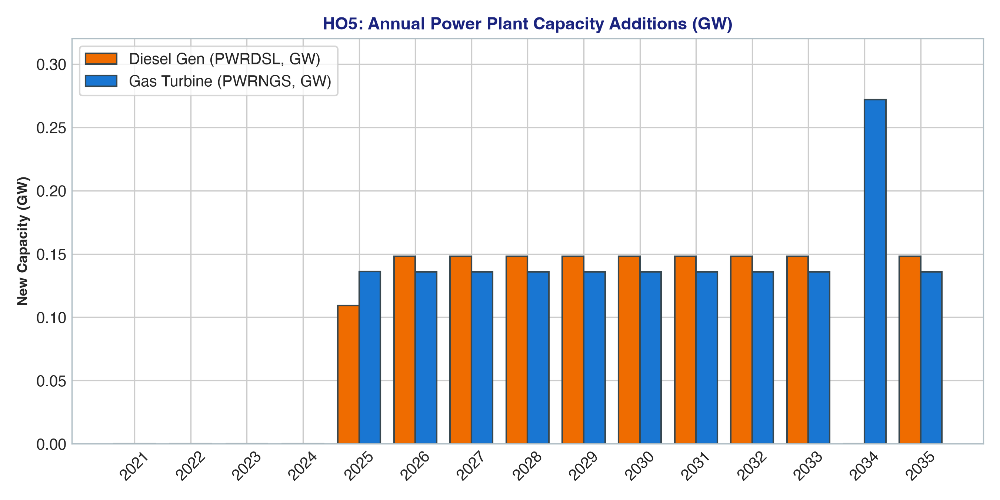
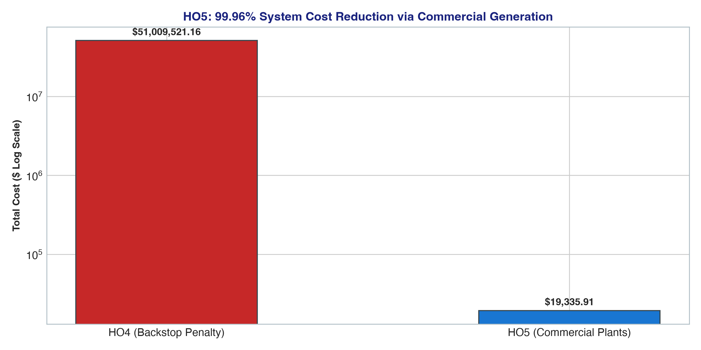

# Handout 5 (HO5): Commercial Thermal Generation Results

## 🎯 Executive Summary & Solver Optimization Statistics
Handout 5 introduces realistic commercial thermal power plants (gas turbines `PWRNGS` and diesel engines `PWRDSL`) along with high-voltage transmission lines (`PWRTRN`) and low-voltage distribution grids (`PWRDIST`). Connecting these technologies to upstream fuels eliminates the need for the artificial backstop, causing system costs to collapse.

* **Optimization Status**: `OPTIMAL` 🟢
* **Objective Function (NPV Total Cost)**: **$19,335.91** (**-99.96% reduction** vs. HO4)
* **Backstop Generation**: **0.00 GW** (phased out completely to 0 PJ)
* **LP Problem Rows (Constraints)**: **1502**
* **LP Problem Columns (Variables)**: **960**
* **Non-Zero Matrix Elements**: **8,640**
* **Solve Time**: **< 0.08 seconds**
* **Active Technologies Added**: `PWRDSL`, `PWRNGS`, `PWRTRN`, `PWRDIST`

---

## 📊 Visual Analytics & Scenario Charts

### 1. Thermal Power Plant Additions (Gas Turbines vs. Diesel Generators)


### 2. Dramatic 99.96% System Cost Reduction


---

## 📋 Comprehensive Optimization Result Tables

### Table 1: Annual New Capacity Additions by Technology (GW/yr)
Gas turbines (`PWRNGS`) and diesel gensets (`PWRDSL`) are built starting in 2025 (~0.136 GW and ~0.148 GW annually) to support escalating demand:

| Technology Code | 2021 | 2023 | 2025 | 2027 | 2029 | 2031 | 2033 | 2035 | Cumulative Built (GW) |
|---|---|---|---|---|---|---|---|---|---|
| **`PWRNGS`** | 0.000 | 0.000 | 0.136 | 0.136 | 0.136 | 0.136 | 0.136 | 0.136 | **1.495** |
| **`PWRDSL`** | 0.000 | 0.000 | 0.109 | 0.148 | 0.148 | 0.148 | 0.148 | 0.148 | **1.591** |
| **`PWRTRN`** | 0.000 | 0.000 | 0.223 | 0.223 | 0.223 | 0.223 | 0.223 | 0.223 | **2.513** |
| **`PWRDIST`** | 0.000 | 0.000 | 0.025 | 0.191 | 0.191 | 0.191 | 0.191 | 0.191 | **1.930** |
| **`MINNGS`** | 53.716 | 6.941 | 7.581 | 15.160 | 7.580 | 7.580 | 7.580 | 7.580 | **161.437** |
| **`IMPDSL`** | 10.600 | 11.571 | 21.384 | 10.693 | 0.000 | 10.693 | 0.000 | 10.693 | **158.091** |
| **`BACKSTOP`** | 0.000 | 0.000 | 0.000 | 0.000 | 0.000 | 0.000 | 0.000 | 0.000 | **0.000** |


---

### Table 2: Cumulative Installed Generation & Infrastructure Capacity (GW)

| Technology Code | 2021 | 2023 | 2025 | 2027 | 2029 | 2031 | 2033 | 2035 | Horizon End (2035) |
|---|---|---|---|---|---|---|---|---|---|
| **`PWRNGS`** | 0.000 | 0.000 | 0.136 | 0.408 | 0.680 | 0.952 | 1.224 | 1.495 | **1.495** |
| **`PWRDSL`** | 0.000 | 0.000 | 0.109 | 0.405 | 0.702 | 0.998 | 1.295 | 1.591 | **1.591** |
| **`PWRTRN`** | 0.000 | 0.000 | 0.284 | 0.730 | 1.176 | 1.621 | 2.067 | 2.513 | **2.513** |
| **`PWRDIST`** | 0.000 | 0.000 | 0.025 | 0.406 | 0.787 | 1.168 | 1.549 | 1.930 | **1.930** |
| **`MINNGS`** | 53.716 | 66.646 | 85.639 | 108.378 | 115.958 | 131.118 | 146.278 | 161.437 | **161.437** |
| **`IMPDSL`** | 10.600 | 35.050 | 61.858 | 72.550 | 93.936 | 115.321 | 147.398 | 158.091 | **158.091** |
| **`BACKSTOP`** | 0.000 | 0.000 | 0.000 | 0.000 | 0.000 | 0.000 | 0.000 | 0.000 | **0.000** |


---

### Table 3: Annual Primary Fuel & Energy Resource Activity (PJ/yr)
Natural gas mining (`MINNGS`) supplies baseload fuel, while diesel imports (`IMPDSL`) meet peak fuel requirements:

| Technology Code | Commodity | 2021 | 2023 | 2025 | 2027 | 2029 | 2031 | 2033 | 2035 | 15-Yr Total (PJ) |
|---|---|---|---|---|---|---|---|---|---|---|
| **`MINNGS`** | 45.00 | 55.00 | 65.00 | 75.00 | 85.00 | 95.00 | 105.00 | 115.00 | **1200.00** |
| **`IMPDSL`** | 8.40 | 29.78 | 51.17 | 72.55 | 93.94 | 115.32 | 136.71 | 158.09 | **1248.65** |
| **`PWRNGS`** | 21.63 | 26.44 | 31.25 | 36.06 | 40.87 | 45.67 | 50.48 | 55.29 | **576.92** |
| **`PWRDSL`** | 2.94 | 10.41 | 17.89 | 25.37 | 32.84 | 40.32 | 47.80 | 55.28 | **436.59** |
| **`PWRTRN`** | 23.40 | 35.10 | 46.80 | 58.50 | 70.20 | 81.90 | 93.60 | 105.30 | **965.25** |
| **`PWRDIST`** | 20.00 | 30.00 | 40.00 | 50.00 | 60.00 | 70.00 | 80.00 | 90.00 | **825.00** |
| **`BACKSTOP`** | 0.00 | 0.00 | 0.00 | 0.00 | 0.00 | 0.00 | 0.00 | 0.00 | **0.00** |


---

### Table 4: Sub-Annual Generation Activity by Timeslice (PJ/yr Rate)
Comparison of operational dispatch rates between Rainy Day (`RD`) and Dry Day (`DD`) for gas turbines vs. diesel peaking plants:

| Benchmark Year | Gas Turbine `PWRNGS` (RD) | Gas Turbine `PWRNGS` (DD) | Diesel Gen `PWRDSL` (RD) | Diesel Gen `PWRDSL` (DD) |
|---|---|---|---|---|
| **2021** | 25.82 | 21.54 | 3.71 | 3.71 |
| **2025** | 41.17 | 32.60 | 17.89 | 17.89 |
| **2030** | 59.39 | 45.46 | 36.58 | 36.58 |
| **2035** | 77.61 | 58.32 | 55.28 | 55.28 |


---

## 💡 Key Economic & Engineering Takeaways
1. **Thermal Merit Order**: Gas turbines operate as baseload generators due to lower variable fuel costs and high availability. Diesel engines serve as fast-ramping peaking plants during high-demand dry season hours.
2. **Economic Collapse (-99.96%)**: By replacing the $99,999/kW virtual penalty with realistic commercial assets ($1,200/kW for gas and diesel), total discounted system expenditure drops from **$51.01 Million** down to **$19,335.91**.

---

## 📜 Full Verbatim GLPK Solver Solution Output (`solution.txt`)

Below is the complete, raw primal and dual solver output generated by the GLPK linear programming solver (`glpsol`), incorporating all LP row constraints, column variables, activity levels, bounds, and shadow prices:

<details>
<summary><b>🔍 Click to expand complete raw GLPK solver solution output (OSeHO5_solution.txt)</b></summary>

```text
Problem:    osemosys_fast
Rows:       1502
Columns:    960
Non-zeros:  8640
Status:     OPTIMAL
Objective:  cost = 19335.90563 (MINimum)

   No.   Row name   St   Activity     Lower bound   Upper bound    Marginal
------ ------------ -- ------------- ------------- ------------- -------------
     1 cost         B        18514.2                             
     2 CAa4_Constraint_Capacity[SC_0,RD,MINBACK,2021]
                    B              0                          -0 
     3 CAa4_Constraint_Capacity[SC_0,RD,MINBACK,2022]
                    B              0                          -0 
     4 CAa4_Constraint_Capacity[SC_0,RD,MINBACK,2023]
                    B              0                          -0 
     5 CAa4_Constraint_Capacity[SC_0,RD,MINBACK,2024]
                    B              0                          -0 
     6 CAa4_Constraint_Capacity[SC_0,RD,MINBACK,2025]
                    B              0                          -0 
     7 CAa4_Constraint_Capacity[SC_0,RD,MINBACK,2026]
                    B              0                          -0 
     8 CAa4_Constraint_Capacity[SC_0,RD,MINBACK,2027]
                    B              0                          -0 
     9 CAa4_Constraint_Capacity[SC_0,RD,MINBACK,2028]
                    B              0                          -0 
    10 CAa4_Constraint_Capacity[SC_0,RD,MINBACK,2029]
                    B              0                          -0 
    11 CAa4_Constraint_Capacity[SC_0,RD,MINBACK,2030]
                    B              0                          -0 
    12 CAa4_Constraint_Capacity[SC_0,RD,MINBACK,2031]
                    B              0                          -0 
    13 CAa4_Constraint_Capacity[SC_0,RD,MINBACK,2032]
                    B              0                          -0 
    14 CAa4_Constraint_Capacity[SC_0,RD,MINBACK,2033]
                    B              0                          -0 
    15 CAa4_Constraint_Capacity[SC_0,RD,MINBACK,2034]
                    B              0                          -0 
    16 CAa4_Constraint_Capacity[SC_0,RD,MINBACK,2035]
                    B              0                          -0 
    17 CAa4_Constraint_Capacity[SC_0,RD,BACKSTOP,2021]
                    B              0                          -0 
    18 CAa4_Constraint_Capacity[SC_0,RD,BACKSTOP,2022]
                    B              0                          -0 
    19 CAa4_Constraint_Capacity[SC_0,RD,BACKSTOP,2023]
                    B              0                          -0 
    20 CAa4_Constraint_Capacity[SC_0,RD,BACKSTOP,2024]
                    B              0                          -0 
    21 CAa4_Constraint_Capacity[SC_0,RD,BACKSTOP,2025]
                    B              0                          -0 
    22 CAa4_Constraint_Capacity[SC_0,RD,BACKSTOP,2026]
                    B              0                          -0 
    23 CAa4_Constraint_Capacity[SC_0,RD,BACKSTOP,2027]
                    B              0                          -0 
    24 CAa4_Constraint_Capacity[SC_0,RD,BACKSTOP,2028]
                    B              0                          -0 
    25 CAa4_Constraint_Capacity[SC_0,RD,BACKSTOP,2029]
                    B              0                          -0 
    26 CAa4_Constraint_Capacity[SC_0,RD,BACKSTOP,2030]
                    B              0                          -0 
    27 CAa4_Constraint_Capacity[SC_0,RD,BACKSTOP,2031]
                    B              0                          -0 
    28 CAa4_Constraint_Capacity[SC_0,RD,BACKSTOP,2032]
                    B              0                          -0 
    29 CAa4_Constraint_Capacity[SC_0,RD,BACKSTOP,2033]
                    B              0                          -0 
    30 CAa4_Constraint_Capacity[SC_0,RD,BACKSTOP,2034]
                    B              0                          -0 
    31 CAa4_Constraint_Capacity[SC_0,RD,BACKSTOP,2035]
                    B              0                          -0 
    32 CAa4_Constraint_Capacity[SC_0,RD,MINNGS,2021]
                    NU             0                          -0  -9.09157e-05 
    33 CAa4_Constraint_Capacity[SC_0,RD,MINNGS,2022]
                    NU             0                          -0  -8.90974e-05 
    34 CAa4_Constraint_Capacity[SC_0,RD,MINNGS,2023]
                    NU             0                          -0  -8.09976e-05 
    35 CAa4_Constraint_Capacity[SC_0,RD,MINNGS,2024]
                    NU             0                          -0  -6.83063e-05 
    36 CAa4_Constraint_Capacity[SC_0,RD,MINNGS,2025]
                    NU             0                          -0  -6.20966e-05 
    37 CAa4_Constraint_Capacity[SC_0,RD,MINNGS,2026]
                    NU             0                          -0  -5.64515e-05 
    38 CAa4_Constraint_Capacity[SC_0,RD,MINNGS,2027]
                    B       -7.57985                          -0 
    39 CAa4_Constraint_Capacity[SC_0,RD,MINNGS,2028]
                    NU             0                          -0  -9.79737e-05 
    40 CAa4_Constraint_Capacity[SC_0,RD,MINNGS,2029]
                    NU             0                          -0  -4.24128e-05 
    41 CAa4_Constraint_Capacity[SC_0,RD,MINNGS,2030]
                    NU             0                          -0  -3.85571e-05 
    42 CAa4_Constraint_Capacity[SC_0,RD,MINNGS,2031]
                    NU             0                          -0  -3.50519e-05 
    43 CAa4_Constraint_Capacity[SC_0,RD,MINNGS,2032]
                    NU             0                          -0  -3.18654e-05 
    44 CAa4_Constraint_Capacity[SC_0,RD,MINNGS,2033]
                    NU             0                          -0  -2.89685e-05 
    45 CAa4_Constraint_Capacity[SC_0,RD,MINNGS,2034]
                    NU             0                          -0   -2.6335e-05 
    46 CAa4_Constraint_Capacity[SC_0,RD,MINNGS,2035]
                    NU             0                          -0  -2.39409e-05 
    47 CAa4_Constraint_Capacity[SC_0,RD,IMPDSL,2021]
                    NU             0                          -0  -7.26324e-05 
    48 CAa4_Constraint_Capacity[SC_0,RD,IMPDSL,2022]
                    NU             0                          -0  -6.94866e-05 
    49 CAa4_Constraint_Capacity[SC_0,RD,IMPDSL,2023]
                    NU             0                          -0  -6.31697e-05 
    50 CAa4_Constraint_Capacity[SC_0,RD,IMPDSL,2024]
                    NU             0                          -0  -6.83063e-05 
    51 CAa4_Constraint_Capacity[SC_0,RD,IMPDSL,2025]
                    B       -10.6926                          -0 
    52 CAa4_Constraint_Capacity[SC_0,RD,IMPDSL,2026]
                    B              0                          -0 
    53 CAa4_Constraint_Capacity[SC_0,RD,IMPDSL,2027]
                    NU             0                          -0  -5.13195e-05 
    54 CAa4_Constraint_Capacity[SC_0,RD,IMPDSL,2028]
                    B       -10.6925                          -0 
    55 CAa4_Constraint_Capacity[SC_0,RD,IMPDSL,2029]
                    B              0                          -0 
    56 CAa4_Constraint_Capacity[SC_0,RD,IMPDSL,2030]
                    B              0                          -0 
    57 CAa4_Constraint_Capacity[SC_0,RD,IMPDSL,2031]
                    B              0                          -0 
    58 CAa4_Constraint_Capacity[SC_0,RD,IMPDSL,2032]
                    B       -21.3851                          -0 
    59 CAa4_Constraint_Capacity[SC_0,RD,IMPDSL,2033]
                    B       -10.6926                          -0 
    60 CAa4_Constraint_Capacity[SC_0,RD,IMPDSL,2034]
                    B              0                          -0 
    61 CAa4_Constraint_Capacity[SC_0,RD,IMPDSL,2035]
                    B              0                          -0 
    62 CAa4_Constraint_Capacity[SC_0,RD,PWRDSL,2021]
                    B        3.70629                     15.1373 
    63 CAa4_Constraint_Capacity[SC_0,RD,PWRDSL,2022]
                    B        8.20966                     15.1373 
    64 CAa4_Constraint_Capacity[SC_0,RD,PWRDSL,2023]
                    B        12.2554                     15.1373 
    65 CAa4_Constraint_Capacity[SC_0,RD,PWRDSL,2024]
                    B        14.1518                     15.1373 
    66 CAa4_Constraint_Capacity[SC_0,RD,PWRDSL,2025]
                    NU       15.1373                     15.1373      -3.96357 
    67 CAa4_Constraint_Capacity[SC_0,RD,PWRDSL,2026]
                    NU       15.1373                     15.1373      -3.60332 
    68 CAa4_Constraint_Capacity[SC_0,RD,PWRDSL,2027]
                    NU       15.1373                     15.1373      -3.23341 
    69 CAa4_Constraint_Capacity[SC_0,RD,PWRDSL,2028]
                    NU       15.1373                     15.1373      -2.97798 
    70 CAa4_Constraint_Capacity[SC_0,RD,PWRDSL,2029]
                    NU       15.1373                     15.1373      -2.70717 
    71 CAa4_Constraint_Capacity[SC_0,RD,PWRDSL,2030]
                    NU       15.1373                     15.1373      -2.46107 
    72 CAa4_Constraint_Capacity[SC_0,RD,PWRDSL,2031]
                    NU       15.1373                     15.1373      -2.23736 
    73 CAa4_Constraint_Capacity[SC_0,RD,PWRDSL,2032]
                    NU       15.1373                     15.1373      -2.03394 
    74 CAa4_Constraint_Capacity[SC_0,RD,PWRDSL,2033]
                    NU       15.1373                     15.1373      -1.84904 
    75 CAa4_Constraint_Capacity[SC_0,RD,PWRDSL,2034]
                    NU       15.1373                     15.1373      -1.68094 
    76 CAa4_Constraint_Capacity[SC_0,RD,PWRDSL,2035]
                    NU       15.1373                     15.1373      -1.52814 
    77 CAa4_Constraint_Capacity[SC_0,RD,PWRNGS,2021]
                    B         25.825                     37.5278 
    78 CAa4_Constraint_Capacity[SC_0,RD,PWRNGS,2022]
                    B        28.7044                     37.5278 
    79 CAa4_Constraint_Capacity[SC_0,RD,PWRNGS,2023]
                    B        32.0414                     37.5278 
    80 CAa4_Constraint_Capacity[SC_0,RD,PWRNGS,2024]
                    NU       37.5278                     37.5278  -5.32789e-05 
    81 CAa4_Constraint_Capacity[SC_0,RD,PWRNGS,2025]
                    NU       37.5278                     37.5278      -3.91261 
    82 CAa4_Constraint_Capacity[SC_0,RD,PWRNGS,2026]
                    NU       37.5278                     37.5278      -3.55692 
    83 CAa4_Constraint_Capacity[SC_0,RD,PWRNGS,2027]
                    NU       37.5278                     37.5278      -3.23356 
    84 CAa4_Constraint_Capacity[SC_0,RD,PWRNGS,2028]
                    NU       37.5278                     37.5278       -2.9396 
    85 CAa4_Constraint_Capacity[SC_0,RD,PWRNGS,2029]
                    NU       37.5278                     37.5278      -2.67236 
    86 CAa4_Constraint_Capacity[SC_0,RD,PWRNGS,2030]
                    NU       37.5278                     37.5278      -2.42942 
    87 CAa4_Constraint_Capacity[SC_0,RD,PWRNGS,2031]
                    NU       37.5278                     37.5278      -2.20857 
    88 CAa4_Constraint_Capacity[SC_0,RD,PWRNGS,2032]
                    NU       37.5278                     37.5278      -2.00779 
    89 CAa4_Constraint_Capacity[SC_0,RD,PWRNGS,2033]
                    NU       37.5278                     37.5278      -1.82526 
    90 CAa4_Constraint_Capacity[SC_0,RD,PWRNGS,2034]
                    NU       37.5278                     37.5278      -1.65933 
    91 CAa4_Constraint_Capacity[SC_0,RD,PWRNGS,2035]
                    NU       37.5278                     37.5278      -1.50848 
    92 CAa4_Constraint_Capacity[SC_0,RD,PWRTRN,2021]
                    B         28.125                      47.304 
    93 CAa4_Constraint_Capacity[SC_0,RD,PWRTRN,2022]
                    B        35.1562                      47.304 
    94 CAa4_Constraint_Capacity[SC_0,RD,PWRTRN,2023]
                    B        42.1875                      47.304 
    95 CAa4_Constraint_Capacity[SC_0,RD,PWRTRN,2024]
                    NU        47.304                      47.304      -1.68811 
    96 CAa4_Constraint_Capacity[SC_0,RD,PWRTRN,2025]
                    NU        47.304                      47.304      -1.53464 
    97 CAa4_Constraint_Capacity[SC_0,RD,PWRTRN,2026]
                    NU        47.304                      47.304      -1.39513 
    98 CAa4_Constraint_Capacity[SC_0,RD,PWRTRN,2027]
                    NU        47.304                      47.304       -1.2683 
    99 CAa4_Constraint_Capacity[SC_0,RD,PWRTRN,2028]
                    NU        47.304                      47.304        -1.153 
   100 CAa4_Constraint_Capacity[SC_0,RD,PWRTRN,2029]
                    NU        47.304                      47.304      -1.04818 
   101 CAa4_Constraint_Capacity[SC_0,RD,PWRTRN,2030]
                    NU        47.304                      47.304     -0.952893 
   102 CAa4_Constraint_Capacity[SC_0,RD,PWRTRN,2031]
                    NU        47.304                      47.304     -0.866266 
   103 CAa4_Constraint_Capacity[SC_0,RD,PWRTRN,2032]
                    NU        47.304                      47.304     -0.787515 
   104 CAa4_Constraint_Capacity[SC_0,RD,PWRTRN,2033]
                    NU        47.304                      47.304     -0.715923 
   105 CAa4_Constraint_Capacity[SC_0,RD,PWRTRN,2034]
                    NU        47.304                      47.304     -0.650839 
   106 CAa4_Constraint_Capacity[SC_0,RD,PWRTRN,2035]
                    NU        47.304                      47.304     -0.591672 
   107 CAa4_Constraint_Capacity[SC_0,RD,PWRDIST,2021]
                    B        24.0385                      47.304 
   108 CAa4_Constraint_Capacity[SC_0,RD,PWRDIST,2022]
                    B        30.0481                      47.304 
   109 CAa4_Constraint_Capacity[SC_0,RD,PWRDIST,2023]
                    B        36.0577                      47.304 
   110 CAa4_Constraint_Capacity[SC_0,RD,PWRDIST,2024]
                    B        42.0673                      47.304 
   111 CAa4_Constraint_Capacity[SC_0,RD,PWRDIST,2025]
                    NU        47.304                      47.304      -3.26689 
   112 CAa4_Constraint_Capacity[SC_0,RD,PWRDIST,2026]
                    NU        47.304                      47.304       -2.9699 
   113 CAa4_Constraint_Capacity[SC_0,RD,PWRDIST,2027]
                    NU        47.304                      47.304      -2.69991 
   114 CAa4_Constraint_Capacity[SC_0,RD,PWRDIST,2028]
                    NU        47.304                      47.304      -2.45446 
   115 CAa4_Constraint_Capacity[SC_0,RD,PWRDIST,2029]
                    NU        47.304                      47.304      -2.23133 
   116 CAa4_Constraint_Capacity[SC_0,RD,PWRDIST,2030]
                    NU        47.304                      47.304      -2.02848 
   117 CAa4_Constraint_Capacity[SC_0,RD,PWRDIST,2031]
                    NU        47.304                      47.304      -1.84408 
   118 CAa4_Constraint_Capacity[SC_0,RD,PWRDIST,2032]
                    NU        47.304                      47.304      -1.67643 
   119 CAa4_Constraint_Capacity[SC_0,RD,PWRDIST,2033]
                    NU        47.304                      47.304      -1.52403 
   120 CAa4_Constraint_Capacity[SC_0,RD,PWRDIST,2034]
                    NU        47.304                      47.304      -1.38548 
   121 CAa4_Constraint_Capacity[SC_0,RD,PWRDIST,2035]
                    NU        47.304                      47.304      -1.25953 
   122 CAa4_Constraint_Capacity[SC_0,RN,MINBACK,2021]
                    B              0                          -0 
   123 CAa4_Constraint_Capacity[SC_0,RN,MINBACK,2022]
                    NU             0                          -0         < eps
   124 CAa4_Constraint_Capacity[SC_0,RN,MINBACK,2023]
                    B              0                          -0 
   125 CAa4_Constraint_Capacity[SC_0,RN,MINBACK,2024]
                    B              0                          -0 
   126 CAa4_Constraint_Capacity[SC_0,RN,MINBACK,2025]
                    B              0                          -0 
   127 CAa4_Constraint_Capacity[SC_0,RN,MINBACK,2026]
                    B              0                          -0 
   128 CAa4_Constraint_Capacity[SC_0,RN,MINBACK,2027]
                    B              0                          -0 
   129 CAa4_Constraint_Capacity[SC_0,RN,MINBACK,2028]
                    B              0                          -0 
   130 CAa4_Constraint_Capacity[SC_0,RN,MINBACK,2029]
                    B              0                          -0 
   131 CAa4_Constraint_Capacity[SC_0,RN,MINBACK,2030]
                    B              0                          -0 
   132 CAa4_Constraint_Capacity[SC_0,RN,MINBACK,2031]
                    B              0                          -0 
   133 CAa4_Constraint_Capacity[SC_0,RN,MINBACK,2032]
                    B              0                          -0 
   134 CAa4_Constraint_Capacity[SC_0,RN,MINBACK,2033]
                    B              0                          -0 
   135 CAa4_Constraint_Capacity[SC_0,RN,MINBACK,2034]
                    B              0                          -0 
   136 CAa4_Constraint_Capacity[SC_0,RN,MINBACK,2035]
                    B              0                          -0 
   137 CAa4_Constraint_Capacity[SC_0,RN,BACKSTOP,2021]
                    B              0                          -0 
   138 CAa4_Constraint_Capacity[SC_0,RN,BACKSTOP,2022]
                    B              0                          -0 
   139 CAa4_Constraint_Capacity[SC_0,RN,BACKSTOP,2023]
                    B              0                          -0 
   140 CAa4_Constraint_Capacity[SC_0,RN,BACKSTOP,2024]
                    B              0                          -0 
   141 CAa4_Constraint_Capacity[SC_0,RN,BACKSTOP,2025]
                    B              0                          -0 
   142 CAa4_Constraint_Capacity[SC_0,RN,BACKSTOP,2026]
                    B              0                          -0 
   143 CAa4_Constraint_Capacity[SC_0,RN,BACKSTOP,2027]
                    B              0                          -0 
   144 CAa4_Constraint_Capacity[SC_0,RN,BACKSTOP,2028]
                    B              0                          -0 
   145 CAa4_Constraint_Capacity[SC_0,RN,BACKSTOP,2029]
                    B              0                          -0 
   146 CAa4_Constraint_Capacity[SC_0,RN,BACKSTOP,2030]
                    B              0                          -0 
   147 CAa4_Constraint_Capacity[SC_0,RN,BACKSTOP,2031]
                    B              0                          -0 
   148 CAa4_Constraint_Capacity[SC_0,RN,BACKSTOP,2032]
                    B              0                          -0 
   149 CAa4_Constraint_Capacity[SC_0,RN,BACKSTOP,2033]
                    B              0                          -0 
   150 CAa4_Constraint_Capacity[SC_0,RN,BACKSTOP,2034]
                    B              0                          -0 
   151 CAa4_Constraint_Capacity[SC_0,RN,BACKSTOP,2035]
                    B              0                          -0 
   152 CAa4_Constraint_Capacity[SC_0,RN,MINNGS,2021]
                    B       -4.57591                          -0 
   153 CAa4_Constraint_Capacity[SC_0,RN,MINNGS,2022]
                    NU             0                          -0   6.44675e-06 
   154 CAa4_Constraint_Capacity[SC_0,RN,MINNGS,2023]
                    NU             0                          -0   5.86068e-06 
   155 CAa4_Constraint_Capacity[SC_0,RN,MINNGS,2024]
                    B       -21.4937                          -0 
   156 CAa4_Constraint_Capacity[SC_0,RN,MINNGS,2025]
                    B         -24.57                          -0 
   157 CAa4_Constraint_Capacity[SC_0,RN,MINNGS,2026]
                    B       -27.6412                          -0 
   158 CAa4_Constraint_Capacity[SC_0,RN,MINNGS,2027]
                    B       -38.2923                          -0 
   159 CAa4_Constraint_Capacity[SC_0,RN,MINNGS,2028]
                    B       -33.7838                          -0 
   160 CAa4_Constraint_Capacity[SC_0,RN,MINNGS,2029]
                    B        -36.855                          -0 
   161 CAa4_Constraint_Capacity[SC_0,RN,MINNGS,2030]
                    B       -39.9263                          -0 
   162 CAa4_Constraint_Capacity[SC_0,RN,MINNGS,2031]
                    B       -42.9975                          -0 
   163 CAa4_Constraint_Capacity[SC_0,RN,MINNGS,2032]
                    B       -46.0688                          -0 
   164 CAa4_Constraint_Capacity[SC_0,RN,MINNGS,2033]
                    B         -49.14                          -0 
   165 CAa4_Constraint_Capacity[SC_0,RN,MINNGS,2034]
                    B       -52.2112                          -0 
   166 CAa4_Constraint_Capacity[SC_0,RN,MINNGS,2035]
                    B       -55.2825                          -0 
   167 CAa4_Constraint_Capacity[SC_0,RN,IMPDSL,2021]
                    B          -10.6                          -0 
   168 CAa4_Constraint_Capacity[SC_0,RN,IMPDSL,2022]
                    B       -21.1148                          -0 
   169 CAa4_Constraint_Capacity[SC_0,RN,IMPDSL,2023]
                    B       -25.3378                          -0 
   170 CAa4_Constraint_Capacity[SC_0,RN,IMPDSL,2024]
                    B    -0.00689351                          -0 
   171 CAa4_Constraint_Capacity[SC_0,RN,IMPDSL,2025]
                    B       -10.6925                          -0 
   172 CAa4_Constraint_Capacity[SC_0,RN,IMPDSL,2026]
                    NU             0                          -0  -0.000118548 
   173 CAa4_Constraint_Capacity[SC_0,RN,IMPDSL,2027]
                    NU             0                          -0         < eps
   174 CAa4_Constraint_Capacity[SC_0,RN,IMPDSL,2028]
                    B       -10.6925                          -0 
   175 CAa4_Constraint_Capacity[SC_0,RN,IMPDSL,2029]
                    B              0                          -0 
   176 CAa4_Constraint_Capacity[SC_0,RN,IMPDSL,2030]
                    B              0                          -0 
   177 CAa4_Constraint_Capacity[SC_0,RN,IMPDSL,2031]
                    NU             0                          -0  -3.50519e-05 
   178 CAa4_Constraint_Capacity[SC_0,RN,IMPDSL,2032]
                    B       -21.3851                          -0 
   179 CAa4_Constraint_Capacity[SC_0,RN,IMPDSL,2033]
                    B       -10.6926                          -0 
   180 CAa4_Constraint_Capacity[SC_0,RN,IMPDSL,2034]
                    B              0                          -0 
   181 CAa4_Constraint_Capacity[SC_0,RN,IMPDSL,2035]
                    NU             0                          -0  -2.39409e-05 
   182 CAa4_Constraint_Capacity[SC_0,RN,PWRDSL,2021]
                    B              0                     15.1373 
   183 CAa4_Constraint_Capacity[SC_0,RN,PWRDSL,2022]
                    B       0.826851                     15.1373 
   184 CAa4_Constraint_Capacity[SC_0,RN,PWRDSL,2023]
                    B        3.39607                     15.1373 
   185 CAa4_Constraint_Capacity[SC_0,RN,PWRDSL,2024]
                    B        14.1494                     15.1373 
   186 CAa4_Constraint_Capacity[SC_0,RN,PWRDSL,2025]
                    NU       15.1373                     15.1373     -0.050837 
   187 CAa4_Constraint_Capacity[SC_0,RN,PWRDSL,2026]
                    NU       15.1373                     15.1373     -0.045947 
   188 CAa4_Constraint_Capacity[SC_0,RN,PWRDSL,2027]
                    B        15.1373                     15.1373 
   189 CAa4_Constraint_Capacity[SC_0,RN,PWRDSL,2028]
                    NU       15.1373                     15.1373    -0.0381724 
   190 CAa4_Constraint_Capacity[SC_0,RN,PWRDSL,2029]
                    NU       15.1373                     15.1373    -0.0347224 
   191 CAa4_Constraint_Capacity[SC_0,RN,PWRDSL,2030]
                    NU       15.1373                     15.1373    -0.0315658 
   192 CAa4_Constraint_Capacity[SC_0,RN,PWRDSL,2031]
                    NU       15.1373                     15.1373    -0.0286168 
   193 CAa4_Constraint_Capacity[SC_0,RN,PWRDSL,2032]
                    NU       15.1373                     15.1373    -0.0260874 
   194 CAa4_Constraint_Capacity[SC_0,RN,PWRDSL,2033]
                    NU       15.1373                     15.1373    -0.0237159 
   195 CAa4_Constraint_Capacity[SC_0,RN,PWRDSL,2034]
                    NU       15.1373                     15.1373    -0.0215599 
   196 CAa4_Constraint_Capacity[SC_0,RN,PWRDSL,2035]
                    NU       15.1373                     15.1373    -0.0195457 
   197 CAa4_Constraint_Capacity[SC_0,RN,PWRNGS,2021]
                    B         23.625                     37.5278 
   198 CAa4_Constraint_Capacity[SC_0,RN,PWRNGS,2022]
                    B        28.7044                     37.5278 
   199 CAa4_Constraint_Capacity[SC_0,RN,PWRNGS,2023]
                    B        32.0414                     37.5278 
   200 CAa4_Constraint_Capacity[SC_0,RN,PWRNGS,2024]
                    B        27.1943                     37.5278 
   201 CAa4_Constraint_Capacity[SC_0,RN,PWRNGS,2025]
                    B        25.7153                     37.5278 
   202 CAa4_Constraint_Capacity[SC_0,RN,PWRNGS,2026]
                    B        24.2388                     37.5278 
   203 CAa4_Constraint_Capacity[SC_0,RN,PWRNGS,2027]
                    B        22.7622                     37.5278 
   204 CAa4_Constraint_Capacity[SC_0,RN,PWRNGS,2028]
                    B        21.2857                     37.5278 
   205 CAa4_Constraint_Capacity[SC_0,RN,PWRNGS,2029]
                    B        19.8091                     37.5278 
   206 CAa4_Constraint_Capacity[SC_0,RN,PWRNGS,2030]
                    B        18.3325                     37.5278 
   207 CAa4_Constraint_Capacity[SC_0,RN,PWRNGS,2031]
                    B         16.856                     37.5278 
   208 CAa4_Constraint_Capacity[SC_0,RN,PWRNGS,2032]
                    B        15.3794                     37.5278 
   209 CAa4_Constraint_Capacity[SC_0,RN,PWRNGS,2033]
                    B        13.9028                     37.5278 
   210 CAa4_Constraint_Capacity[SC_0,RN,PWRNGS,2034]
                    B        12.4263                     37.5278 
   211 CAa4_Constraint_Capacity[SC_0,RN,PWRNGS,2035]
                    B        10.9497                     37.5278 
   212 CAa4_Constraint_Capacity[SC_0,RN,PWRTRN,2021]
                    B           22.5                      47.304 
   213 CAa4_Constraint_Capacity[SC_0,RN,PWRTRN,2022]
                    B         28.125                      47.304 
   214 CAa4_Constraint_Capacity[SC_0,RN,PWRTRN,2023]
                    B          33.75                      47.304 
   215 CAa4_Constraint_Capacity[SC_0,RN,PWRTRN,2024]
                    B        37.4603                      47.304 
   216 CAa4_Constraint_Capacity[SC_0,RN,PWRTRN,2025]
                    B         36.054                      47.304 
   217 CAa4_Constraint_Capacity[SC_0,RN,PWRTRN,2026]
                    B        34.6478                      47.304 
   218 CAa4_Constraint_Capacity[SC_0,RN,PWRTRN,2027]
                    B        33.2415                      47.304 
   219 CAa4_Constraint_Capacity[SC_0,RN,PWRTRN,2028]
                    B        31.8352                      47.304 
   220 CAa4_Constraint_Capacity[SC_0,RN,PWRTRN,2029]
                    B         30.429                      47.304 
   221 CAa4_Constraint_Capacity[SC_0,RN,PWRTRN,2030]
                    B        29.0227                      47.304 
   222 CAa4_Constraint_Capacity[SC_0,RN,PWRTRN,2031]
                    B        27.6165                      47.304 
   223 CAa4_Constraint_Capacity[SC_0,RN,PWRTRN,2032]
                    B        26.2103                      47.304 
   224 CAa4_Constraint_Capacity[SC_0,RN,PWRTRN,2033]
                    B         24.804                      47.304 
   225 CAa4_Constraint_Capacity[SC_0,RN,PWRTRN,2034]
                    B        23.3978                      47.304 
   226 CAa4_Constraint_Capacity[SC_0,RN,PWRTRN,2035]
                    B        21.9915                      47.304 
   227 CAa4_Constraint_Capacity[SC_0,RN,PWRDIST,2021]
                    B        19.2308                      47.304 
   228 CAa4_Constraint_Capacity[SC_0,RN,PWRDIST,2022]
                    B        24.0385                      47.304 
   229 CAa4_Constraint_Capacity[SC_0,RN,PWRDIST,2023]
                    B        28.8462                      47.304 
   230 CAa4_Constraint_Capacity[SC_0,RN,PWRDIST,2024]
                    B        33.6538                      47.304 
   231 CAa4_Constraint_Capacity[SC_0,RN,PWRDIST,2025]
                    B        37.6886                      47.304 
   232 CAa4_Constraint_Capacity[SC_0,RN,PWRDIST,2026]
                    B        36.4867                      47.304 
   233 CAa4_Constraint_Capacity[SC_0,RN,PWRDIST,2027]
                    B        35.2848                      47.304 
   234 CAa4_Constraint_Capacity[SC_0,RN,PWRDIST,2028]
                    B        34.0828                      47.304 
   235 CAa4_Constraint_Capacity[SC_0,RN,PWRDIST,2029]
                    B        32.8809                      47.304 
   236 CAa4_Constraint_Capacity[SC_0,RN,PWRDIST,2030]
                    B         31.679                      47.304 
   237 CAa4_Constraint_Capacity[SC_0,RN,PWRDIST,2031]
                    B        30.4771                      47.304 
   238 CAa4_Constraint_Capacity[SC_0,RN,PWRDIST,2032]
                    B        29.2752                      47.304 
   239 CAa4_Constraint_Capacity[SC_0,RN,PWRDIST,2033]
                    B        28.0732                      47.304 
   240 CAa4_Constraint_Capacity[SC_0,RN,PWRDIST,2034]
                    B        26.8713                      47.304 
   241 CAa4_Constraint_Capacity[SC_0,RN,PWRDIST,2035]
                    B        25.6694                      47.304 
   242 CAa4_Constraint_Capacity[SC_0,DD,MINBACK,2021]
                    B              0                          -0 
   243 CAa4_Constraint_Capacity[SC_0,DD,MINBACK,2022]
                    B              0                          -0 
   244 CAa4_Constraint_Capacity[SC_0,DD,MINBACK,2023]
                    B              0                          -0 
   245 CAa4_Constraint_Capacity[SC_0,DD,MINBACK,2024]
                    B              0                          -0 
   246 CAa4_Constraint_Capacity[SC_0,DD,MINBACK,2025]
                    B              0                          -0 
   247 CAa4_Constraint_Capacity[SC_0,DD,MINBACK,2026]
                    B              0                          -0 
   248 CAa4_Constraint_Capacity[SC_0,DD,MINBACK,2027]
                    B              0                          -0 
   249 CAa4_Constraint_Capacity[SC_0,DD,MINBACK,2028]
                    B              0                          -0 
   250 CAa4_Constraint_Capacity[SC_0,DD,MINBACK,2029]
                    B              0                          -0 
   251 CAa4_Constraint_Capacity[SC_0,DD,MINBACK,2030]
                    B              0                          -0 
   252 CAa4_Constraint_Capacity[SC_0,DD,MINBACK,2031]
                    B              0                          -0 
   253 CAa4_Constraint_Capacity[SC_0,DD,MINBACK,2032]
                    B              0                          -0 
   254 CAa4_Constraint_Capacity[SC_0,DD,MINBACK,2033]
                    B              0                          -0 
   255 CAa4_Constraint_Capacity[SC_0,DD,MINBACK,2034]
                    B              0                          -0 
   256 CAa4_Constraint_Capacity[SC_0,DD,MINBACK,2035]
                    B              0                          -0 
   257 CAa4_Constraint_Capacity[SC_0,DD,BACKSTOP,2021]
                    B              0                          -0 
   258 CAa4_Constraint_Capacity[SC_0,DD,BACKSTOP,2022]
                    B              0                          -0 
   259 CAa4_Constraint_Capacity[SC_0,DD,BACKSTOP,2023]
                    B              0                          -0 
   260 CAa4_Constraint_Capacity[SC_0,DD,BACKSTOP,2024]
                    B              0                          -0 
   261 CAa4_Constraint_Capacity[SC_0,DD,BACKSTOP,2025]
                    B              0                          -0 
   262 CAa4_Constraint_Capacity[SC_0,DD,BACKSTOP,2026]
                    B              0                          -0 
   263 CAa4_Constraint_Capacity[SC_0,DD,BACKSTOP,2027]
                    B              0                          -0 
   264 CAa4_Constraint_Capacity[SC_0,DD,BACKSTOP,2028]
                    B              0                          -0 
   265 CAa4_Constraint_Capacity[SC_0,DD,BACKSTOP,2029]
                    B              0                          -0 
   266 CAa4_Constraint_Capacity[SC_0,DD,BACKSTOP,2030]
                    B              0                          -0 
   267 CAa4_Constraint_Capacity[SC_0,DD,BACKSTOP,2031]
                    B              0                          -0 
   268 CAa4_Constraint_Capacity[SC_0,DD,BACKSTOP,2032]
                    B              0                          -0 
   269 CAa4_Constraint_Capacity[SC_0,DD,BACKSTOP,2033]
                    B              0                          -0 
   270 CAa4_Constraint_Capacity[SC_0,DD,BACKSTOP,2034]
                    B              0                          -0 
   271 CAa4_Constraint_Capacity[SC_0,DD,BACKSTOP,2035]
                    B              0                          -0 
   272 CAa4_Constraint_Capacity[SC_0,DD,MINNGS,2021]
                    B       -8.91925                          -0 
   273 CAa4_Constraint_Capacity[SC_0,DD,MINNGS,2022]
                    B       -11.1491                          -0 
   274 CAa4_Constraint_Capacity[SC_0,DD,MINNGS,2023]
                    B       -13.3789                          -0 
   275 CAa4_Constraint_Capacity[SC_0,DD,MINNGS,2024]
                    B       -15.6087                          -0 
   276 CAa4_Constraint_Capacity[SC_0,DD,MINNGS,2025]
                    B       -17.8385                          -0 
   277 CAa4_Constraint_Capacity[SC_0,DD,MINNGS,2026]
                    B       -20.0683                          -0 
   278 CAa4_Constraint_Capacity[SC_0,DD,MINNGS,2027]
                    B        -29.878                          -0 
   279 CAa4_Constraint_Capacity[SC_0,DD,MINNGS,2028]
                    B       -24.5279                          -0 
   280 CAa4_Constraint_Capacity[SC_0,DD,MINNGS,2029]
                    B       -26.7577                          -0 
   281 CAa4_Constraint_Capacity[SC_0,DD,MINNGS,2030]
                    B       -28.9876                          -0 
   282 CAa4_Constraint_Capacity[SC_0,DD,MINNGS,2031]
                    B       -31.2174                          -0 
   283 CAa4_Constraint_Capacity[SC_0,DD,MINNGS,2032]
                    B       -33.4472                          -0 
   284 CAa4_Constraint_Capacity[SC_0,DD,MINNGS,2033]
                    B        -35.677                          -0 
   285 CAa4_Constraint_Capacity[SC_0,DD,MINNGS,2034]
                    B       -37.9068                          -0 
   286 CAa4_Constraint_Capacity[SC_0,DD,MINNGS,2035]
                    B       -40.1366                          -0 
   287 CAa4_Constraint_Capacity[SC_0,DD,IMPDSL,2021]
                    NU             0                          -0  -9.14166e-06 
   288 CAa4_Constraint_Capacity[SC_0,DD,IMPDSL,2022]
                    NU             0                          -0    -6.582e-06 
   289 CAa4_Constraint_Capacity[SC_0,DD,IMPDSL,2023]
                    NU             0                          -0  -5.98363e-06 
   290 CAa4_Constraint_Capacity[SC_0,DD,IMPDSL,2024]
                    NU             0                          -0         < eps
   291 CAa4_Constraint_Capacity[SC_0,DD,IMPDSL,2025]
                    B       -10.6926                          -0 
   292 CAa4_Constraint_Capacity[SC_0,DD,IMPDSL,2026]
                    B              0                          -0 
   293 CAa4_Constraint_Capacity[SC_0,DD,IMPDSL,2027]
                    B              0                          -0 
   294 CAa4_Constraint_Capacity[SC_0,DD,IMPDSL,2028]
                    B       -10.6925                          -0 
   295 CAa4_Constraint_Capacity[SC_0,DD,IMPDSL,2029]
                    B              0                          -0 
   296 CAa4_Constraint_Capacity[SC_0,DD,IMPDSL,2030]
                    B              0                          -0 
   297 CAa4_Constraint_Capacity[SC_0,DD,IMPDSL,2031]
                    B              0                          -0 
   298 CAa4_Constraint_Capacity[SC_0,DD,IMPDSL,2032]
                    B       -21.3851                          -0 
   299 CAa4_Constraint_Capacity[SC_0,DD,IMPDSL,2033]
                    B       -10.6925                          -0 
   300 CAa4_Constraint_Capacity[SC_0,DD,IMPDSL,2034]
                    B              0                          -0 
   301 CAa4_Constraint_Capacity[SC_0,DD,IMPDSL,2035]
                    B              0                          -0 
   302 CAa4_Constraint_Capacity[SC_0,DD,PWRDSL,2021]
                    B        3.70629                     15.1373 
   303 CAa4_Constraint_Capacity[SC_0,DD,PWRDSL,2022]
                    B        8.20966                     15.1373 
   304 CAa4_Constraint_Capacity[SC_0,DD,PWRDSL,2023]
                    B        12.2554                     15.1373 
   305 CAa4_Constraint_Capacity[SC_0,DD,PWRDSL,2024]
                    B        14.1518                     15.1373 
   306 CAa4_Constraint_Capacity[SC_0,DD,PWRDSL,2025]
                    NU       15.1373                     15.1373    -0.0713674 
   307 CAa4_Constraint_Capacity[SC_0,DD,PWRDSL,2026]
                    NU       15.1373                     15.1373    -0.0649784 
   308 CAa4_Constraint_Capacity[SC_0,DD,PWRDSL,2027]
                    NU       15.1373                     15.1373         < eps
   309 CAa4_Constraint_Capacity[SC_0,DD,PWRDSL,2028]
                    NU       15.1373                     15.1373    -0.0535882 
   310 CAa4_Constraint_Capacity[SC_0,DD,PWRDSL,2029]
                    NU       15.1373                     15.1373    -0.0487449 
   311 CAa4_Constraint_Capacity[SC_0,DD,PWRDSL,2030]
                    NU       15.1373                     15.1373    -0.0443135 
   312 CAa4_Constraint_Capacity[SC_0,DD,PWRDSL,2031]
                    NU       15.1373                     15.1373    -0.0403143 
   313 CAa4_Constraint_Capacity[SC_0,DD,PWRDSL,2032]
                    NU       15.1373                     15.1373    -0.0366228 
   314 CAa4_Constraint_Capacity[SC_0,DD,PWRDSL,2033]
                    NU       15.1373                     15.1373    -0.0332934 
   315 CAa4_Constraint_Capacity[SC_0,DD,PWRDSL,2034]
                    NU       15.1373                     15.1373    -0.0302667 
   316 CAa4_Constraint_Capacity[SC_0,DD,PWRDSL,2035]
                    NU       15.1373                     15.1373    -0.0275352 
   317 CAa4_Constraint_Capacity[SC_0,DD,PWRNGS,2021]
                    B        21.5369                     37.5278 
   318 CAa4_Constraint_Capacity[SC_0,DD,PWRNGS,2022]
                    B        23.3443                     37.5278 
   319 CAa4_Constraint_Capacity[SC_0,DD,PWRNGS,2023]
                    B        25.6093                     37.5278 
   320 CAa4_Constraint_Capacity[SC_0,DD,PWRNGS,2024]
                    B        30.0237                     37.5278 
   321 CAa4_Constraint_Capacity[SC_0,DD,PWRNGS,2025]
                    B        28.9516                     37.5278 
   322 CAa4_Constraint_Capacity[SC_0,DD,PWRNGS,2026]
                    B        27.8796                     37.5278 
   323 CAa4_Constraint_Capacity[SC_0,DD,PWRNGS,2027]
                    B        26.8076                     37.5278 
   324 CAa4_Constraint_Capacity[SC_0,DD,PWRNGS,2028]
                    B        25.7356                     37.5278 
   325 CAa4_Constraint_Capacity[SC_0,DD,PWRNGS,2029]
                    B        24.6635                     37.5278 
   326 CAa4_Constraint_Capacity[SC_0,DD,PWRNGS,2030]
                    B        23.5915                     37.5278 
   327 CAa4_Constraint_Capacity[SC_0,DD,PWRNGS,2031]
                    B        22.5195                     37.5278 
   328 CAa4_Constraint_Capacity[SC_0,DD,PWRNGS,2032]
                    B        21.4475                     37.5278 
   329 CAa4_Constraint_Capacity[SC_0,DD,PWRNGS,2033]
                    B        20.3754                     37.5278 
   330 CAa4_Constraint_Capacity[SC_0,DD,PWRNGS,2034]
                    B        19.3034                     37.5278 
   331 CAa4_Constraint_Capacity[SC_0,DD,PWRNGS,2035]
                    B        18.2314                     37.5278 
   332 CAa4_Constraint_Capacity[SC_0,DD,PWRTRN,2021]
                    B        24.0411                      47.304 
   333 CAa4_Constraint_Capacity[SC_0,DD,PWRTRN,2022]
                    B        30.0514                      47.304 
   334 CAa4_Constraint_Capacity[SC_0,DD,PWRTRN,2023]
                    B        36.0616                      47.304 
   335 CAa4_Constraint_Capacity[SC_0,DD,PWRTRN,2024]
                    B        40.1572                      47.304 
   336 CAa4_Constraint_Capacity[SC_0,DD,PWRTRN,2025]
                    B        39.1362                      47.304 
   337 CAa4_Constraint_Capacity[SC_0,DD,PWRTRN,2026]
                    B        38.1152                      47.304 
   338 CAa4_Constraint_Capacity[SC_0,DD,PWRTRN,2027]
                    B        37.0942                      47.304 
   339 CAa4_Constraint_Capacity[SC_0,DD,PWRTRN,2028]
                    B        36.0733                      47.304 
   340 CAa4_Constraint_Capacity[SC_0,DD,PWRTRN,2029]
                    B        35.0523                      47.304 
   341 CAa4_Constraint_Capacity[SC_0,DD,PWRTRN,2030]
                    B        34.0313                      47.304 
   342 CAa4_Constraint_Capacity[SC_0,DD,PWRTRN,2031]
                    B        33.0103                      47.304 
   343 CAa4_Constraint_Capacity[SC_0,DD,PWRTRN,2032]
                    B        31.9894                      47.304 
   344 CAa4_Constraint_Capacity[SC_0,DD,PWRTRN,2033]
                    B        30.9684                      47.304 
   345 CAa4_Constraint_Capacity[SC_0,DD,PWRTRN,2034]
                    B        29.9474                      47.304 
   346 CAa4_Constraint_Capacity[SC_0,DD,PWRTRN,2035]
                    B        28.9264                      47.304 
   347 CAa4_Constraint_Capacity[SC_0,DD,PWRDIST,2021]
                    B        20.5479                      47.304 
   348 CAa4_Constraint_Capacity[SC_0,DD,PWRDIST,2022]
                    B        25.6849                      47.304 
   349 CAa4_Constraint_Capacity[SC_0,DD,PWRDIST,2023]
                    B        30.8219                      47.304 
   350 CAa4_Constraint_Capacity[SC_0,DD,PWRDIST,2024]
                    B        35.9589                      47.304 
   351 CAa4_Constraint_Capacity[SC_0,DD,PWRDIST,2025]
                    B         40.323                      47.304 
   352 CAa4_Constraint_Capacity[SC_0,DD,PWRDIST,2026]
                    B        39.4503                      47.304 
   353 CAa4_Constraint_Capacity[SC_0,DD,PWRDIST,2027]
                    B        38.5777                      47.304 
   354 CAa4_Constraint_Capacity[SC_0,DD,PWRDIST,2028]
                    B        37.7051                      47.304 
   355 CAa4_Constraint_Capacity[SC_0,DD,PWRDIST,2029]
                    B        36.8325                      47.304 
   356 CAa4_Constraint_Capacity[SC_0,DD,PWRDIST,2030]
                    B        35.9598                      47.304 
   357 CAa4_Constraint_Capacity[SC_0,DD,PWRDIST,2031]
                    B        35.0872                      47.304 
   358 CAa4_Constraint_Capacity[SC_0,DD,PWRDIST,2032]
                    B        34.2146                      47.304 
   359 CAa4_Constraint_Capacity[SC_0,DD,PWRDIST,2033]
                    B        33.3419                      47.304 
   360 CAa4_Constraint_Capacity[SC_0,DD,PWRDIST,2034]
                    B        32.4693                      47.304 
   361 CAa4_Constraint_Capacity[SC_0,DD,PWRDIST,2035]
                    B        31.5967                      47.304 
   362 CAa4_Constraint_Capacity[SC_0,DN,MINBACK,2021]
                    B              0                          -0 
   363 CAa4_Constraint_Capacity[SC_0,DN,MINBACK,2022]
                    B              0                          -0 
   364 CAa4_Constraint_Capacity[SC_0,DN,MINBACK,2023]
                    B              0                          -0 
   365 CAa4_Constraint_Capacity[SC_0,DN,MINBACK,2024]
                    B              0                          -0 
   366 CAa4_Constraint_Capacity[SC_0,DN,MINBACK,2025]
                    B              0                          -0 
   367 CAa4_Constraint_Capacity[SC_0,DN,MINBACK,2026]
                    B              0                          -0 
   368 CAa4_Constraint_Capacity[SC_0,DN,MINBACK,2027]
                    B              0                          -0 
   369 CAa4_Constraint_Capacity[SC_0,DN,MINBACK,2028]
                    B              0                          -0 
   370 CAa4_Constraint_Capacity[SC_0,DN,MINBACK,2029]
                    B              0                          -0 
   371 CAa4_Constraint_Capacity[SC_0,DN,MINBACK,2030]
                    B              0                          -0 
   372 CAa4_Constraint_Capacity[SC_0,DN,MINBACK,2031]
                    B              0                          -0 
   373 CAa4_Constraint_Capacity[SC_0,DN,MINBACK,2032]
                    B              0                          -0 
   374 CAa4_Constraint_Capacity[SC_0,DN,MINBACK,2033]
                    B              0                          -0 
   375 CAa4_Constraint_Capacity[SC_0,DN,MINBACK,2034]
                    B              0                          -0 
   376 CAa4_Constraint_Capacity[SC_0,DN,MINBACK,2035]
                    B              0                          -0 
   377 CAa4_Constraint_Capacity[SC_0,DN,BACKSTOP,2021]
                    B              0                          -0 
   378 CAa4_Constraint_Capacity[SC_0,DN,BACKSTOP,2022]
                    B              0                          -0 
   379 CAa4_Constraint_Capacity[SC_0,DN,BACKSTOP,2023]
                    B              0                          -0 
   380 CAa4_Constraint_Capacity[SC_0,DN,BACKSTOP,2024]
                    B              0                          -0 
   381 CAa4_Constraint_Capacity[SC_0,DN,BACKSTOP,2025]
                    B              0                          -0 
   382 CAa4_Constraint_Capacity[SC_0,DN,BACKSTOP,2026]
                    B              0                          -0 
   383 CAa4_Constraint_Capacity[SC_0,DN,BACKSTOP,2027]
                    B              0                          -0 
   384 CAa4_Constraint_Capacity[SC_0,DN,BACKSTOP,2028]
                    B              0                          -0 
   385 CAa4_Constraint_Capacity[SC_0,DN,BACKSTOP,2029]
                    B              0                          -0 
   386 CAa4_Constraint_Capacity[SC_0,DN,BACKSTOP,2030]
                    B              0                          -0 
   387 CAa4_Constraint_Capacity[SC_0,DN,BACKSTOP,2031]
                    B              0                          -0 
   388 CAa4_Constraint_Capacity[SC_0,DN,BACKSTOP,2032]
                    B              0                          -0 
   389 CAa4_Constraint_Capacity[SC_0,DN,BACKSTOP,2033]
                    B              0                          -0 
   390 CAa4_Constraint_Capacity[SC_0,DN,BACKSTOP,2034]
                    B              0                          -0 
   391 CAa4_Constraint_Capacity[SC_0,DN,BACKSTOP,2035]
                    B              0                          -0 
   392 CAa4_Constraint_Capacity[SC_0,DN,MINNGS,2021]
                    B       -17.6702                          -0 
   393 CAa4_Constraint_Capacity[SC_0,DN,MINNGS,2022]
                    B       -22.0878                          -0 
   394 CAa4_Constraint_Capacity[SC_0,DN,MINNGS,2023]
                    B       -26.5053                          -0 
   395 CAa4_Constraint_Capacity[SC_0,DN,MINNGS,2024]
                    B       -30.9229                          -0 
   396 CAa4_Constraint_Capacity[SC_0,DN,MINNGS,2025]
                    B       -35.3404                          -0 
   397 CAa4_Constraint_Capacity[SC_0,DN,MINNGS,2026]
                    B        -39.758                          -0 
   398 CAa4_Constraint_Capacity[SC_0,DN,MINNGS,2027]
                    B       -51.7554                          -0 
   399 CAa4_Constraint_Capacity[SC_0,DN,MINNGS,2028]
                    B       -48.5931                          -0 
   400 CAa4_Constraint_Capacity[SC_0,DN,MINNGS,2029]
                    B       -53.0106                          -0 
   401 CAa4_Constraint_Capacity[SC_0,DN,MINNGS,2030]
                    B       -57.4282                          -0 
   402 CAa4_Constraint_Capacity[SC_0,DN,MINNGS,2031]
                    B       -61.8457                          -0 
   403 CAa4_Constraint_Capacity[SC_0,DN,MINNGS,2032]
                    B       -66.2633                          -0 
   404 CAa4_Constraint_Capacity[SC_0,DN,MINNGS,2033]
                    B       -70.6808                          -0 
   405 CAa4_Constraint_Capacity[SC_0,DN,MINNGS,2034]
                    B       -75.0984                          -0 
   406 CAa4_Constraint_Capacity[SC_0,DN,MINNGS,2035]
                    B       -79.5159                          -0 
   407 CAa4_Constraint_Capacity[SC_0,DN,IMPDSL,2021]
                    NU             0                          -0  -9.14166e-06 
   408 CAa4_Constraint_Capacity[SC_0,DN,IMPDSL,2022]
                    NU             0                          -0    -6.582e-06 
   409 CAa4_Constraint_Capacity[SC_0,DN,IMPDSL,2023]
                    NU             0                          -0  -5.98363e-06 
   410 CAa4_Constraint_Capacity[SC_0,DN,IMPDSL,2024]
                    NU             0                          -0         < eps
   411 CAa4_Constraint_Capacity[SC_0,DN,IMPDSL,2025]
                    B       -10.6926                          -0 
   412 CAa4_Constraint_Capacity[SC_0,DN,IMPDSL,2026]
                    B              0                          -0 
   413 CAa4_Constraint_Capacity[SC_0,DN,IMPDSL,2027]
                    B              0                          -0 
   414 CAa4_Constraint_Capacity[SC_0,DN,IMPDSL,2028]
                    B       -10.6925                          -0 
   415 CAa4_Constraint_Capacity[SC_0,DN,IMPDSL,2029]
                    B              0                          -0 
   416 CAa4_Constraint_Capacity[SC_0,DN,IMPDSL,2030]
                    B              0                          -0 
   417 CAa4_Constraint_Capacity[SC_0,DN,IMPDSL,2031]
                    B              0                          -0 
   418 CAa4_Constraint_Capacity[SC_0,DN,IMPDSL,2032]
                    B       -21.3851                          -0 
   419 CAa4_Constraint_Capacity[SC_0,DN,IMPDSL,2033]
                    B       -10.6925                          -0 
   420 CAa4_Constraint_Capacity[SC_0,DN,IMPDSL,2034]
                    B              0                          -0 
   421 CAa4_Constraint_Capacity[SC_0,DN,IMPDSL,2035]
                    B              0                          -0 
   422 CAa4_Constraint_Capacity[SC_0,DN,PWRDSL,2021]
                    B        3.70629                     15.1373 
   423 CAa4_Constraint_Capacity[SC_0,DN,PWRDSL,2022]
                    B        8.20966                     15.1373 
   424 CAa4_Constraint_Capacity[SC_0,DN,PWRDSL,2023]
                    B        12.2554                     15.1373 
   425 CAa4_Constraint_Capacity[SC_0,DN,PWRDSL,2024]
                    B        14.1518                     15.1373 
   426 CAa4_Constraint_Capacity[SC_0,DN,PWRDSL,2025]
                    NU       15.1373                     15.1373    -0.0713674 
   427 CAa4_Constraint_Capacity[SC_0,DN,PWRDSL,2026]
                    NU       15.1373                     15.1373    -0.0649784 
   428 CAa4_Constraint_Capacity[SC_0,DN,PWRDSL,2027]
                    B        15.1373                     15.1373 
   429 CAa4_Constraint_Capacity[SC_0,DN,PWRDSL,2028]
                    NU       15.1373                     15.1373    -0.0535882 
   430 CAa4_Constraint_Capacity[SC_0,DN,PWRDSL,2029]
                    NU       15.1373                     15.1373    -0.0487449 
   431 CAa4_Constraint_Capacity[SC_0,DN,PWRDSL,2030]
                    NU       15.1373                     15.1373    -0.0443135 
   432 CAa4_Constraint_Capacity[SC_0,DN,PWRDSL,2031]
                    NU       15.1373                     15.1373    -0.0403143 
   433 CAa4_Constraint_Capacity[SC_0,DN,PWRDSL,2032]
                    NU       15.1373                     15.1373    -0.0366228 
   434 CAa4_Constraint_Capacity[SC_0,DN,PWRDSL,2033]
                    NU       15.1373                     15.1373    -0.0332934 
   435 CAa4_Constraint_Capacity[SC_0,DN,PWRDSL,2034]
                    NU       15.1373                     15.1373    -0.0302667 
   436 CAa4_Constraint_Capacity[SC_0,DN,PWRDSL,2035]
                    NU       15.1373                     15.1373    -0.0275352 
   437 CAa4_Constraint_Capacity[SC_0,DN,PWRNGS,2021]
                    B        17.3297                     37.5278 
   438 CAa4_Constraint_Capacity[SC_0,DN,PWRNGS,2022]
                    B        18.0853                     37.5278 
   439 CAa4_Constraint_Capacity[SC_0,DN,PWRNGS,2023]
                    B        19.2985                     37.5278 
   440 CAa4_Constraint_Capacity[SC_0,DN,PWRNGS,2024]
                    B        22.6611                     37.5278 
   441 CAa4_Constraint_Capacity[SC_0,DN,PWRNGS,2025]
                    B        20.5373                     37.5278 
   442 CAa4_Constraint_Capacity[SC_0,DN,PWRNGS,2026]
                    B        18.4134                     37.5278 
   443 CAa4_Constraint_Capacity[SC_0,DN,PWRNGS,2027]
                    B        16.2896                     37.5278 
   444 CAa4_Constraint_Capacity[SC_0,DN,PWRNGS,2028]
                    B        14.1658                     37.5278 
   445 CAa4_Constraint_Capacity[SC_0,DN,PWRNGS,2029]
                    B         12.042                     37.5278 
   446 CAa4_Constraint_Capacity[SC_0,DN,PWRNGS,2030]
                    B        9.91814                     37.5278 
   447 CAa4_Constraint_Capacity[SC_0,DN,PWRNGS,2031]
                    B        7.79432                     37.5278 
   448 CAa4_Constraint_Capacity[SC_0,DN,PWRNGS,2032]
                    B         5.6705                     37.5278 
   449 CAa4_Constraint_Capacity[SC_0,DN,PWRNGS,2033]
                    B        3.54668                     37.5278 
   450 CAa4_Constraint_Capacity[SC_0,DN,PWRNGS,2034]
                    B        1.42285                     37.5278 
   451 CAa4_Constraint_Capacity[SC_0,DN,PWRNGS,2035]
                    B       -0.70097                     37.5278 
   452 CAa4_Constraint_Capacity[SC_0,DN,PWRTRN,2021]
                    B        20.0342                      47.304 
   453 CAa4_Constraint_Capacity[SC_0,DN,PWRTRN,2022]
                    B        25.0428                      47.304 
   454 CAa4_Constraint_Capacity[SC_0,DN,PWRTRN,2023]
                    B        30.0514                      47.304 
   455 CAa4_Constraint_Capacity[SC_0,DN,PWRTRN,2024]
                    B        33.1452                      47.304 
   456 CAa4_Constraint_Capacity[SC_0,DN,PWRTRN,2025]
                    B        31.1225                      47.304 
   457 CAa4_Constraint_Capacity[SC_0,DN,PWRTRN,2026]
                    B        29.0998                      47.304 
   458 CAa4_Constraint_Capacity[SC_0,DN,PWRTRN,2027]
                    B        27.0771                      47.304 
   459 CAa4_Constraint_Capacity[SC_0,DN,PWRTRN,2028]
                    B        25.0544                      47.304 
   460 CAa4_Constraint_Capacity[SC_0,DN,PWRTRN,2029]
                    B        23.0317                      47.304 
   461 CAa4_Constraint_Capacity[SC_0,DN,PWRTRN,2030]
                    B        21.0091                      47.304 
   462 CAa4_Constraint_Capacity[SC_0,DN,PWRTRN,2031]
                    B        18.9864                      47.304 
   463 CAa4_Constraint_Capacity[SC_0,DN,PWRTRN,2032]
                    B        16.9637                      47.304 
   464 CAa4_Constraint_Capacity[SC_0,DN,PWRTRN,2033]
                    B         14.941                      47.304 
   465 CAa4_Constraint_Capacity[SC_0,DN,PWRTRN,2034]
                    B        12.9183                      47.304 
   466 CAa4_Constraint_Capacity[SC_0,DN,PWRTRN,2035]
                    B        10.8956                      47.304 
   467 CAa4_Constraint_Capacity[SC_0,DN,PWRDIST,2021]
                    B        17.1233                      47.304 
   468 CAa4_Constraint_Capacity[SC_0,DN,PWRDIST,2022]
                    B        21.4041                      47.304 
   469 CAa4_Constraint_Capacity[SC_0,DN,PWRDIST,2023]
                    B        25.6849                      47.304 
   470 CAa4_Constraint_Capacity[SC_0,DN,PWRDIST,2024]
                    B        29.9658                      47.304 
   471 CAa4_Constraint_Capacity[SC_0,DN,PWRDIST,2025]
                    B        33.4737                      47.304 
   472 CAa4_Constraint_Capacity[SC_0,DN,PWRDIST,2026]
                    B        31.7449                      47.304 
   473 CAa4_Constraint_Capacity[SC_0,DN,PWRDIST,2027]
                    B        30.0161                      47.304 
   474 CAa4_Constraint_Capacity[SC_0,DN,PWRDIST,2028]
                    B        28.2873                      47.304 
   475 CAa4_Constraint_Capacity[SC_0,DN,PWRDIST,2029]
                    B        26.5585                      47.304 
   476 CAa4_Constraint_Capacity[SC_0,DN,PWRDIST,2030]
                    B        24.8297                      47.304 
   477 CAa4_Constraint_Capacity[SC_0,DN,PWRDIST,2031]
                    B        23.1009                      47.304 
   478 CAa4_Constraint_Capacity[SC_0,DN,PWRDIST,2032]
                    B        21.3721                      47.304 
   479 CAa4_Constraint_Capacity[SC_0,DN,PWRDIST,2033]
                    B        19.6433                      47.304 
   480 CAa4_Constraint_Capacity[SC_0,DN,PWRDIST,2034]
                    B        17.9145                      47.304 
   481 CAa4_Constraint_Capacity[SC_0,DN,PWRDIST,2035]
                    B        16.1857                      47.304 
   482 CAb1_PlannedMaintenance[SC_0,MINBACK,2021]
                    B              0                          -0 
   483 CAb1_PlannedMaintenance[SC_0,MINBACK,2022]
                    B              0                          -0 
   484 CAb1_PlannedMaintenance[SC_0,MINBACK,2023]
                    B              0                          -0 
   485 CAb1_PlannedMaintenance[SC_0,MINBACK,2024]
                    B              0                          -0 
   486 CAb1_PlannedMaintenance[SC_0,MINBACK,2025]
                    B              0                          -0 
   487 CAb1_PlannedMaintenance[SC_0,MINBACK,2026]
                    B              0                          -0 
   488 CAb1_PlannedMaintenance[SC_0,MINBACK,2027]
                    B              0                          -0 
   489 CAb1_PlannedMaintenance[SC_0,MINBACK,2028]
                    B              0                          -0 
   490 CAb1_PlannedMaintenance[SC_0,MINBACK,2029]
                    B              0                          -0 
   491 CAb1_PlannedMaintenance[SC_0,MINBACK,2030]
                    B              0                          -0 
   492 CAb1_PlannedMaintenance[SC_0,MINBACK,2031]
                    B              0                          -0 
   493 CAb1_PlannedMaintenance[SC_0,MINBACK,2032]
                    B              0                          -0 
   494 CAb1_PlannedMaintenance[SC_0,MINBACK,2033]
                    B              0                          -0 
   495 CAb1_PlannedMaintenance[SC_0,MINBACK,2034]
                    B              0                          -0 
   496 CAb1_PlannedMaintenance[SC_0,MINBACK,2035]
                    B              0                          -0 
   497 CAb1_PlannedMaintenance[SC_0,BACKSTOP,2021]
                    B              0                          -0 
   498 CAb1_PlannedMaintenance[SC_0,BACKSTOP,2022]
                    B              0                          -0 
   499 CAb1_PlannedMaintenance[SC_0,BACKSTOP,2023]
                    B              0                          -0 
   500 CAb1_PlannedMaintenance[SC_0,BACKSTOP,2024]
                    B              0                          -0 
   501 CAb1_PlannedMaintenance[SC_0,BACKSTOP,2025]
                    B              0                          -0 
   502 CAb1_PlannedMaintenance[SC_0,BACKSTOP,2026]
                    B              0                          -0 
   503 CAb1_PlannedMaintenance[SC_0,BACKSTOP,2027]
                    NU             0                          -0      -11842.2 
   504 CAb1_PlannedMaintenance[SC_0,BACKSTOP,2028]
                    B              0                          -0 
   505 CAb1_PlannedMaintenance[SC_0,BACKSTOP,2029]
                    B              0                          -0 
   506 CAb1_PlannedMaintenance[SC_0,BACKSTOP,2030]
                    B              0                          -0 
   507 CAb1_PlannedMaintenance[SC_0,BACKSTOP,2031]
                    B              0                          -0 
   508 CAb1_PlannedMaintenance[SC_0,BACKSTOP,2032]
                    B              0                          -0 
   509 CAb1_PlannedMaintenance[SC_0,BACKSTOP,2033]
                    B              0                          -0 
   510 CAb1_PlannedMaintenance[SC_0,BACKSTOP,2034]
                    B              0                          -0 
   511 CAb1_PlannedMaintenance[SC_0,BACKSTOP,2035]
                    B              0                          -0 
   512 CAb1_PlannedMaintenance[SC_0,MINNGS,2021]
                    B       -8.71591                          -0 
   513 CAb1_PlannedMaintenance[SC_0,MINNGS,2022]
                    B       -9.70515                          -0 
   514 CAb1_PlannedMaintenance[SC_0,MINNGS,2023]
                    B       -11.6462                          -0 
   515 CAb1_PlannedMaintenance[SC_0,MINNGS,2024]
                    B       -18.0579                          -0 
   516 CAb1_PlannedMaintenance[SC_0,MINNGS,2025]
                    B       -20.6388                          -0 
   517 CAb1_PlannedMaintenance[SC_0,MINNGS,2026]
                    B       -23.2186                          -0 
   518 CAb1_PlannedMaintenance[SC_0,MINNGS,2027]
                    B       -33.3783                          -0 
   519 CAb1_PlannedMaintenance[SC_0,MINNGS,2028]
                    B       -28.3783                          -0 
   520 CAb1_PlannedMaintenance[SC_0,MINNGS,2029]
                    B       -30.9582                          -0 
   521 CAb1_PlannedMaintenance[SC_0,MINNGS,2030]
                    B        -33.538                          -0 
   522 CAb1_PlannedMaintenance[SC_0,MINNGS,2031]
                    B       -36.1179                          -0 
   523 CAb1_PlannedMaintenance[SC_0,MINNGS,2032]
                    B       -38.6978                          -0 
   524 CAb1_PlannedMaintenance[SC_0,MINNGS,2033]
                    B       -41.2776                          -0 
   525 CAb1_PlannedMaintenance[SC_0,MINNGS,2034]
                    B       -43.8575                          -0 
   526 CAb1_PlannedMaintenance[SC_0,MINNGS,2035]
                    B       -46.4373                          -0 
   527 CAb1_PlannedMaintenance[SC_0,IMPDSL,2021]
                    B        -2.2048                          -0 
   528 CAb1_PlannedMaintenance[SC_0,IMPDSL,2022]
                    B       -4.39189                          -0 
   529 CAb1_PlannedMaintenance[SC_0,IMPDSL,2023]
                    B       -5.27026                          -0 
   530 CAb1_PlannedMaintenance[SC_0,IMPDSL,2024]
                    B    -0.00143385                          -0 
   531 CAb1_PlannedMaintenance[SC_0,IMPDSL,2025]
                    B       -10.6926                          -0 
   532 CAb1_PlannedMaintenance[SC_0,IMPDSL,2026]
                    B              0                          -0 
   533 CAb1_PlannedMaintenance[SC_0,IMPDSL,2027]
                    B              0                          -0 
   534 CAb1_PlannedMaintenance[SC_0,IMPDSL,2028]
                    B       -10.6925                          -0 
   535 CAb1_PlannedMaintenance[SC_0,IMPDSL,2029]
                    NU             0                          -0   -8.9067e-05 
   536 CAb1_PlannedMaintenance[SC_0,IMPDSL,2030]
                    NU             0                          -0  -3.85571e-05 
   537 CAb1_PlannedMaintenance[SC_0,IMPDSL,2031]
                    B              0                          -0 
   538 CAb1_PlannedMaintenance[SC_0,IMPDSL,2032]
                    B       -21.3851                          -0 
   539 CAb1_PlannedMaintenance[SC_0,IMPDSL,2033]
                    B       -10.6925                          -0 
   540 CAb1_PlannedMaintenance[SC_0,IMPDSL,2034]
                    NU             0                          -0   -8.7169e-05 
   541 CAb1_PlannedMaintenance[SC_0,IMPDSL,2035]
                    B              0                          -0 
   542 CAb1_PlannedMaintenance[SC_0,PWRDSL,2021]
                    B        2.93538                     15.1373 
   543 CAb1_PlannedMaintenance[SC_0,PWRDSL,2022]
                    B        6.67404                     15.1373 
   544 CAb1_PlannedMaintenance[SC_0,PWRDSL,2023]
                    B        10.4127                     15.1373 
   545 CAb1_PlannedMaintenance[SC_0,PWRDSL,2024]
                    B        14.1513                     15.1373 
   546 CAb1_PlannedMaintenance[SC_0,PWRDSL,2025]
                    B        15.1373                     15.1373 
   547 CAb1_PlannedMaintenance[SC_0,PWRDSL,2026]
                    B        15.1373                     15.1373 
   548 CAb1_PlannedMaintenance[SC_0,PWRDSL,2027]
                    NU       15.1373                     15.1373     -0.202244 
   549 CAb1_PlannedMaintenance[SC_0,PWRDSL,2028]
                    B        15.1373                     15.1373 
   550 CAb1_PlannedMaintenance[SC_0,PWRDSL,2029]
                    B        15.1373                     15.1373 
   551 CAb1_PlannedMaintenance[SC_0,PWRDSL,2030]
                    B        15.1373                     15.1373 
   552 CAb1_PlannedMaintenance[SC_0,PWRDSL,2031]
                    B        15.1373                     15.1373 
   553 CAb1_PlannedMaintenance[SC_0,PWRDSL,2032]
                    B        15.1373                     15.1373 
   554 CAb1_PlannedMaintenance[SC_0,PWRDSL,2033]
                    B        15.1373                     15.1373 
   555 CAb1_PlannedMaintenance[SC_0,PWRDSL,2034]
                    B        15.1373                     15.1373 
   556 CAb1_PlannedMaintenance[SC_0,PWRDSL,2035]
                    B        15.1373                     15.1373 
   557 CAb1_PlannedMaintenance[SC_0,PWRNGS,2021]
                    B        21.6346                     37.5278 
   558 CAb1_PlannedMaintenance[SC_0,PWRNGS,2022]
                    B        24.0385                     37.5278 
   559 CAb1_PlannedMaintenance[SC_0,PWRNGS,2023]
                    B        26.4423                     37.5278 
   560 CAb1_PlannedMaintenance[SC_0,PWRNGS,2024]
                    B        28.8462                     37.5278 
   561 CAb1_PlannedMaintenance[SC_0,PWRNGS,2025]
                    B        27.6053                     37.5278 
   562 CAb1_PlannedMaintenance[SC_0,PWRNGS,2026]
                    B         26.365                     37.5278 
   563 CAb1_PlannedMaintenance[SC_0,PWRNGS,2027]
                    B        25.1247                     37.5278 
   564 CAb1_PlannedMaintenance[SC_0,PWRNGS,2028]
                    B        23.8844                     37.5278 
   565 CAb1_PlannedMaintenance[SC_0,PWRNGS,2029]
                    B        22.6441                     37.5278 
   566 CAb1_PlannedMaintenance[SC_0,PWRNGS,2030]
                    B        21.4038                     37.5278 
   567 CAb1_PlannedMaintenance[SC_0,PWRNGS,2031]
                    B        20.1635                     37.5278 
   568 CAb1_PlannedMaintenance[SC_0,PWRNGS,2032]
                    B        18.9232                     37.5278 
   569 CAb1_PlannedMaintenance[SC_0,PWRNGS,2033]
                    B        17.6828                     37.5278 
   570 CAb1_PlannedMaintenance[SC_0,PWRNGS,2034]
                    B        16.4425                     37.5278 
   571 CAb1_PlannedMaintenance[SC_0,PWRNGS,2035]
                    B        15.2022                     37.5278 
   572 CAb1_PlannedMaintenance[SC_0,PWRTRN,2021]
                    B           23.4                      47.304 
   573 CAb1_PlannedMaintenance[SC_0,PWRTRN,2022]
                    B          29.25                      47.304 
   574 CAb1_PlannedMaintenance[SC_0,PWRTRN,2023]
                    B           35.1                      47.304 
   575 CAb1_PlannedMaintenance[SC_0,PWRTRN,2024]
                    B        39.0353                      47.304 
   576 CAb1_PlannedMaintenance[SC_0,PWRTRN,2025]
                    B         37.854                      47.304 
   577 CAb1_PlannedMaintenance[SC_0,PWRTRN,2026]
                    B        36.6728                      47.304 
   578 CAb1_PlannedMaintenance[SC_0,PWRTRN,2027]
                    B        35.4915                      47.304 
   579 CAb1_PlannedMaintenance[SC_0,PWRTRN,2028]
                    B        34.3102                      47.304 
   580 CAb1_PlannedMaintenance[SC_0,PWRTRN,2029]
                    B         33.129                      47.304 
   581 CAb1_PlannedMaintenance[SC_0,PWRTRN,2030]
                    B        31.9478                      47.304 
   582 CAb1_PlannedMaintenance[SC_0,PWRTRN,2031]
                    B        30.7665                      47.304 
   583 CAb1_PlannedMaintenance[SC_0,PWRTRN,2032]
                    B        29.5853                      47.304 
   584 CAb1_PlannedMaintenance[SC_0,PWRTRN,2033]
                    B         28.404                      47.304 
   585 CAb1_PlannedMaintenance[SC_0,PWRTRN,2034]
                    B        27.2228                      47.304 
   586 CAb1_PlannedMaintenance[SC_0,PWRTRN,2035]
                    B        26.0415                      47.304 
   587 CAb1_PlannedMaintenance[SC_0,PWRDIST,2021]
                    B             20                      47.304 
   588 CAb1_PlannedMaintenance[SC_0,PWRDIST,2022]
                    B             25                      47.304 
   589 CAb1_PlannedMaintenance[SC_0,PWRDIST,2023]
                    B             30                      47.304 
   590 CAb1_PlannedMaintenance[SC_0,PWRDIST,2024]
                    B             35                      47.304 
   591 CAb1_PlannedMaintenance[SC_0,PWRDIST,2025]
                    B        39.2271                      47.304 
   592 CAb1_PlannedMaintenance[SC_0,PWRDIST,2026]
                    B        38.2175                      47.304 
   593 CAb1_PlannedMaintenance[SC_0,PWRDIST,2027]
                    B        37.2078                      47.304 
   594 CAb1_PlannedMaintenance[SC_0,PWRDIST,2028]
                    B        36.1982                      47.304 
   595 CAb1_PlannedMaintenance[SC_0,PWRDIST,2029]
                    B        35.1886                      47.304 
   596 CAb1_PlannedMaintenance[SC_0,PWRDIST,2030]
                    B         34.179                      47.304 
   597 CAb1_PlannedMaintenance[SC_0,PWRDIST,2031]
                    B        33.1694                      47.304 
   598 CAb1_PlannedMaintenance[SC_0,PWRDIST,2032]
                    B        32.1598                      47.304 
   599 CAb1_PlannedMaintenance[SC_0,PWRDIST,2033]
                    B        31.1502                      47.304 
   600 CAb1_PlannedMaintenance[SC_0,PWRDIST,2034]
                    B        30.1405                      47.304 
   601 CAb1_PlannedMaintenance[SC_0,PWRDIST,2035]
                    B        29.1309                      47.304 
   602 EBa11_EnergyBalanceEachTS5[SC_0,RD,BACK,2021]
                    NL             0            -0                     952.509 
   603 EBa11_EnergyBalanceEachTS5[SC_0,RD,BACK,2022]
                    NL             0            -0                       < eps
   604 EBa11_EnergyBalanceEachTS5[SC_0,RD,BACK,2023]
                    B              0            -0               
   605 EBa11_EnergyBalanceEachTS5[SC_0,RD,BACK,2024]
                    B              0            -0               
   606 EBa11_EnergyBalanceEachTS5[SC_0,RD,BACK,2025]
                    B              0            -0               
   607 EBa11_EnergyBalanceEachTS5[SC_0,RD,BACK,2026]
                    B              0            -0               
   608 EBa11_EnergyBalanceEachTS5[SC_0,RD,BACK,2027]
                    B              0            -0               
   609 EBa11_EnergyBalanceEachTS5[SC_0,RD,BACK,2028]
                    B              0            -0               
   610 EBa11_EnergyBalanceEachTS5[SC_0,RD,BACK,2029]
                    B              0            -0               
   611 EBa11_EnergyBalanceEachTS5[SC_0,RD,BACK,2030]
                    B              0            -0               
   612 EBa11_EnergyBalanceEachTS5[SC_0,RD,BACK,2031]
                    B              0            -0               
   613 EBa11_EnergyBalanceEachTS5[SC_0,RD,BACK,2032]
                    B              0            -0               
   614 EBa11_EnergyBalanceEachTS5[SC_0,RD,BACK,2033]
                    B              0            -0               
   615 EBa11_EnergyBalanceEachTS5[SC_0,RD,BACK,2034]
                    B              0            -0               
   616 EBa11_EnergyBalanceEachTS5[SC_0,RD,BACK,2035]
                    B              0            -0               
   617 EBa11_EnergyBalanceEachTS5[SC_0,RD,ELC003,2021]
                    NL             5             5                     83.7512 
   618 EBa11_EnergyBalanceEachTS5[SC_0,RD,ELC003,2022]
                    NL          6.25          6.25                     76.1375 
   619 EBa11_EnergyBalanceEachTS5[SC_0,RD,ELC003,2023]
                    NL           7.5           7.5                      69.216 
   620 EBa11_EnergyBalanceEachTS5[SC_0,RD,ELC003,2024]
                    NL          8.75          8.75                     72.4194 
   621 EBa11_EnergyBalanceEachTS5[SC_0,RD,ELC003,2025]
                    NL            10            10                     104.951 
   622 EBa11_EnergyBalanceEachTS5[SC_0,RD,ELC003,2026]
                    NL         11.25         11.25                     95.4103 
   623 EBa11_EnergyBalanceEachTS5[SC_0,RD,ELC003,2027]
                    NL          12.5          12.5                     86.7359 
   624 EBa11_EnergyBalanceEachTS5[SC_0,RD,ELC003,2028]
                    NL         13.75         13.75                     78.8516 
   625 EBa11_EnergyBalanceEachTS5[SC_0,RD,ELC003,2029]
                    NL            15            15                     71.6831 
   626 EBa11_EnergyBalanceEachTS5[SC_0,RD,ELC003,2030]
                    NL         16.25         16.25                     65.1663 
   627 EBa11_EnergyBalanceEachTS5[SC_0,RD,ELC003,2031]
                    NL          17.5          17.5                     59.2421 
   628 EBa11_EnergyBalanceEachTS5[SC_0,RD,ELC003,2032]
                    NL         18.75         18.75                     53.8564 
   629 EBa11_EnergyBalanceEachTS5[SC_0,RD,ELC003,2033]
                    NL            20            20                     48.9603 
   630 EBa11_EnergyBalanceEachTS5[SC_0,RD,ELC003,2034]
                    NL         21.25         21.25                     44.5097 
   631 EBa11_EnergyBalanceEachTS5[SC_0,RD,ELC003,2035]
                    NL          22.5          22.5                     40.4632 
   632 EBa11_EnergyBalanceEachTS5[SC_0,RD,NGS,2021]
                    NL             0            -0                     32.7758 
   633 EBa11_EnergyBalanceEachTS5[SC_0,RD,NGS,2022]
                    NL             0            -0                     29.7962 
   634 EBa11_EnergyBalanceEachTS5[SC_0,RD,NGS,2023]
                    NL             0            -0                     27.0874 
   635 EBa11_EnergyBalanceEachTS5[SC_0,RD,NGS,2024]
                    NL             0            -0                     24.6249 
   636 EBa11_EnergyBalanceEachTS5[SC_0,RD,NGS,2025]
                    NL             0            -0                     22.5038 
   637 EBa11_EnergyBalanceEachTS5[SC_0,RD,NGS,2026]
                    NL             0            -0                     20.4581 
   638 EBa11_EnergyBalanceEachTS5[SC_0,RD,NGS,2027]
                    NL             0            -0                      18.598 
   639 EBa11_EnergyBalanceEachTS5[SC_0,RD,NGS,2028]
                    NL             0            -0                     16.9076 
   640 EBa11_EnergyBalanceEachTS5[SC_0,RD,NGS,2029]
                    NL             0            -0                     15.3705 
   641 EBa11_EnergyBalanceEachTS5[SC_0,RD,NGS,2030]
                    NL             0            -0                     13.9731 
   642 EBa11_EnergyBalanceEachTS5[SC_0,RD,NGS,2031]
                    NL             0            -0                     12.7028 
   643 EBa11_EnergyBalanceEachTS5[SC_0,RD,NGS,2032]
                    NL             0            -0                      11.548 
   644 EBa11_EnergyBalanceEachTS5[SC_0,RD,NGS,2033]
                    NL             0            -0                     10.4982 
   645 EBa11_EnergyBalanceEachTS5[SC_0,RD,NGS,2034]
                    NL             0            -0                 0.000126611 
   646 EBa11_EnergyBalanceEachTS5[SC_0,RD,NGS,2035]
                    NL             0            -0                     8.67621 
   647 EBa11_EnergyBalanceEachTS5[SC_0,RD,DSL,2021]
                    NL             0            -0                     23.8369 
   648 EBa11_EnergyBalanceEachTS5[SC_0,RD,DSL,2022]
                    NL             0            -0                     21.6699 
   649 EBa11_EnergyBalanceEachTS5[SC_0,RD,DSL,2023]
                    NL             0            -0                     19.6999 
   650 EBa11_EnergyBalanceEachTS5[SC_0,RD,DSL,2024]
                    NL             0            -0                     17.9091 
   651 EBa11_EnergyBalanceEachTS5[SC_0,RD,DSL,2025]
                    NL             0            -0                     16.2807 
   652 EBa11_EnergyBalanceEachTS5[SC_0,RD,DSL,2026]
                    NL             0            -0                     14.8006 
   653 EBa11_EnergyBalanceEachTS5[SC_0,RD,DSL,2027]
                    NL             0            -0                     13.4554 
   654 EBa11_EnergyBalanceEachTS5[SC_0,RD,DSL,2028]
                    NL             0            -0                     12.2319 
   655 EBa11_EnergyBalanceEachTS5[SC_0,RD,DSL,2029]
                    NL             0            -0                       11.12 
   656 EBa11_EnergyBalanceEachTS5[SC_0,RD,DSL,2030]
                    NL             0            -0                     10.1091 
   657 EBa11_EnergyBalanceEachTS5[SC_0,RD,DSL,2031]
                    NL             0            -0                     9.19003 
   658 EBa11_EnergyBalanceEachTS5[SC_0,RD,DSL,2032]
                    NL             0            -0                     8.35457 
   659 EBa11_EnergyBalanceEachTS5[SC_0,RD,DSL,2033]
                    NL             0            -0                     7.59506 
   660 EBa11_EnergyBalanceEachTS5[SC_0,RD,DSL,2034]
                    NL             0            -0                     6.90469 
   661 EBa11_EnergyBalanceEachTS5[SC_0,RD,DSL,2035]
                    NL             0            -0                     6.27691 
   662 EBa11_EnergyBalanceEachTS5[SC_0,RD,ELC001,2021]
                    NL             0            -0                     68.1736 
   663 EBa11_EnergyBalanceEachTS5[SC_0,RD,ELC001,2022]
                    NL             0            -0                      61.976 
   664 EBa11_EnergyBalanceEachTS5[SC_0,RD,ELC001,2023]
                    NL             0            -0                     56.3418 
   665 EBa11_EnergyBalanceEachTS5[SC_0,RD,ELC001,2024]
                    NL             0            -0                       51.22 
   666 EBa11_EnergyBalanceEachTS5[SC_0,RD,ELC001,2025]
                    NL             0            -0                     65.6184 
   667 EBa11_EnergyBalanceEachTS5[SC_0,RD,ELC001,2026]
                    NL             0            -0                     59.6535 
   668 EBa11_EnergyBalanceEachTS5[SC_0,RD,ELC001,2027]
                    NL             0            -0                     54.2299 
   669 EBa11_EnergyBalanceEachTS5[SC_0,RD,ELC001,2028]
                    NL             0            -0                     49.3005 
   670 EBa11_EnergyBalanceEachTS5[SC_0,RD,ELC001,2029]
                    NL             0            -0                     44.8185 
   671 EBa11_EnergyBalanceEachTS5[SC_0,RD,ELC001,2030]
                    NL             0            -0                      40.744 
   672 EBa11_EnergyBalanceEachTS5[SC_0,RD,ELC001,2031]
                    NL             0            -0                       37.04 
   673 EBa11_EnergyBalanceEachTS5[SC_0,RD,ELC001,2032]
                    NL             0            -0                     33.6726 
   674 EBa11_EnergyBalanceEachTS5[SC_0,RD,ELC001,2033]
                    NL             0            -0                     30.6115 
   675 EBa11_EnergyBalanceEachTS5[SC_0,RD,ELC001,2034]
                    NL             0            -0                     27.8289 
   676 EBa11_EnergyBalanceEachTS5[SC_0,RD,ELC001,2035]
                    NL             0            -0                     25.2988 
   677 EBa11_EnergyBalanceEachTS5[SC_0,RD,ELC002,2021]
                    NL             0            -0                     71.5823 
   678 EBa11_EnergyBalanceEachTS5[SC_0,RD,ELC002,2022]
                    NL             0            -0                     65.0748 
   679 EBa11_EnergyBalanceEachTS5[SC_0,RD,ELC002,2023]
                    NL             0            -0                     59.1589 
   680 EBa11_EnergyBalanceEachTS5[SC_0,RD,ELC002,2024]
                    NL             0            -0                     61.8969 
   681 EBa11_EnergyBalanceEachTS5[SC_0,RD,ELC002,2025]
                    NL             0            -0                     76.2774 
   682 EBa11_EnergyBalanceEachTS5[SC_0,RD,ELC002,2026]
                    NL             0            -0                     69.3435 
   683 EBa11_EnergyBalanceEachTS5[SC_0,RD,ELC002,2027]
                    NL             0            -0                     63.0389 
   684 EBa11_EnergyBalanceEachTS5[SC_0,RD,ELC002,2028]
                    NL             0            -0                     57.3088 
   685 EBa11_EnergyBalanceEachTS5[SC_0,RD,ELC002,2029]
                    NL             0            -0                     52.0988 
   686 EBa11_EnergyBalanceEachTS5[SC_0,RD,ELC002,2030]
                    NL             0            -0                     47.3624 
   687 EBa11_EnergyBalanceEachTS5[SC_0,RD,ELC002,2031]
                    NL             0            -0                     43.0567 
   688 EBa11_EnergyBalanceEachTS5[SC_0,RD,ELC002,2032]
                    NL             0            -0                     39.1424 
   689 EBa11_EnergyBalanceEachTS5[SC_0,RD,ELC002,2033]
                    NL             0            -0                      35.584 
   690 EBa11_EnergyBalanceEachTS5[SC_0,RD,ELC002,2034]
                    NL             0            -0                     32.3493 
   691 EBa11_EnergyBalanceEachTS5[SC_0,RD,ELC002,2035]
                    NL             0            -0                     29.4083 
   692 EBa11_EnergyBalanceEachTS5[SC_0,RN,BACK,2021]
                    NL             0            -0                     952.509 
   693 EBa11_EnergyBalanceEachTS5[SC_0,RN,BACK,2022]
                    B              0            -0               
   694 EBa11_EnergyBalanceEachTS5[SC_0,RN,BACK,2023]
                    B              0            -0               
   695 EBa11_EnergyBalanceEachTS5[SC_0,RN,BACK,2024]
                    B              0            -0               
   696 EBa11_EnergyBalanceEachTS5[SC_0,RN,BACK,2025]
                    B              0            -0               
   697 EBa11_EnergyBalanceEachTS5[SC_0,RN,BACK,2026]
                    B              0            -0               
   698 EBa11_EnergyBalanceEachTS5[SC_0,RN,BACK,2027]
                    B              0            -0               
   699 EBa11_EnergyBalanceEachTS5[SC_0,RN,BACK,2028]
                    NL             0            -0                     488.788 
   700 EBa11_EnergyBalanceEachTS5[SC_0,RN,BACK,2029]
                    NL             0            -0                     444.353 
   701 EBa11_EnergyBalanceEachTS5[SC_0,RN,BACK,2030]
                    B              0            -0               
   702 EBa11_EnergyBalanceEachTS5[SC_0,RN,BACK,2031]
                    B              0            -0               
   703 EBa11_EnergyBalanceEachTS5[SC_0,RN,BACK,2032]
                    NL             0            -0                     333.849 
   704 EBa11_EnergyBalanceEachTS5[SC_0,RN,BACK,2033]
                    NL             0            -0                     303.499 
   705 EBa11_EnergyBalanceEachTS5[SC_0,RN,BACK,2034]
                    NL             0            -0                     275.908 
   706 EBa11_EnergyBalanceEachTS5[SC_0,RN,BACK,2035]
                    NL             0            -0                     250.825 
   707 EBa11_EnergyBalanceEachTS5[SC_0,RN,ELC003,2021]
                    NL             4             4                     83.7501 
   708 EBa11_EnergyBalanceEachTS5[SC_0,RN,ELC003,2022]
                    NL             5             5                     76.1364 
   709 EBa11_EnergyBalanceEachTS5[SC_0,RN,ELC003,2023]
                    NL             6             6                     69.2149 
   710 EBa11_EnergyBalanceEachTS5[SC_0,RN,ELC003,2024]
                    NL             7             7                     62.9226 
   711 EBa11_EnergyBalanceEachTS5[SC_0,RN,ELC003,2025]
                    NL             8             8                     57.5026 
   712 EBa11_EnergyBalanceEachTS5[SC_0,RN,ELC003,2026]
                    NL             9             9                     52.2755 
   713 EBa11_EnergyBalanceEachTS5[SC_0,RN,ELC003,2027]
                    NL            10            10                     47.5232 
   714 EBa11_EnergyBalanceEachTS5[SC_0,RN,ELC003,2028]
                    NL            11            11                     43.2025 
   715 EBa11_EnergyBalanceEachTS5[SC_0,RN,ELC003,2029]
                    NL            12            12                     39.2754 
   716 EBa11_EnergyBalanceEachTS5[SC_0,RN,ELC003,2030]
                    NL            13            13                     35.7048 
   717 EBa11_EnergyBalanceEachTS5[SC_0,RN,ELC003,2031]
                    NL            14            14                     32.4589 
   718 EBa11_EnergyBalanceEachTS5[SC_0,RN,ELC003,2032]
                    NL            15            15                     29.5079 
   719 EBa11_EnergyBalanceEachTS5[SC_0,RN,ELC003,2033]
                    NL            16            16                     26.8254 
   720 EBa11_EnergyBalanceEachTS5[SC_0,RN,ELC003,2034]
                    NL            17            17                      24.387 
   721 EBa11_EnergyBalanceEachTS5[SC_0,RN,ELC003,2035]
                    NL            18            18                     22.1698 
   722 EBa11_EnergyBalanceEachTS5[SC_0,RN,NGS,2021]
                    NL             0            -0                     32.7753 
   723 EBa11_EnergyBalanceEachTS5[SC_0,RN,NGS,2022]
                    NL             0            -0                     29.7957 
   724 EBa11_EnergyBalanceEachTS5[SC_0,RN,NGS,2023]
                    NL             0            -0                      27.087 
   725 EBa11_EnergyBalanceEachTS5[SC_0,RN,NGS,2024]
                    NL             0            -0                     24.6246 
   726 EBa11_EnergyBalanceEachTS5[SC_0,RN,NGS,2025]
                    NL             0            -0                     22.5035 
   727 EBa11_EnergyBalanceEachTS5[SC_0,RN,NGS,2026]
                    NL             0            -0                     20.4579 
   728 EBa11_EnergyBalanceEachTS5[SC_0,RN,NGS,2027]
                    NL             0            -0                      18.598 
   729 EBa11_EnergyBalanceEachTS5[SC_0,RN,NGS,2028]
                    NL             0            -0                     16.9071 
   730 EBa11_EnergyBalanceEachTS5[SC_0,RN,NGS,2029]
                    NL             0            -0                     15.3703 
   731 EBa11_EnergyBalanceEachTS5[SC_0,RN,NGS,2030]
                    NL             0            -0                     13.9729 
   732 EBa11_EnergyBalanceEachTS5[SC_0,RN,NGS,2031]
                    NL             0            -0                     12.7027 
   733 EBa11_EnergyBalanceEachTS5[SC_0,RN,NGS,2032]
                    NL             0            -0                     11.5478 
   734 EBa11_EnergyBalanceEachTS5[SC_0,RN,NGS,2033]
                    NL             0            -0                      10.498 
   735 EBa11_EnergyBalanceEachTS5[SC_0,RN,NGS,2034]
                    NL             0            -0                       < eps
   736 EBa11_EnergyBalanceEachTS5[SC_0,RN,NGS,2035]
                    NL             0            -0                     8.67609 
   737 EBa11_EnergyBalanceEachTS5[SC_0,RN,DSL,2021]
                    NL             0            -0                     23.8366 
   738 EBa11_EnergyBalanceEachTS5[SC_0,RN,DSL,2022]
                    NL             0            -0                     21.6696 
   739 EBa11_EnergyBalanceEachTS5[SC_0,RN,DSL,2023]
                    NL             0            -0                     19.6996 
   740 EBa11_EnergyBalanceEachTS5[SC_0,RN,DSL,2024]
                    NL             0            -0                     17.9088 
   741 EBa11_EnergyBalanceEachTS5[SC_0,RN,DSL,2025]
                    NL             0            -0                     16.2807 
   742 EBa11_EnergyBalanceEachTS5[SC_0,RN,DSL,2026]
                    NL             0            -0                     14.8012 
   743 EBa11_EnergyBalanceEachTS5[SC_0,RN,DSL,2027]
                    NL             0            -0                     13.4551 
   744 EBa11_EnergyBalanceEachTS5[SC_0,RN,DSL,2028]
                    NL             0            -0                     12.2319 
   745 EBa11_EnergyBalanceEachTS5[SC_0,RN,DSL,2029]
                    NL             0            -0                       11.12 
   746 EBa11_EnergyBalanceEachTS5[SC_0,RN,DSL,2030]
                    NL             0            -0                     10.1091 
   747 EBa11_EnergyBalanceEachTS5[SC_0,RN,DSL,2031]
                    NL             0            -0                      9.1902 
   748 EBa11_EnergyBalanceEachTS5[SC_0,RN,DSL,2032]
                    NL             0            -0                     8.35457 
   749 EBa11_EnergyBalanceEachTS5[SC_0,RN,DSL,2033]
                    NL             0            -0                     7.59506 
   750 EBa11_EnergyBalanceEachTS5[SC_0,RN,DSL,2034]
                    NL             0            -0                     6.90469 
   751 EBa11_EnergyBalanceEachTS5[SC_0,RN,DSL,2035]
                    NL             0            -0                     6.27703 
   752 EBa11_EnergyBalanceEachTS5[SC_0,RN,ELC001,2021]
                    NL             0            -0                     68.1727 
   753 EBa11_EnergyBalanceEachTS5[SC_0,RN,ELC001,2022]
                    NL             0            -0                     61.9751 
   754 EBa11_EnergyBalanceEachTS5[SC_0,RN,ELC001,2023]
                    NL             0            -0                      56.341 
   755 EBa11_EnergyBalanceEachTS5[SC_0,RN,ELC001,2024]
                    NL             0            -0                     51.2191 
   756 EBa11_EnergyBalanceEachTS5[SC_0,RN,ELC001,2025]
                    NL             0            -0                     46.8072 
   757 EBa11_EnergyBalanceEachTS5[SC_0,RN,ELC001,2026]
                    NL             0            -0                     42.5523 
   758 EBa11_EnergyBalanceEachTS5[SC_0,RN,ELC001,2027]
                    NL             0            -0                     38.6839 
   759 EBa11_EnergyBalanceEachTS5[SC_0,RN,ELC001,2028]
                    NL             0            -0                     35.1668 
   760 EBa11_EnergyBalanceEachTS5[SC_0,RN,ELC001,2029]
                    NL             0            -0                     31.9702 
   761 EBa11_EnergyBalanceEachTS5[SC_0,RN,ELC001,2030]
                    NL             0            -0                     29.0637 
   762 EBa11_EnergyBalanceEachTS5[SC_0,RN,ELC001,2031]
                    NL             0            -0                     26.4215 
   763 EBa11_EnergyBalanceEachTS5[SC_0,RN,ELC001,2032]
                    NL             0            -0                     24.0195 
   764 EBa11_EnergyBalanceEachTS5[SC_0,RN,ELC001,2033]
                    NL             0            -0                     21.8359 
   765 EBa11_EnergyBalanceEachTS5[SC_0,RN,ELC001,2034]
                    NL             0            -0                     19.8511 
   766 EBa11_EnergyBalanceEachTS5[SC_0,RN,ELC001,2035]
                    NL             0            -0                     18.0463 
   767 EBa11_EnergyBalanceEachTS5[SC_0,RN,ELC002,2021]
                    NL             0            -0                     71.5813 
   768 EBa11_EnergyBalanceEachTS5[SC_0,RN,ELC002,2022]
                    NL             0            -0                     65.0738 
   769 EBa11_EnergyBalanceEachTS5[SC_0,RN,ELC002,2023]
                    NL             0            -0                      59.158 
   770 EBa11_EnergyBalanceEachTS5[SC_0,RN,ELC002,2024]
                    NL             0            -0                       53.78 
   771 EBa11_EnergyBalanceEachTS5[SC_0,RN,ELC002,2025]
                    NL             0            -0                     49.1476 
   772 EBa11_EnergyBalanceEachTS5[SC_0,RN,ELC002,2026]
                    NL             0            -0                       44.68 
   773 EBa11_EnergyBalanceEachTS5[SC_0,RN,ELC002,2027]
                    NL             0            -0                     40.6181 
   774 EBa11_EnergyBalanceEachTS5[SC_0,RN,ELC002,2028]
                    NL             0            -0                     36.9252 
   775 EBa11_EnergyBalanceEachTS5[SC_0,RN,ELC002,2029]
                    NL             0            -0                     33.5687 
   776 EBa11_EnergyBalanceEachTS5[SC_0,RN,ELC002,2030]
                    NL             0            -0                     30.5169 
   777 EBa11_EnergyBalanceEachTS5[SC_0,RN,ELC002,2031]
                    NL             0            -0                     27.7426 
   778 EBa11_EnergyBalanceEachTS5[SC_0,RN,ELC002,2032]
                    NL             0            -0                     25.2205 
   779 EBa11_EnergyBalanceEachTS5[SC_0,RN,ELC002,2033]
                    NL             0            -0                     22.9277 
   780 EBa11_EnergyBalanceEachTS5[SC_0,RN,ELC002,2034]
                    NL             0            -0                     20.8436 
   781 EBa11_EnergyBalanceEachTS5[SC_0,RN,ELC002,2035]
                    NL             0            -0                     18.9486 
   782 EBa11_EnergyBalanceEachTS5[SC_0,DD,BACK,2021]
                    B              0            -0               
   783 EBa11_EnergyBalanceEachTS5[SC_0,DD,BACK,2022]
                    B              0            -0               
   784 EBa11_EnergyBalanceEachTS5[SC_0,DD,BACK,2023]
                    B              0            -0               
   785 EBa11_EnergyBalanceEachTS5[SC_0,DD,BACK,2024]
                    B              0            -0               
   786 EBa11_EnergyBalanceEachTS5[SC_0,DD,BACK,2025]
                    B              0            -0               
   787 EBa11_EnergyBalanceEachTS5[SC_0,DD,BACK,2026]
                    B              0            -0               
   788 EBa11_EnergyBalanceEachTS5[SC_0,DD,BACK,2027]
                    B              0            -0               
   789 EBa11_EnergyBalanceEachTS5[SC_0,DD,BACK,2028]
                    B              0            -0               
   790 EBa11_EnergyBalanceEachTS5[SC_0,DD,BACK,2029]
                    B              0            -0               
   791 EBa11_EnergyBalanceEachTS5[SC_0,DD,BACK,2030]
                    B              0            -0               
   792 EBa11_EnergyBalanceEachTS5[SC_0,DD,BACK,2031]
                    B              0            -0               
   793 EBa11_EnergyBalanceEachTS5[SC_0,DD,BACK,2032]
                    B              0            -0               
   794 EBa11_EnergyBalanceEachTS5[SC_0,DD,BACK,2033]
                    B              0            -0               
   795 EBa11_EnergyBalanceEachTS5[SC_0,DD,BACK,2034]
                    B              0            -0               
   796 EBa11_EnergyBalanceEachTS5[SC_0,DD,BACK,2035]
                    B              0            -0               
   797 EBa11_EnergyBalanceEachTS5[SC_0,DD,ELC003,2021]
                    NL             6             6                     83.7501 
   798 EBa11_EnergyBalanceEachTS5[SC_0,DD,ELC003,2022]
                    NL           7.5           7.5                     76.1365 
   799 EBa11_EnergyBalanceEachTS5[SC_0,DD,ELC003,2023]
                    NL             9             9                      69.215 
   800 EBa11_EnergyBalanceEachTS5[SC_0,DD,ELC003,2024]
                    NL          10.5          10.5                     62.9226 
   801 EBa11_EnergyBalanceEachTS5[SC_0,DD,ELC003,2025]
                    NL            12            12                     57.5026 
   802 EBa11_EnergyBalanceEachTS5[SC_0,DD,ELC003,2026]
                    NL          13.5          13.5                     52.2755 
   803 EBa11_EnergyBalanceEachTS5[SC_0,DD,ELC003,2027]
                    NL            15            15                     47.5232 
   804 EBa11_EnergyBalanceEachTS5[SC_0,DD,ELC003,2028]
                    NL          16.5          16.5                     43.2025 
   805 EBa11_EnergyBalanceEachTS5[SC_0,DD,ELC003,2029]
                    NL            18            18                     39.2754 
   806 EBa11_EnergyBalanceEachTS5[SC_0,DD,ELC003,2030]
                    NL          19.5          19.5                     35.7048 
   807 EBa11_EnergyBalanceEachTS5[SC_0,DD,ELC003,2031]
                    NL            21            21                     32.4589 
   808 EBa11_EnergyBalanceEachTS5[SC_0,DD,ELC003,2032]
                    NL          22.5          22.5                     29.5079 
   809 EBa11_EnergyBalanceEachTS5[SC_0,DD,ELC003,2033]
                    NL            24            24                     26.8254 
   810 EBa11_EnergyBalanceEachTS5[SC_0,DD,ELC003,2034]
                    NL          25.5          25.5                      24.387 
   811 EBa11_EnergyBalanceEachTS5[SC_0,DD,ELC003,2035]
                    NL            27            27                     22.1698 
   812 EBa11_EnergyBalanceEachTS5[SC_0,DD,NGS,2021]
                    NL             0            -0                     32.7753 
   813 EBa11_EnergyBalanceEachTS5[SC_0,DD,NGS,2022]
                    NL             0            -0                     29.7957 
   814 EBa11_EnergyBalanceEachTS5[SC_0,DD,NGS,2023]
                    NL             0            -0                      27.087 
   815 EBa11_EnergyBalanceEachTS5[SC_0,DD,NGS,2024]
                    NL             0            -0                     24.6246 
   816 EBa11_EnergyBalanceEachTS5[SC_0,DD,NGS,2025]
                    NL             0            -0                     22.5035 
   817 EBa11_EnergyBalanceEachTS5[SC_0,DD,NGS,2026]
                    NL             0            -0                     20.4579 
   818 EBa11_EnergyBalanceEachTS5[SC_0,DD,NGS,2027]
                    NL             0            -0                      18.598 
   819 EBa11_EnergyBalanceEachTS5[SC_0,DD,NGS,2028]
                    NL             0            -0                     16.9071 
   820 EBa11_EnergyBalanceEachTS5[SC_0,DD,NGS,2029]
                    NL             0            -0                     15.3703 
   821 EBa11_EnergyBalanceEachTS5[SC_0,DD,NGS,2030]
                    NL             0            -0                     13.9729 
   822 EBa11_EnergyBalanceEachTS5[SC_0,DD,NGS,2031]
                    NL             0            -0                     12.7027 
   823 EBa11_EnergyBalanceEachTS5[SC_0,DD,NGS,2032]
                    NL             0            -0                     11.5478 
   824 EBa11_EnergyBalanceEachTS5[SC_0,DD,NGS,2033]
                    NL             0            -0                      10.498 
   825 EBa11_EnergyBalanceEachTS5[SC_0,DD,NGS,2034]
                    B              0            -0               
   826 EBa11_EnergyBalanceEachTS5[SC_0,DD,NGS,2035]
                    NL             0            -0                     8.67609 
   827 EBa11_EnergyBalanceEachTS5[SC_0,DD,DSL,2021]
                    NL             0            -0                     23.8366 
   828 EBa11_EnergyBalanceEachTS5[SC_0,DD,DSL,2022]
                    NL             0            -0                     21.6696 
   829 EBa11_EnergyBalanceEachTS5[SC_0,DD,DSL,2023]
                    NL             0            -0                     19.6997 
   830 EBa11_EnergyBalanceEachTS5[SC_0,DD,DSL,2024]
                    NL             0            -0                     17.9088 
   831 EBa11_EnergyBalanceEachTS5[SC_0,DD,DSL,2025]
                    NL             0            -0                     16.2807 
   832 EBa11_EnergyBalanceEachTS5[SC_0,DD,DSL,2026]
                    NL             0            -0                     14.8006 
   833 EBa11_EnergyBalanceEachTS5[SC_0,DD,DSL,2027]
                    NL             0            -0                     13.4551 
   834 EBa11_EnergyBalanceEachTS5[SC_0,DD,DSL,2028]
                    NL             0            -0                     12.2319 
   835 EBa11_EnergyBalanceEachTS5[SC_0,DD,DSL,2029]
                    NL             0            -0                       11.12 
   836 EBa11_EnergyBalanceEachTS5[SC_0,DD,DSL,2030]
                    NL             0            -0                     10.1091 
   837 EBa11_EnergyBalanceEachTS5[SC_0,DD,DSL,2031]
                    NL             0            -0                     9.19003 
   838 EBa11_EnergyBalanceEachTS5[SC_0,DD,DSL,2032]
                    NL             0            -0                     8.35457 
   839 EBa11_EnergyBalanceEachTS5[SC_0,DD,DSL,2033]
                    NL             0            -0                     7.59506 
   840 EBa11_EnergyBalanceEachTS5[SC_0,DD,DSL,2034]
                    NL             0            -0                     6.90469 
   841 EBa11_EnergyBalanceEachTS5[SC_0,DD,DSL,2035]
                    NL             0            -0                     6.27691 
   842 EBa11_EnergyBalanceEachTS5[SC_0,DD,ELC001,2021]
                    NL             0            -0                     68.1727 
   843 EBa11_EnergyBalanceEachTS5[SC_0,DD,ELC001,2022]
                    NL             0            -0                     61.9751 
   844 EBa11_EnergyBalanceEachTS5[SC_0,DD,ELC001,2023]
                    NL             0            -0                      56.341 
   845 EBa11_EnergyBalanceEachTS5[SC_0,DD,ELC001,2024]
                    NL             0            -0                     51.2191 
   846 EBa11_EnergyBalanceEachTS5[SC_0,DD,ELC001,2025]
                    NL             0            -0                     46.8072 
   847 EBa11_EnergyBalanceEachTS5[SC_0,DD,ELC001,2026]
                    NL             0            -0                     42.5523 
   848 EBa11_EnergyBalanceEachTS5[SC_0,DD,ELC001,2027]
                    NL             0            -0                     38.6839 
   849 EBa11_EnergyBalanceEachTS5[SC_0,DD,ELC001,2028]
                    NL             0            -0                     35.1668 
   850 EBa11_EnergyBalanceEachTS5[SC_0,DD,ELC001,2029]
                    NL             0            -0                     31.9702 
   851 EBa11_EnergyBalanceEachTS5[SC_0,DD,ELC001,2030]
                    NL             0            -0                     29.0637 
   852 EBa11_EnergyBalanceEachTS5[SC_0,DD,ELC001,2031]
                    NL             0            -0                     26.4215 
   853 EBa11_EnergyBalanceEachTS5[SC_0,DD,ELC001,2032]
                    NL             0            -0                     24.0195 
   854 EBa11_EnergyBalanceEachTS5[SC_0,DD,ELC001,2033]
                    NL             0            -0                     21.8359 
   855 EBa11_EnergyBalanceEachTS5[SC_0,DD,ELC001,2034]
                    NL             0            -0                     19.8511 
   856 EBa11_EnergyBalanceEachTS5[SC_0,DD,ELC001,2035]
                    NL             0            -0                     18.0463 
   857 EBa11_EnergyBalanceEachTS5[SC_0,DD,ELC002,2021]
                    NL             0            -0                     71.5813 
   858 EBa11_EnergyBalanceEachTS5[SC_0,DD,ELC002,2022]
                    NL             0            -0                     65.0739 
   859 EBa11_EnergyBalanceEachTS5[SC_0,DD,ELC002,2023]
                    NL             0            -0                     59.1581 
   860 EBa11_EnergyBalanceEachTS5[SC_0,DD,ELC002,2024]
                    NL             0            -0                       53.78 
   861 EBa11_EnergyBalanceEachTS5[SC_0,DD,ELC002,2025]
                    NL             0            -0                     49.1476 
   862 EBa11_EnergyBalanceEachTS5[SC_0,DD,ELC002,2026]
                    NL             0            -0                       44.68 
   863 EBa11_EnergyBalanceEachTS5[SC_0,DD,ELC002,2027]
                    NL             0            -0                     40.6181 
   864 EBa11_EnergyBalanceEachTS5[SC_0,DD,ELC002,2028]
                    NL             0            -0                     36.9252 
   865 EBa11_EnergyBalanceEachTS5[SC_0,DD,ELC002,2029]
                    NL             0            -0                     33.5687 
   866 EBa11_EnergyBalanceEachTS5[SC_0,DD,ELC002,2030]
                    NL             0            -0                     30.5169 
   867 EBa11_EnergyBalanceEachTS5[SC_0,DD,ELC002,2031]
                    NL             0            -0                     27.7426 
   868 EBa11_EnergyBalanceEachTS5[SC_0,DD,ELC002,2032]
                    NL             0            -0                     25.2205 
   869 EBa11_EnergyBalanceEachTS5[SC_0,DD,ELC002,2033]
                    NL             0            -0                     22.9277 
   870 EBa11_EnergyBalanceEachTS5[SC_0,DD,ELC002,2034]
                    NL             0            -0                     20.8436 
   871 EBa11_EnergyBalanceEachTS5[SC_0,DD,ELC002,2035]
                    NL             0            -0                     18.9486 
   872 EBa11_EnergyBalanceEachTS5[SC_0,DN,BACK,2021]
                    B              0            -0               
   873 EBa11_EnergyBalanceEachTS5[SC_0,DN,BACK,2022]
                    B              0            -0               
   874 EBa11_EnergyBalanceEachTS5[SC_0,DN,BACK,2023]
                    B              0            -0               
   875 EBa11_EnergyBalanceEachTS5[SC_0,DN,BACK,2024]
                    B              0            -0               
   876 EBa11_EnergyBalanceEachTS5[SC_0,DN,BACK,2025]
                    B              0            -0               
   877 EBa11_EnergyBalanceEachTS5[SC_0,DN,BACK,2026]
                    B              0            -0               
   878 EBa11_EnergyBalanceEachTS5[SC_0,DN,BACK,2027]
                    NL             0            -0                     537.667 
   879 EBa11_EnergyBalanceEachTS5[SC_0,DN,BACK,2028]
                    B              0            -0               
   880 EBa11_EnergyBalanceEachTS5[SC_0,DN,BACK,2029]
                    B              0            -0               
   881 EBa11_EnergyBalanceEachTS5[SC_0,DN,BACK,2030]
                    NL             0            -0                     403.957 
   882 EBa11_EnergyBalanceEachTS5[SC_0,DN,BACK,2031]
                    B              0            -0               
   883 EBa11_EnergyBalanceEachTS5[SC_0,DN,BACK,2032]
                    B              0            -0               
   884 EBa11_EnergyBalanceEachTS5[SC_0,DN,BACK,2033]
                    B              0            -0               
   885 EBa11_EnergyBalanceEachTS5[SC_0,DN,BACK,2034]
                    B              0            -0               
   886 EBa11_EnergyBalanceEachTS5[SC_0,DN,BACK,2035]
                    B              0            -0               
   887 EBa11_EnergyBalanceEachTS5[SC_0,DN,ELC003,2021]
                    NL             5             5                     83.7501 
   888 EBa11_EnergyBalanceEachTS5[SC_0,DN,ELC003,2022]
                    NL          6.25          6.25                     76.1365 
   889 EBa11_EnergyBalanceEachTS5[SC_0,DN,ELC003,2023]
                    NL           7.5           7.5                      69.215 
   890 EBa11_EnergyBalanceEachTS5[SC_0,DN,ELC003,2024]
                    NL          8.75          8.75                     62.9226 
   891 EBa11_EnergyBalanceEachTS5[SC_0,DN,ELC003,2025]
                    NL            10            10                     57.5026 
   892 EBa11_EnergyBalanceEachTS5[SC_0,DN,ELC003,2026]
                    NL         11.25         11.25                     52.2755 
   893 EBa11_EnergyBalanceEachTS5[SC_0,DN,ELC003,2027]
                    NL          12.5          12.5                     47.5232 
   894 EBa11_EnergyBalanceEachTS5[SC_0,DN,ELC003,2028]
                    NL         13.75         13.75                     43.2025 
   895 EBa11_EnergyBalanceEachTS5[SC_0,DN,ELC003,2029]
                    NL            15            15                     39.2754 
   896 EBa11_EnergyBalanceEachTS5[SC_0,DN,ELC003,2030]
                    NL         16.25         16.25                     35.7048 
   897 EBa11_EnergyBalanceEachTS5[SC_0,DN,ELC003,2031]
                    NL          17.5          17.5                     32.4589 
   898 EBa11_EnergyBalanceEachTS5[SC_0,DN,ELC003,2032]
                    NL         18.75         18.75                     29.5079 
   899 EBa11_EnergyBalanceEachTS5[SC_0,DN,ELC003,2033]
                    NL            20            20                     26.8254 
   900 EBa11_EnergyBalanceEachTS5[SC_0,DN,ELC003,2034]
                    NL         21.25         21.25                      24.387 
   901 EBa11_EnergyBalanceEachTS5[SC_0,DN,ELC003,2035]
                    NL          22.5          22.5                     22.1698 
   902 EBa11_EnergyBalanceEachTS5[SC_0,DN,NGS,2021]
                    NL             0            -0                     32.7753 
   903 EBa11_EnergyBalanceEachTS5[SC_0,DN,NGS,2022]
                    NL             0            -0                     29.7957 
   904 EBa11_EnergyBalanceEachTS5[SC_0,DN,NGS,2023]
                    NL             0            -0                      27.087 
   905 EBa11_EnergyBalanceEachTS5[SC_0,DN,NGS,2024]
                    NL             0            -0                     24.6246 
   906 EBa11_EnergyBalanceEachTS5[SC_0,DN,NGS,2025]
                    NL             0            -0                     22.5035 
   907 EBa11_EnergyBalanceEachTS5[SC_0,DN,NGS,2026]
                    NL             0            -0                     20.4579 
   908 EBa11_EnergyBalanceEachTS5[SC_0,DN,NGS,2027]
                    NL             0            -0                      18.598 
   909 EBa11_EnergyBalanceEachTS5[SC_0,DN,NGS,2028]
                    NL             0            -0                     16.9071 
   910 EBa11_EnergyBalanceEachTS5[SC_0,DN,NGS,2029]
                    NL             0            -0                     15.3703 
   911 EBa11_EnergyBalanceEachTS5[SC_0,DN,NGS,2030]
                    NL             0            -0                     13.9729 
   912 EBa11_EnergyBalanceEachTS5[SC_0,DN,NGS,2031]
                    NL             0            -0                     12.7027 
   913 EBa11_EnergyBalanceEachTS5[SC_0,DN,NGS,2032]
                    NL             0            -0                     11.5478 
   914 EBa11_EnergyBalanceEachTS5[SC_0,DN,NGS,2033]
                    NL             0            -0                      10.498 
   915 EBa11_EnergyBalanceEachTS5[SC_0,DN,NGS,2034]
                    NL             0            -0                       < eps
   916 EBa11_EnergyBalanceEachTS5[SC_0,DN,NGS,2035]
                    NL             0            -0                     8.67609 
   917 EBa11_EnergyBalanceEachTS5[SC_0,DN,DSL,2021]
                    NL             0            -0                     23.8366 
   918 EBa11_EnergyBalanceEachTS5[SC_0,DN,DSL,2022]
                    NL             0            -0                     21.6696 
   919 EBa11_EnergyBalanceEachTS5[SC_0,DN,DSL,2023]
                    NL             0            -0                     19.6997 
   920 EBa11_EnergyBalanceEachTS5[SC_0,DN,DSL,2024]
                    NL             0            -0                     17.9088 
   921 EBa11_EnergyBalanceEachTS5[SC_0,DN,DSL,2025]
                    NL             0            -0                     16.2807 
   922 EBa11_EnergyBalanceEachTS5[SC_0,DN,DSL,2026]
                    NL             0            -0                     14.8006 
   923 EBa11_EnergyBalanceEachTS5[SC_0,DN,DSL,2027]
                    NL             0            -0                     13.4551 
   924 EBa11_EnergyBalanceEachTS5[SC_0,DN,DSL,2028]
                    NL             0            -0                     12.2319 
   925 EBa11_EnergyBalanceEachTS5[SC_0,DN,DSL,2029]
                    NL             0            -0                       11.12 
   926 EBa11_EnergyBalanceEachTS5[SC_0,DN,DSL,2030]
                    NL             0            -0                     10.1091 
   927 EBa11_EnergyBalanceEachTS5[SC_0,DN,DSL,2031]
                    NL             0            -0                     9.19003 
   928 EBa11_EnergyBalanceEachTS5[SC_0,DN,DSL,2032]
                    NL             0            -0                     8.35457 
   929 EBa11_EnergyBalanceEachTS5[SC_0,DN,DSL,2033]
                    NL             0            -0                     7.59506 
   930 EBa11_EnergyBalanceEachTS5[SC_0,DN,DSL,2034]
                    NL             0            -0                     6.90469 
   931 EBa11_EnergyBalanceEachTS5[SC_0,DN,DSL,2035]
                    NL             0            -0                     6.27691 
   932 EBa11_EnergyBalanceEachTS5[SC_0,DN,ELC001,2021]
                    NL             0            -0                     68.1727 
   933 EBa11_EnergyBalanceEachTS5[SC_0,DN,ELC001,2022]
                    NL             0            -0                     61.9751 
   934 EBa11_EnergyBalanceEachTS5[SC_0,DN,ELC001,2023]
                    NL             0            -0                      56.341 
   935 EBa11_EnergyBalanceEachTS5[SC_0,DN,ELC001,2024]
                    NL             0            -0                     51.2191 
   936 EBa11_EnergyBalanceEachTS5[SC_0,DN,ELC001,2025]
                    NL             0            -0                     46.8072 
   937 EBa11_EnergyBalanceEachTS5[SC_0,DN,ELC001,2026]
                    NL             0            -0                     42.5523 
   938 EBa11_EnergyBalanceEachTS5[SC_0,DN,ELC001,2027]
                    NL             0            -0                     38.6839 
   939 EBa11_EnergyBalanceEachTS5[SC_0,DN,ELC001,2028]
                    NL             0            -0                     35.1668 
   940 EBa11_EnergyBalanceEachTS5[SC_0,DN,ELC001,2029]
                    NL             0            -0                     31.9702 
   941 EBa11_EnergyBalanceEachTS5[SC_0,DN,ELC001,2030]
                    NL             0            -0                     29.0637 
   942 EBa11_EnergyBalanceEachTS5[SC_0,DN,ELC001,2031]
                    NL             0            -0                     26.4215 
   943 EBa11_EnergyBalanceEachTS5[SC_0,DN,ELC001,2032]
                    NL             0            -0                     24.0195 
   944 EBa11_EnergyBalanceEachTS5[SC_0,DN,ELC001,2033]
                    NL             0            -0                     21.8359 
   945 EBa11_EnergyBalanceEachTS5[SC_0,DN,ELC001,2034]
                    NL             0            -0                     19.8511 
   946 EBa11_EnergyBalanceEachTS5[SC_0,DN,ELC001,2035]
                    NL             0            -0                     18.0463 
   947 EBa11_EnergyBalanceEachTS5[SC_0,DN,ELC002,2021]
                    NL             0            -0                     71.5813 
   948 EBa11_EnergyBalanceEachTS5[SC_0,DN,ELC002,2022]
                    NL             0            -0                     65.0739 
   949 EBa11_EnergyBalanceEachTS5[SC_0,DN,ELC002,2023]
                    NL             0            -0                     59.1581 
   950 EBa11_EnergyBalanceEachTS5[SC_0,DN,ELC002,2024]
                    NL             0            -0                       53.78 
   951 EBa11_EnergyBalanceEachTS5[SC_0,DN,ELC002,2025]
                    NL             0            -0                     49.1476 
   952 EBa11_EnergyBalanceEachTS5[SC_0,DN,ELC002,2026]
                    NL             0            -0                       44.68 
   953 EBa11_EnergyBalanceEachTS5[SC_0,DN,ELC002,2027]
                    NL             0            -0                     40.6181 
   954 EBa11_EnergyBalanceEachTS5[SC_0,DN,ELC002,2028]
                    NL             0            -0                     36.9252 
   955 EBa11_EnergyBalanceEachTS5[SC_0,DN,ELC002,2029]
                    NL             0            -0                     33.5687 
   956 EBa11_EnergyBalanceEachTS5[SC_0,DN,ELC002,2030]
                    NL             0            -0                     30.5169 
   957 EBa11_EnergyBalanceEachTS5[SC_0,DN,ELC002,2031]
                    NL             0            -0                     27.7426 
   958 EBa11_EnergyBalanceEachTS5[SC_0,DN,ELC002,2032]
                    NL             0            -0                     25.2205 
   959 EBa11_EnergyBalanceEachTS5[SC_0,DN,ELC002,2033]
                    NL             0            -0                     22.9277 
   960 EBa11_EnergyBalanceEachTS5[SC_0,DN,ELC002,2034]
                    NL             0            -0                     20.8436 
   961 EBa11_EnergyBalanceEachTS5[SC_0,DN,ELC002,2035]
                    NL             0            -0                     18.9486 
   962 EBb4_EnergyBalanceEachYear4[SC_0,BACK,2021]
                    B              0            -0               
   963 EBb4_EnergyBalanceEachYear4[SC_0,BACK,2022]
                    NL             0            -0                     865.917 
   964 EBb4_EnergyBalanceEachYear4[SC_0,BACK,2023]
                    B              0            -0               
   965 EBb4_EnergyBalanceEachYear4[SC_0,BACK,2024]
                    B              0            -0               
   966 EBb4_EnergyBalanceEachYear4[SC_0,BACK,2025]
                    B              0            -0               
   967 EBb4_EnergyBalanceEachYear4[SC_0,BACK,2026]
                    B              0            -0               
   968 EBb4_EnergyBalanceEachYear4[SC_0,BACK,2027]
                    B              0            -0               
   969 EBb4_EnergyBalanceEachYear4[SC_0,BACK,2028]
                    B              0            -0               
   970 EBb4_EnergyBalanceEachYear4[SC_0,BACK,2029]
                    B              0            -0               
   971 EBb4_EnergyBalanceEachYear4[SC_0,BACK,2030]
                    B              0            -0               
   972 EBb4_EnergyBalanceEachYear4[SC_0,BACK,2031]
                    B              0            -0               
   973 EBb4_EnergyBalanceEachYear4[SC_0,BACK,2032]
                    B              0            -0               
   974 EBb4_EnergyBalanceEachYear4[SC_0,BACK,2033]
                    B              0            -0               
   975 EBb4_EnergyBalanceEachYear4[SC_0,BACK,2034]
                    B              0            -0               
   976 EBb4_EnergyBalanceEachYear4[SC_0,BACK,2035]
                    B              0            -0               
   977 EBb4_EnergyBalanceEachYear4[SC_0,ELC003,2021]
                    B             20            -0               
   978 EBb4_EnergyBalanceEachYear4[SC_0,ELC003,2022]
                    B             25            -0               
   979 EBb4_EnergyBalanceEachYear4[SC_0,ELC003,2023]
                    B             30            -0               
   980 EBb4_EnergyBalanceEachYear4[SC_0,ELC003,2024]
                    B             35            -0               
   981 EBb4_EnergyBalanceEachYear4[SC_0,ELC003,2025]
                    B             40            -0               
   982 EBb4_EnergyBalanceEachYear4[SC_0,ELC003,2026]
                    B             45            -0               
   983 EBb4_EnergyBalanceEachYear4[SC_0,ELC003,2027]
                    B             50            -0               
   984 EBb4_EnergyBalanceEachYear4[SC_0,ELC003,2028]
                    B             55            -0               
   985 EBb4_EnergyBalanceEachYear4[SC_0,ELC003,2029]
                    B             60            -0               
   986 EBb4_EnergyBalanceEachYear4[SC_0,ELC003,2030]
                    B             65            -0               
   987 EBb4_EnergyBalanceEachYear4[SC_0,ELC003,2031]
                    B             70            -0               
   988 EBb4_EnergyBalanceEachYear4[SC_0,ELC003,2032]
                    B             75            -0               
   989 EBb4_EnergyBalanceEachYear4[SC_0,ELC003,2033]
                    B             80            -0               
   990 EBb4_EnergyBalanceEachYear4[SC_0,ELC003,2034]
                    B             85            -0               
   991 EBb4_EnergyBalanceEachYear4[SC_0,ELC003,2035]
                    B             90            -0               
   992 EBb4_EnergyBalanceEachYear4[SC_0,NGS,2021]
                    B              0            -0               
   993 EBb4_EnergyBalanceEachYear4[SC_0,NGS,2022]
                    B              0            -0               
   994 EBb4_EnergyBalanceEachYear4[SC_0,NGS,2023]
                    B              0            -0               
   995 EBb4_EnergyBalanceEachYear4[SC_0,NGS,2024]
                    B              0            -0               
   996 EBb4_EnergyBalanceEachYear4[SC_0,NGS,2025]
                    B              0            -0               
   997 EBb4_EnergyBalanceEachYear4[SC_0,NGS,2026]
                    B              0            -0               
   998 EBb4_EnergyBalanceEachYear4[SC_0,NGS,2027]
                    B              0            -0               
   999 EBb4_EnergyBalanceEachYear4[SC_0,NGS,2028]
                    B              0            -0               
  1000 EBb4_EnergyBalanceEachYear4[SC_0,NGS,2029]
                    B              0            -0               
  1001 EBb4_EnergyBalanceEachYear4[SC_0,NGS,2030]
                    B              0            -0               
  1002 EBb4_EnergyBalanceEachYear4[SC_0,NGS,2031]
                    B              0            -0               
  1003 EBb4_EnergyBalanceEachYear4[SC_0,NGS,2032]
                    B              0            -0               
  1004 EBb4_EnergyBalanceEachYear4[SC_0,NGS,2033]
                    B              0            -0               
  1005 EBb4_EnergyBalanceEachYear4[SC_0,NGS,2034]
                    NL             0            -0                     9.54378 
  1006 EBb4_EnergyBalanceEachYear4[SC_0,NGS,2035]
                    B              0            -0               
  1007 EBb4_EnergyBalanceEachYear4[SC_0,DSL,2021]
                    B              0            -0               
  1008 EBb4_EnergyBalanceEachYear4[SC_0,DSL,2022]
                    B              0            -0               
  1009 EBb4_EnergyBalanceEachYear4[SC_0,DSL,2023]
                    B              0            -0               
  1010 EBb4_EnergyBalanceEachYear4[SC_0,DSL,2024]
                    B              0            -0               
  1011 EBb4_EnergyBalanceEachYear4[SC_0,DSL,2025]
                    B              0            -0               
  1012 EBb4_EnergyBalanceEachYear4[SC_0,DSL,2026]
                    B              0            -0               
  1013 EBb4_EnergyBalanceEachYear4[SC_0,DSL,2027]
                    B              0            -0               
  1014 EBb4_EnergyBalanceEachYear4[SC_0,DSL,2028]
                    B              0            -0               
  1015 EBb4_EnergyBalanceEachYear4[SC_0,DSL,2029]
                    B              0            -0               
  1016 EBb4_EnergyBalanceEachYear4[SC_0,DSL,2030]
                    B              0            -0               
  1017 EBb4_EnergyBalanceEachYear4[SC_0,DSL,2031]
                    B              0            -0               
  1018 EBb4_EnergyBalanceEachYear4[SC_0,DSL,2032]
                    B              0            -0               
  1019 EBb4_EnergyBalanceEachYear4[SC_0,DSL,2033]
                    B              0            -0               
  1020 EBb4_EnergyBalanceEachYear4[SC_0,DSL,2034]
                    B              0            -0               
  1021 EBb4_EnergyBalanceEachYear4[SC_0,DSL,2035]
                    B              0            -0               
  1022 EBb4_EnergyBalanceEachYear4[SC_0,ELC001,2021]
                    B              0            -0               
  1023 EBb4_EnergyBalanceEachYear4[SC_0,ELC001,2022]
                    B              0            -0               
  1024 EBb4_EnergyBalanceEachYear4[SC_0,ELC001,2023]
                    B              0            -0               
  1025 EBb4_EnergyBalanceEachYear4[SC_0,ELC001,2024]
                    B              0            -0               
  1026 EBb4_EnergyBalanceEachYear4[SC_0,ELC001,2025]
                    B              0            -0               
  1027 EBb4_EnergyBalanceEachYear4[SC_0,ELC001,2026]
                    B              0            -0               
  1028 EBb4_EnergyBalanceEachYear4[SC_0,ELC001,2027]
                    B              0            -0               
  1029 EBb4_EnergyBalanceEachYear4[SC_0,ELC001,2028]
                    B              0            -0               
  1030 EBb4_EnergyBalanceEachYear4[SC_0,ELC001,2029]
                    B              0            -0               
  1031 EBb4_EnergyBalanceEachYear4[SC_0,ELC001,2030]
                    B              0            -0               
  1032 EBb4_EnergyBalanceEachYear4[SC_0,ELC001,2031]
                    B              0            -0               
  1033 EBb4_EnergyBalanceEachYear4[SC_0,ELC001,2032]
                    B              0            -0               
  1034 EBb4_EnergyBalanceEachYear4[SC_0,ELC001,2033]
                    B              0            -0               
  1035 EBb4_EnergyBalanceEachYear4[SC_0,ELC001,2034]
                    B              0            -0               
  1036 EBb4_EnergyBalanceEachYear4[SC_0,ELC001,2035]
                    B              0            -0               
  1037 EBb4_EnergyBalanceEachYear4[SC_0,ELC002,2021]
                    B              0            -0               
  1038 EBb4_EnergyBalanceEachYear4[SC_0,ELC002,2022]
                    B              0            -0               
  1039 EBb4_EnergyBalanceEachYear4[SC_0,ELC002,2023]
                    B              0            -0               
  1040 EBb4_EnergyBalanceEachYear4[SC_0,ELC002,2024]
                    B              0            -0               
  1041 EBb4_EnergyBalanceEachYear4[SC_0,ELC002,2025]
                    B              0            -0               
  1042 EBb4_EnergyBalanceEachYear4[SC_0,ELC002,2026]
                    B              0            -0               
  1043 EBb4_EnergyBalanceEachYear4[SC_0,ELC002,2027]
                    B              0            -0               
  1044 EBb4_EnergyBalanceEachYear4[SC_0,ELC002,2028]
                    B              0            -0               
  1045 EBb4_EnergyBalanceEachYear4[SC_0,ELC002,2029]
                    B              0            -0               
  1046 EBb4_EnergyBalanceEachYear4[SC_0,ELC002,2030]
                    B              0            -0               
  1047 EBb4_EnergyBalanceEachYear4[SC_0,ELC002,2031]
                    B              0            -0               
  1048 EBb4_EnergyBalanceEachYear4[SC_0,ELC002,2032]
                    B              0            -0               
  1049 EBb4_EnergyBalanceEachYear4[SC_0,ELC002,2033]
                    B              0            -0               
  1050 EBb4_EnergyBalanceEachYear4[SC_0,ELC002,2034]
                    B              0            -0               
  1051 EBb4_EnergyBalanceEachYear4[SC_0,ELC002,2035]
                    B              0            -0               
  1052 SV1_SalvageValueAtEndOfPeriod1[SC_0,MINBACK,2021]
                    NS             0            -0             =     -0.239392 
  1053 SV1_SalvageValueAtEndOfPeriod1[SC_0,MINBACK,2022]
                    NS             0            -0             =     -0.239392 
  1054 SV1_SalvageValueAtEndOfPeriod1[SC_0,MINBACK,2023]
                    NS             0            -0             =     -0.239392 
  1055 SV1_SalvageValueAtEndOfPeriod1[SC_0,MINBACK,2024]
                    NS             0            -0             =     -0.239392 
  1056 SV1_SalvageValueAtEndOfPeriod1[SC_0,MINBACK,2025]
                    NS             0            -0             =     -0.239392 
  1057 SV1_SalvageValueAtEndOfPeriod1[SC_0,MINBACK,2026]
                    NS             0            -0             =     -0.239392 
  1058 SV1_SalvageValueAtEndOfPeriod1[SC_0,MINBACK,2027]
                    NS             0            -0             =     -0.239392 
  1059 SV1_SalvageValueAtEndOfPeriod1[SC_0,MINBACK,2028]
                    NS             0            -0             =     -0.239392 
  1060 SV1_SalvageValueAtEndOfPeriod1[SC_0,MINBACK,2029]
                    NS             0            -0             =     -0.239392 
  1061 SV1_SalvageValueAtEndOfPeriod1[SC_0,MINBACK,2030]
                    NS             0            -0             =     -0.239392 
  1062 SV1_SalvageValueAtEndOfPeriod1[SC_0,MINBACK,2031]
                    NS             0            -0             =     -0.239392 
  1063 SV1_SalvageValueAtEndOfPeriod1[SC_0,MINBACK,2032]
                    NS             0            -0             =     -0.239392 
  1064 SV1_SalvageValueAtEndOfPeriod1[SC_0,MINBACK,2033]
                    NS             0            -0             =     -0.239392 
  1065 SV1_SalvageValueAtEndOfPeriod1[SC_0,MINBACK,2034]
                    NS             0            -0             =     -0.239392 
  1066 SV1_SalvageValueAtEndOfPeriod1[SC_0,MINBACK,2035]
                    NS             0            -0             =     -0.239392 
  1067 SV1_SalvageValueAtEndOfPeriod1[SC_0,BACKSTOP,2021]
                    NS             0            -0             =     -0.239392 
  1068 SV1_SalvageValueAtEndOfPeriod1[SC_0,BACKSTOP,2022]
                    NS             0            -0             =     -0.239392 
  1069 SV1_SalvageValueAtEndOfPeriod1[SC_0,BACKSTOP,2023]
                    NS             0            -0             =     -0.239392 
  1070 SV1_SalvageValueAtEndOfPeriod1[SC_0,BACKSTOP,2024]
                    NS             0            -0             =     -0.239392 
  1071 SV1_SalvageValueAtEndOfPeriod1[SC_0,BACKSTOP,2025]
                    NS             0            -0             =     -0.239392 
  1072 SV1_SalvageValueAtEndOfPeriod1[SC_0,BACKSTOP,2026]
                    NS             0            -0             =     -0.239392 
  1073 SV1_SalvageValueAtEndOfPeriod1[SC_0,BACKSTOP,2027]
                    NS             0            -0             =     -0.239392 
  1074 SV1_SalvageValueAtEndOfPeriod1[SC_0,BACKSTOP,2028]
                    NS             0            -0             =     -0.239392 
  1075 SV1_SalvageValueAtEndOfPeriod1[SC_0,BACKSTOP,2029]
                    NS             0            -0             =     -0.239392 
  1076 SV1_SalvageValueAtEndOfPeriod1[SC_0,BACKSTOP,2030]
                    NS             0            -0             =     -0.239392 
  1077 SV1_SalvageValueAtEndOfPeriod1[SC_0,BACKSTOP,2031]
                    NS             0            -0             =     -0.239392 
  1078 SV1_SalvageValueAtEndOfPeriod1[SC_0,BACKSTOP,2032]
                    NS             0            -0             =     -0.239392 
  1079 SV1_SalvageValueAtEndOfPeriod1[SC_0,BACKSTOP,2033]
                    NS             0            -0             =     -0.239392 
  1080 SV1_SalvageValueAtEndOfPeriod1[SC_0,BACKSTOP,2034]
                    NS             0            -0             =     -0.239392 
  1081 SV1_SalvageValueAtEndOfPeriod1[SC_0,BACKSTOP,2035]
                    NS             0            -0             =     -0.239392 
  1082 SV1_SalvageValueAtEndOfPeriod1[SC_0,MINNGS,2021]
                    NS             0            -0             =     -0.239392 
  1083 SV1_SalvageValueAtEndOfPeriod1[SC_0,MINNGS,2022]
                    NS             0            -0             =     -0.239392 
  1084 SV1_SalvageValueAtEndOfPeriod1[SC_0,MINNGS,2023]
                    NS             0            -0             =     -0.239392 
  1085 SV1_SalvageValueAtEndOfPeriod1[SC_0,MINNGS,2024]
                    NS             0            -0             =     -0.239392 
  1086 SV1_SalvageValueAtEndOfPeriod1[SC_0,MINNGS,2025]
                    NS             0            -0             =     -0.239392 
  1087 SV1_SalvageValueAtEndOfPeriod1[SC_0,MINNGS,2026]
                    NS             0            -0             =     -0.239392 
  1088 SV1_SalvageValueAtEndOfPeriod1[SC_0,MINNGS,2027]
                    NS             0            -0             =     -0.239392 
  1089 SV1_SalvageValueAtEndOfPeriod1[SC_0,MINNGS,2028]
                    NS             0            -0             =     -0.239392 
  1090 SV1_SalvageValueAtEndOfPeriod1[SC_0,MINNGS,2029]
                    NS             0            -0             =     -0.239392 
  1091 SV1_SalvageValueAtEndOfPeriod1[SC_0,MINNGS,2030]
                    NS             0            -0             =     -0.239392 
  1092 SV1_SalvageValueAtEndOfPeriod1[SC_0,MINNGS,2031]
                    NS             0            -0             =     -0.239392 
  1093 SV1_SalvageValueAtEndOfPeriod1[SC_0,MINNGS,2032]
                    NS             0            -0             =     -0.239392 
  1094 SV1_SalvageValueAtEndOfPeriod1[SC_0,MINNGS,2033]
                    NS             0            -0             =     -0.239392 
  1095 SV1_SalvageValueAtEndOfPeriod1[SC_0,MINNGS,2034]
                    NS             0            -0             =     -0.239392 
  1096 SV1_SalvageValueAtEndOfPeriod1[SC_0,MINNGS,2035]
                    NS             0            -0             =     -0.239392 
  1097 SV1_SalvageValueAtEndOfPeriod1[SC_0,IMPDSL,2021]
                    NS             0            -0             =     -0.239392 
  1098 SV1_SalvageValueAtEndOfPeriod1[SC_0,IMPDSL,2022]
                    NS             0            -0             =     -0.239392 
  1099 SV1_SalvageValueAtEndOfPeriod1[SC_0,IMPDSL,2023]
                    NS             0            -0             =     -0.239392 
  1100 SV1_SalvageValueAtEndOfPeriod1[SC_0,IMPDSL,2024]
                    NS             0            -0             =     -0.239392 
  1101 SV1_SalvageValueAtEndOfPeriod1[SC_0,IMPDSL,2025]
                    NS             0            -0             =     -0.239392 
  1102 SV1_SalvageValueAtEndOfPeriod1[SC_0,IMPDSL,2026]
                    NS             0            -0             =     -0.239392 
  1103 SV1_SalvageValueAtEndOfPeriod1[SC_0,IMPDSL,2027]
                    NS             0            -0             =     -0.239392 
  1104 SV1_SalvageValueAtEndOfPeriod1[SC_0,IMPDSL,2028]
                    NS             0            -0             =     -0.239392 
  1105 SV1_SalvageValueAtEndOfPeriod1[SC_0,IMPDSL,2029]
                    NS             0            -0             =     -0.239392 
  1106 SV1_SalvageValueAtEndOfPeriod1[SC_0,IMPDSL,2030]
                    NS             0            -0             =     -0.239392 
  1107 SV1_SalvageValueAtEndOfPeriod1[SC_0,IMPDSL,2031]
                    NS             0            -0             =     -0.239392 
  1108 SV1_SalvageValueAtEndOfPeriod1[SC_0,IMPDSL,2032]
                    NS             0            -0             =     -0.239392 
  1109 SV1_SalvageValueAtEndOfPeriod1[SC_0,IMPDSL,2033]
                    NS             0            -0             =     -0.239392 
  1110 SV1_SalvageValueAtEndOfPeriod1[SC_0,IMPDSL,2034]
                    NS             0            -0             =     -0.239392 
  1111 SV1_SalvageValueAtEndOfPeriod1[SC_0,IMPDSL,2035]
                    NS             0            -0             =     -0.239392 
  1112 SV1_SalvageValueAtEndOfPeriod1[SC_0,PWRDSL,2021]
                    NS             0            -0             =     -0.239392 
  1113 SV1_SalvageValueAtEndOfPeriod1[SC_0,PWRDSL,2022]
                    NS             0            -0             =     -0.239392 
  1114 SV1_SalvageValueAtEndOfPeriod1[SC_0,PWRDSL,2023]
                    NS             0            -0             =     -0.239392 
  1115 SV1_SalvageValueAtEndOfPeriod1[SC_0,PWRDSL,2024]
                    NS             0            -0             =     -0.239392 
  1116 SV1_SalvageValueAtEndOfPeriod1[SC_0,PWRDSL,2025]
                    NS             0            -0             =     -0.239392 
  1117 SV1_SalvageValueAtEndOfPeriod1[SC_0,PWRDSL,2026]
                    NS             0            -0             =     -0.239392 
  1118 SV1_SalvageValueAtEndOfPeriod1[SC_0,PWRDSL,2027]
                    NS             0            -0             =     -0.239392 
  1119 SV1_SalvageValueAtEndOfPeriod1[SC_0,PWRDSL,2028]
                    NS             0            -0             =     -0.239392 
  1120 SV1_SalvageValueAtEndOfPeriod1[SC_0,PWRDSL,2029]
                    NS             0            -0             =     -0.239392 
  1121 SV1_SalvageValueAtEndOfPeriod1[SC_0,PWRDSL,2030]
                    NS             0            -0             =     -0.239392 
  1122 SV1_SalvageValueAtEndOfPeriod1[SC_0,PWRDSL,2031]
                    NS             0            -0             =     -0.239392 
  1123 SV1_SalvageValueAtEndOfPeriod1[SC_0,PWRDSL,2032]
                    NS             0            -0             =     -0.239392 
  1124 SV1_SalvageValueAtEndOfPeriod1[SC_0,PWRDSL,2033]
                    NS             0            -0             =     -0.239392 
  1125 SV1_SalvageValueAtEndOfPeriod1[SC_0,PWRDSL,2034]
                    NS             0            -0             =     -0.239392 
  1126 SV1_SalvageValueAtEndOfPeriod1[SC_0,PWRDSL,2035]
                    NS             0            -0             =     -0.239392 
  1127 SV1_SalvageValueAtEndOfPeriod1[SC_0,PWRNGS,2021]
                    NS             0            -0             =     -0.239392 
  1128 SV1_SalvageValueAtEndOfPeriod1[SC_0,PWRNGS,2022]
                    NS             0            -0             =     -0.239392 
  1129 SV1_SalvageValueAtEndOfPeriod1[SC_0,PWRNGS,2023]
                    NS             0            -0             =     -0.239392 
  1130 SV1_SalvageValueAtEndOfPeriod1[SC_0,PWRNGS,2024]
                    NS             0            -0             =     -0.239392 
  1131 SV1_SalvageValueAtEndOfPeriod1[SC_0,PWRNGS,2025]
                    NS             0            -0             =     -0.239392 
  1132 SV1_SalvageValueAtEndOfPeriod1[SC_0,PWRNGS,2026]
                    NS             0            -0             =     -0.239392 
  1133 SV1_SalvageValueAtEndOfPeriod1[SC_0,PWRNGS,2027]
                    NS             0            -0             =     -0.239392 
  1134 SV1_SalvageValueAtEndOfPeriod1[SC_0,PWRNGS,2028]
                    NS             0            -0             =     -0.239392 
  1135 SV1_SalvageValueAtEndOfPeriod1[SC_0,PWRNGS,2029]
                    NS             0            -0             =     -0.239392 
  1136 SV1_SalvageValueAtEndOfPeriod1[SC_0,PWRNGS,2030]
                    NS             0            -0             =     -0.239392 
  1137 SV1_SalvageValueAtEndOfPeriod1[SC_0,PWRNGS,2031]
                    NS             0            -0             =     -0.239392 
  1138 SV1_SalvageValueAtEndOfPeriod1[SC_0,PWRNGS,2032]
                    NS             0            -0             =     -0.239392 
  1139 SV1_SalvageValueAtEndOfPeriod1[SC_0,PWRNGS,2033]
                    NS             0            -0             =     -0.239392 
  1140 SV1_SalvageValueAtEndOfPeriod1[SC_0,PWRNGS,2034]
                    NS             0            -0             =     -0.239392 
  1141 SV1_SalvageValueAtEndOfPeriod1[SC_0,PWRNGS,2035]
                    NS             0            -0             =     -0.239392 
  1142 SV1_SalvageValueAtEndOfPeriod1[SC_0,PWRTRN,2021]
                    NS             0            -0             =     -0.239392 
  1143 SV1_SalvageValueAtEndOfPeriod1[SC_0,PWRTRN,2022]
                    NS             0            -0             =     -0.239392 
  1144 SV1_SalvageValueAtEndOfPeriod1[SC_0,PWRTRN,2023]
                    NS             0            -0             =     -0.239392 
  1145 SV1_SalvageValueAtEndOfPeriod1[SC_0,PWRTRN,2024]
                    NS             0            -0             =     -0.239392 
  1146 SV1_SalvageValueAtEndOfPeriod1[SC_0,PWRTRN,2025]
                    NS             0            -0             =     -0.239392 
  1147 SV1_SalvageValueAtEndOfPeriod1[SC_0,PWRTRN,2026]
                    NS             0            -0             =     -0.239392 
  1148 SV1_SalvageValueAtEndOfPeriod1[SC_0,PWRTRN,2027]
                    NS             0            -0             =     -0.239392 
  1149 SV1_SalvageValueAtEndOfPeriod1[SC_0,PWRTRN,2028]
                    NS             0            -0             =     -0.239392 
  1150 SV1_SalvageValueAtEndOfPeriod1[SC_0,PWRTRN,2029]
                    NS             0            -0             =     -0.239392 
  1151 SV1_SalvageValueAtEndOfPeriod1[SC_0,PWRTRN,2030]
                    NS             0            -0             =     -0.239392 
  1152 SV1_SalvageValueAtEndOfPeriod1[SC_0,PWRTRN,2031]
                    NS             0            -0             =     -0.239392 
  1153 SV1_SalvageValueAtEndOfPeriod1[SC_0,PWRTRN,2032]
                    NS             0            -0             =     -0.239392 
  1154 SV1_SalvageValueAtEndOfPeriod1[SC_0,PWRTRN,2033]
                    NS             0            -0             =     -0.239392 
  1155 SV1_SalvageValueAtEndOfPeriod1[SC_0,PWRTRN,2034]
                    NS             0            -0             =     -0.239392 
  1156 SV1_SalvageValueAtEndOfPeriod1[SC_0,PWRTRN,2035]
                    NS             0            -0             =     -0.239392 
  1157 SV1_SalvageValueAtEndOfPeriod1[SC_0,PWRDIST,2021]
                    NS             0            -0             =     -0.239392 
  1158 SV1_SalvageValueAtEndOfPeriod1[SC_0,PWRDIST,2022]
                    NS             0            -0             =     -0.239392 
  1159 SV1_SalvageValueAtEndOfPeriod1[SC_0,PWRDIST,2023]
                    NS             0            -0             =     -0.239392 
  1160 SV1_SalvageValueAtEndOfPeriod1[SC_0,PWRDIST,2024]
                    NS             0            -0             =     -0.239392 
  1161 SV1_SalvageValueAtEndOfPeriod1[SC_0,PWRDIST,2025]
                    NS             0            -0             =     -0.239392 
  1162 SV1_SalvageValueAtEndOfPeriod1[SC_0,PWRDIST,2026]
                    NS             0            -0             =     -0.239392 
  1163 SV1_SalvageValueAtEndOfPeriod1[SC_0,PWRDIST,2027]
                    NS             0            -0             =     -0.239392 
  1164 SV1_SalvageValueAtEndOfPeriod1[SC_0,PWRDIST,2028]
                    NS             0            -0             =     -0.239392 
  1165 SV1_SalvageValueAtEndOfPeriod1[SC_0,PWRDIST,2029]
                    NS             0            -0             =     -0.239392 
  1166 SV1_SalvageValueAtEndOfPeriod1[SC_0,PWRDIST,2030]
                    NS             0            -0             =     -0.239392 
  1167 SV1_SalvageValueAtEndOfPeriod1[SC_0,PWRDIST,2031]
                    NS             0            -0             =     -0.239392 
  1168 SV1_SalvageValueAtEndOfPeriod1[SC_0,PWRDIST,2032]
                    NS             0            -0             =     -0.239392 
  1169 SV1_SalvageValueAtEndOfPeriod1[SC_0,PWRDIST,2033]
                    NS             0            -0             =     -0.239392 
  1170 SV1_SalvageValueAtEndOfPeriod1[SC_0,PWRDIST,2034]
                    NS             0            -0             =     -0.239392 
  1171 SV1_SalvageValueAtEndOfPeriod1[SC_0,PWRDIST,2035]
                    NS             0            -0             =     -0.239392 
  1172 SV4_SalvageValueDiscountedToStartYear[SC_0,MINBACK,2021]
                    NS             0            -0             =            -1 
  1173 SV4_SalvageValueDiscountedToStartYear[SC_0,MINBACK,2022]
                    NS             0            -0             =            -1 
  1174 SV4_SalvageValueDiscountedToStartYear[SC_0,MINBACK,2023]
                    NS             0            -0             =            -1 
  1175 SV4_SalvageValueDiscountedToStartYear[SC_0,MINBACK,2024]
                    NS             0            -0             =            -1 
  1176 SV4_SalvageValueDiscountedToStartYear[SC_0,MINBACK,2025]
                    NS             0            -0             =            -1 
  1177 SV4_SalvageValueDiscountedToStartYear[SC_0,MINBACK,2026]
                    NS             0            -0             =            -1 
  1178 SV4_SalvageValueDiscountedToStartYear[SC_0,MINBACK,2027]
                    NS             0            -0             =            -1 
  1179 SV4_SalvageValueDiscountedToStartYear[SC_0,MINBACK,2028]
                    NS             0            -0             =            -1 
  1180 SV4_SalvageValueDiscountedToStartYear[SC_0,MINBACK,2029]
                    NS             0            -0             =            -1 
  1181 SV4_SalvageValueDiscountedToStartYear[SC_0,MINBACK,2030]
                    NS             0            -0             =            -1 
  1182 SV4_SalvageValueDiscountedToStartYear[SC_0,MINBACK,2031]
                    NS             0            -0             =            -1 
  1183 SV4_SalvageValueDiscountedToStartYear[SC_0,MINBACK,2032]
                    NS             0            -0             =            -1 
  1184 SV4_SalvageValueDiscountedToStartYear[SC_0,MINBACK,2033]
                    NS             0            -0             =            -1 
  1185 SV4_SalvageValueDiscountedToStartYear[SC_0,MINBACK,2034]
                    NS             0            -0             =            -1 
  1186 SV4_SalvageValueDiscountedToStartYear[SC_0,MINBACK,2035]
                    NS             0            -0             =            -1 
  1187 SV4_SalvageValueDiscountedToStartYear[SC_0,BACKSTOP,2021]
                    NS             0            -0             =            -1 
  1188 SV4_SalvageValueDiscountedToStartYear[SC_0,BACKSTOP,2022]
                    NS             0            -0             =            -1 
  1189 SV4_SalvageValueDiscountedToStartYear[SC_0,BACKSTOP,2023]
                    NS             0            -0             =            -1 
  1190 SV4_SalvageValueDiscountedToStartYear[SC_0,BACKSTOP,2024]
                    NS             0            -0             =            -1 
  1191 SV4_SalvageValueDiscountedToStartYear[SC_0,BACKSTOP,2025]
                    NS             0            -0             =            -1 
  1192 SV4_SalvageValueDiscountedToStartYear[SC_0,BACKSTOP,2026]
                    NS             0            -0             =            -1 
  1193 SV4_SalvageValueDiscountedToStartYear[SC_0,BACKSTOP,2027]
                    NS             0            -0             =            -1 
  1194 SV4_SalvageValueDiscountedToStartYear[SC_0,BACKSTOP,2028]
                    NS             0            -0             =            -1 
  1195 SV4_SalvageValueDiscountedToStartYear[SC_0,BACKSTOP,2029]
                    NS             0            -0             =            -1 
  1196 SV4_SalvageValueDiscountedToStartYear[SC_0,BACKSTOP,2030]
                    NS             0            -0             =            -1 
  1197 SV4_SalvageValueDiscountedToStartYear[SC_0,BACKSTOP,2031]
                    NS             0            -0             =            -1 
  1198 SV4_SalvageValueDiscountedToStartYear[SC_0,BACKSTOP,2032]
                    NS             0            -0             =            -1 
  1199 SV4_SalvageValueDiscountedToStartYear[SC_0,BACKSTOP,2033]
                    NS             0            -0             =            -1 
  1200 SV4_SalvageValueDiscountedToStartYear[SC_0,BACKSTOP,2034]
                    NS             0            -0             =            -1 
  1201 SV4_SalvageValueDiscountedToStartYear[SC_0,BACKSTOP,2035]
                    NS             0            -0             =            -1 
  1202 SV4_SalvageValueDiscountedToStartYear[SC_0,MINNGS,2021]
                    NS             0            -0             =            -1 
  1203 SV4_SalvageValueDiscountedToStartYear[SC_0,MINNGS,2022]
                    NS             0            -0             =            -1 
  1204 SV4_SalvageValueDiscountedToStartYear[SC_0,MINNGS,2023]
                    NS             0            -0             =            -1 
  1205 SV4_SalvageValueDiscountedToStartYear[SC_0,MINNGS,2024]
                    NS             0            -0             =            -1 
  1206 SV4_SalvageValueDiscountedToStartYear[SC_0,MINNGS,2025]
                    NS             0            -0             =            -1 
  1207 SV4_SalvageValueDiscountedToStartYear[SC_0,MINNGS,2026]
                    NS             0            -0             =            -1 
  1208 SV4_SalvageValueDiscountedToStartYear[SC_0,MINNGS,2027]
                    NS             0            -0             =            -1 
  1209 SV4_SalvageValueDiscountedToStartYear[SC_0,MINNGS,2028]
                    NS             0            -0             =            -1 
  1210 SV4_SalvageValueDiscountedToStartYear[SC_0,MINNGS,2029]
                    NS             0            -0             =            -1 
  1211 SV4_SalvageValueDiscountedToStartYear[SC_0,MINNGS,2030]
                    NS             0            -0             =            -1 
  1212 SV4_SalvageValueDiscountedToStartYear[SC_0,MINNGS,2031]
                    NS             0            -0             =            -1 
  1213 SV4_SalvageValueDiscountedToStartYear[SC_0,MINNGS,2032]
                    NS             0            -0             =            -1 
  1214 SV4_SalvageValueDiscountedToStartYear[SC_0,MINNGS,2033]
                    NS             0            -0             =            -1 
  1215 SV4_SalvageValueDiscountedToStartYear[SC_0,MINNGS,2034]
                    NS             0            -0             =            -1 
  1216 SV4_SalvageValueDiscountedToStartYear[SC_0,MINNGS,2035]
                    NS             0            -0             =            -1 
  1217 SV4_SalvageValueDiscountedToStartYear[SC_0,IMPDSL,2021]
                    NS             0            -0             =            -1 
  1218 SV4_SalvageValueDiscountedToStartYear[SC_0,IMPDSL,2022]
                    NS             0            -0             =            -1 
  1219 SV4_SalvageValueDiscountedToStartYear[SC_0,IMPDSL,2023]
                    NS             0            -0             =            -1 
  1220 SV4_SalvageValueDiscountedToStartYear[SC_0,IMPDSL,2024]
                    NS             0            -0             =            -1 
  1221 SV4_SalvageValueDiscountedToStartYear[SC_0,IMPDSL,2025]
                    NS             0            -0             =            -1 
  1222 SV4_SalvageValueDiscountedToStartYear[SC_0,IMPDSL,2026]
                    NS             0            -0             =            -1 
  1223 SV4_SalvageValueDiscountedToStartYear[SC_0,IMPDSL,2027]
                    NS             0            -0             =            -1 
  1224 SV4_SalvageValueDiscountedToStartYear[SC_0,IMPDSL,2028]
                    NS             0            -0             =            -1 
  1225 SV4_SalvageValueDiscountedToStartYear[SC_0,IMPDSL,2029]
                    NS             0            -0             =            -1 
  1226 SV4_SalvageValueDiscountedToStartYear[SC_0,IMPDSL,2030]
                    NS             0            -0             =            -1 
  1227 SV4_SalvageValueDiscountedToStartYear[SC_0,IMPDSL,2031]
                    NS             0            -0             =            -1 
  1228 SV4_SalvageValueDiscountedToStartYear[SC_0,IMPDSL,2032]
                    NS             0            -0             =            -1 
  1229 SV4_SalvageValueDiscountedToStartYear[SC_0,IMPDSL,2033]
                    NS             0            -0             =            -1 
  1230 SV4_SalvageValueDiscountedToStartYear[SC_0,IMPDSL,2034]
                    NS             0            -0             =            -1 
  1231 SV4_SalvageValueDiscountedToStartYear[SC_0,IMPDSL,2035]
                    NS             0            -0             =            -1 
  1232 SV4_SalvageValueDiscountedToStartYear[SC_0,PWRDSL,2021]
                    NS             0            -0             =            -1 
  1233 SV4_SalvageValueDiscountedToStartYear[SC_0,PWRDSL,2022]
                    NS             0            -0             =            -1 
  1234 SV4_SalvageValueDiscountedToStartYear[SC_0,PWRDSL,2023]
                    NS             0            -0             =            -1 
  1235 SV4_SalvageValueDiscountedToStartYear[SC_0,PWRDSL,2024]
                    NS             0            -0             =            -1 
  1236 SV4_SalvageValueDiscountedToStartYear[SC_0,PWRDSL,2025]
                    NS             0            -0             =            -1 
  1237 SV4_SalvageValueDiscountedToStartYear[SC_0,PWRDSL,2026]
                    NS             0            -0             =            -1 
  1238 SV4_SalvageValueDiscountedToStartYear[SC_0,PWRDSL,2027]
                    NS             0            -0             =            -1 
  1239 SV4_SalvageValueDiscountedToStartYear[SC_0,PWRDSL,2028]
                    NS             0            -0             =            -1 
  1240 SV4_SalvageValueDiscountedToStartYear[SC_0,PWRDSL,2029]
                    NS             0            -0             =            -1 
  1241 SV4_SalvageValueDiscountedToStartYear[SC_0,PWRDSL,2030]
                    NS             0            -0             =            -1 
  1242 SV4_SalvageValueDiscountedToStartYear[SC_0,PWRDSL,2031]
                    NS             0            -0             =            -1 
  1243 SV4_SalvageValueDiscountedToStartYear[SC_0,PWRDSL,2032]
                    NS             0            -0             =            -1 
  1244 SV4_SalvageValueDiscountedToStartYear[SC_0,PWRDSL,2033]
                    NS             0            -0             =            -1 
  1245 SV4_SalvageValueDiscountedToStartYear[SC_0,PWRDSL,2034]
                    NS             0            -0             =            -1 
  1246 SV4_SalvageValueDiscountedToStartYear[SC_0,PWRDSL,2035]
                    NS             0            -0             =            -1 
  1247 SV4_SalvageValueDiscountedToStartYear[SC_0,PWRNGS,2021]
                    NS             0            -0             =            -1 
  1248 SV4_SalvageValueDiscountedToStartYear[SC_0,PWRNGS,2022]
                    NS             0            -0             =            -1 
  1249 SV4_SalvageValueDiscountedToStartYear[SC_0,PWRNGS,2023]
                    NS             0            -0             =            -1 
  1250 SV4_SalvageValueDiscountedToStartYear[SC_0,PWRNGS,2024]
                    NS             0            -0             =            -1 
  1251 SV4_SalvageValueDiscountedToStartYear[SC_0,PWRNGS,2025]
                    NS             0            -0             =            -1 
  1252 SV4_SalvageValueDiscountedToStartYear[SC_0,PWRNGS,2026]
                    NS             0            -0             =            -1 
  1253 SV4_SalvageValueDiscountedToStartYear[SC_0,PWRNGS,2027]
                    NS             0            -0             =            -1 
  1254 SV4_SalvageValueDiscountedToStartYear[SC_0,PWRNGS,2028]
                    NS             0            -0             =            -1 
  1255 SV4_SalvageValueDiscountedToStartYear[SC_0,PWRNGS,2029]
                    NS             0            -0             =            -1 
  1256 SV4_SalvageValueDiscountedToStartYear[SC_0,PWRNGS,2030]
                    NS             0            -0             =            -1 
  1257 SV4_SalvageValueDiscountedToStartYear[SC_0,PWRNGS,2031]
                    NS             0            -0             =            -1 
  1258 SV4_SalvageValueDiscountedToStartYear[SC_0,PWRNGS,2032]
                    NS             0            -0             =            -1 
  1259 SV4_SalvageValueDiscountedToStartYear[SC_0,PWRNGS,2033]
                    NS             0            -0             =            -1 
  1260 SV4_SalvageValueDiscountedToStartYear[SC_0,PWRNGS,2034]
                    NS             0            -0             =            -1 
  1261 SV4_SalvageValueDiscountedToStartYear[SC_0,PWRNGS,2035]
                    NS             0            -0             =            -1 
  1262 SV4_SalvageValueDiscountedToStartYear[SC_0,PWRTRN,2021]
                    NS             0            -0             =            -1 
  1263 SV4_SalvageValueDiscountedToStartYear[SC_0,PWRTRN,2022]
                    NS             0            -0             =            -1 
  1264 SV4_SalvageValueDiscountedToStartYear[SC_0,PWRTRN,2023]
                    NS             0            -0             =            -1 
  1265 SV4_SalvageValueDiscountedToStartYear[SC_0,PWRTRN,2024]
                    NS             0            -0             =            -1 
  1266 SV4_SalvageValueDiscountedToStartYear[SC_0,PWRTRN,2025]
                    NS             0            -0             =            -1 
  1267 SV4_SalvageValueDiscountedToStartYear[SC_0,PWRTRN,2026]
                    NS             0            -0             =            -1 
  1268 SV4_SalvageValueDiscountedToStartYear[SC_0,PWRTRN,2027]
                    NS             0            -0             =            -1 
  1269 SV4_SalvageValueDiscountedToStartYear[SC_0,PWRTRN,2028]
                    NS             0            -0             =            -1 
  1270 SV4_SalvageValueDiscountedToStartYear[SC_0,PWRTRN,2029]
                    NS             0            -0             =            -1 
  1271 SV4_SalvageValueDiscountedToStartYear[SC_0,PWRTRN,2030]
                    NS             0            -0             =            -1 
  1272 SV4_SalvageValueDiscountedToStartYear[SC_0,PWRTRN,2031]
                    NS             0            -0             =            -1 
  1273 SV4_SalvageValueDiscountedToStartYear[SC_0,PWRTRN,2032]
                    NS             0            -0             =            -1 
  1274 SV4_SalvageValueDiscountedToStartYear[SC_0,PWRTRN,2033]
                    NS             0            -0             =            -1 
  1275 SV4_SalvageValueDiscountedToStartYear[SC_0,PWRTRN,2034]
                    NS             0            -0             =            -1 
  1276 SV4_SalvageValueDiscountedToStartYear[SC_0,PWRTRN,2035]
                    NS             0            -0             =            -1 
  1277 SV4_SalvageValueDiscountedToStartYear[SC_0,PWRDIST,2021]
                    NS             0            -0             =            -1 
  1278 SV4_SalvageValueDiscountedToStartYear[SC_0,PWRDIST,2022]
                    NS             0            -0             =            -1 
  1279 SV4_SalvageValueDiscountedToStartYear[SC_0,PWRDIST,2023]
                    NS             0            -0             =            -1 
  1280 SV4_SalvageValueDiscountedToStartYear[SC_0,PWRDIST,2024]
                    NS             0            -0             =            -1 
  1281 SV4_SalvageValueDiscountedToStartYear[SC_0,PWRDIST,2025]
                    NS             0            -0             =            -1 
  1282 SV4_SalvageValueDiscountedToStartYear[SC_0,PWRDIST,2026]
                    NS             0            -0             =            -1 
  1283 SV4_SalvageValueDiscountedToStartYear[SC_0,PWRDIST,2027]
                    NS             0            -0             =            -1 
  1284 SV4_SalvageValueDiscountedToStartYear[SC_0,PWRDIST,2028]
                    NS             0            -0             =            -1 
  1285 SV4_SalvageValueDiscountedToStartYear[SC_0,PWRDIST,2029]
                    NS             0            -0             =            -1 
  1286 SV4_SalvageValueDiscountedToStartYear[SC_0,PWRDIST,2030]
                    NS             0            -0             =            -1 
  1287 SV4_SalvageValueDiscountedToStartYear[SC_0,PWRDIST,2031]
                    NS             0            -0             =            -1 
  1288 SV4_SalvageValueDiscountedToStartYear[SC_0,PWRDIST,2032]
                    NS             0            -0             =            -1 
  1289 SV4_SalvageValueDiscountedToStartYear[SC_0,PWRDIST,2033]
                    NS             0            -0             =            -1 
  1290 SV4_SalvageValueDiscountedToStartYear[SC_0,PWRDIST,2034]
                    NS             0            -0             =            -1 
  1291 SV4_SalvageValueDiscountedToStartYear[SC_0,PWRDIST,2035]
                    NS             0            -0             =            -1 
  1292 AAC2_TotalAnnualTechnologyActivityUpperLimit[SC_0,MINNGS,2021]
                    NU            45                          45      -26.8639 
  1293 AAC2_TotalAnnualTechnologyActivityUpperLimit[SC_0,MINNGS,2022]
                    NU            50                          50      -24.4217 
  1294 AAC2_TotalAnnualTechnologyActivityUpperLimit[SC_0,MINNGS,2023]
                    NU            55                          55      -22.2015 
  1295 AAC2_TotalAnnualTechnologyActivityUpperLimit[SC_0,MINNGS,2024]
                    NU            60                          60      -20.1832 
  1296 AAC2_TotalAnnualTechnologyActivityUpperLimit[SC_0,MINNGS,2025]
                    NU            65                          65      -18.4658 
  1297 AAC2_TotalAnnualTechnologyActivityUpperLimit[SC_0,MINNGS,2026]
                    NU            70                          70      -16.7873 
  1298 AAC2_TotalAnnualTechnologyActivityUpperLimit[SC_0,MINNGS,2027]
                    NU            75                          75      -15.2612 
  1299 AAC2_TotalAnnualTechnologyActivityUpperLimit[SC_0,MINNGS,2028]
                    NU            80                          80      -13.8736 
  1300 AAC2_TotalAnnualTechnologyActivityUpperLimit[SC_0,MINNGS,2029]
                    NU            85                          85      -12.6125 
  1301 AAC2_TotalAnnualTechnologyActivityUpperLimit[SC_0,MINNGS,2030]
                    NU            90                          90      -11.4659 
  1302 AAC2_TotalAnnualTechnologyActivityUpperLimit[SC_0,MINNGS,2031]
                    NU            95                          95      -10.4235 
  1303 AAC2_TotalAnnualTechnologyActivityUpperLimit[SC_0,MINNGS,2032]
                    NU           100                         100       -9.4759 
  1304 AAC2_TotalAnnualTechnologyActivityUpperLimit[SC_0,MINNGS,2033]
                    NU           105                         105      -8.61445 
  1305 AAC2_TotalAnnualTechnologyActivityUpperLimit[SC_0,MINNGS,2034]
                    NU           110                         110      -7.83144 
  1306 AAC2_TotalAnnualTechnologyActivityUpperLimit[SC_0,MINNGS,2035]
                    NU           115                         115      -7.11942 
  1307 TAC2_TotalModelHorizonTechnologyActivityUpperLimit[SC_0,MINNGS]
                    B           1200                        7500 
  1308 RM3_ReserveMargin_Constraint[SC_0,RD,2021]
                    B              0                          -0 
  1309 RM3_ReserveMargin_Constraint[SC_0,RD,2022]
                    B              0                          -0 
  1310 RM3_ReserveMargin_Constraint[SC_0,RD,2023]
                    B              0                          -0 
  1311 RM3_ReserveMargin_Constraint[SC_0,RD,2024]
                    B              0                          -0 
  1312 RM3_ReserveMargin_Constraint[SC_0,RD,2025]
                    B              0                          -0 
  1313 RM3_ReserveMargin_Constraint[SC_0,RD,2026]
                    B              0                          -0 
  1314 RM3_ReserveMargin_Constraint[SC_0,RD,2027]
                    B              0                          -0 
  1315 RM3_ReserveMargin_Constraint[SC_0,RD,2028]
                    B              0                          -0 
  1316 RM3_ReserveMargin_Constraint[SC_0,RD,2029]
                    B              0                          -0 
  1317 RM3_ReserveMargin_Constraint[SC_0,RD,2030]
                    B              0                          -0 
  1318 RM3_ReserveMargin_Constraint[SC_0,RD,2031]
                    B              0                          -0 
  1319 RM3_ReserveMargin_Constraint[SC_0,RD,2032]
                    B              0                          -0 
  1320 RM3_ReserveMargin_Constraint[SC_0,RD,2033]
                    B              0                          -0 
  1321 RM3_ReserveMargin_Constraint[SC_0,RD,2034]
                    B              0                          -0 
  1322 RM3_ReserveMargin_Constraint[SC_0,RD,2035]
                    B              0                          -0 
  1323 RM3_ReserveMargin_Constraint[SC_0,RN,2021]
                    B              0                          -0 
  1324 RM3_ReserveMargin_Constraint[SC_0,RN,2022]
                    B              0                          -0 
  1325 RM3_ReserveMargin_Constraint[SC_0,RN,2023]
                    B              0                          -0 
  1326 RM3_ReserveMargin_Constraint[SC_0,RN,2024]
                    B              0                          -0 
  1327 RM3_ReserveMargin_Constraint[SC_0,RN,2025]
                    B              0                          -0 
  1328 RM3_ReserveMargin_Constraint[SC_0,RN,2026]
                    B              0                          -0 
  1329 RM3_ReserveMargin_Constraint[SC_0,RN,2027]
                    B              0                          -0 
  1330 RM3_ReserveMargin_Constraint[SC_0,RN,2028]
                    B              0                          -0 
  1331 RM3_ReserveMargin_Constraint[SC_0,RN,2029]
                    B              0                          -0 
  1332 RM3_ReserveMargin_Constraint[SC_0,RN,2030]
                    B              0                          -0 
  1333 RM3_ReserveMargin_Constraint[SC_0,RN,2031]
                    B              0                          -0 
  1334 RM3_ReserveMargin_Constraint[SC_0,RN,2032]
                    B              0                          -0 
  1335 RM3_ReserveMargin_Constraint[SC_0,RN,2033]
                    B              0                          -0 
  1336 RM3_ReserveMargin_Constraint[SC_0,RN,2034]
                    B              0                          -0 
  1337 RM3_ReserveMargin_Constraint[SC_0,RN,2035]
                    B              0                          -0 
  1338 RM3_ReserveMargin_Constraint[SC_0,DD,2021]
                    B              0                          -0 
  1339 RM3_ReserveMargin_Constraint[SC_0,DD,2022]
                    B              0                          -0 
  1340 RM3_ReserveMargin_Constraint[SC_0,DD,2023]
                    B              0                          -0 
  1341 RM3_ReserveMargin_Constraint[SC_0,DD,2024]
                    B              0                          -0 
  1342 RM3_ReserveMargin_Constraint[SC_0,DD,2025]
                    B              0                          -0 
  1343 RM3_ReserveMargin_Constraint[SC_0,DD,2026]
                    B              0                          -0 
  1344 RM3_ReserveMargin_Constraint[SC_0,DD,2027]
                    B              0                          -0 
  1345 RM3_ReserveMargin_Constraint[SC_0,DD,2028]
                    B              0                          -0 
  1346 RM3_ReserveMargin_Constraint[SC_0,DD,2029]
                    B              0                          -0 
  1347 RM3_ReserveMargin_Constraint[SC_0,DD,2030]
                    B              0                          -0 
  1348 RM3_ReserveMargin_Constraint[SC_0,DD,2031]
                    B              0                          -0 
  1349 RM3_ReserveMargin_Constraint[SC_0,DD,2032]
                    B              0                          -0 
  1350 RM3_ReserveMargin_Constraint[SC_0,DD,2033]
                    B              0                          -0 
  1351 RM3_ReserveMargin_Constraint[SC_0,DD,2034]
                    B              0                          -0 
  1352 RM3_ReserveMargin_Constraint[SC_0,DD,2035]
                    B              0                          -0 
  1353 RM3_ReserveMargin_Constraint[SC_0,DN,2021]
                    B              0                          -0 
  1354 RM3_ReserveMargin_Constraint[SC_0,DN,2022]
                    B              0                          -0 
  1355 RM3_ReserveMargin_Constraint[SC_0,DN,2023]
                    B              0                          -0 
  1356 RM3_ReserveMargin_Constraint[SC_0,DN,2024]
                    B              0                          -0 
  1357 RM3_ReserveMargin_Constraint[SC_0,DN,2025]
                    B              0                          -0 
  1358 RM3_ReserveMargin_Constraint[SC_0,DN,2026]
                    B              0                          -0 
  1359 RM3_ReserveMargin_Constraint[SC_0,DN,2027]
                    B              0                          -0 
  1360 RM3_ReserveMargin_Constraint[SC_0,DN,2028]
                    B              0                          -0 
  1361 RM3_ReserveMargin_Constraint[SC_0,DN,2029]
                    B              0                          -0 
  1362 RM3_ReserveMargin_Constraint[SC_0,DN,2030]
                    B              0                          -0 
  1363 RM3_ReserveMargin_Constraint[SC_0,DN,2031]
                    B              0                          -0 
  1364 RM3_ReserveMargin_Constraint[SC_0,DN,2032]
                    B              0                          -0 
  1365 RM3_ReserveMargin_Constraint[SC_0,DN,2033]
                    B              0                          -0 
  1366 RM3_ReserveMargin_Constraint[SC_0,DN,2034]
                    B              0                          -0 
  1367 RM3_ReserveMargin_Constraint[SC_0,DN,2035]
                    B              0                          -0 
  1368 RE4_EnergyConstraint[SC_0,2021]
                    B              0                          -0 
  1369 RE4_EnergyConstraint[SC_0,2022]
                    B              0                          -0 
  1370 RE4_EnergyConstraint[SC_0,2023]
                    B              0                          -0 
  1371 RE4_EnergyConstraint[SC_0,2024]
                    B              0                          -0 
  1372 RE4_EnergyConstraint[SC_0,2025]
                    B              0                          -0 
  1373 RE4_EnergyConstraint[SC_0,2026]
                    B              0                          -0 
  1374 RE4_EnergyConstraint[SC_0,2027]
                    B              0                          -0 
  1375 RE4_EnergyConstraint[SC_0,2028]
                    B              0                          -0 
  1376 RE4_EnergyConstraint[SC_0,2029]
                    B              0                          -0 
  1377 RE4_EnergyConstraint[SC_0,2030]
                    B              0                          -0 
  1378 RE4_EnergyConstraint[SC_0,2031]
                    B              0                          -0 
  1379 RE4_EnergyConstraint[SC_0,2032]
                    B              0                          -0 
  1380 RE4_EnergyConstraint[SC_0,2033]
                    B              0                          -0 
  1381 RE4_EnergyConstraint[SC_0,2034]
                    B              0                          -0 
  1382 RE4_EnergyConstraint[SC_0,2035]
                    B              0                          -0 
  1383 E5_DiscountedEmissionsPenaltyByTechnology[SC_0,MINBACK,2021]
                    NS             0            -0             =            -1 
  1384 E5_DiscountedEmissionsPenaltyByTechnology[SC_0,MINBACK,2022]
                    NS             0            -0             =            -1 
  1385 E5_DiscountedEmissionsPenaltyByTechnology[SC_0,MINBACK,2023]
                    NS             0            -0             =            -1 
  1386 E5_DiscountedEmissionsPenaltyByTechnology[SC_0,MINBACK,2024]
                    NS             0            -0             =            -1 
  1387 E5_DiscountedEmissionsPenaltyByTechnology[SC_0,MINBACK,2025]
                    NS             0            -0             =            -1 
  1388 E5_DiscountedEmissionsPenaltyByTechnology[SC_0,MINBACK,2026]
                    NS             0            -0             =            -1 
  1389 E5_DiscountedEmissionsPenaltyByTechnology[SC_0,MINBACK,2027]
                    NS             0            -0             =            -1 
  1390 E5_DiscountedEmissionsPenaltyByTechnology[SC_0,MINBACK,2028]
                    NS             0            -0             =            -1 
  1391 E5_DiscountedEmissionsPenaltyByTechnology[SC_0,MINBACK,2029]
                    NS             0            -0             =            -1 
  1392 E5_DiscountedEmissionsPenaltyByTechnology[SC_0,MINBACK,2030]
                    NS             0            -0             =            -1 
  1393 E5_DiscountedEmissionsPenaltyByTechnology[SC_0,MINBACK,2031]
                    NS             0            -0             =            -1 
  1394 E5_DiscountedEmissionsPenaltyByTechnology[SC_0,MINBACK,2032]
                    NS             0            -0             =            -1 
  1395 E5_DiscountedEmissionsPenaltyByTechnology[SC_0,MINBACK,2033]
                    NS             0            -0             =            -1 
  1396 E5_DiscountedEmissionsPenaltyByTechnology[SC_0,MINBACK,2034]
                    NS             0            -0             =            -1 
  1397 E5_DiscountedEmissionsPenaltyByTechnology[SC_0,MINBACK,2035]
                    NS             0            -0             =            -1 
  1398 E5_DiscountedEmissionsPenaltyByTechnology[SC_0,BACKSTOP,2021]
                    NS             0            -0             =            -1 
  1399 E5_DiscountedEmissionsPenaltyByTechnology[SC_0,BACKSTOP,2022]
                    NS             0            -0             =            -1 
  1400 E5_DiscountedEmissionsPenaltyByTechnology[SC_0,BACKSTOP,2023]
                    NS             0            -0             =            -1 
  1401 E5_DiscountedEmissionsPenaltyByTechnology[SC_0,BACKSTOP,2024]
                    NS             0            -0             =            -1 
  1402 E5_DiscountedEmissionsPenaltyByTechnology[SC_0,BACKSTOP,2025]
                    NS             0            -0             =            -1 
  1403 E5_DiscountedEmissionsPenaltyByTechnology[SC_0,BACKSTOP,2026]
                    NS             0            -0             =            -1 
  1404 E5_DiscountedEmissionsPenaltyByTechnology[SC_0,BACKSTOP,2027]
                    NS             0            -0             =            -1 
  1405 E5_DiscountedEmissionsPenaltyByTechnology[SC_0,BACKSTOP,2028]
                    NS             0            -0             =            -1 
  1406 E5_DiscountedEmissionsPenaltyByTechnology[SC_0,BACKSTOP,2029]
                    NS             0            -0             =            -1 
  1407 E5_DiscountedEmissionsPenaltyByTechnology[SC_0,BACKSTOP,2030]
                    NS             0            -0             =            -1 
  1408 E5_DiscountedEmissionsPenaltyByTechnology[SC_0,BACKSTOP,2031]
                    NS             0            -0             =            -1 
  1409 E5_DiscountedEmissionsPenaltyByTechnology[SC_0,BACKSTOP,2032]
                    NS             0            -0             =            -1 
  1410 E5_DiscountedEmissionsPenaltyByTechnology[SC_0,BACKSTOP,2033]
                    NS             0            -0             =            -1 
  1411 E5_DiscountedEmissionsPenaltyByTechnology[SC_0,BACKSTOP,2034]
                    NS             0            -0             =            -1 
  1412 E5_DiscountedEmissionsPenaltyByTechnology[SC_0,BACKSTOP,2035]
                    NS             0            -0             =            -1 
  1413 E5_DiscountedEmissionsPenaltyByTechnology[SC_0,MINNGS,2021]
                    NS             0            -0             =            -1 
  1414 E5_DiscountedEmissionsPenaltyByTechnology[SC_0,MINNGS,2022]
                    NS             0            -0             =            -1 
  1415 E5_DiscountedEmissionsPenaltyByTechnology[SC_0,MINNGS,2023]
                    NS             0            -0             =            -1 
  1416 E5_DiscountedEmissionsPenaltyByTechnology[SC_0,MINNGS,2024]
                    NS             0            -0             =            -1 
  1417 E5_DiscountedEmissionsPenaltyByTechnology[SC_0,MINNGS,2025]
                    NS             0            -0             =            -1 
  1418 E5_DiscountedEmissionsPenaltyByTechnology[SC_0,MINNGS,2026]
                    NS             0            -0             =            -1 
  1419 E5_DiscountedEmissionsPenaltyByTechnology[SC_0,MINNGS,2027]
                    NS             0            -0             =            -1 
  1420 E5_DiscountedEmissionsPenaltyByTechnology[SC_0,MINNGS,2028]
                    NS             0            -0             =            -1 
  1421 E5_DiscountedEmissionsPenaltyByTechnology[SC_0,MINNGS,2029]
                    NS             0            -0             =            -1 
  1422 E5_DiscountedEmissionsPenaltyByTechnology[SC_0,MINNGS,2030]
                    NS             0            -0             =            -1 
  1423 E5_DiscountedEmissionsPenaltyByTechnology[SC_0,MINNGS,2031]
                    NS             0            -0             =            -1 
  1424 E5_DiscountedEmissionsPenaltyByTechnology[SC_0,MINNGS,2032]
                    NS             0            -0             =            -1 
  1425 E5_DiscountedEmissionsPenaltyByTechnology[SC_0,MINNGS,2033]
                    NS             0            -0             =            -1 
  1426 E5_DiscountedEmissionsPenaltyByTechnology[SC_0,MINNGS,2034]
                    NS             0            -0             =            -1 
  1427 E5_DiscountedEmissionsPenaltyByTechnology[SC_0,MINNGS,2035]
                    NS             0            -0             =            -1 
  1428 E5_DiscountedEmissionsPenaltyByTechnology[SC_0,IMPDSL,2021]
                    NS             0            -0             =            -1 
  1429 E5_DiscountedEmissionsPenaltyByTechnology[SC_0,IMPDSL,2022]
                    NS             0            -0             =            -1 
  1430 E5_DiscountedEmissionsPenaltyByTechnology[SC_0,IMPDSL,2023]
                    NS             0            -0             =            -1 
  1431 E5_DiscountedEmissionsPenaltyByTechnology[SC_0,IMPDSL,2024]
                    NS             0            -0             =            -1 
  1432 E5_DiscountedEmissionsPenaltyByTechnology[SC_0,IMPDSL,2025]
                    NS             0            -0             =            -1 
  1433 E5_DiscountedEmissionsPenaltyByTechnology[SC_0,IMPDSL,2026]
                    NS             0            -0             =            -1 
  1434 E5_DiscountedEmissionsPenaltyByTechnology[SC_0,IMPDSL,2027]
                    NS             0            -0             =            -1 
  1435 E5_DiscountedEmissionsPenaltyByTechnology[SC_0,IMPDSL,2028]
                    NS             0            -0             =            -1 
  1436 E5_DiscountedEmissionsPenaltyByTechnology[SC_0,IMPDSL,2029]
                    NS             0            -0             =            -1 
  1437 E5_DiscountedEmissionsPenaltyByTechnology[SC_0,IMPDSL,2030]
                    NS             0            -0             =            -1 
  1438 E5_DiscountedEmissionsPenaltyByTechnology[SC_0,IMPDSL,2031]
                    NS             0            -0             =            -1 
  1439 E5_DiscountedEmissionsPenaltyByTechnology[SC_0,IMPDSL,2032]
                    NS             0            -0             =            -1 
  1440 E5_DiscountedEmissionsPenaltyByTechnology[SC_0,IMPDSL,2033]
                    NS             0            -0             =            -1 
  1441 E5_DiscountedEmissionsPenaltyByTechnology[SC_0,IMPDSL,2034]
                    NS             0            -0             =            -1 
  1442 E5_DiscountedEmissionsPenaltyByTechnology[SC_0,IMPDSL,2035]
                    NS             0            -0             =            -1 
  1443 E5_DiscountedEmissionsPenaltyByTechnology[SC_0,PWRDSL,2021]
                    NS             0            -0             =            -1 
  1444 E5_DiscountedEmissionsPenaltyByTechnology[SC_0,PWRDSL,2022]
                    NS             0            -0             =            -1 
  1445 E5_DiscountedEmissionsPenaltyByTechnology[SC_0,PWRDSL,2023]
                    NS             0            -0             =            -1 
  1446 E5_DiscountedEmissionsPenaltyByTechnology[SC_0,PWRDSL,2024]
                    NS             0            -0             =            -1 
  1447 E5_DiscountedEmissionsPenaltyByTechnology[SC_0,PWRDSL,2025]
                    NS             0            -0             =            -1 
  1448 E5_DiscountedEmissionsPenaltyByTechnology[SC_0,PWRDSL,2026]
                    NS             0            -0             =            -1 
  1449 E5_DiscountedEmissionsPenaltyByTechnology[SC_0,PWRDSL,2027]
                    NS             0            -0             =            -1 
  1450 E5_DiscountedEmissionsPenaltyByTechnology[SC_0,PWRDSL,2028]
                    NS             0            -0             =            -1 
  1451 E5_DiscountedEmissionsPenaltyByTechnology[SC_0,PWRDSL,2029]
                    NS             0            -0             =            -1 
  1452 E5_DiscountedEmissionsPenaltyByTechnology[SC_0,PWRDSL,2030]
                    NS             0            -0             =            -1 
  1453 E5_DiscountedEmissionsPenaltyByTechnology[SC_0,PWRDSL,2031]
                    NS             0            -0             =            -1 
  1454 E5_DiscountedEmissionsPenaltyByTechnology[SC_0,PWRDSL,2032]
                    NS             0            -0             =            -1 
  1455 E5_DiscountedEmissionsPenaltyByTechnology[SC_0,PWRDSL,2033]
                    NS             0            -0             =            -1 
  1456 E5_DiscountedEmissionsPenaltyByTechnology[SC_0,PWRDSL,2034]
                    NS             0            -0             =            -1 
  1457 E5_DiscountedEmissionsPenaltyByTechnology[SC_0,PWRDSL,2035]
                    NS             0            -0             =            -1 
  1458 E5_DiscountedEmissionsPenaltyByTechnology[SC_0,PWRNGS,2021]
                    NS             0            -0             =            -1 
  1459 E5_DiscountedEmissionsPenaltyByTechnology[SC_0,PWRNGS,2022]
                    NS             0            -0             =            -1 
  1460 E5_DiscountedEmissionsPenaltyByTechnology[SC_0,PWRNGS,2023]
                    NS             0            -0             =            -1 
  1461 E5_DiscountedEmissionsPenaltyByTechnology[SC_0,PWRNGS,2024]
                    NS             0            -0             =            -1 
  1462 E5_DiscountedEmissionsPenaltyByTechnology[SC_0,PWRNGS,2025]
                    NS             0            -0             =            -1 
  1463 E5_DiscountedEmissionsPenaltyByTechnology[SC_0,PWRNGS,2026]
                    NS             0            -0             =            -1 
  1464 E5_DiscountedEmissionsPenaltyByTechnology[SC_0,PWRNGS,2027]
                    NS             0            -0             =            -1 
  1465 E5_DiscountedEmissionsPenaltyByTechnology[SC_0,PWRNGS,2028]
                    NS             0            -0             =            -1 
  1466 E5_DiscountedEmissionsPenaltyByTechnology[SC_0,PWRNGS,2029]
                    NS             0            -0             =            -1 
  1467 E5_DiscountedEmissionsPenaltyByTechnology[SC_0,PWRNGS,2030]
                    NS             0            -0             =            -1 
  1468 E5_DiscountedEmissionsPenaltyByTechnology[SC_0,PWRNGS,2031]
                    NS             0            -0             =            -1 
  1469 E5_DiscountedEmissionsPenaltyByTechnology[SC_0,PWRNGS,2032]
                    NS             0            -0             =            -1 
  1470 E5_DiscountedEmissionsPenaltyByTechnology[SC_0,PWRNGS,2033]
                    NS             0            -0             =            -1 
  1471 E5_DiscountedEmissionsPenaltyByTechnology[SC_0,PWRNGS,2034]
                    NS             0            -0             =            -1 
  1472 E5_DiscountedEmissionsPenaltyByTechnology[SC_0,PWRNGS,2035]
                    NS             0            -0             =            -1 
  1473 E5_DiscountedEmissionsPenaltyByTechnology[SC_0,PWRTRN,2021]
                    NS             0            -0             =            -1 
  1474 E5_DiscountedEmissionsPenaltyByTechnology[SC_0,PWRTRN,2022]
                    NS             0            -0             =            -1 
  1475 E5_DiscountedEmissionsPenaltyByTechnology[SC_0,PWRTRN,2023]
                    NS             0            -0             =            -1 
  1476 E5_DiscountedEmissionsPenaltyByTechnology[SC_0,PWRTRN,2024]
                    NS             0            -0             =            -1 
  1477 E5_DiscountedEmissionsPenaltyByTechnology[SC_0,PWRTRN,2025]
                    NS             0            -0             =            -1 
  1478 E5_DiscountedEmissionsPenaltyByTechnology[SC_0,PWRTRN,2026]
                    NS             0            -0             =            -1 
  1479 E5_DiscountedEmissionsPenaltyByTechnology[SC_0,PWRTRN,2027]
                    NS             0            -0             =            -1 
  1480 E5_DiscountedEmissionsPenaltyByTechnology[SC_0,PWRTRN,2028]
                    NS             0            -0             =            -1 
  1481 E5_DiscountedEmissionsPenaltyByTechnology[SC_0,PWRTRN,2029]
                    NS             0            -0             =            -1 
  1482 E5_DiscountedEmissionsPenaltyByTechnology[SC_0,PWRTRN,2030]
                    NS             0            -0             =            -1 
  1483 E5_DiscountedEmissionsPenaltyByTechnology[SC_0,PWRTRN,2031]
                    NS             0            -0             =            -1 
  1484 E5_DiscountedEmissionsPenaltyByTechnology[SC_0,PWRTRN,2032]
                    NS             0            -0             =            -1 
  1485 E5_DiscountedEmissionsPenaltyByTechnology[SC_0,PWRTRN,2033]
                    NS             0            -0             =            -1 
  1486 E5_DiscountedEmissionsPenaltyByTechnology[SC_0,PWRTRN,2034]
                    NS             0            -0             =            -1 
  1487 E5_DiscountedEmissionsPenaltyByTechnology[SC_0,PWRTRN,2035]
                    NS             0            -0             =            -1 
  1488 E5_DiscountedEmissionsPenaltyByTechnology[SC_0,PWRDIST,2021]
                    NS             0            -0             =            -1 
  1489 E5_DiscountedEmissionsPenaltyByTechnology[SC_0,PWRDIST,2022]
                    NS             0            -0             =            -1 
  1490 E5_DiscountedEmissionsPenaltyByTechnology[SC_0,PWRDIST,2023]
                    NS             0            -0             =            -1 
  1491 E5_DiscountedEmissionsPenaltyByTechnology[SC_0,PWRDIST,2024]
                    NS             0            -0             =            -1 
  1492 E5_DiscountedEmissionsPenaltyByTechnology[SC_0,PWRDIST,2025]
                    NS             0            -0             =            -1 
  1493 E5_DiscountedEmissionsPenaltyByTechnology[SC_0,PWRDIST,2026]
                    NS             0            -0             =            -1 
  1494 E5_DiscountedEmissionsPenaltyByTechnology[SC_0,PWRDIST,2027]
                    NS             0            -0             =            -1 
  1495 E5_DiscountedEmissionsPenaltyByTechnology[SC_0,PWRDIST,2028]
                    NS             0            -0             =            -1 
  1496 E5_DiscountedEmissionsPenaltyByTechnology[SC_0,PWRDIST,2029]
                    NS             0            -0             =            -1 
  1497 E5_DiscountedEmissionsPenaltyByTechnology[SC_0,PWRDIST,2030]
                    NS             0            -0             =            -1 
  1498 E5_DiscountedEmissionsPenaltyByTechnology[SC_0,PWRDIST,2031]
                    NS             0            -0             =            -1 
  1499 E5_DiscountedEmissionsPenaltyByTechnology[SC_0,PWRDIST,2032]
                    NS             0            -0             =            -1 
  1500 E5_DiscountedEmissionsPenaltyByTechnology[SC_0,PWRDIST,2033]
                    NS             0            -0             =            -1 
  1501 E5_DiscountedEmissionsPenaltyByTechnology[SC_0,PWRDIST,2034]
                    NS             0            -0             =            -1 
  1502 E5_DiscountedEmissionsPenaltyByTechnology[SC_0,PWRDIST,2035]
                    NS             0            -0             =            -1 

   No. Column name  St   Activity     Lower bound   Upper bound    Marginal
------ ------------ -- ------------- ------------- ------------- -------------
     1 NewCapacity[SC_0,MINBACK,2021]
                    NL             0             0                      873790 
     2 NewCapacity[SC_0,MINBACK,2022]
                    NL             0             0                      769353 
     3 NewCapacity[SC_0,MINBACK,2023]
                    NL             0             0                      674411 
     4 NewCapacity[SC_0,MINBACK,2024]
                    NL             0             0                      588099 
     5 NewCapacity[SC_0,MINBACK,2025]
                    NL             0             0                      509634 
     6 NewCapacity[SC_0,MINBACK,2026]
                    NL             0             0                      438303 
     7 NewCapacity[SC_0,MINBACK,2027]
                    NL             0             0                      373456 
     8 NewCapacity[SC_0,MINBACK,2028]
                    NL             0             0                      314504 
     9 NewCapacity[SC_0,MINBACK,2029]
                    NL             0             0                      260911 
    10 NewCapacity[SC_0,MINBACK,2030]
                    NL             0             0                      212191 
    11 NewCapacity[SC_0,MINBACK,2031]
                    NL             0             0                      167899 
    12 NewCapacity[SC_0,MINBACK,2032]
                    NL             0             0                      127634 
    13 NewCapacity[SC_0,MINBACK,2033]
                    NL             0             0                     91029.9 
    14 NewCapacity[SC_0,MINBACK,2034]
                    NL             0             0                     57753.1 
    15 NewCapacity[SC_0,MINBACK,2035]
                    NL             0             0                     27501.5 
    16 NewCapacity[SC_0,BACKSTOP,2021]
                    NL             0             0                      500334 
    17 NewCapacity[SC_0,BACKSTOP,2022]
                    NL             0             0                      395898 
    18 NewCapacity[SC_0,BACKSTOP,2023]
                    NL             0             0                      300955 
    19 NewCapacity[SC_0,BACKSTOP,2024]
                    NL             0             0                      214644 
    20 NewCapacity[SC_0,BACKSTOP,2025]
                    NL             0             0                      136179 
    21 NewCapacity[SC_0,BACKSTOP,2026]
                    NL             0             0                       64847 
    22 NewCapacity[SC_0,BACKSTOP,2027]
                    B              0             0               
    23 NewCapacity[SC_0,BACKSTOP,2028]
                    NL             0             0                      314504 
    24 NewCapacity[SC_0,BACKSTOP,2029]
                    NL             0             0                      260911 
    25 NewCapacity[SC_0,BACKSTOP,2030]
                    NL             0             0                      212191 
    26 NewCapacity[SC_0,BACKSTOP,2031]
                    NL             0             0                      167899 
    27 NewCapacity[SC_0,BACKSTOP,2032]
                    NL             0             0                      127634 
    28 NewCapacity[SC_0,BACKSTOP,2033]
                    NL             0             0                     91029.9 
    29 NewCapacity[SC_0,BACKSTOP,2034]
                    NL             0             0                     57753.1 
    30 NewCapacity[SC_0,BACKSTOP,2035]
                    NL             0             0                     27501.5 
    31 NewCapacity[SC_0,MINNGS,2021]
                    B        53.7159             0               
    32 NewCapacity[SC_0,MINNGS,2022]
                    B        5.98924             0               
    33 NewCapacity[SC_0,MINNGS,2023]
                    B        6.94103             0               
    34 NewCapacity[SC_0,MINNGS,2024]
                    B        11.4117             0               
    35 NewCapacity[SC_0,MINNGS,2025]
                    B        7.58089             0               
    36 NewCapacity[SC_0,MINNGS,2026]
                    B        7.57985             0               
    37 NewCapacity[SC_0,MINNGS,2027]
                    B        15.1597             0               
    38 NewCapacity[SC_0,MINNGS,2028]
                    NL             0             0                -5.13195e-05 
    39 NewCapacity[SC_0,MINNGS,2029]
                    B        7.57985             0               
    40 NewCapacity[SC_0,MINNGS,2030]
                    B        7.57985             0               
    41 NewCapacity[SC_0,MINNGS,2031]
                    B        7.57985             0               
    42 NewCapacity[SC_0,MINNGS,2032]
                    B        7.57985             0               
    43 NewCapacity[SC_0,MINNGS,2033]
                    B        7.57985             0               
    44 NewCapacity[SC_0,MINNGS,2034]
                    B        7.57985             0               
    45 NewCapacity[SC_0,MINNGS,2035]
                    B        7.57985             0               
    46 NewCapacity[SC_0,IMPDSL,2021]
                    B           10.6             0               
    47 NewCapacity[SC_0,IMPDSL,2022]
                    B        12.8796             0               
    48 NewCapacity[SC_0,IMPDSL,2023]
                    B        11.5709             0               
    49 NewCapacity[SC_0,IMPDSL,2024]
                    B        5.42372             0               
    50 NewCapacity[SC_0,IMPDSL,2025]
                    B        21.3837             0               
    51 NewCapacity[SC_0,IMPDSL,2026]
                    NL             0             0                -6.20966e-05 
    52 NewCapacity[SC_0,IMPDSL,2027]
                    B        10.6925             0               
    53 NewCapacity[SC_0,IMPDSL,2028]
                    B        21.3851             0               
    54 NewCapacity[SC_0,IMPDSL,2029]
                    NL             0             0                -4.66541e-05 
    55 NewCapacity[SC_0,IMPDSL,2030]
                    B        10.6926             0               
    56 NewCapacity[SC_0,IMPDSL,2031]
                    B        10.6925             0               
    57 NewCapacity[SC_0,IMPDSL,2032]
                    B        32.0777             0               
    58 NewCapacity[SC_0,IMPDSL,2033]
                    NL             0             0                -3.18654e-05 
    59 NewCapacity[SC_0,IMPDSL,2034]
                    NL             0             0                -6.08339e-05 
    60 NewCapacity[SC_0,IMPDSL,2035]
                    B        10.6926             0               
    61 NewCapacity[SC_0,PWRDSL,2021]
                    NL             0             0                     535.422 
    62 NewCapacity[SC_0,PWRDSL,2022]
                    NL             0             0                     381.867 
    63 NewCapacity[SC_0,PWRDSL,2023]
                    NL             0             0                     242.272 
    64 NewCapacity[SC_0,PWRDSL,2024]
                    NL             0             0                     115.368 
    65 NewCapacity[SC_0,PWRDSL,2025]
                    B        0.10911             0               
    66 NewCapacity[SC_0,PWRDSL,2026]
                    B        0.14819             0               
    67 NewCapacity[SC_0,PWRDSL,2027]
                    B        0.14819             0               
    68 NewCapacity[SC_0,PWRDSL,2028]
                    B        0.14819             0               
    69 NewCapacity[SC_0,PWRDSL,2029]
                    B        0.14819             0               
    70 NewCapacity[SC_0,PWRDSL,2030]
                    B        0.14819             0               
    71 NewCapacity[SC_0,PWRDSL,2031]
                    B        0.14819             0               
    72 NewCapacity[SC_0,PWRDSL,2032]
                    B        0.14819             0               
    73 NewCapacity[SC_0,PWRDSL,2033]
                    B        0.14819             0               
    74 NewCapacity[SC_0,PWRDSL,2034]
                    B        0.14819             0               
    75 NewCapacity[SC_0,PWRDSL,2035]
                    B        0.14819             0               
    76 NewCapacity[SC_0,PWRNGS,2021]
                    NL             0             0                     535.421 
    77 NewCapacity[SC_0,PWRNGS,2022]
                    NL             0             0                     381.866 
    78 NewCapacity[SC_0,PWRNGS,2023]
                    NL             0             0                     242.271 
    79 NewCapacity[SC_0,PWRNGS,2024]
                    NL             0             0                     115.366 
    80 NewCapacity[SC_0,PWRNGS,2025]
                    B       0.135966             0               
    81 NewCapacity[SC_0,PWRNGS,2026]
                    B       0.135948             0               
    82 NewCapacity[SC_0,PWRNGS,2027]
                    B       0.135948             0               
    83 NewCapacity[SC_0,PWRNGS,2028]
                    B       0.135948             0               
    84 NewCapacity[SC_0,PWRNGS,2029]
                    B       0.135948             0               
    85 NewCapacity[SC_0,PWRNGS,2030]
                    B       0.135948             0               
    86 NewCapacity[SC_0,PWRNGS,2031]
                    B       0.135948             0               
    87 NewCapacity[SC_0,PWRNGS,2032]
                    B       0.135948             0               
    88 NewCapacity[SC_0,PWRNGS,2033]
                    B       0.135948             0               
    89 NewCapacity[SC_0,PWRNGS,2034]
                    B       0.135948             0               
    90 NewCapacity[SC_0,PWRNGS,2035]
                    B       0.135948             0               
    91 NewCapacity[SC_0,PWRTRN,2021]
                    NL             0             0                     193.833 
    92 NewCapacity[SC_0,PWRTRN,2022]
                    NL             0             0                     122.976 
    93 NewCapacity[SC_0,PWRTRN,2023]
                    NL             0             0                     58.5598 
    94 NewCapacity[SC_0,PWRTRN,2024]
                    B      0.0607163             0               
    95 NewCapacity[SC_0,PWRTRN,2025]
                    B       0.222959             0               
    96 NewCapacity[SC_0,PWRTRN,2026]
                    B       0.222959             0               
    97 NewCapacity[SC_0,PWRTRN,2027]
                    B       0.222959             0               
    98 NewCapacity[SC_0,PWRTRN,2028]
                    B       0.222959             0               
    99 NewCapacity[SC_0,PWRTRN,2029]
                    B       0.222959             0               
   100 NewCapacity[SC_0,PWRTRN,2030]
                    B       0.222959             0               
   101 NewCapacity[SC_0,PWRTRN,2031]
                    B       0.222959             0               
   102 NewCapacity[SC_0,PWRTRN,2032]
                    B       0.222959             0               
   103 NewCapacity[SC_0,PWRTRN,2033]
                    B       0.222959             0               
   104 NewCapacity[SC_0,PWRTRN,2034]
                    B       0.222959             0               
   105 NewCapacity[SC_0,PWRTRN,2035]
                    B       0.222959             0               
   106 NewCapacity[SC_0,PWRDIST,2021]
                    NL             0             0                     525.951 
   107 NewCapacity[SC_0,PWRDIST,2022]
                    NL             0             0                     375.113 
   108 NewCapacity[SC_0,PWRDIST,2023]
                    NL             0             0                     237.987 
   109 NewCapacity[SC_0,PWRDIST,2024]
                    NL             0             0                     113.327 
   110 NewCapacity[SC_0,PWRDIST,2025]
                    B      0.0245092             0               
   111 NewCapacity[SC_0,PWRDIST,2026]
                    B       0.190564             0               
   112 NewCapacity[SC_0,PWRDIST,2027]
                    B       0.190564             0               
   113 NewCapacity[SC_0,PWRDIST,2028]
                    B       0.190564             0               
   114 NewCapacity[SC_0,PWRDIST,2029]
                    B       0.190564             0               
   115 NewCapacity[SC_0,PWRDIST,2030]
                    B       0.190564             0               
   116 NewCapacity[SC_0,PWRDIST,2031]
                    B       0.190564             0               
   117 NewCapacity[SC_0,PWRDIST,2032]
                    B       0.190564             0               
   118 NewCapacity[SC_0,PWRDIST,2033]
                    B       0.190564             0               
   119 NewCapacity[SC_0,PWRDIST,2034]
                    B       0.190564             0               
   120 NewCapacity[SC_0,PWRDIST,2035]
                    B       0.190564             0               
   121 RateOfActivity[SC_0,RD,MINBACK,1,2021]
                    B              0             0               
   122 RateOfActivity[SC_0,RN,MINBACK,1,2021]
                    B              0             0               
   123 RateOfActivity[SC_0,DD,MINBACK,1,2021]
                    NL             0             0                     278.133 
   124 RateOfActivity[SC_0,DN,MINBACK,1,2021]
                    NL             0             0                     278.133 
   125 RateOfActivity[SC_0,RD,MINBACK,1,2022]
                    B              0             0               
   126 RateOfActivity[SC_0,RN,MINBACK,1,2022]
                    B              0             0               
   127 RateOfActivity[SC_0,DD,MINBACK,1,2022]
                    NL             0             0                       < eps
   128 RateOfActivity[SC_0,DN,MINBACK,1,2022]
                    B              0             0               
   129 RateOfActivity[SC_0,RD,MINBACK,1,2023]
                    NL             0             0                     163.737 
   130 RateOfActivity[SC_0,RN,MINBACK,1,2023]
                    NL             0             0                     163.737 
   131 RateOfActivity[SC_0,DD,MINBACK,1,2023]
                    NL             0             0                     229.862 
   132 RateOfActivity[SC_0,DN,MINBACK,1,2023]
                    NL             0             0                     229.862 
   133 RateOfActivity[SC_0,RD,MINBACK,1,2024]
                    NL             0             0                     148.852 
   134 RateOfActivity[SC_0,RN,MINBACK,1,2024]
                    NL             0             0                     148.852 
   135 RateOfActivity[SC_0,DD,MINBACK,1,2024]
                    NL             0             0                     208.965 
   136 RateOfActivity[SC_0,DN,MINBACK,1,2024]
                    NL             0             0                     208.965 
   137 RateOfActivity[SC_0,RD,MINBACK,1,2025]
                    NL             0             0                      135.32 
   138 RateOfActivity[SC_0,RN,MINBACK,1,2025]
                    NL             0             0                      135.32 
   139 RateOfActivity[SC_0,DD,MINBACK,1,2025]
                    NL             0             0                     189.968 
   140 RateOfActivity[SC_0,DN,MINBACK,1,2025]
                    NL             0             0                     189.968 
   141 RateOfActivity[SC_0,RD,MINBACK,1,2026]
                    NL             0             0                     123.018 
   142 RateOfActivity[SC_0,RN,MINBACK,1,2026]
                    NL             0             0                     123.018 
   143 RateOfActivity[SC_0,DD,MINBACK,1,2026]
                    NL             0             0                     172.699 
   144 RateOfActivity[SC_0,DN,MINBACK,1,2026]
                    NL             0             0                     172.699 
   145 RateOfActivity[SC_0,RD,MINBACK,1,2027]
                    NL             0             0                     111.835 
   146 RateOfActivity[SC_0,RN,MINBACK,1,2027]
                    NL             0             0                     111.835 
   147 RateOfActivity[SC_0,DD,MINBACK,1,2027]
                    NL             0             0                     156.999 
   148 RateOfActivity[SC_0,DN,MINBACK,1,2027]
                    B              0             0               
   149 RateOfActivity[SC_0,RD,MINBACK,1,2028]
                    NL             0             0                     101.668 
   150 RateOfActivity[SC_0,RN,MINBACK,1,2028]
                    B              0             0               
   151 RateOfActivity[SC_0,DD,MINBACK,1,2028]
                    NL             0             0                     142.726 
   152 RateOfActivity[SC_0,DN,MINBACK,1,2028]
                    NL             0             0                     142.726 
   153 RateOfActivity[SC_0,RD,MINBACK,1,2029]
                    NL             0             0                     92.4253 
   154 RateOfActivity[SC_0,RN,MINBACK,1,2029]
                    B              0             0               
   155 RateOfActivity[SC_0,DD,MINBACK,1,2029]
                    NL             0             0                     129.751 
   156 RateOfActivity[SC_0,DN,MINBACK,1,2029]
                    NL             0             0                     129.751 
   157 RateOfActivity[SC_0,RD,MINBACK,1,2030]
                    NL             0             0                      84.023 
   158 RateOfActivity[SC_0,RN,MINBACK,1,2030]
                    NL             0             0                      84.023 
   159 RateOfActivity[SC_0,DD,MINBACK,1,2030]
                    NL             0             0                     117.955 
   160 RateOfActivity[SC_0,DN,MINBACK,1,2030]
                    B              0             0               
   161 RateOfActivity[SC_0,RD,MINBACK,1,2031]
                    NL             0             0                     76.3846 
   162 RateOfActivity[SC_0,RN,MINBACK,1,2031]
                    NL             0             0                     76.3846 
   163 RateOfActivity[SC_0,DD,MINBACK,1,2031]
                    NL             0             0                     107.232 
   164 RateOfActivity[SC_0,DN,MINBACK,1,2031]
                    NL             0             0                     107.232 
   165 RateOfActivity[SC_0,RD,MINBACK,1,2032]
                    NL             0             0                     69.4405 
   166 RateOfActivity[SC_0,RN,MINBACK,1,2032]
                    B              0             0               
   167 RateOfActivity[SC_0,DD,MINBACK,1,2032]
                    NL             0             0                     97.4838 
   168 RateOfActivity[SC_0,DN,MINBACK,1,2032]
                    NL             0             0                     97.4838 
   169 RateOfActivity[SC_0,RD,MINBACK,1,2033]
                    NL             0             0                     63.1277 
   170 RateOfActivity[SC_0,RN,MINBACK,1,2033]
                    B              0             0               
   171 RateOfActivity[SC_0,DD,MINBACK,1,2033]
                    NL             0             0                     88.6216 
   172 RateOfActivity[SC_0,DN,MINBACK,1,2033]
                    NL             0             0                     88.6216 
   173 RateOfActivity[SC_0,RD,MINBACK,1,2034]
                    NL             0             0                     57.3889 
   174 RateOfActivity[SC_0,RN,MINBACK,1,2034]
                    B              0             0               
   175 RateOfActivity[SC_0,DD,MINBACK,1,2034]
                    NL             0             0                     80.5651 
   176 RateOfActivity[SC_0,DN,MINBACK,1,2034]
                    NL             0             0                     80.5651 
   177 RateOfActivity[SC_0,RD,MINBACK,1,2035]
                    NL             0             0                     52.1717 
   178 RateOfActivity[SC_0,RN,MINBACK,1,2035]
                    B              0             0               
   179 RateOfActivity[SC_0,DD,MINBACK,1,2035]
                    NL             0             0                      73.241 
   180 RateOfActivity[SC_0,DN,MINBACK,1,2035]
                    NL             0             0                      73.241 
   181 RateOfActivity[SC_0,RD,BACKSTOP,1,2021]
                    NL             0             0                     378.824 
   182 RateOfActivity[SC_0,RN,BACKSTOP,1,2021]
                    NL             0             0                     378.824 
   183 RateOfActivity[SC_0,DD,BACKSTOP,1,2021]
                    NL             0             0                     253.678 
   184 RateOfActivity[SC_0,DN,BACKSTOP,1,2021]
                    NL             0             0                     253.678 
   185 RateOfActivity[SC_0,RD,BACKSTOP,1,2022]
                    NL             0             0                     344.385 
   186 RateOfActivity[SC_0,RN,BACKSTOP,1,2022]
                    NL             0             0                     344.385 
   187 RateOfActivity[SC_0,DD,BACKSTOP,1,2022]
                    NL             0             0                     483.464 
   188 RateOfActivity[SC_0,DN,BACKSTOP,1,2022]
                    NL             0             0                     483.464 
   189 RateOfActivity[SC_0,RD,BACKSTOP,1,2023]
                    NL             0             0                      149.34 
   190 RateOfActivity[SC_0,RN,BACKSTOP,1,2023]
                    NL             0             0                      149.34 
   191 RateOfActivity[SC_0,DD,BACKSTOP,1,2023]
                    NL             0             0                     209.651 
   192 RateOfActivity[SC_0,DN,BACKSTOP,1,2023]
                    NL             0             0                     209.651 
   193 RateOfActivity[SC_0,RD,BACKSTOP,1,2024]
                    NL             0             0                     133.789 
   194 RateOfActivity[SC_0,RN,BACKSTOP,1,2024]
                    NL             0             0                     135.764 
   195 RateOfActivity[SC_0,DD,BACKSTOP,1,2024]
                    NL             0             0                     190.592 
   196 RateOfActivity[SC_0,DN,BACKSTOP,1,2024]
                    NL             0             0                     190.592 
   197 RateOfActivity[SC_0,RD,BACKSTOP,1,2025]
                    NL             0             0                      113.49 
   198 RateOfActivity[SC_0,RN,BACKSTOP,1,2025]
                    NL             0             0                     123.359 
   199 RateOfActivity[SC_0,DD,BACKSTOP,1,2025]
                    NL             0             0                     173.178 
   200 RateOfActivity[SC_0,DN,BACKSTOP,1,2025]
                    NL             0             0                     173.178 
   201 RateOfActivity[SC_0,RD,BACKSTOP,1,2026]
                    NL             0             0                     103.173 
   202 RateOfActivity[SC_0,RN,BACKSTOP,1,2026]
                    NL             0             0                     112.145 
   203 RateOfActivity[SC_0,DD,BACKSTOP,1,2026]
                    NL             0             0                     157.434 
   204 RateOfActivity[SC_0,DN,BACKSTOP,1,2026]
                    NL             0             0                     157.434 
   205 RateOfActivity[SC_0,RD,BACKSTOP,1,2027]
                    NL             0             0                     2556.97 
   206 RateOfActivity[SC_0,RN,BACKSTOP,1,2027]
                    NL             0             0                     2565.13 
   207 RateOfActivity[SC_0,DD,BACKSTOP,1,2027]
                    NL             0             0                     3601.04 
   208 RateOfActivity[SC_0,DN,BACKSTOP,1,2027]
                    NL             0             0                     3758.04 
   209 RateOfActivity[SC_0,RD,BACKSTOP,1,2028]
                    NL             0             0                     85.2667 
   210 RateOfActivity[SC_0,RN,BACKSTOP,1,2028]
                    NL             0             0                      194.35 
   211 RateOfActivity[SC_0,DD,BACKSTOP,1,2028]
                    NL             0             0                     130.111 
   212 RateOfActivity[SC_0,DN,BACKSTOP,1,2028]
                    NL             0             0                     130.111 
   213 RateOfActivity[SC_0,RD,BACKSTOP,1,2029]
                    NL             0             0                     77.5152 
   214 RateOfActivity[SC_0,RN,BACKSTOP,1,2029]
                    NL             0             0                     176.681 
   215 RateOfActivity[SC_0,DD,BACKSTOP,1,2029]
                    NL             0             0                     118.283 
   216 RateOfActivity[SC_0,DN,BACKSTOP,1,2029]
                    NL             0             0                     118.283 
   217 RateOfActivity[SC_0,RD,BACKSTOP,1,2030]
                    NL             0             0                     70.4684 
   218 RateOfActivity[SC_0,RN,BACKSTOP,1,2030]
                    NL             0             0                     76.5964 
   219 RateOfActivity[SC_0,DD,BACKSTOP,1,2030]
                    NL             0             0                      107.53 
   220 RateOfActivity[SC_0,DN,BACKSTOP,1,2030]
                    NL             0             0                     225.485 
   221 RateOfActivity[SC_0,RD,BACKSTOP,1,2031]
                    NL             0             0                     64.0622 
   222 RateOfActivity[SC_0,RN,BACKSTOP,1,2031]
                    NL             0             0                     69.6331 
   223 RateOfActivity[SC_0,DD,BACKSTOP,1,2031]
                    NL             0             0                     97.7542 
   224 RateOfActivity[SC_0,DN,BACKSTOP,1,2031]
                    NL             0             0                     97.7542 
   225 RateOfActivity[SC_0,RD,BACKSTOP,1,2032]
                    NL             0             0                     58.2384 
   226 RateOfActivity[SC_0,RN,BACKSTOP,1,2032]
                    NL             0             0                     132.743 
   227 RateOfActivity[SC_0,DD,BACKSTOP,1,2032]
                    NL             0             0                     88.8675 
   228 RateOfActivity[SC_0,DN,BACKSTOP,1,2032]
                    NL             0             0                     88.8675 
   229 RateOfActivity[SC_0,RD,BACKSTOP,1,2033]
                    NL             0             0                      52.944 
   230 RateOfActivity[SC_0,RN,BACKSTOP,1,2033]
                    NL             0             0                     120.676 
   231 RateOfActivity[SC_0,DD,BACKSTOP,1,2033]
                    NL             0             0                     80.7886 
   232 RateOfActivity[SC_0,DN,BACKSTOP,1,2033]
                    NL             0             0                     80.7886 
   233 RateOfActivity[SC_0,RD,BACKSTOP,1,2034]
                    NL             0             0                     48.1308 
   234 RateOfActivity[SC_0,RN,BACKSTOP,1,2034]
                    NL             0             0                     109.705 
   235 RateOfActivity[SC_0,DD,BACKSTOP,1,2034]
                    NL             0             0                     73.4441 
   236 RateOfActivity[SC_0,DN,BACKSTOP,1,2034]
                    NL             0             0                     73.4441 
   237 RateOfActivity[SC_0,RD,BACKSTOP,1,2035]
                    NL             0             0                     43.7553 
   238 RateOfActivity[SC_0,RN,BACKSTOP,1,2035]
                    NL             0             0                      99.732 
   239 RateOfActivity[SC_0,DD,BACKSTOP,1,2035]
                    NL             0             0                     66.7674 
   240 RateOfActivity[SC_0,DN,BACKSTOP,1,2035]
                    NL             0             0                     66.7674 
   241 RateOfActivity[SC_0,RD,MINNGS,1,2021]
                    B        53.7159             0               
   242 RateOfActivity[SC_0,RN,MINNGS,1,2021]
                    B          49.14             0               
   243 RateOfActivity[SC_0,DD,MINNGS,1,2021]
                    B        44.7967             0               
   244 RateOfActivity[SC_0,DN,MINNGS,1,2021]
                    B        36.0457             0               
   245 RateOfActivity[SC_0,RD,MINNGS,1,2022]
                    B        59.7051             0               
   246 RateOfActivity[SC_0,RN,MINNGS,1,2022]
                    B        59.7051             0               
   247 RateOfActivity[SC_0,DD,MINNGS,1,2022]
                    B        48.5561             0               
   248 RateOfActivity[SC_0,DN,MINNGS,1,2022]
                    B        37.6174             0               
   249 RateOfActivity[SC_0,RD,MINNGS,1,2023]
                    B        66.6462             0               
   250 RateOfActivity[SC_0,RN,MINNGS,1,2023]
                    B        66.6462             0               
   251 RateOfActivity[SC_0,DD,MINNGS,1,2023]
                    B        53.2673             0               
   252 RateOfActivity[SC_0,DN,MINNGS,1,2023]
                    B        40.1409             0               
   253 RateOfActivity[SC_0,RD,MINNGS,1,2024]
                    B        78.0579             0               
   254 RateOfActivity[SC_0,RN,MINNGS,1,2024]
                    B        56.5642             0               
   255 RateOfActivity[SC_0,DD,MINNGS,1,2024]
                    B        62.4492             0               
   256 RateOfActivity[SC_0,DN,MINNGS,1,2024]
                    B         47.135             0               
   257 RateOfActivity[SC_0,RD,MINNGS,1,2025]
                    B        85.6388             0               
   258 RateOfActivity[SC_0,RN,MINNGS,1,2025]
                    B        61.0688             0               
   259 RateOfActivity[SC_0,DD,MINNGS,1,2025]
                    B        67.8003             0               
   260 RateOfActivity[SC_0,DN,MINNGS,1,2025]
                    B        50.2984             0               
   261 RateOfActivity[SC_0,RD,MINNGS,1,2026]
                    B        93.2186             0               
   262 RateOfActivity[SC_0,RN,MINNGS,1,2026]
                    B        65.5774             0               
   263 RateOfActivity[SC_0,DD,MINNGS,1,2026]
                    B        73.1503             0               
   264 RateOfActivity[SC_0,DN,MINNGS,1,2026]
                    B        53.4607             0               
   265 RateOfActivity[SC_0,RD,MINNGS,1,2027]
                    B        100.798             0               
   266 RateOfActivity[SC_0,RN,MINNGS,1,2027]
                    B         70.086             0               
   267 RateOfActivity[SC_0,DD,MINNGS,1,2027]
                    B        78.5004             0               
   268 RateOfActivity[SC_0,DN,MINNGS,1,2027]
                    B         56.623             0               
   269 RateOfActivity[SC_0,RD,MINNGS,1,2028]
                    B        108.378             0               
   270 RateOfActivity[SC_0,RN,MINNGS,1,2028]
                    B        74.5946             0               
   271 RateOfActivity[SC_0,DD,MINNGS,1,2028]
                    B        83.8504             0               
   272 RateOfActivity[SC_0,DN,MINNGS,1,2028]
                    B        59.7853             0               
   273 RateOfActivity[SC_0,RD,MINNGS,1,2029]
                    B        115.958             0               
   274 RateOfActivity[SC_0,RN,MINNGS,1,2029]
                    B        79.1032             0               
   275 RateOfActivity[SC_0,DD,MINNGS,1,2029]
                    B        89.2005             0               
   276 RateOfActivity[SC_0,DN,MINNGS,1,2029]
                    B        62.9476             0               
   277 RateOfActivity[SC_0,RD,MINNGS,1,2030]
                    B        123.538             0               
   278 RateOfActivity[SC_0,RN,MINNGS,1,2030]
                    B        83.6118             0               
   279 RateOfActivity[SC_0,DD,MINNGS,1,2030]
                    B        94.5505             0               
   280 RateOfActivity[SC_0,DN,MINNGS,1,2030]
                    B        66.1099             0               
   281 RateOfActivity[SC_0,RD,MINNGS,1,2031]
                    B        131.118             0               
   282 RateOfActivity[SC_0,RN,MINNGS,1,2031]
                    B        88.1204             0               
   283 RateOfActivity[SC_0,DD,MINNGS,1,2031]
                    B        99.9005             0               
   284 RateOfActivity[SC_0,DN,MINNGS,1,2031]
                    B        69.2722             0               
   285 RateOfActivity[SC_0,RD,MINNGS,1,2032]
                    B        138.698             0               
   286 RateOfActivity[SC_0,RN,MINNGS,1,2032]
                    B         92.629             0               
   287 RateOfActivity[SC_0,DD,MINNGS,1,2032]
                    B        105.251             0               
   288 RateOfActivity[SC_0,DN,MINNGS,1,2032]
                    B        72.4345             0               
   289 RateOfActivity[SC_0,RD,MINNGS,1,2033]
                    B        146.278             0               
   290 RateOfActivity[SC_0,RN,MINNGS,1,2033]
                    B        97.1376             0               
   291 RateOfActivity[SC_0,DD,MINNGS,1,2033]
                    B        110.601             0               
   292 RateOfActivity[SC_0,DN,MINNGS,1,2033]
                    B        75.5968             0               
   293 RateOfActivity[SC_0,RD,MINNGS,1,2034]
                    B        153.857             0               
   294 RateOfActivity[SC_0,RN,MINNGS,1,2034]
                    B        101.646             0               
   295 RateOfActivity[SC_0,DD,MINNGS,1,2034]
                    B        115.951             0               
   296 RateOfActivity[SC_0,DN,MINNGS,1,2034]
                    B        78.7591             0               
   297 RateOfActivity[SC_0,RD,MINNGS,1,2035]
                    B        161.437             0               
   298 RateOfActivity[SC_0,RN,MINNGS,1,2035]
                    B        106.155             0               
   299 RateOfActivity[SC_0,DD,MINNGS,1,2035]
                    B        121.301             0               
   300 RateOfActivity[SC_0,DN,MINNGS,1,2035]
                    B        81.9214             0               
   301 RateOfActivity[SC_0,RD,IMPDSL,1,2021]
                    B           10.6             0               
   302 RateOfActivity[SC_0,RN,IMPDSL,1,2021]
                    NL             0             0                -6.51187e-06 
   303 RateOfActivity[SC_0,DD,IMPDSL,1,2021]
                    B           10.6             0               
   304 RateOfActivity[SC_0,DN,IMPDSL,1,2021]
                    B           10.6             0               
   305 RateOfActivity[SC_0,RD,IMPDSL,1,2022]
                    B        23.4796             0               
   306 RateOfActivity[SC_0,RN,IMPDSL,1,2022]
                    B        2.36479             0               
   307 RateOfActivity[SC_0,DD,IMPDSL,1,2022]
                    B        23.4796             0               
   308 RateOfActivity[SC_0,DN,IMPDSL,1,2022]
                    B        23.4796             0               
   309 RateOfActivity[SC_0,RD,IMPDSL,1,2023]
                    B        35.0506             0               
   310 RateOfActivity[SC_0,RN,IMPDSL,1,2023]
                    B        9.71275             0               
   311 RateOfActivity[SC_0,DD,IMPDSL,1,2023]
                    B        35.0506             0               
   312 RateOfActivity[SC_0,DN,IMPDSL,1,2023]
                    B        35.0506             0               
   313 RateOfActivity[SC_0,RD,IMPDSL,1,2024]
                    B        40.4743             0               
   314 RateOfActivity[SC_0,RN,IMPDSL,1,2024]
                    B        40.4674             0               
   315 RateOfActivity[SC_0,DD,IMPDSL,1,2024]
                    B        40.4743             0               
   316 RateOfActivity[SC_0,DN,IMPDSL,1,2024]
                    B        40.4743             0               
   317 RateOfActivity[SC_0,RD,IMPDSL,1,2025]
                    B        51.1654             0               
   318 RateOfActivity[SC_0,RN,IMPDSL,1,2025]
                    B        51.1654             0               
   319 RateOfActivity[SC_0,DD,IMPDSL,1,2025]
                    B        51.1654             0               
   320 RateOfActivity[SC_0,DN,IMPDSL,1,2025]
                    B        51.1654             0               
   321 RateOfActivity[SC_0,RD,IMPDSL,1,2026]
                    B         61.858             0               
   322 RateOfActivity[SC_0,RN,IMPDSL,1,2026]
                    B         61.858             0               
   323 RateOfActivity[SC_0,DD,IMPDSL,1,2026]
                    B         61.858             0               
   324 RateOfActivity[SC_0,DN,IMPDSL,1,2026]
                    B         61.858             0               
   325 RateOfActivity[SC_0,RD,IMPDSL,1,2027]
                    B        72.5505             0               
   326 RateOfActivity[SC_0,RN,IMPDSL,1,2027]
                    B        72.5505             0               
   327 RateOfActivity[SC_0,DD,IMPDSL,1,2027]
                    B        72.5505             0               
   328 RateOfActivity[SC_0,DN,IMPDSL,1,2027]
                    B        72.5505             0               
   329 RateOfActivity[SC_0,RD,IMPDSL,1,2028]
                    B        83.2431             0               
   330 RateOfActivity[SC_0,RN,IMPDSL,1,2028]
                    B        83.2431             0               
   331 RateOfActivity[SC_0,DD,IMPDSL,1,2028]
                    B        83.2431             0               
   332 RateOfActivity[SC_0,DN,IMPDSL,1,2028]
                    B        83.2431             0               
   333 RateOfActivity[SC_0,RD,IMPDSL,1,2029]
                    B        93.9356             0               
   334 RateOfActivity[SC_0,RN,IMPDSL,1,2029]
                    B        93.9356             0               
   335 RateOfActivity[SC_0,DD,IMPDSL,1,2029]
                    B        93.9356             0               
   336 RateOfActivity[SC_0,DN,IMPDSL,1,2029]
                    B        93.9356             0               
   337 RateOfActivity[SC_0,RD,IMPDSL,1,2030]
                    B        104.628             0               
   338 RateOfActivity[SC_0,RN,IMPDSL,1,2030]
                    B        104.628             0               
   339 RateOfActivity[SC_0,DD,IMPDSL,1,2030]
                    B        104.628             0               
   340 RateOfActivity[SC_0,DN,IMPDSL,1,2030]
                    B        104.628             0               
   341 RateOfActivity[SC_0,RD,IMPDSL,1,2031]
                    B        115.321             0               
   342 RateOfActivity[SC_0,RN,IMPDSL,1,2031]
                    B        115.321             0               
   343 RateOfActivity[SC_0,DD,IMPDSL,1,2031]
                    B        115.321             0               
   344 RateOfActivity[SC_0,DN,IMPDSL,1,2031]
                    B        115.321             0               
   345 RateOfActivity[SC_0,RD,IMPDSL,1,2032]
                    B        126.013             0               
   346 RateOfActivity[SC_0,RN,IMPDSL,1,2032]
                    B        126.013             0               
   347 RateOfActivity[SC_0,DD,IMPDSL,1,2032]
                    B        126.013             0               
   348 RateOfActivity[SC_0,DN,IMPDSL,1,2032]
                    B        126.013             0               
   349 RateOfActivity[SC_0,RD,IMPDSL,1,2033]
                    B        136.706             0               
   350 RateOfActivity[SC_0,RN,IMPDSL,1,2033]
                    B        136.706             0               
   351 RateOfActivity[SC_0,DD,IMPDSL,1,2033]
                    B        136.706             0               
   352 RateOfActivity[SC_0,DN,IMPDSL,1,2033]
                    B        136.706             0               
   353 RateOfActivity[SC_0,RD,IMPDSL,1,2034]
                    B        147.398             0               
   354 RateOfActivity[SC_0,RN,IMPDSL,1,2034]
                    B        147.398             0               
   355 RateOfActivity[SC_0,DD,IMPDSL,1,2034]
                    B        147.398             0               
   356 RateOfActivity[SC_0,DN,IMPDSL,1,2034]
                    B        147.398             0               
   357 RateOfActivity[SC_0,RD,IMPDSL,1,2035]
                    B        158.091             0               
   358 RateOfActivity[SC_0,RN,IMPDSL,1,2035]
                    B        158.091             0               
   359 RateOfActivity[SC_0,DD,IMPDSL,1,2035]
                    B        158.091             0               
   360 RateOfActivity[SC_0,DN,IMPDSL,1,2035]
                    B        158.091             0               
   361 RateOfActivity[SC_0,RD,PWRDSL,1,2021]
                    B        3.70629             0               
   362 RateOfActivity[SC_0,RN,PWRDSL,1,2021]
                    B              0             0               
   363 RateOfActivity[SC_0,DD,PWRDSL,1,2021]
                    B        3.70629             0               
   364 RateOfActivity[SC_0,DN,PWRDSL,1,2021]
                    B        3.70629             0               
   365 RateOfActivity[SC_0,RD,PWRDSL,1,2022]
                    B        8.20966             0               
   366 RateOfActivity[SC_0,RN,PWRDSL,1,2022]
                    B       0.826851             0               
   367 RateOfActivity[SC_0,DD,PWRDSL,1,2022]
                    B        8.20966             0               
   368 RateOfActivity[SC_0,DN,PWRDSL,1,2022]
                    B        8.20966             0               
   369 RateOfActivity[SC_0,RD,PWRDSL,1,2023]
                    B        12.2554             0               
   370 RateOfActivity[SC_0,RN,PWRDSL,1,2023]
                    B        3.39607             0               
   371 RateOfActivity[SC_0,DD,PWRDSL,1,2023]
                    B        12.2554             0               
   372 RateOfActivity[SC_0,DN,PWRDSL,1,2023]
                    B        12.2554             0               
   373 RateOfActivity[SC_0,RD,PWRDSL,1,2024]
                    B        14.1518             0               
   374 RateOfActivity[SC_0,RN,PWRDSL,1,2024]
                    B        14.1494             0               
   375 RateOfActivity[SC_0,DD,PWRDSL,1,2024]
                    B        14.1518             0               
   376 RateOfActivity[SC_0,DN,PWRDSL,1,2024]
                    B        14.1518             0               
   377 RateOfActivity[SC_0,RD,PWRDSL,1,2025]
                    B          17.89             0               
   378 RateOfActivity[SC_0,RN,PWRDSL,1,2025]
                    B          17.89             0               
   379 RateOfActivity[SC_0,DD,PWRDSL,1,2025]
                    B          17.89             0               
   380 RateOfActivity[SC_0,DN,PWRDSL,1,2025]
                    B          17.89             0               
   381 RateOfActivity[SC_0,RD,PWRDSL,1,2026]
                    B        21.6287             0               
   382 RateOfActivity[SC_0,RN,PWRDSL,1,2026]
                    B        21.6287             0               
   383 RateOfActivity[SC_0,DD,PWRDSL,1,2026]
                    B        21.6287             0               
   384 RateOfActivity[SC_0,DN,PWRDSL,1,2026]
                    B        21.6287             0               
   385 RateOfActivity[SC_0,RD,PWRDSL,1,2027]
                    B        25.3673             0               
   386 RateOfActivity[SC_0,RN,PWRDSL,1,2027]
                    B        25.3673             0               
   387 RateOfActivity[SC_0,DD,PWRDSL,1,2027]
                    B        25.3673             0               
   388 RateOfActivity[SC_0,DN,PWRDSL,1,2027]
                    B        25.3673             0               
   389 RateOfActivity[SC_0,RD,PWRDSL,1,2028]
                    B         29.106             0               
   390 RateOfActivity[SC_0,RN,PWRDSL,1,2028]
                    B         29.106             0               
   391 RateOfActivity[SC_0,DD,PWRDSL,1,2028]
                    B         29.106             0               
   392 RateOfActivity[SC_0,DN,PWRDSL,1,2028]
                    B         29.106             0               
   393 RateOfActivity[SC_0,RD,PWRDSL,1,2029]
                    B        32.8446             0               
   394 RateOfActivity[SC_0,RN,PWRDSL,1,2029]
                    B        32.8446             0               
   395 RateOfActivity[SC_0,DD,PWRDSL,1,2029]
                    B        32.8446             0               
   396 RateOfActivity[SC_0,DN,PWRDSL,1,2029]
                    B        32.8446             0               
   397 RateOfActivity[SC_0,RD,PWRDSL,1,2030]
                    B        36.5833             0               
   398 RateOfActivity[SC_0,RN,PWRDSL,1,2030]
                    B        36.5833             0               
   399 RateOfActivity[SC_0,DD,PWRDSL,1,2030]
                    B        36.5833             0               
   400 RateOfActivity[SC_0,DN,PWRDSL,1,2030]
                    B        36.5833             0               
   401 RateOfActivity[SC_0,RD,PWRDSL,1,2031]
                    B        40.3219             0               
   402 RateOfActivity[SC_0,RN,PWRDSL,1,2031]
                    B        40.3219             0               
   403 RateOfActivity[SC_0,DD,PWRDSL,1,2031]
                    B        40.3219             0               
   404 RateOfActivity[SC_0,DN,PWRDSL,1,2031]
                    B        40.3219             0               
   405 RateOfActivity[SC_0,RD,PWRDSL,1,2032]
                    B        44.0606             0               
   406 RateOfActivity[SC_0,RN,PWRDSL,1,2032]
                    B        44.0606             0               
   407 RateOfActivity[SC_0,DD,PWRDSL,1,2032]
                    B        44.0606             0               
   408 RateOfActivity[SC_0,DN,PWRDSL,1,2032]
                    B        44.0606             0               
   409 RateOfActivity[SC_0,RD,PWRDSL,1,2033]
                    B        47.7992             0               
   410 RateOfActivity[SC_0,RN,PWRDSL,1,2033]
                    B        47.7992             0               
   411 RateOfActivity[SC_0,DD,PWRDSL,1,2033]
                    B        47.7992             0               
   412 RateOfActivity[SC_0,DN,PWRDSL,1,2033]
                    B        47.7992             0               
   413 RateOfActivity[SC_0,RD,PWRDSL,1,2034]
                    B        51.5379             0               
   414 RateOfActivity[SC_0,RN,PWRDSL,1,2034]
                    B        51.5379             0               
   415 RateOfActivity[SC_0,DD,PWRDSL,1,2034]
                    B        51.5379             0               
   416 RateOfActivity[SC_0,DN,PWRDSL,1,2034]
                    B        51.5379             0               
   417 RateOfActivity[SC_0,RD,PWRDSL,1,2035]
                    B        55.2765             0               
   418 RateOfActivity[SC_0,RN,PWRDSL,1,2035]
                    B        55.2765             0               
   419 RateOfActivity[SC_0,DD,PWRDSL,1,2035]
                    B        55.2765             0               
   420 RateOfActivity[SC_0,DN,PWRDSL,1,2035]
                    B        55.2765             0               
   421 RateOfActivity[SC_0,RD,PWRNGS,1,2021]
                    B         25.825             0               
   422 RateOfActivity[SC_0,RN,PWRNGS,1,2021]
                    B         23.625             0               
   423 RateOfActivity[SC_0,DD,PWRNGS,1,2021]
                    B        21.5369             0               
   424 RateOfActivity[SC_0,DN,PWRNGS,1,2021]
                    B        17.3297             0               
   425 RateOfActivity[SC_0,RD,PWRNGS,1,2022]
                    B        28.7044             0               
   426 RateOfActivity[SC_0,RN,PWRNGS,1,2022]
                    B        28.7044             0               
   427 RateOfActivity[SC_0,DD,PWRNGS,1,2022]
                    B        23.3443             0               
   428 RateOfActivity[SC_0,DN,PWRNGS,1,2022]
                    B        18.0853             0               
   429 RateOfActivity[SC_0,RD,PWRNGS,1,2023]
                    B        32.0414             0               
   430 RateOfActivity[SC_0,RN,PWRNGS,1,2023]
                    B        32.0414             0               
   431 RateOfActivity[SC_0,DD,PWRNGS,1,2023]
                    B        25.6093             0               
   432 RateOfActivity[SC_0,DN,PWRNGS,1,2023]
                    B        19.2985             0               
   433 RateOfActivity[SC_0,RD,PWRNGS,1,2024]
                    B        37.5278             0               
   434 RateOfActivity[SC_0,RN,PWRNGS,1,2024]
                    B        27.1943             0               
   435 RateOfActivity[SC_0,DD,PWRNGS,1,2024]
                    B        30.0237             0               
   436 RateOfActivity[SC_0,DN,PWRNGS,1,2024]
                    B        22.6611             0               
   437 RateOfActivity[SC_0,RD,PWRNGS,1,2025]
                    B        41.1725             0               
   438 RateOfActivity[SC_0,RN,PWRNGS,1,2025]
                    B          29.36             0               
   439 RateOfActivity[SC_0,DD,PWRNGS,1,2025]
                    B        32.5963             0               
   440 RateOfActivity[SC_0,DN,PWRNGS,1,2025]
                    B        24.1819             0               
   441 RateOfActivity[SC_0,RD,PWRNGS,1,2026]
                    B        44.8167             0               
   442 RateOfActivity[SC_0,RN,PWRNGS,1,2026]
                    B        31.5276             0               
   443 RateOfActivity[SC_0,DD,PWRNGS,1,2026]
                    B        35.1684             0               
   444 RateOfActivity[SC_0,DN,PWRNGS,1,2026]
                    B        25.7023             0               
   445 RateOfActivity[SC_0,RD,PWRNGS,1,2027]
                    B        48.4608             0               
   446 RateOfActivity[SC_0,RN,PWRNGS,1,2027]
                    B        33.6952             0               
   447 RateOfActivity[SC_0,DD,PWRNGS,1,2027]
                    B        37.7406             0               
   448 RateOfActivity[SC_0,DN,PWRNGS,1,2027]
                    B        27.2226             0               
   449 RateOfActivity[SC_0,RD,PWRNGS,1,2028]
                    B         52.105             0               
   450 RateOfActivity[SC_0,RN,PWRNGS,1,2028]
                    B        35.8628             0               
   451 RateOfActivity[SC_0,DD,PWRNGS,1,2028]
                    B        40.3127             0               
   452 RateOfActivity[SC_0,DN,PWRNGS,1,2028]
                    B        28.7429             0               
   453 RateOfActivity[SC_0,RD,PWRNGS,1,2029]
                    B        55.7491             0               
   454 RateOfActivity[SC_0,RN,PWRNGS,1,2029]
                    B        38.0304             0               
   455 RateOfActivity[SC_0,DD,PWRNGS,1,2029]
                    B        42.8848             0               
   456 RateOfActivity[SC_0,DN,PWRNGS,1,2029]
                    B        30.2633             0               
   457 RateOfActivity[SC_0,RD,PWRNGS,1,2030]
                    B        59.3933             0               
   458 RateOfActivity[SC_0,RN,PWRNGS,1,2030]
                    B         40.198             0               
   459 RateOfActivity[SC_0,DD,PWRNGS,1,2030]
                    B         45.457             0               
   460 RateOfActivity[SC_0,DN,PWRNGS,1,2030]
                    B        31.7836             0               
   461 RateOfActivity[SC_0,RD,PWRNGS,1,2031]
                    B        63.0375             0               
   462 RateOfActivity[SC_0,RN,PWRNGS,1,2031]
                    B        42.3656             0               
   463 RateOfActivity[SC_0,DD,PWRNGS,1,2031]
                    B        48.0291             0               
   464 RateOfActivity[SC_0,DN,PWRNGS,1,2031]
                    B        33.3039             0               
   465 RateOfActivity[SC_0,RD,PWRNGS,1,2032]
                    B        66.6816             0               
   466 RateOfActivity[SC_0,RN,PWRNGS,1,2032]
                    B        44.5332             0               
   467 RateOfActivity[SC_0,DD,PWRNGS,1,2032]
                    B        50.6012             0               
   468 RateOfActivity[SC_0,DN,PWRNGS,1,2032]
                    B        34.8243             0               
   469 RateOfActivity[SC_0,RD,PWRNGS,1,2033]
                    B        70.3258             0               
   470 RateOfActivity[SC_0,RN,PWRNGS,1,2033]
                    B        46.7008             0               
   471 RateOfActivity[SC_0,DD,PWRNGS,1,2033]
                    B        53.1734             0               
   472 RateOfActivity[SC_0,DN,PWRNGS,1,2033]
                    B        36.3446             0               
   473 RateOfActivity[SC_0,RD,PWRNGS,1,2034]
                    B        73.9699             0               
   474 RateOfActivity[SC_0,RN,PWRNGS,1,2034]
                    B        48.8684             0               
   475 RateOfActivity[SC_0,DD,PWRNGS,1,2034]
                    B        55.7455             0               
   476 RateOfActivity[SC_0,DN,PWRNGS,1,2034]
                    B        37.8649             0               
   477 RateOfActivity[SC_0,RD,PWRNGS,1,2035]
                    B        77.6141             0               
   478 RateOfActivity[SC_0,RN,PWRNGS,1,2035]
                    B         51.036             0               
   479 RateOfActivity[SC_0,DD,PWRNGS,1,2035]
                    B        58.3176             0               
   480 RateOfActivity[SC_0,DN,PWRNGS,1,2035]
                    B        39.3853             0               
   481 RateOfActivity[SC_0,RD,PWRTRN,1,2021]
                    B         28.125             0               
   482 RateOfActivity[SC_0,RN,PWRTRN,1,2021]
                    B           22.5             0               
   483 RateOfActivity[SC_0,DD,PWRTRN,1,2021]
                    B        24.0411             0               
   484 RateOfActivity[SC_0,DN,PWRTRN,1,2021]
                    B        20.0342             0               
   485 RateOfActivity[SC_0,RD,PWRTRN,1,2022]
                    B        35.1562             0               
   486 RateOfActivity[SC_0,RN,PWRTRN,1,2022]
                    B         28.125             0               
   487 RateOfActivity[SC_0,DD,PWRTRN,1,2022]
                    B        30.0514             0               
   488 RateOfActivity[SC_0,DN,PWRTRN,1,2022]
                    B        25.0428             0               
   489 RateOfActivity[SC_0,RD,PWRTRN,1,2023]
                    B        42.1875             0               
   490 RateOfActivity[SC_0,RN,PWRTRN,1,2023]
                    B          33.75             0               
   491 RateOfActivity[SC_0,DD,PWRTRN,1,2023]
                    B        36.0616             0               
   492 RateOfActivity[SC_0,DN,PWRTRN,1,2023]
                    B        30.0514             0               
   493 RateOfActivity[SC_0,RD,PWRTRN,1,2024]
                    B        49.2188             0               
   494 RateOfActivity[SC_0,RN,PWRTRN,1,2024]
                    B         39.375             0               
   495 RateOfActivity[SC_0,DD,PWRTRN,1,2024]
                    B        42.0719             0               
   496 RateOfActivity[SC_0,DN,PWRTRN,1,2024]
                    B        35.0599             0               
   497 RateOfActivity[SC_0,RD,PWRTRN,1,2025]
                    B          56.25             0               
   498 RateOfActivity[SC_0,RN,PWRTRN,1,2025]
                    B             45             0               
   499 RateOfActivity[SC_0,DD,PWRTRN,1,2025]
                    B        48.0822             0               
   500 RateOfActivity[SC_0,DN,PWRTRN,1,2025]
                    B        40.0685             0               
   501 RateOfActivity[SC_0,RD,PWRTRN,1,2026]
                    B        63.2812             0               
   502 RateOfActivity[SC_0,RN,PWRTRN,1,2026]
                    B         50.625             0               
   503 RateOfActivity[SC_0,DD,PWRTRN,1,2026]
                    B        54.0925             0               
   504 RateOfActivity[SC_0,DN,PWRTRN,1,2026]
                    B        45.0771             0               
   505 RateOfActivity[SC_0,RD,PWRTRN,1,2027]
                    B        70.3125             0               
   506 RateOfActivity[SC_0,RN,PWRTRN,1,2027]
                    B          56.25             0               
   507 RateOfActivity[SC_0,DD,PWRTRN,1,2027]
                    B        60.1027             0               
   508 RateOfActivity[SC_0,DN,PWRTRN,1,2027]
                    B        50.0856             0               
   509 RateOfActivity[SC_0,RD,PWRTRN,1,2028]
                    B        77.3438             0               
   510 RateOfActivity[SC_0,RN,PWRTRN,1,2028]
                    B         61.875             0               
   511 RateOfActivity[SC_0,DD,PWRTRN,1,2028]
                    B         66.113             0               
   512 RateOfActivity[SC_0,DN,PWRTRN,1,2028]
                    B        55.0942             0               
   513 RateOfActivity[SC_0,RD,PWRTRN,1,2029]
                    B         84.375             0               
   514 RateOfActivity[SC_0,RN,PWRTRN,1,2029]
                    B           67.5             0               
   515 RateOfActivity[SC_0,DD,PWRTRN,1,2029]
                    B        72.1233             0               
   516 RateOfActivity[SC_0,DN,PWRTRN,1,2029]
                    B        60.1027             0               
   517 RateOfActivity[SC_0,RD,PWRTRN,1,2030]
                    B        91.4062             0               
   518 RateOfActivity[SC_0,RN,PWRTRN,1,2030]
                    B         73.125             0               
   519 RateOfActivity[SC_0,DD,PWRTRN,1,2030]
                    B        78.1336             0               
   520 RateOfActivity[SC_0,DN,PWRTRN,1,2030]
                    B        65.1113             0               
   521 RateOfActivity[SC_0,RD,PWRTRN,1,2031]
                    B        98.4375             0               
   522 RateOfActivity[SC_0,RN,PWRTRN,1,2031]
                    B          78.75             0               
   523 RateOfActivity[SC_0,DD,PWRTRN,1,2031]
                    B        84.1438             0               
   524 RateOfActivity[SC_0,DN,PWRTRN,1,2031]
                    B        70.1199             0               
   525 RateOfActivity[SC_0,RD,PWRTRN,1,2032]
                    B        105.469             0               
   526 RateOfActivity[SC_0,RN,PWRTRN,1,2032]
                    B         84.375             0               
   527 RateOfActivity[SC_0,DD,PWRTRN,1,2032]
                    B        90.1541             0               
   528 RateOfActivity[SC_0,DN,PWRTRN,1,2032]
                    B        75.1284             0               
   529 RateOfActivity[SC_0,RD,PWRTRN,1,2033]
                    B          112.5             0               
   530 RateOfActivity[SC_0,RN,PWRTRN,1,2033]
                    B             90             0               
   531 RateOfActivity[SC_0,DD,PWRTRN,1,2033]
                    B        96.1644             0               
   532 RateOfActivity[SC_0,DN,PWRTRN,1,2033]
                    B         80.137             0               
   533 RateOfActivity[SC_0,RD,PWRTRN,1,2034]
                    B        119.531             0               
   534 RateOfActivity[SC_0,RN,PWRTRN,1,2034]
                    B         95.625             0               
   535 RateOfActivity[SC_0,DD,PWRTRN,1,2034]
                    B        102.175             0               
   536 RateOfActivity[SC_0,DN,PWRTRN,1,2034]
                    B        85.1455             0               
   537 RateOfActivity[SC_0,RD,PWRTRN,1,2035]
                    B        126.562             0               
   538 RateOfActivity[SC_0,RN,PWRTRN,1,2035]
                    B         101.25             0               
   539 RateOfActivity[SC_0,DD,PWRTRN,1,2035]
                    B        108.185             0               
   540 RateOfActivity[SC_0,DN,PWRTRN,1,2035]
                    B        90.1541             0               
   541 RateOfActivity[SC_0,RD,PWRDIST,1,2021]
                    B        24.0385             0               
   542 RateOfActivity[SC_0,RN,PWRDIST,1,2021]
                    B        19.2308             0               
   543 RateOfActivity[SC_0,DD,PWRDIST,1,2021]
                    B        20.5479             0               
   544 RateOfActivity[SC_0,DN,PWRDIST,1,2021]
                    B        17.1233             0               
   545 RateOfActivity[SC_0,RD,PWRDIST,1,2022]
                    B        30.0481             0               
   546 RateOfActivity[SC_0,RN,PWRDIST,1,2022]
                    B        24.0385             0               
   547 RateOfActivity[SC_0,DD,PWRDIST,1,2022]
                    B        25.6849             0               
   548 RateOfActivity[SC_0,DN,PWRDIST,1,2022]
                    B        21.4041             0               
   549 RateOfActivity[SC_0,RD,PWRDIST,1,2023]
                    B        36.0577             0               
   550 RateOfActivity[SC_0,RN,PWRDIST,1,2023]
                    B        28.8462             0               
   551 RateOfActivity[SC_0,DD,PWRDIST,1,2023]
                    B        30.8219             0               
   552 RateOfActivity[SC_0,DN,PWRDIST,1,2023]
                    B        25.6849             0               
   553 RateOfActivity[SC_0,RD,PWRDIST,1,2024]
                    B        42.0673             0               
   554 RateOfActivity[SC_0,RN,PWRDIST,1,2024]
                    B        33.6538             0               
   555 RateOfActivity[SC_0,DD,PWRDIST,1,2024]
                    B        35.9589             0               
   556 RateOfActivity[SC_0,DN,PWRDIST,1,2024]
                    B        29.9658             0               
   557 RateOfActivity[SC_0,RD,PWRDIST,1,2025]
                    B        48.0769             0               
   558 RateOfActivity[SC_0,RN,PWRDIST,1,2025]
                    B        38.4615             0               
   559 RateOfActivity[SC_0,DD,PWRDIST,1,2025]
                    B        41.0959             0               
   560 RateOfActivity[SC_0,DN,PWRDIST,1,2025]
                    B        34.2466             0               
   561 RateOfActivity[SC_0,RD,PWRDIST,1,2026]
                    B        54.0865             0               
   562 RateOfActivity[SC_0,RN,PWRDIST,1,2026]
                    B        43.2692             0               
   563 RateOfActivity[SC_0,DD,PWRDIST,1,2026]
                    B        46.2329             0               
   564 RateOfActivity[SC_0,DN,PWRDIST,1,2026]
                    B        38.5274             0               
   565 RateOfActivity[SC_0,RD,PWRDIST,1,2027]
                    B        60.0962             0               
   566 RateOfActivity[SC_0,RN,PWRDIST,1,2027]
                    B        48.0769             0               
   567 RateOfActivity[SC_0,DD,PWRDIST,1,2027]
                    B        51.3699             0               
   568 RateOfActivity[SC_0,DN,PWRDIST,1,2027]
                    B        42.8082             0               
   569 RateOfActivity[SC_0,RD,PWRDIST,1,2028]
                    B        66.1058             0               
   570 RateOfActivity[SC_0,RN,PWRDIST,1,2028]
                    B        52.8846             0               
   571 RateOfActivity[SC_0,DD,PWRDIST,1,2028]
                    B        56.5068             0               
   572 RateOfActivity[SC_0,DN,PWRDIST,1,2028]
                    B         47.089             0               
   573 RateOfActivity[SC_0,RD,PWRDIST,1,2029]
                    B        72.1154             0               
   574 RateOfActivity[SC_0,RN,PWRDIST,1,2029]
                    B        57.6923             0               
   575 RateOfActivity[SC_0,DD,PWRDIST,1,2029]
                    B        61.6438             0               
   576 RateOfActivity[SC_0,DN,PWRDIST,1,2029]
                    B        51.3699             0               
   577 RateOfActivity[SC_0,RD,PWRDIST,1,2030]
                    B         78.125             0               
   578 RateOfActivity[SC_0,RN,PWRDIST,1,2030]
                    B           62.5             0               
   579 RateOfActivity[SC_0,DD,PWRDIST,1,2030]
                    B        66.7808             0               
   580 RateOfActivity[SC_0,DN,PWRDIST,1,2030]
                    B        55.6507             0               
   581 RateOfActivity[SC_0,RD,PWRDIST,1,2031]
                    B        84.1346             0               
   582 RateOfActivity[SC_0,RN,PWRDIST,1,2031]
                    B        67.3077             0               
   583 RateOfActivity[SC_0,DD,PWRDIST,1,2031]
                    B        71.9178             0               
   584 RateOfActivity[SC_0,DN,PWRDIST,1,2031]
                    B        59.9315             0               
   585 RateOfActivity[SC_0,RD,PWRDIST,1,2032]
                    B        90.1442             0               
   586 RateOfActivity[SC_0,RN,PWRDIST,1,2032]
                    B        72.1154             0               
   587 RateOfActivity[SC_0,DD,PWRDIST,1,2032]
                    B        77.0548             0               
   588 RateOfActivity[SC_0,DN,PWRDIST,1,2032]
                    B        64.2123             0               
   589 RateOfActivity[SC_0,RD,PWRDIST,1,2033]
                    B        96.1538             0               
   590 RateOfActivity[SC_0,RN,PWRDIST,1,2033]
                    B        76.9231             0               
   591 RateOfActivity[SC_0,DD,PWRDIST,1,2033]
                    B        82.1918             0               
   592 RateOfActivity[SC_0,DN,PWRDIST,1,2033]
                    B        68.4932             0               
   593 RateOfActivity[SC_0,RD,PWRDIST,1,2034]
                    B        102.163             0               
   594 RateOfActivity[SC_0,RN,PWRDIST,1,2034]
                    B        81.7308             0               
   595 RateOfActivity[SC_0,DD,PWRDIST,1,2034]
                    B        87.3288             0               
   596 RateOfActivity[SC_0,DN,PWRDIST,1,2034]
                    B         72.774             0               
   597 RateOfActivity[SC_0,RD,PWRDIST,1,2035]
                    B        108.173             0               
   598 RateOfActivity[SC_0,RN,PWRDIST,1,2035]
                    B        86.5385             0               
   599 RateOfActivity[SC_0,DD,PWRDIST,1,2035]
                    B        92.4658             0               
   600 RateOfActivity[SC_0,DN,PWRDIST,1,2035]
                    B        77.0548             0               
   601 SalvageValue[SC_0,MINBACK,2021]
                    B              0             0               
   602 SalvageValue[SC_0,MINBACK,2022]
                    B              0             0               
   603 SalvageValue[SC_0,MINBACK,2023]
                    B              0             0               
   604 SalvageValue[SC_0,MINBACK,2024]
                    B              0             0               
   605 SalvageValue[SC_0,MINBACK,2025]
                    B              0             0               
   606 SalvageValue[SC_0,MINBACK,2026]
                    B              0             0               
   607 SalvageValue[SC_0,MINBACK,2027]
                    B              0             0               
   608 SalvageValue[SC_0,MINBACK,2028]
                    B              0             0               
   609 SalvageValue[SC_0,MINBACK,2029]
                    B              0             0               
   610 SalvageValue[SC_0,MINBACK,2030]
                    B              0             0               
   611 SalvageValue[SC_0,MINBACK,2031]
                    B              0             0               
   612 SalvageValue[SC_0,MINBACK,2032]
                    B              0             0               
   613 SalvageValue[SC_0,MINBACK,2033]
                    B              0             0               
   614 SalvageValue[SC_0,MINBACK,2034]
                    B              0             0               
   615 SalvageValue[SC_0,MINBACK,2035]
                    B              0             0               
   616 SalvageValue[SC_0,BACKSTOP,2021]
                    B              0             0               
   617 SalvageValue[SC_0,BACKSTOP,2022]
                    B              0             0               
   618 SalvageValue[SC_0,BACKSTOP,2023]
                    B              0             0               
   619 SalvageValue[SC_0,BACKSTOP,2024]
                    B              0             0               
   620 SalvageValue[SC_0,BACKSTOP,2025]
                    B              0             0               
   621 SalvageValue[SC_0,BACKSTOP,2026]
                    B              0             0               
   622 SalvageValue[SC_0,BACKSTOP,2027]
                    B              0             0               
   623 SalvageValue[SC_0,BACKSTOP,2028]
                    B              0             0               
   624 SalvageValue[SC_0,BACKSTOP,2029]
                    B              0             0               
   625 SalvageValue[SC_0,BACKSTOP,2030]
                    B              0             0               
   626 SalvageValue[SC_0,BACKSTOP,2031]
                    B              0             0               
   627 SalvageValue[SC_0,BACKSTOP,2032]
                    B              0             0               
   628 SalvageValue[SC_0,BACKSTOP,2033]
                    B              0             0               
   629 SalvageValue[SC_0,BACKSTOP,2034]
                    B              0             0               
   630 SalvageValue[SC_0,BACKSTOP,2035]
                    B              0             0               
   631 SalvageValue[SC_0,MINNGS,2021]
                    B      0.0537035             0               
   632 SalvageValue[SC_0,MINNGS,2022]
                    B     0.00598802             0               
   633 SalvageValue[SC_0,MINNGS,2023]
                    B     0.00693979             0               
   634 SalvageValue[SC_0,MINNGS,2024]
                    B        0.01141             0               
   635 SalvageValue[SC_0,MINNGS,2025]
                    B     0.00757987             0               
   636 SalvageValue[SC_0,MINNGS,2026]
                    B     0.00757897             0               
   637 SalvageValue[SC_0,MINNGS,2027]
                    B      0.0151582             0               
   638 SalvageValue[SC_0,MINNGS,2028]
                    B              0             0               
   639 SalvageValue[SC_0,MINNGS,2029]
                    B     0.00757933             0               
   640 SalvageValue[SC_0,MINNGS,2030]
                    B     0.00757943             0               
   641 SalvageValue[SC_0,MINNGS,2031]
                    B     0.00757951             0               
   642 SalvageValue[SC_0,MINNGS,2032]
                    B     0.00757959             0               
   643 SalvageValue[SC_0,MINNGS,2033]
                    B     0.00757967             0               
   644 SalvageValue[SC_0,MINNGS,2034]
                    B     0.00757973             0               
   645 SalvageValue[SC_0,MINNGS,2035]
                    B     0.00757979             0               
   646 SalvageValue[SC_0,IMPDSL,2021]
                    B      0.0105976             0               
   647 SalvageValue[SC_0,IMPDSL,2022]
                    B       0.012877             0               
   648 SalvageValue[SC_0,IMPDSL,2023]
                    B      0.0115689             0               
   649 SalvageValue[SC_0,IMPDSL,2024]
                    B     0.00542288             0               
   650 SalvageValue[SC_0,IMPDSL,2025]
                    B      0.0213808             0               
   651 SalvageValue[SC_0,IMPDSL,2026]
                    B              0             0               
   652 SalvageValue[SC_0,IMPDSL,2027]
                    B      0.0106915             0               
   653 SalvageValue[SC_0,IMPDSL,2028]
                    B      0.0213833             0               
   654 SalvageValue[SC_0,IMPDSL,2029]
                    B              0             0               
   655 SalvageValue[SC_0,IMPDSL,2030]
                    B       0.010692             0               
   656 SalvageValue[SC_0,IMPDSL,2031]
                    B      0.0106921             0               
   657 SalvageValue[SC_0,IMPDSL,2032]
                    B      0.0320766             0               
   658 SalvageValue[SC_0,IMPDSL,2033]
                    B              0             0               
   659 SalvageValue[SC_0,IMPDSL,2034]
                    B              0             0               
   660 SalvageValue[SC_0,IMPDSL,2035]
                    B      0.0106925             0               
   661 SalvageValue[SC_0,PWRDSL,2021]
                    B              0             0               
   662 SalvageValue[SC_0,PWRDSL,2022]
                    B              0             0               
   663 SalvageValue[SC_0,PWRDSL,2023]
                    B              0             0               
   664 SalvageValue[SC_0,PWRDSL,2024]
                    B              0             0               
   665 SalvageValue[SC_0,PWRDSL,2025]
                    B        106.261             0               
   666 SalvageValue[SC_0,PWRDSL,2026]
                    B         149.01             0               
   667 SalvageValue[SC_0,PWRDSL,2027]
                    B        153.274             0               
   668 SalvageValue[SC_0,PWRDSL,2028]
                    B         157.15             0               
   669 SalvageValue[SC_0,PWRDSL,2029]
                    B        160.674             0               
   670 SalvageValue[SC_0,PWRDSL,2030]
                    B        163.877             0               
   671 SalvageValue[SC_0,PWRDSL,2031]
                    B        166.789             0               
   672 SalvageValue[SC_0,PWRDSL,2032]
                    B        169.436             0               
   673 SalvageValue[SC_0,PWRDSL,2033]
                    B        171.843             0               
   674 SalvageValue[SC_0,PWRDSL,2034]
                    B        174.031             0               
   675 SalvageValue[SC_0,PWRDSL,2035]
                    B         176.02             0               
   676 SalvageValue[SC_0,PWRNGS,2021]
                    B              0             0               
   677 SalvageValue[SC_0,PWRNGS,2022]
                    B              0             0               
   678 SalvageValue[SC_0,PWRNGS,2023]
                    B              0             0               
   679 SalvageValue[SC_0,PWRNGS,2024]
                    B              0             0               
   680 SalvageValue[SC_0,PWRNGS,2025]
                    B        132.416             0               
   681 SalvageValue[SC_0,PWRNGS,2026]
                    B          136.7             0               
   682 SalvageValue[SC_0,PWRNGS,2027]
                    B        140.612             0               
   683 SalvageValue[SC_0,PWRNGS,2028]
                    B        144.167             0               
   684 SalvageValue[SC_0,PWRNGS,2029]
                    B          147.4             0               
   685 SalvageValue[SC_0,PWRNGS,2030]
                    B        150.339             0               
   686 SalvageValue[SC_0,PWRNGS,2031]
                    B         153.01             0               
   687 SalvageValue[SC_0,PWRNGS,2032]
                    B        155.439             0               
   688 SalvageValue[SC_0,PWRNGS,2033]
                    B        157.647             0               
   689 SalvageValue[SC_0,PWRNGS,2034]
                    B        159.654             0               
   690 SalvageValue[SC_0,PWRNGS,2035]
                    B        161.478             0               
   691 SalvageValue[SC_0,PWRTRN,2021]
                    B              0             0               
   692 SalvageValue[SC_0,PWRTRN,2022]
                    B              0             0               
   693 SalvageValue[SC_0,PWRTRN,2023]
                    B              0             0               
   694 SalvageValue[SC_0,PWRTRN,2024]
                    B        41.7206             0               
   695 SalvageValue[SC_0,PWRTRN,2025]
                    B        153.587             0               
   696 SalvageValue[SC_0,PWRTRN,2026]
                    B        153.935             0               
   697 SalvageValue[SC_0,PWRTRN,2027]
                    B        154.251             0               
   698 SalvageValue[SC_0,PWRTRN,2028]
                    B        154.538             0               
   699 SalvageValue[SC_0,PWRTRN,2029]
                    B        154.799             0               
   700 SalvageValue[SC_0,PWRTRN,2030]
                    B        155.037             0               
   701 SalvageValue[SC_0,PWRTRN,2031]
                    B        155.253             0               
   702 SalvageValue[SC_0,PWRTRN,2032]
                    B        155.449             0               
   703 SalvageValue[SC_0,PWRTRN,2033]
                    B        155.628             0               
   704 SalvageValue[SC_0,PWRTRN,2034]
                    B         155.79             0               
   705 SalvageValue[SC_0,PWRTRN,2035]
                    B        155.938             0               
   706 SalvageValue[SC_0,PWRDIST,2021]
                    B              0             0               
   707 SalvageValue[SC_0,PWRDIST,2022]
                    B              0             0               
   708 SalvageValue[SC_0,PWRDIST,2023]
                    B              0             0               
   709 SalvageValue[SC_0,PWRDIST,2024]
                    B              0             0               
   710 SalvageValue[SC_0,PWRDIST,2025]
                    B        36.6775             0               
   711 SalvageValue[SC_0,PWRDIST,2026]
                    B        285.268             0               
   712 SalvageValue[SC_0,PWRDIST,2027]
                    B        285.353             0               
   713 SalvageValue[SC_0,PWRDIST,2028]
                    B        285.431             0               
   714 SalvageValue[SC_0,PWRDIST,2029]
                    B        285.502             0               
   715 SalvageValue[SC_0,PWRDIST,2030]
                    B        285.566             0               
   716 SalvageValue[SC_0,PWRDIST,2031]
                    B        285.624             0               
   717 SalvageValue[SC_0,PWRDIST,2032]
                    B        285.677             0               
   718 SalvageValue[SC_0,PWRDIST,2033]
                    B        285.726             0               
   719 SalvageValue[SC_0,PWRDIST,2034]
                    B        285.769             0               
   720 SalvageValue[SC_0,PWRDIST,2035]
                    B        285.809             0               
   721 DiscountedSalvageValue[SC_0,MINBACK,2021]
                    B              0             0               
   722 DiscountedSalvageValue[SC_0,MINBACK,2022]
                    B              0             0               
   723 DiscountedSalvageValue[SC_0,MINBACK,2023]
                    B              0             0               
   724 DiscountedSalvageValue[SC_0,MINBACK,2024]
                    B              0             0               
   725 DiscountedSalvageValue[SC_0,MINBACK,2025]
                    B              0             0               
   726 DiscountedSalvageValue[SC_0,MINBACK,2026]
                    B              0             0               
   727 DiscountedSalvageValue[SC_0,MINBACK,2027]
                    B              0             0               
   728 DiscountedSalvageValue[SC_0,MINBACK,2028]
                    B              0             0               
   729 DiscountedSalvageValue[SC_0,MINBACK,2029]
                    B              0             0               
   730 DiscountedSalvageValue[SC_0,MINBACK,2030]
                    B              0             0               
   731 DiscountedSalvageValue[SC_0,MINBACK,2031]
                    B              0             0               
   732 DiscountedSalvageValue[SC_0,MINBACK,2032]
                    B              0             0               
   733 DiscountedSalvageValue[SC_0,MINBACK,2033]
                    B              0             0               
   734 DiscountedSalvageValue[SC_0,MINBACK,2034]
                    B              0             0               
   735 DiscountedSalvageValue[SC_0,MINBACK,2035]
                    B              0             0               
   736 DiscountedSalvageValue[SC_0,BACKSTOP,2021]
                    B              0             0               
   737 DiscountedSalvageValue[SC_0,BACKSTOP,2022]
                    B              0             0               
   738 DiscountedSalvageValue[SC_0,BACKSTOP,2023]
                    B              0             0               
   739 DiscountedSalvageValue[SC_0,BACKSTOP,2024]
                    B              0             0               
   740 DiscountedSalvageValue[SC_0,BACKSTOP,2025]
                    B              0             0               
   741 DiscountedSalvageValue[SC_0,BACKSTOP,2026]
                    B              0             0               
   742 DiscountedSalvageValue[SC_0,BACKSTOP,2027]
                    B              0             0               
   743 DiscountedSalvageValue[SC_0,BACKSTOP,2028]
                    B              0             0               
   744 DiscountedSalvageValue[SC_0,BACKSTOP,2029]
                    B              0             0               
   745 DiscountedSalvageValue[SC_0,BACKSTOP,2030]
                    B              0             0               
   746 DiscountedSalvageValue[SC_0,BACKSTOP,2031]
                    B              0             0               
   747 DiscountedSalvageValue[SC_0,BACKSTOP,2032]
                    B              0             0               
   748 DiscountedSalvageValue[SC_0,BACKSTOP,2033]
                    B              0             0               
   749 DiscountedSalvageValue[SC_0,BACKSTOP,2034]
                    B              0             0               
   750 DiscountedSalvageValue[SC_0,BACKSTOP,2035]
                    B              0             0               
   751 DiscountedSalvageValue[SC_0,MINNGS,2021]
                    B      0.0128562             0               
   752 DiscountedSalvageValue[SC_0,MINNGS,2022]
                    B     0.00143349             0               
   753 DiscountedSalvageValue[SC_0,MINNGS,2023]
                    B     0.00166133             0               
   754 DiscountedSalvageValue[SC_0,MINNGS,2024]
                    B     0.00273145             0               
   755 DiscountedSalvageValue[SC_0,MINNGS,2025]
                    B     0.00181456             0               
   756 DiscountedSalvageValue[SC_0,MINNGS,2026]
                    B     0.00181435             0               
   757 DiscountedSalvageValue[SC_0,MINNGS,2027]
                    B     0.00362875             0               
   758 DiscountedSalvageValue[SC_0,MINNGS,2028]
                    B              0             0               
   759 DiscountedSalvageValue[SC_0,MINNGS,2029]
                    B     0.00181443             0               
   760 DiscountedSalvageValue[SC_0,MINNGS,2030]
                    B     0.00181445             0               
   761 DiscountedSalvageValue[SC_0,MINNGS,2031]
                    B     0.00181448             0               
   762 DiscountedSalvageValue[SC_0,MINNGS,2032]
                    B     0.00181449             0               
   763 DiscountedSalvageValue[SC_0,MINNGS,2033]
                    B     0.00181451             0               
   764 DiscountedSalvageValue[SC_0,MINNGS,2034]
                    B     0.00181453             0               
   765 DiscountedSalvageValue[SC_0,MINNGS,2035]
                    B     0.00181454             0               
   766 DiscountedSalvageValue[SC_0,IMPDSL,2021]
                    B     0.00253697             0               
   767 DiscountedSalvageValue[SC_0,IMPDSL,2022]
                    B     0.00308266             0               
   768 DiscountedSalvageValue[SC_0,IMPDSL,2023]
                    B      0.0027695             0               
   769 DiscountedSalvageValue[SC_0,IMPDSL,2024]
                    B     0.00129819             0               
   770 DiscountedSalvageValue[SC_0,IMPDSL,2025]
                    B     0.00511839             0               
   771 DiscountedSalvageValue[SC_0,IMPDSL,2026]
                    B              0             0               
   772 DiscountedSalvageValue[SC_0,IMPDSL,2027]
                    B     0.00255946             0               
   773 DiscountedSalvageValue[SC_0,IMPDSL,2028]
                    B       0.005119             0               
   774 DiscountedSalvageValue[SC_0,IMPDSL,2029]
                    B              0             0               
   775 DiscountedSalvageValue[SC_0,IMPDSL,2030]
                    B     0.00255957             0               
   776 DiscountedSalvageValue[SC_0,IMPDSL,2031]
                    B      0.0025596             0               
   777 DiscountedSalvageValue[SC_0,IMPDSL,2032]
                    B     0.00767888             0               
   778 DiscountedSalvageValue[SC_0,IMPDSL,2033]
                    B              0             0               
   779 DiscountedSalvageValue[SC_0,IMPDSL,2034]
                    B              0             0               
   780 DiscountedSalvageValue[SC_0,IMPDSL,2035]
                    B     0.00255969             0               
   781 DiscountedSalvageValue[SC_0,PWRDSL,2021]
                    B              0             0               
   782 DiscountedSalvageValue[SC_0,PWRDSL,2022]
                    B              0             0               
   783 DiscountedSalvageValue[SC_0,PWRDSL,2023]
                    B              0             0               
   784 DiscountedSalvageValue[SC_0,PWRDSL,2024]
                    B              0             0               
   785 DiscountedSalvageValue[SC_0,PWRDSL,2025]
                    B        25.4381             0               
   786 DiscountedSalvageValue[SC_0,PWRDSL,2026]
                    B        35.6719             0               
   787 DiscountedSalvageValue[SC_0,PWRDSL,2027]
                    B        36.6926             0               
   788 DiscountedSalvageValue[SC_0,PWRDSL,2028]
                    B        37.6204             0               
   789 DiscountedSalvageValue[SC_0,PWRDSL,2029]
                    B         38.464             0               
   790 DiscountedSalvageValue[SC_0,PWRDSL,2030]
                    B        39.2308             0               
   791 DiscountedSalvageValue[SC_0,PWRDSL,2031]
                    B        39.9279             0               
   792 DiscountedSalvageValue[SC_0,PWRDSL,2032]
                    B        40.5617             0               
   793 DiscountedSalvageValue[SC_0,PWRDSL,2033]
                    B        41.1378             0               
   794 DiscountedSalvageValue[SC_0,PWRDSL,2034]
                    B        41.6616             0               
   795 DiscountedSalvageValue[SC_0,PWRDSL,2035]
                    B        42.1377             0               
   796 DiscountedSalvageValue[SC_0,PWRNGS,2021]
                    B              0             0               
   797 DiscountedSalvageValue[SC_0,PWRNGS,2022]
                    B              0             0               
   798 DiscountedSalvageValue[SC_0,PWRNGS,2023]
                    B              0             0               
   799 DiscountedSalvageValue[SC_0,PWRNGS,2024]
                    B              0             0               
   800 DiscountedSalvageValue[SC_0,PWRNGS,2025]
                    B        31.6994             0               
   801 DiscountedSalvageValue[SC_0,PWRNGS,2026]
                    B         32.725             0               
   802 DiscountedSalvageValue[SC_0,PWRNGS,2027]
                    B        33.6613             0               
   803 DiscountedSalvageValue[SC_0,PWRNGS,2028]
                    B        34.5125             0               
   804 DiscountedSalvageValue[SC_0,PWRNGS,2029]
                    B        35.2864             0               
   805 DiscountedSalvageValue[SC_0,PWRNGS,2030]
                    B        35.9899             0               
   806 DiscountedSalvageValue[SC_0,PWRNGS,2031]
                    B        36.6294             0               
   807 DiscountedSalvageValue[SC_0,PWRNGS,2032]
                    B        37.2108             0               
   808 DiscountedSalvageValue[SC_0,PWRNGS,2033]
                    B        37.7393             0               
   809 DiscountedSalvageValue[SC_0,PWRNGS,2034]
                    B        38.2198             0               
   810 DiscountedSalvageValue[SC_0,PWRNGS,2035]
                    B        38.6566             0               
   811 DiscountedSalvageValue[SC_0,PWRTRN,2021]
                    B              0             0               
   812 DiscountedSalvageValue[SC_0,PWRTRN,2022]
                    B              0             0               
   813 DiscountedSalvageValue[SC_0,PWRTRN,2023]
                    B              0             0               
   814 DiscountedSalvageValue[SC_0,PWRTRN,2024]
                    B        9.98757             0               
   815 DiscountedSalvageValue[SC_0,PWRTRN,2025]
                    B        36.7674             0               
   816 DiscountedSalvageValue[SC_0,PWRTRN,2026]
                    B        36.8507             0               
   817 DiscountedSalvageValue[SC_0,PWRTRN,2027]
                    B        36.9264             0               
   818 DiscountedSalvageValue[SC_0,PWRTRN,2028]
                    B        36.9952             0               
   819 DiscountedSalvageValue[SC_0,PWRTRN,2029]
                    B        37.0578             0               
   820 DiscountedSalvageValue[SC_0,PWRTRN,2030]
                    B        37.1146             0               
   821 DiscountedSalvageValue[SC_0,PWRTRN,2031]
                    B        37.1663             0               
   822 DiscountedSalvageValue[SC_0,PWRTRN,2032]
                    B        37.2133             0               
   823 DiscountedSalvageValue[SC_0,PWRTRN,2033]
                    B        37.2561             0               
   824 DiscountedSalvageValue[SC_0,PWRTRN,2034]
                    B        37.2949             0               
   825 DiscountedSalvageValue[SC_0,PWRTRN,2035]
                    B        37.3302             0               
   826 DiscountedSalvageValue[SC_0,PWRDIST,2021]
                    B              0             0               
   827 DiscountedSalvageValue[SC_0,PWRDIST,2022]
                    B              0             0               
   828 DiscountedSalvageValue[SC_0,PWRDIST,2023]
                    B              0             0               
   829 DiscountedSalvageValue[SC_0,PWRDIST,2024]
                    B              0             0               
   830 DiscountedSalvageValue[SC_0,PWRDIST,2025]
                    B        8.78029             0               
   831 DiscountedSalvageValue[SC_0,PWRDIST,2026]
                    B        68.2909             0               
   832 DiscountedSalvageValue[SC_0,PWRDIST,2027]
                    B        68.3113             0               
   833 DiscountedSalvageValue[SC_0,PWRDIST,2028]
                    B        68.3299             0               
   834 DiscountedSalvageValue[SC_0,PWRDIST,2029]
                    B        68.3468             0               
   835 DiscountedSalvageValue[SC_0,PWRDIST,2030]
                    B        68.3622             0               
   836 DiscountedSalvageValue[SC_0,PWRDIST,2031]
                    B        68.3762             0               
   837 DiscountedSalvageValue[SC_0,PWRDIST,2032]
                    B        68.3889             0               
   838 DiscountedSalvageValue[SC_0,PWRDIST,2033]
                    B        68.4004             0               
   839 DiscountedSalvageValue[SC_0,PWRDIST,2034]
                    B        68.4109             0               
   840 DiscountedSalvageValue[SC_0,PWRDIST,2035]
                    B        68.4205             0               
   841 DiscountedTechnologyEmissionsPenalty[SC_0,MINBACK,2021]
                    B              0             0               
   842 DiscountedTechnologyEmissionsPenalty[SC_0,MINBACK,2022]
                    B              0             0               
   843 DiscountedTechnologyEmissionsPenalty[SC_0,MINBACK,2023]
                    B              0             0               
   844 DiscountedTechnologyEmissionsPenalty[SC_0,MINBACK,2024]
                    B              0             0               
   845 DiscountedTechnologyEmissionsPenalty[SC_0,MINBACK,2025]
                    B              0             0               
   846 DiscountedTechnologyEmissionsPenalty[SC_0,MINBACK,2026]
                    B              0             0               
   847 DiscountedTechnologyEmissionsPenalty[SC_0,MINBACK,2027]
                    B              0             0               
   848 DiscountedTechnologyEmissionsPenalty[SC_0,MINBACK,2028]
                    B              0             0               
   849 DiscountedTechnologyEmissionsPenalty[SC_0,MINBACK,2029]
                    B              0             0               
   850 DiscountedTechnologyEmissionsPenalty[SC_0,MINBACK,2030]
                    B              0             0               
   851 DiscountedTechnologyEmissionsPenalty[SC_0,MINBACK,2031]
                    B              0             0               
   852 DiscountedTechnologyEmissionsPenalty[SC_0,MINBACK,2032]
                    B              0             0               
   853 DiscountedTechnologyEmissionsPenalty[SC_0,MINBACK,2033]
                    B              0             0               
   854 DiscountedTechnologyEmissionsPenalty[SC_0,MINBACK,2034]
                    B              0             0               
   855 DiscountedTechnologyEmissionsPenalty[SC_0,MINBACK,2035]
                    B              0             0               
   856 DiscountedTechnologyEmissionsPenalty[SC_0,BACKSTOP,2021]
                    B              0             0               
   857 DiscountedTechnologyEmissionsPenalty[SC_0,BACKSTOP,2022]
                    B              0             0               
   858 DiscountedTechnologyEmissionsPenalty[SC_0,BACKSTOP,2023]
                    B              0             0               
   859 DiscountedTechnologyEmissionsPenalty[SC_0,BACKSTOP,2024]
                    B              0             0               
   860 DiscountedTechnologyEmissionsPenalty[SC_0,BACKSTOP,2025]
                    B              0             0               
   861 DiscountedTechnologyEmissionsPenalty[SC_0,BACKSTOP,2026]
                    B              0             0               
   862 DiscountedTechnologyEmissionsPenalty[SC_0,BACKSTOP,2027]
                    B              0             0               
   863 DiscountedTechnologyEmissionsPenalty[SC_0,BACKSTOP,2028]
                    B              0             0               
   864 DiscountedTechnologyEmissionsPenalty[SC_0,BACKSTOP,2029]
                    B              0             0               
   865 DiscountedTechnologyEmissionsPenalty[SC_0,BACKSTOP,2030]
                    B              0             0               
   866 DiscountedTechnologyEmissionsPenalty[SC_0,BACKSTOP,2031]
                    B              0             0               
   867 DiscountedTechnologyEmissionsPenalty[SC_0,BACKSTOP,2032]
                    B              0             0               
   868 DiscountedTechnologyEmissionsPenalty[SC_0,BACKSTOP,2033]
                    B              0             0               
   869 DiscountedTechnologyEmissionsPenalty[SC_0,BACKSTOP,2034]
                    B              0             0               
   870 DiscountedTechnologyEmissionsPenalty[SC_0,BACKSTOP,2035]
                    B              0             0               
   871 DiscountedTechnologyEmissionsPenalty[SC_0,MINNGS,2021]
                    B              0             0               
   872 DiscountedTechnologyEmissionsPenalty[SC_0,MINNGS,2022]
                    B              0             0               
   873 DiscountedTechnologyEmissionsPenalty[SC_0,MINNGS,2023]
                    B              0             0               
   874 DiscountedTechnologyEmissionsPenalty[SC_0,MINNGS,2024]
                    B              0             0               
   875 DiscountedTechnologyEmissionsPenalty[SC_0,MINNGS,2025]
                    B              0             0               
   876 DiscountedTechnologyEmissionsPenalty[SC_0,MINNGS,2026]
                    B              0             0               
   877 DiscountedTechnologyEmissionsPenalty[SC_0,MINNGS,2027]
                    B              0             0               
   878 DiscountedTechnologyEmissionsPenalty[SC_0,MINNGS,2028]
                    B              0             0               
   879 DiscountedTechnologyEmissionsPenalty[SC_0,MINNGS,2029]
                    B              0             0               
   880 DiscountedTechnologyEmissionsPenalty[SC_0,MINNGS,2030]
                    B              0             0               
   881 DiscountedTechnologyEmissionsPenalty[SC_0,MINNGS,2031]
                    B              0             0               
   882 DiscountedTechnologyEmissionsPenalty[SC_0,MINNGS,2032]
                    B              0             0               
   883 DiscountedTechnologyEmissionsPenalty[SC_0,MINNGS,2033]
                    B              0             0               
   884 DiscountedTechnologyEmissionsPenalty[SC_0,MINNGS,2034]
                    B              0             0               
   885 DiscountedTechnologyEmissionsPenalty[SC_0,MINNGS,2035]
                    B              0             0               
   886 DiscountedTechnologyEmissionsPenalty[SC_0,IMPDSL,2021]
                    B              0             0               
   887 DiscountedTechnologyEmissionsPenalty[SC_0,IMPDSL,2022]
                    B              0             0               
   888 DiscountedTechnologyEmissionsPenalty[SC_0,IMPDSL,2023]
                    B              0             0               
   889 DiscountedTechnologyEmissionsPenalty[SC_0,IMPDSL,2024]
                    B              0             0               
   890 DiscountedTechnologyEmissionsPenalty[SC_0,IMPDSL,2025]
                    B              0             0               
   891 DiscountedTechnologyEmissionsPenalty[SC_0,IMPDSL,2026]
                    B              0             0               
   892 DiscountedTechnologyEmissionsPenalty[SC_0,IMPDSL,2027]
                    B              0             0               
   893 DiscountedTechnologyEmissionsPenalty[SC_0,IMPDSL,2028]
                    B              0             0               
   894 DiscountedTechnologyEmissionsPenalty[SC_0,IMPDSL,2029]
                    B              0             0               
   895 DiscountedTechnologyEmissionsPenalty[SC_0,IMPDSL,2030]
                    B              0             0               
   896 DiscountedTechnologyEmissionsPenalty[SC_0,IMPDSL,2031]
                    B              0             0               
   897 DiscountedTechnologyEmissionsPenalty[SC_0,IMPDSL,2032]
                    B              0             0               
   898 DiscountedTechnologyEmissionsPenalty[SC_0,IMPDSL,2033]
                    B              0             0               
   899 DiscountedTechnologyEmissionsPenalty[SC_0,IMPDSL,2034]
                    B              0             0               
   900 DiscountedTechnologyEmissionsPenalty[SC_0,IMPDSL,2035]
                    B              0             0               
   901 DiscountedTechnologyEmissionsPenalty[SC_0,PWRDSL,2021]
                    B              0             0               
   902 DiscountedTechnologyEmissionsPenalty[SC_0,PWRDSL,2022]
                    B              0             0               
   903 DiscountedTechnologyEmissionsPenalty[SC_0,PWRDSL,2023]
                    B              0             0               
   904 DiscountedTechnologyEmissionsPenalty[SC_0,PWRDSL,2024]
                    B              0             0               
   905 DiscountedTechnologyEmissionsPenalty[SC_0,PWRDSL,2025]
                    B              0             0               
   906 DiscountedTechnologyEmissionsPenalty[SC_0,PWRDSL,2026]
                    B              0             0               
   907 DiscountedTechnologyEmissionsPenalty[SC_0,PWRDSL,2027]
                    B              0             0               
   908 DiscountedTechnologyEmissionsPenalty[SC_0,PWRDSL,2028]
                    B              0             0               
   909 DiscountedTechnologyEmissionsPenalty[SC_0,PWRDSL,2029]
                    B              0             0               
   910 DiscountedTechnologyEmissionsPenalty[SC_0,PWRDSL,2030]
                    B              0             0               
   911 DiscountedTechnologyEmissionsPenalty[SC_0,PWRDSL,2031]
                    B              0             0               
   912 DiscountedTechnologyEmissionsPenalty[SC_0,PWRDSL,2032]
                    B              0             0               
   913 DiscountedTechnologyEmissionsPenalty[SC_0,PWRDSL,2033]
                    B              0             0               
   914 DiscountedTechnologyEmissionsPenalty[SC_0,PWRDSL,2034]
                    B              0             0               
   915 DiscountedTechnologyEmissionsPenalty[SC_0,PWRDSL,2035]
                    B              0             0               
   916 DiscountedTechnologyEmissionsPenalty[SC_0,PWRNGS,2021]
                    B              0             0               
   917 DiscountedTechnologyEmissionsPenalty[SC_0,PWRNGS,2022]
                    B              0             0               
   918 DiscountedTechnologyEmissionsPenalty[SC_0,PWRNGS,2023]
                    B              0             0               
   919 DiscountedTechnologyEmissionsPenalty[SC_0,PWRNGS,2024]
                    B              0             0               
   920 DiscountedTechnologyEmissionsPenalty[SC_0,PWRNGS,2025]
                    B              0             0               
   921 DiscountedTechnologyEmissionsPenalty[SC_0,PWRNGS,2026]
                    B              0             0               
   922 DiscountedTechnologyEmissionsPenalty[SC_0,PWRNGS,2027]
                    B              0             0               
   923 DiscountedTechnologyEmissionsPenalty[SC_0,PWRNGS,2028]
                    B              0             0               
   924 DiscountedTechnologyEmissionsPenalty[SC_0,PWRNGS,2029]
                    B              0             0               
   925 DiscountedTechnologyEmissionsPenalty[SC_0,PWRNGS,2030]
                    B              0             0               
   926 DiscountedTechnologyEmissionsPenalty[SC_0,PWRNGS,2031]
                    B              0             0               
   927 DiscountedTechnologyEmissionsPenalty[SC_0,PWRNGS,2032]
                    B              0             0               
   928 DiscountedTechnologyEmissionsPenalty[SC_0,PWRNGS,2033]
                    B              0             0               
   929 DiscountedTechnologyEmissionsPenalty[SC_0,PWRNGS,2034]
                    B              0             0               
   930 DiscountedTechnologyEmissionsPenalty[SC_0,PWRNGS,2035]
                    B              0             0               
   931 DiscountedTechnologyEmissionsPenalty[SC_0,PWRTRN,2021]
                    B              0             0               
   932 DiscountedTechnologyEmissionsPenalty[SC_0,PWRTRN,2022]
                    B              0             0               
   933 DiscountedTechnologyEmissionsPenalty[SC_0,PWRTRN,2023]
                    B              0             0               
   934 DiscountedTechnologyEmissionsPenalty[SC_0,PWRTRN,2024]
                    B              0             0               
   935 DiscountedTechnologyEmissionsPenalty[SC_0,PWRTRN,2025]
                    B              0             0               
   936 DiscountedTechnologyEmissionsPenalty[SC_0,PWRTRN,2026]
                    B              0             0               
   937 DiscountedTechnologyEmissionsPenalty[SC_0,PWRTRN,2027]
                    B              0             0               
   938 DiscountedTechnologyEmissionsPenalty[SC_0,PWRTRN,2028]
                    B              0             0               
   939 DiscountedTechnologyEmissionsPenalty[SC_0,PWRTRN,2029]
                    B              0             0               
   940 DiscountedTechnologyEmissionsPenalty[SC_0,PWRTRN,2030]
                    B              0             0               
   941 DiscountedTechnologyEmissionsPenalty[SC_0,PWRTRN,2031]
                    B              0             0               
   942 DiscountedTechnologyEmissionsPenalty[SC_0,PWRTRN,2032]
                    B              0             0               
   943 DiscountedTechnologyEmissionsPenalty[SC_0,PWRTRN,2033]
                    B              0             0               
   944 DiscountedTechnologyEmissionsPenalty[SC_0,PWRTRN,2034]
                    B              0             0               
   945 DiscountedTechnologyEmissionsPenalty[SC_0,PWRTRN,2035]
                    B              0             0               
   946 DiscountedTechnologyEmissionsPenalty[SC_0,PWRDIST,2021]
                    B              0             0               
   947 DiscountedTechnologyEmissionsPenalty[SC_0,PWRDIST,2022]
                    B              0             0               
   948 DiscountedTechnologyEmissionsPenalty[SC_0,PWRDIST,2023]
                    B              0             0               
   949 DiscountedTechnologyEmissionsPenalty[SC_0,PWRDIST,2024]
                    B              0             0               
   950 DiscountedTechnologyEmissionsPenalty[SC_0,PWRDIST,2025]
                    B              0             0               
   951 DiscountedTechnologyEmissionsPenalty[SC_0,PWRDIST,2026]
                    B              0             0               
   952 DiscountedTechnologyEmissionsPenalty[SC_0,PWRDIST,2027]
                    B              0             0               
   953 DiscountedTechnologyEmissionsPenalty[SC_0,PWRDIST,2028]
                    B              0             0               
   954 DiscountedTechnologyEmissionsPenalty[SC_0,PWRDIST,2029]
                    B              0             0               
   955 DiscountedTechnologyEmissionsPenalty[SC_0,PWRDIST,2030]
                    B              0             0               
   956 DiscountedTechnologyEmissionsPenalty[SC_0,PWRDIST,2031]
                    B              0             0               
   957 DiscountedTechnologyEmissionsPenalty[SC_0,PWRDIST,2032]
                    B              0             0               
   958 DiscountedTechnologyEmissionsPenalty[SC_0,PWRDIST,2033]
                    B              0             0               
   959 DiscountedTechnologyEmissionsPenalty[SC_0,PWRDIST,2034]
                    B              0             0               
   960 DiscountedTechnologyEmissionsPenalty[SC_0,PWRDIST,2035]
                    B              0             0               

Karush-Kuhn-Tucker optimality conditions:

KKT.PE: max.abs.err = 7.28e-12 on row 1
        max.rel.err = 8.99e-16 on row 409
        High quality

KKT.PB: max.abs.err = 5.68e-14 on row 176
        max.rel.err = 5.68e-14 on row 176
        High quality

KKT.DE: max.abs.err = 5.82e-11 on column 21
        max.rel.err = 2.50e-15 on column 36
        High quality

KKT.DB: max.abs.err = 6.21e-05 on column 51
        max.rel.err = 6.21e-05 on column 51
        Low quality

End of output

```

</details>
