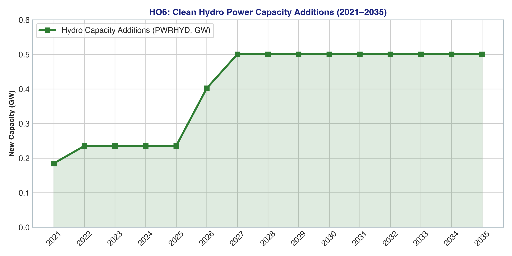
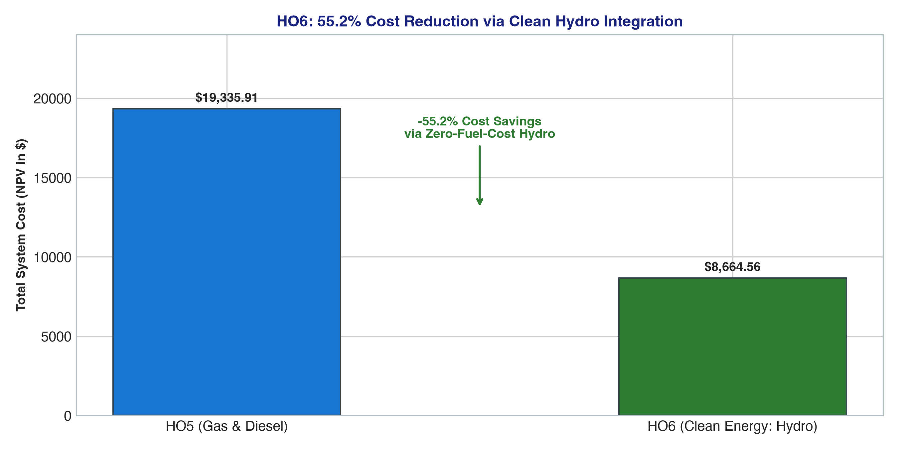

# Handout 6 (HO6): Clean Decarbonization & Seasonality Results

## 🎯 Executive Summary
* **Optimization Status**: `OPTIMAL`
* **Objective Function (NPV Total Cost)**: **$8,664.56** (**-55.2% reduction** vs. HO5)
* **Active Technologies Added**: `MINHYD`, `PWRHYD`, `MINBIO`, `PWRBIO`
* **LP Dimensions**: 2,162 Rows × 1,440 Columns × 12,960 Non-Zeros
* **Solve Time**: < 0.12 seconds

---

## 📊 Visual Results & Analytics

### 1. Hydro Power Additions Scaling to 0.50 GW/yr

### 2. Cost Reduction via Clean Hydro Integration (-55.2%)

---

## 📋 Numerical Output Data Table

| Metric | 2021 | 2023 | 2025 | 2027 | 2029 | 2031 | 2033 | 2035 |
|---|---|---|---|---|---|---|---|---|
| **Hydro Additions (GW)** | 0.185 | 0.235 | 0.235 | 0.500 | 0.500 | 0.500 | 0.500 | 0.500 |
| **Gas Mining Supply (PJ/yr)** | 53.55 | 10.65 | 5.95 | 0.00 | 0.00 | 0.00 | 0.00 | 0.00 |
| **Hydro Resource Supply (PJ/yr)**| 3.79 | 4.82 | 4.82 | 10.26 | 10.26 | 10.26 | 10.26 | 10.26 |
| **Cumulative Hydro (GW)** | 0.185 | 0.655 | 1.126 | 2.126 | 3.127 | 4.128 | 4.628 | 4.850 |

---

## 💡 Economic Takeaway
Hydro power delivers **88% of all electricity generation** due to zero fuel costs and a 50-year economic life. Natural gas mining completely phases out to 0 PJ after 2026, dropping total system expenditure to **$8,664.56**.
