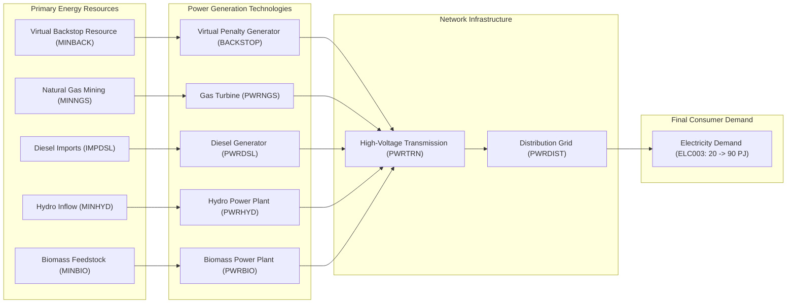

# EN401 — Energy Systems Modelling (OSeMOSYS)

This repository contains the complete academic research, optimization models, datasets, visual chart atlases, and result workbooks for **EN401: Energy Systems Modelling**, implemented using **OSeMOSYS** (Open Source Energy Modelling System) and solved with **GLPK** (`glpsol`).

---

## 🧭 Visual Documentation & Report Hub (Markdown First)

For immediate, interactive viewing directly on GitHub, the entire coursework and results are organized into dedicated **Markdown (`.md`)** documents:

| Document | Format | Description |
|---|---|---|
| 📊 **[RESULTS_AND_INPUTS_GRAPHS.md](RESULTS_AND_INPUTS_GRAPHS.md)** | **Markdown (.md)** | Complete visual atlas with 13 embedded charts covering demand, costs, lifetimes, complexity, capacity additions, and seasonal dynamics. *(Companion PDF: [OSeMOSYS_Results_and_Inputs_Visualized.pdf](OSeMOSYS_Results_and_Inputs_Visualized.pdf))* |
| 📑 **[HANDOUTS_REPORT.md](HANDOUTS_REPORT.md)** | **Markdown (.md)** | Comprehensive analytical report detailing problem formulations, engineering logic, and numerical results for Handouts 1 through 6. *(Companion PDF: [OSeMOSYS_Handouts_Report.pdf](OSeMOSYS_Handouts_Report.pdf))* |
| 💻 **[CODE_EXPLAINED.md](CODE_EXPLAINED.md)** | **Markdown (.md)** | In-depth GNU MathProg coding manual, syntax patterns, runner architecture, and complete 17-parameter dictionary. *(Companion PDF: [OSeMOSYS_Code_Explained.pdf](OSeMOSYS_Code_Explained.pdf))* |
| 🏛 **[EXPLANATORY_GUIDE.md](EXPLANATORY_GUIDE.md)** | **Markdown (.md)** | Repository architecture, version control strategy (`.gitignore`), and linear programming methodology guide. *(Companion PDF: [EN401_Architecture_and_Methodology_Guide.pdf](EN401_Architecture_and_Methodology_Guide.pdf))* |
| 📗 **[OSeMOSYS_Results.xlsx](OSeMOSYS_Results.xlsx)** | **Excel (.xlsx)** | Master 10-sheet interactive workbook with cross-scenario comparison models, capacity addition matrices, and cost breakdowns. |

---

## 🔬 Reference Energy System (RES)



---

## 🗂 Repository Structure

```text
EN401/
├── README.md                                    # Main navigation hub (this file)
├── HANDOUTS_REPORT.md                           # Handouts 1 to 6 complete results analysis
├── CODE_EXPLAINED.md                            # GNU MathProg code & parameter manual
├── RESULTS_AND_INPUTS_GRAPHS.md                 # Visual atlas with 13 analytical charts
├── EXPLANATORY_GUIDE.md                         # Repository architecture & methodology guide
├── .gitignore                                   # Multi-tier exclusion rules
│
├── 📊 PDF & Spreadsheet Deliverables
│   ├── OSeMOSYS_Results.xlsx                    # Master 10-sheet structured results workbook
│   ├── OSeMOSYS_Results_and_Inputs_Visualized.pdf # Full visual PDF atlas
│   ├── OSeMOSYS_Handouts_Report.pdf             # Formal analysis report
│   ├── OSeMOSYS_Code_Explained.pdf              # MathProg code manual
│   └── EN401_Architecture_and_Methodology_Guide.pdf # Methodology PDF
│
├── 📁 Handout Directories (Each with dedicated README.md, RESULTS.md, and RESULTS.pdf)
│   ├── HO1/                                     # Handout 1: Modelling Concepts & RES
│   │   ├── README.md & RESULTS.md               # Scenario documentation & results
│   │   ├── RESULTS.pdf                          # Standalone printable results report
│   │   ├── Hands_on_1.pdf                       # Assignment brief
│   │   └── graphs/                              # Scenario charts
│   ├── HO2/                                     # Handout 2: Energy Chain Data Structures
│   │   ├── README.md & RESULTS.md
│   │   ├── RESULTS.pdf
│   │   ├── Hands_on_2.pdf
│   │   └── graphs/
│   ├── HO3/                                     # Handout 3: Base Power System
│   │   ├── README.md & RESULTS.md               # Results with embedded charts
│   │   ├── RESULTS.pdf                          # Standalone printable results report
│   │   ├── OSeHO3.dat                           # GLPK MathProg input dataset
│   │   ├── OSeHO3_solution.txt                  # Full solver output log
│   │   ├── Hands_on_3.pdf                       # Problem brief
│   │   └── graphs/                              # Scenario charts
│   ├── HO4/                                     # Handout 4: Upstream Fuel Supply
│   │   ├── README.md & RESULTS.md
│   │   ├── RESULTS.pdf
│   │   ├── OSeHO4.dat
│   │   ├── OSeHO4_solution.txt
│   │   ├── Hands_on_4.pdf
│   │   └── graphs/
│   ├── HO5/                                     # Handout 5: Thermal Generation Era
│   │   ├── README.md & RESULTS.md
│   │   ├── RESULTS.pdf
│   │   ├── OSeHO5.dat
│   │   ├── OSeHO5_solution.txt
│   │   ├── Hands_on_5.pdf
│   │   └── graphs/
│   └── HO6/                                     # Handout 6: Clean Energy Decarbonization
│       ├── README.md & RESULTS.md
│       ├── RESULTS.pdf
│       ├── OSeHO6.dat
│       ├── OSeHO6_solution.txt
│       ├── Hands_on_6.pdf
│       └── graphs/
│
├── 🖼 graphs/                                   # 13 high-resolution 300 DPI analytical charts
│   ├── graph_01_demand_trajectory.png
│   ├── graph_02_capital_costs.png
│   ├── graph_03_om_costs.png
│   ├── graph_04_operational_life.png
│   ├── graph_05_model_complexity.png
│   ├── graph_06_npv_system_cost.png
│   ├── graph_07_ho5_capacity_additions.png
│   ├── graph_08_ho6_capacity_additions.png
│   ├── graph_09_cumulative_capacity.png
│   ├── graph_10_energy_portfolio_mix.png
│   ├── graph_11_seasonal_timeslices_and_demand.png
│   ├── graph_12_seasonal_hydro_capacity_factors.png
│   └── graph_13_seasonal_dispatch_profile.png
│
├── 📄 Course Handout Assignment Files (PDF)
│   ├── Hands_on_1_UI_61d5976063.pdf (and Hands_on_1.pdf) # HO1: Introduction & RES concepts
│   ├── Hands_on_2_UI_6b94c1a9ed.pdf (and Hands_on_2.pdf) # HO2: Data structure & activity ratios
│   ├── Hands_on_3_UI_0cf2b81000.pdf                      # HO3: Base electricity model
│   ├── Hands_on_4_UI_b813fa3c10.pdf                      # HO4: Primary fuel supply chains
│   ├── Hands_on_5_UI_784ea5778c.pdf                      # HO5: Commercial thermal generation
│   └── Hands_on_6_UI_e272a90daf.pdf                      # HO6: Clean renewables & timeslices
│
└── 🖼 extracted_images/                         # 68 original schematic and curve assets
```

---

## 📈 Scenario Summary Matrix

| Metric / Handout | [HO3 (Base)](HO3/README.md) | [HO4 (Fuels)](HO4/README.md) | [HO5 (Thermal)](HO5/README.md) | [HO6 (Renewables)](HO6/README.md) |
|---|---|---|---|---|
| **Objective Value (NPV)** | $51,009,521.16 | $51,009,521.16 | **$19,335.91** | **$8,664.56** |
| **Cost Delta vs. Previous** | Baseline | 0.0% | **-99.96%** | **-55.2%** |
| **Dominant Technology** | Virtual `BACKSTOP` | Virtual `BACKSTOP` | `PWRNGS` (Gas) + `PWRDSL` (Diesel) | **`PWRHYD` (88% Hydro)** |
| **Primary Resource** | Penalty Mining | Penalty Mining | Gas Mining + Diesel Imports | Water Inflow (`MINHYD`) |
| **Timeslices** | 4 (Uniform) | 4 (Uniform) | 4 (Uniform) | **4 (Varying Hydrology)** |
| **LP Constraints (Rows)** | 466 | 872 | 1,502 | 2,162 |
| **LP Variables (Cols)** | 240 | 480 | 960 | 1,440 |
| **Non-Zero Matrix Elements** | 2,160 | 4,320 | 8,640 | 12,960 |
| **GLPK Solve Time** | < 0.05s | < 0.05s | < 0.08s | < 0.12s |

---

## 🚀 How to Run & Reproduce

### Prerequisites
Install GLPK (GNU Linear Programming Kit):
```bash
# macOS (Homebrew)
brew install glpk
```

### Solving Any Scenario via Terminal
```bash
# Handout 3
glpsol -m path/to/osemosys_fast.txt -d HO3/OSeHO3.dat -o HO3/OSeHO3_solution.txt

# Handout 4
glpsol -m path/to/osemosys_fast.txt -d HO4/OSeHO4.dat -o HO4/OSeHO4_solution.txt

# Handout 5
glpsol -m path/to/osemosys_fast.txt -d HO5/OSeHO5.dat -o HO5/OSeHO5_solution.txt

# Handout 6
glpsol -m path/to/osemosys_fast.txt -d HO6/OSeHO6.dat -o HO6/OSeHO6_solution.txt
```

---

## 👤 Author
Coursework completed by **Kaustubh Ashok**  
Semester 5 — Energy Systems Modelling (`EN401`)
