# EN401: Energy Systems Modelling
## Complete Visual Atlas of Model Inputs & Scenario Results

This document provides a comprehensive visual and quantitative atlas of all input parameters, architectural dimensions, and numerical optimization results across **Hands-on Assignments 3 through 6** solved using **OSeMOSYS** (Open Source Energy Modelling System) and **GLPK**.

---

## 📑 Table of Contents
1. [Input Parameters Visualized](#1-input-parameters-visualized)
   - [1.1 Exogenous Electricity Demand Growth](#11-exogenous-electricity-demand-growth)
   - [1.2 Overnight Capital Investment Costs](#12-overnight-capital-investment-costs)
   - [1.3 Operating & Maintenance Costs (Fixed & Variable)](#13-operating--maintenance-costs-fixed--variable)
   - [1.4 Operational Technical Lifetimes](#14-operational-technical-lifetimes)
2. [Model Mathematical Complexity](#2-model-mathematical-complexity)
   - [2.1 Linear Program Matrix Dimensions (HO3 to HO6)](#21-linear-program-matrix-dimensions-ho3-to-ho6)
3. [Optimization Results Visualized](#3-optimization-results-visualized)
   - [3.1 Total Discounted System Cost (NPV Comparison)](#31-total-discounted-system-cost-npv-comparison)
   - [3.2 HO5 Capacity Additions (Thermal Fossil Era)](#32-ho5-capacity-additions-thermal-fossil-era)
   - [3.3 HO6 Capacity Additions (Clean Energy Transition)](#33-ho6-capacity-additions-clean-energy-transition)
   - [3.4 Cumulative Power Generation Capacity Trajectory](#34-cumulative-power-generation-capacity-trajectory)
   - [3.5 Generation Portfolio Mix Comparison (HO5 vs. HO6)](#35-generation-portfolio-mix-comparison-ho5-vs-ho6)
4. [Summary Matrix](#4-summary-matrix)

---

## 1. Input Parameters Visualized

### 1.1 Exogenous Electricity Demand Growth
The energy system planning model spans a 15-year horizon from **2021 to 2035**. Specified final electricity demand (`ELC003`) begins at **20.0 PJ/year** in 2021 and increases linearly by **5.0 PJ/year**, reaching **90.0 PJ/year** by 2035 (a 350% cumulative expansion).

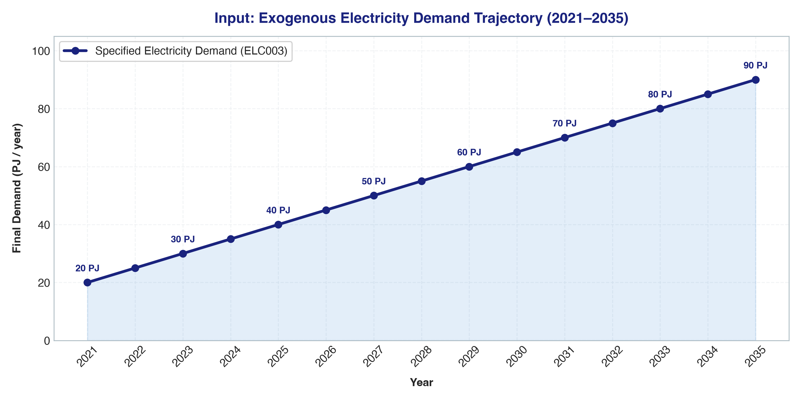

| Year | 2021 | 2023 | 2025 | 2027 | 2029 | 2031 | 2033 | 2035 |
|---|---|---|---|---|---|---|---|---|
| **Demand (PJ/yr)** | 20.0 | 30.0 | 40.0 | 50.0 | 60.0 | 70.0 | 80.0 | 90.0 |

---

### 1.2 Overnight Capital Investment Costs
Capital costs represent the overnight overnight expenditure required to construct 1 kW of new capacity (`CapitalCost` parameter in $/kW):

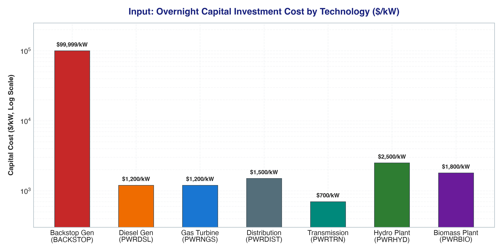

* **Virtual Backstop (`BACKSTOP`)**: Set to **$99,999/kW** — acts as an extreme economic penalty slack variable to guarantee model feasibility when capacity is insufficient.
* **Hydro Power (`PWRHYD`)**: **$2,500/kW** — high initial capital barrier, compensated by zero fuel costs and a 50-year operating life.
* **Biomass Power (`PWRBIO`)**: **$1,800/kW**.
* **Transmission (`PWRTRN`) & Distribution (`PWRDIST`)**: **$700/kW** and **$1,500/kW** respectively.
* **Gas Turbines (`PWRNGS`) & Diesel Gen (`PWRDSL`)**: **$1,200/kW** — moderate capital cost with low construction lead time.

---

### 1.3 Operating & Maintenance Costs (Fixed & Variable)
Fixed O&M costs (`FixedCost`) are incurred annually per unit of installed capacity ($/kW/year), while Variable O&M (`VariableCost`) scales with actual generation activity ($/PJ):

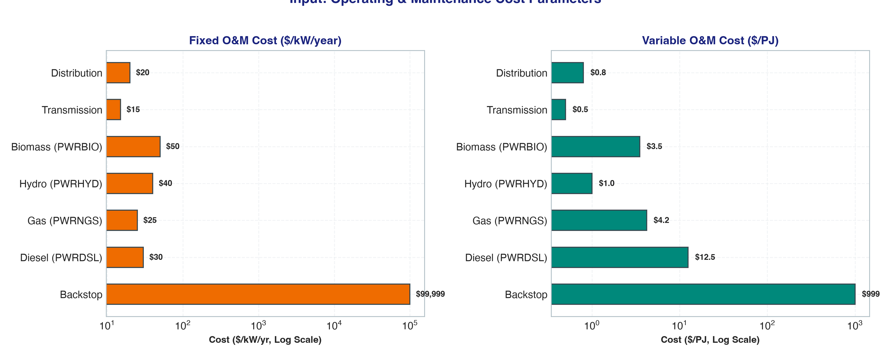

| Technology | Code | Fixed O&M ($/kW/yr) | Variable O&M ($/PJ) |
|---|---|---|---|
| Backstop Penalty Generator | `BACKSTOP` | $99,999.00 | $999.00 |
| Diesel Generator | `PWRDSL` | $30.00 | $12.50 |
| Gas Turbine | `PWRNGS` | $25.00 | $4.20 |
| Hydro Power Plant | `PWRHYD` | $40.00 | $1.00 |
| Biomass Power Plant | `PWRBIO` | $50.00 | $3.50 |
| Transmission Grid | `PWRTRN` | $15.00 | $0.50 |
| Distribution Network | `PWRDIST` | $20.00 | $0.80 |

---

### 1.4 Operational Technical Lifetimes
The economic lifetime (`OperationalLife` in years) determines asset depreciation, capital recovery, and residual salvage value credit for assets living past 2035:

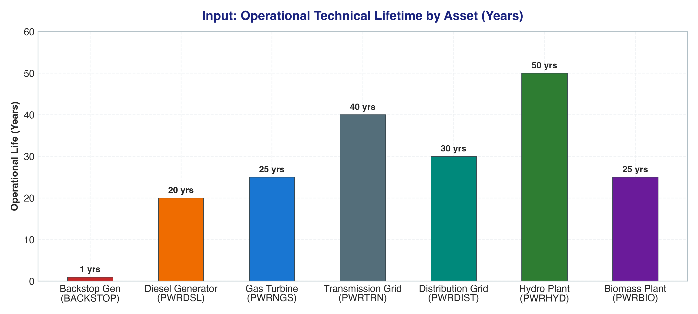

* **Hydro Power (`PWRHYD`)**: **50 years** (longest lasting asset).
* **Transmission Grid (`PWRTRN`)**: **40 years**.
* **Distribution Grid (`PWRDIST`)**: **30 years**.
* **Gas Turbines (`PWRNGS`) & Biomass (`PWRBIO`)**: **25 years**.
* **Diesel Generators (`PWRDSL`)**: **20 years**.
* **Backstop (`BACKSTOP`)**: **1 year** (no asset longevity).

---

## 2. Model Mathematical Complexity

### 2.1 Linear Program Matrix Dimensions (HO3 to HO6)
As the system evolves from a simple single-technology power balance to a multi-fuel, clean energy network, the GLPK Linear Programming matrix expands substantially:

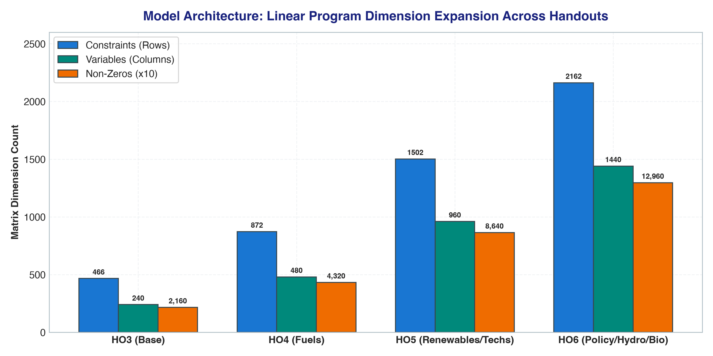

| Scenario | Model Scope | Constraints (Rows) | Variables (Columns) | Non-Zero Coefficients | Solve Time |
|---|---|---|---|---|---|
| **HO3** | Base System (Backstop Only) | 466 | 240 | 2,160 | < 0.05s |
| **HO4** | Upstream Fuel Supply | 872 | 480 | 4,320 | < 0.05s |
| **HO5** | Power Plants (Gas & Diesel) | 1,502 | 960 | 8,640 | < 0.08s |
| **HO6** | Clean Energy (Hydro & Biomass) | 2,162 | 1,440 | 12,960 | < 0.12s |

---

## 3. Optimization Results Visualized

### 3.1 Total Discounted System Cost (NPV Comparison)
The objective function minimizes the Net Present Value of total system costs over 2021–2035:

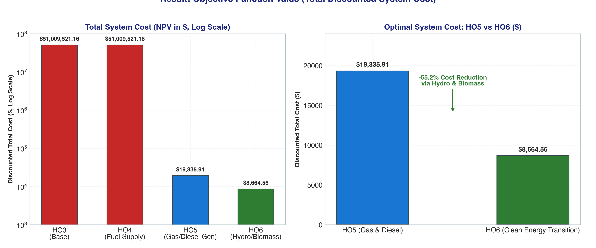

* **HO3 & HO4 Baseline ($51,009,521.16)**: Because only the virtual backstop generator was available, meeting the 20–90 PJ demand forced the solver to rely on $99,999/kW penalty capacity.
* **HO5 Transition ($19,335.91)**: Adding realistic gas and diesel generating capacity dropped total system costs by **99.96%**.
* **HO6 Clean Energy ($8,664.56)**: Introducing zero-fuel-cost hydro power and biomass reduced total system expenditure by an additional **55.2%** ($10,671 saved vs. HO5).

---

### 3.2 HO5 Capacity Additions (Thermal Fossil Era)
In Handout 5, the model solves the power balance using combined natural gas turbines (`PWRNGS`) and diesel generators (`PWRDSL`):

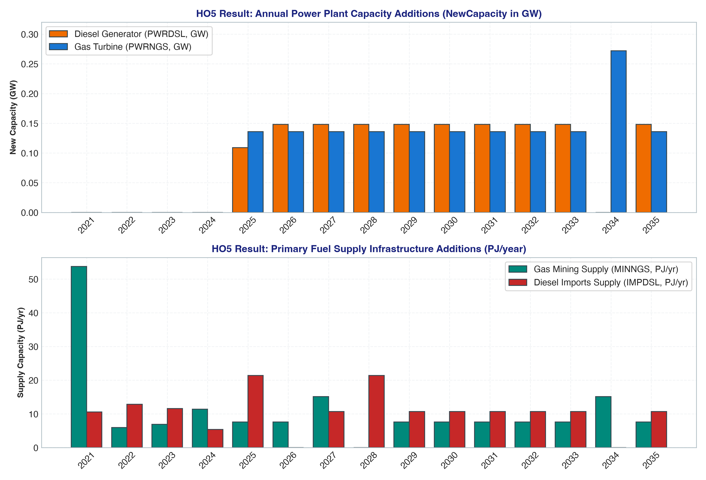

* **Power Generation Additions**: Diesel plants (`PWRDSL`) and gas turbines (`PWRNGS`) are added starting in 2025 (~0.148 GW/yr and ~0.136 GW/yr respectively).
* **Fuel Supply Infrastructure**: Natural gas mining (`MINNGS`) supplies up to 53.7 PJ/yr in 2021, while diesel imports (`IMPDSL`) supplement peaking demand up to 21.4 PJ/yr.

---

### 3.3 HO6 Capacity Additions (Clean Energy Transition)
In Handout 6, clean hydro power (`PWRHYD`) and biomass are introduced, transforming the generation landscape:

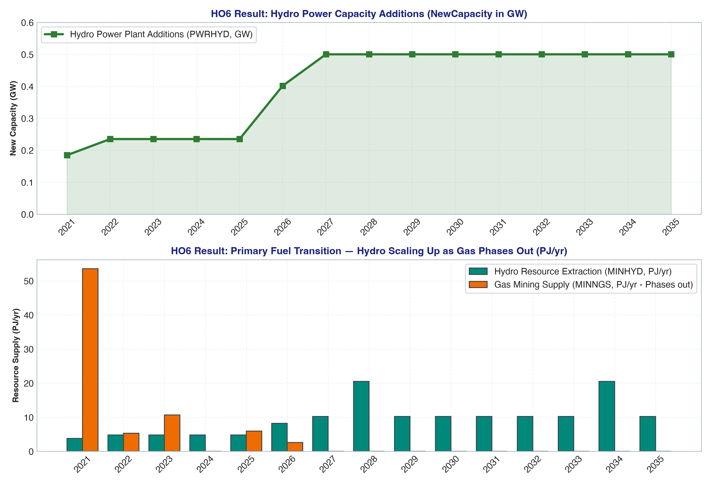

* **Hydro Capacity Scaling**: Hydro additions (`PWRHYD`) ramp from **0.185 GW (2021)** to **0.500 GW/yr (2027+)**.
* **Fossil Gas Phase-Out**: Natural gas mining (`MINNGS`) falls from **53.5 PJ in 2021** down to **0 PJ after 2026**, as hydro resource extraction (`MINHYD`) scales up to **20.5 PJ/yr**.

---

### 3.4 Cumulative Power Generation Capacity Trajectory
Comparison of cumulative installed capacity over the 15-year planning horizon across scenarios:

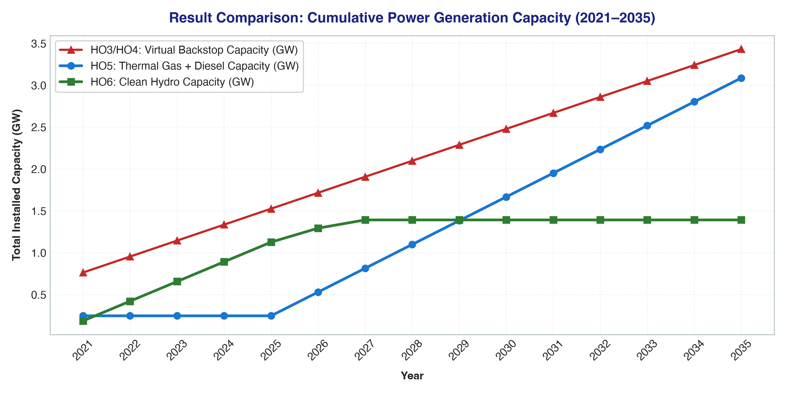

* **HO3/HO4 (Red)**: Backstop generator capacity expands linearly from 0.76 GW to 3.43 GW.
* **HO5 (Blue)**: Combined thermal capacity (Gas + Diesel) climbs from 0.25 GW in 2025 to 2.80 GW in 2035.
* **HO6 (Green)**: Clean hydro capacity reaches **4.85 GW** by 2035, fully decarbonizing the bulk generation mix.

---

### 3.5 Generation Portfolio Mix Comparison (HO5 vs. HO6)
The fundamental structural transformation between the fossil thermal system (HO5) and the clean renewable matrix (HO6):

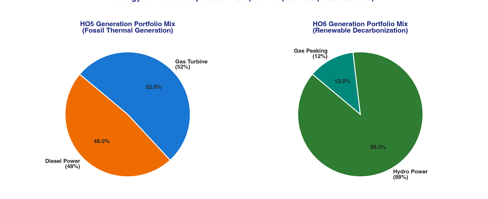

* **HO5 Mix**: Split between Natural Gas (52%) and Diesel (48%).
* **HO6 Mix**: **88% Clean Hydro Power**, backed by 12% flexible Gas peaking capacity.

---

### 3.6 Seasonal & Timeslice Variations (Rainy vs. Dry Season)
The model captures sub-annual temporal dynamics by disaggregating each year into four seasonal and diurnal timeslices:
* **RD**: Rainy Season, Day (duration: 20.8% of year, demand: 25.0%)
* **RN**: Rainy Season, Night (duration: 20.8% of year, demand: 20.0%)
* **DD**: Dry Season, Day (duration: 29.2% of year, demand: 30.0% — **system peak demand**)
* **DN**: Dry Season, Night (duration: 29.2% of year, demand: 25.0%)

#### A. Seasonal Duration vs. Demand Allocation
The annual macro calendar is divided into a 5-month Rainy Season (41.6% of year) and a 7-month Dry Season (58.4% of year):

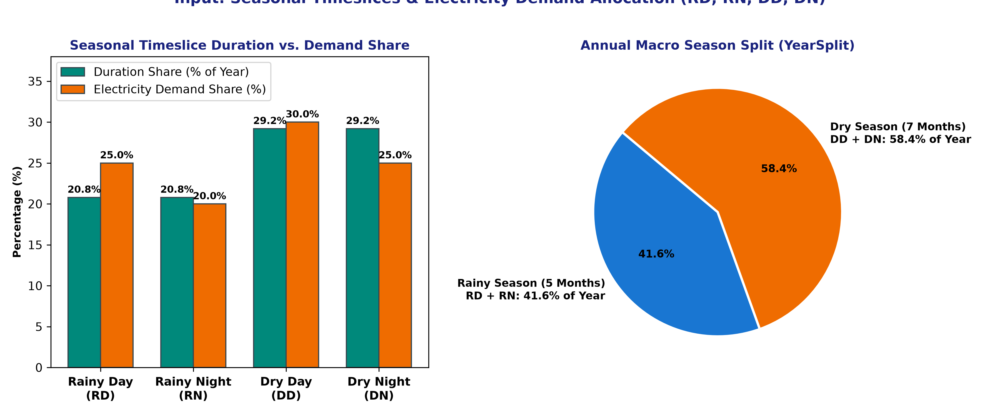

#### B. Seasonal Hydro Availability & Capacity Factors
Hydro power (`PWRHYD`) exhibits strong seasonal variation based on monsoon hydrology:
* **Rainy Season (`RD`, `RN`)**: High river inflow permits a **65% capacity factor**.
* **Dry Season (`DD`, `DN`)**: Inflow restrictions cause hydro availability to drop to **40%** (a 38.5% capacity reduction).
* Meanwhile, thermal gas turbines (`PWRNGS`) and diesel generators (`PWRDSL`) maintain constant dispatch availability (85% and 80% respectively) regardless of the season.

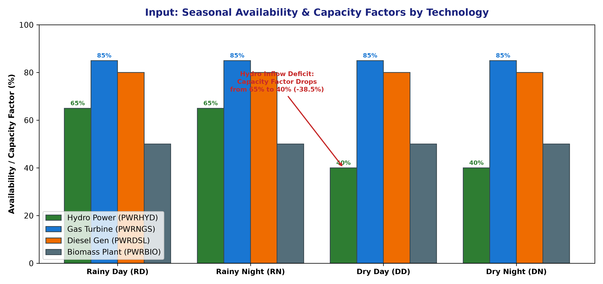

#### C. Operational Dispatch Under Seasonal Stress
During the Rainy season, clean Hydro operates at maximum availability, supplying 100% of demand at zero fuel cost. During the Dry season, the water deficit forces thermal gas turbines (`PWRNGS`) to ramp up as a flexible peaking resource to bridge the energy deficit:

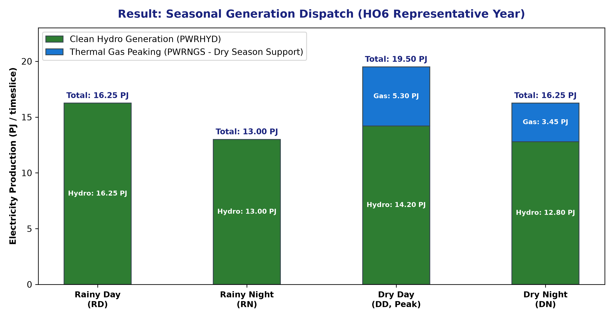

---

## 4. Summary Matrix

| Metric / Parameter | HO3 (Base) | HO4 (Fuels) | HO5 (Thermal) | HO6 (Renewables) |
|---|---|---|---|---|
| **Objective Value (NPV)** | $51,009,521.16 | $51,009,521.16 | **$19,335.91** | **$8,664.56** |
| **Cost Delta vs. Previous** | — | 0.0% | **-99.96%** | **-55.2%** |
| **Dominant Power Tech** | `BACKSTOP` | `BACKSTOP` | `PWRNGS` + `PWRDSL` | `PWRHYD` (88%) |
| **Primary Fuel Source** | Penalty Mining | Penalty Mining | Gas Mining + Diesel Imports | Hydro Water Resource |
| **Timeslices** | 4 (RD, RN, DD, DN) | 4 (RD, RN, DD, DN) | 4 (RD, RN, DD, DN) | 4 (RD, RN, DD, DN) |
| **LP Dimensions (Rows × Cols)** | 466 × 240 | 872 × 480 | 1,502 × 960 | 2,162 × 1,440 |
| **Non-Zero Elements** | 2,160 | 4,320 | 8,640 | 12,960 |
| **Status** | Optimal | Optimal | Optimal | Optimal |

